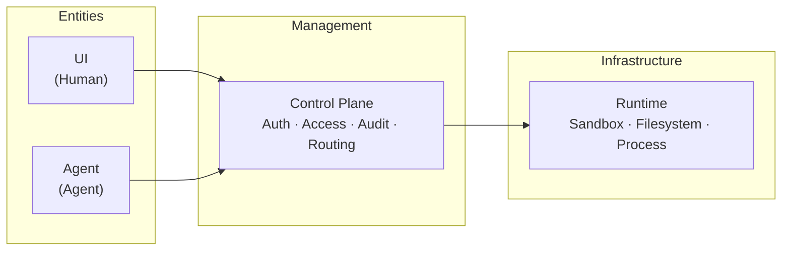

# xihe — General-purpose Agent Runtime Platform

> **xihe** (羲和) — the sun goddess in Chinese mythology who drives the sun chariot across the sky.

> Give agents the status and constraints of a human.

> Multi-agent orchestration · Tool invocation · Sandbox execution · Access control

> **⚠️ Development Status**: This project is under active development. APIs and data structures may change. Not recommended for production use.

## Philosophy

**An agent is not a tool — it's a new role on the team.**

An agent shares many similarities with a new hire: it has defined responsibilities, needs resource access permissions, can make mistakes in uncertain situations, and requires trust, supervision, and retrospection. xihe's design philosophy is built on this analogy:

| Concept | People Management | xihe's Agent Management |
|---------|-------------------|------------------------|
| Onboarding | Assign desk and account | Create workspace, assign Runtime instance |
| Responsibility | Job description | Agent prompt + role definition |
| Permission | RBAC permission matrix | CP access control + MCP tool-level authorization |
| Workspace | Physically isolated office | namespace/cgroup/seccomp sandbox isolation |
| Mistakes | People make mistakes, processes backstop | Agent uncertainty backed by sandbox, logs auditable |
| Collaboration | Team-to-team coordination | Multi-agent orchestration + human-agent collaboration |

This is not a metaphor — it's the **first principle** of the product architecture: when agents start acting like humans, they also need to be constrained like humans. Not to limit their capabilities, but to give them a trustworthy boundary within which they can operate freely.

## Architecture

Based on the above philosophy, xihe models "human" and "agent" as two **equal operating entities**, each expressed as an independent module, centrally orchestrated and constrained by the Control Plane (CP):



| Module | Role | Tech Stack |
|--------|------|-----------|
| **UI** | Human interface | Vue 3 + Vite + Tailwind v4 |
| **Agent** | Agent orchestration | Python + FastAPI + LangChain |
| **Control Plane** | Auth, routing, config, audit | Java + Spring Boot 4 |
| **Runtime** | Sandbox execution | Rust + Axum |

## Quick Start

```bash
# Install dependencies (all modules)
mise run setup

# Start all services (Docker Compose backend + UI on host)
mise run dev:full

# Run full validation (lint + typecheck + build + test)
mise run validate
```

## License

Apache 2.0
