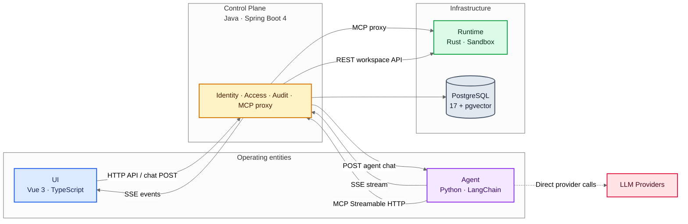

[简体中文](docs/i18n/zh-Hans/README.md)

<!-- Sync with docs/i18n/zh-Hans/README.md: architecture diagram, Quick Start commands, port, and stack summary. Feature status is maintained in the Chinese README. -->

# xihe

**A general-purpose agent runtime platform** for multi-agent orchestration, tool access, sandboxed execution, and access control.

> Give agents the standing and boundaries of a human teammate.

**Development status:** Active development. APIs and data structures may change; production use is not recommended.

## 1. Quick Start

```bash
# Install the pinned toolchain and dependencies
mise install
mise run setup

# .env.dev is already checked in with safe placeholders
# Put personal credentials in the gitignored .env.local, never in .env.dev

# Start daily host development: PostgreSQL in Docker; other modules native
mise run dev:host
```

The UI uses port `12630` by default. See [DEV-002](docs/i18n/zh-Hans/DEV-002-developer-guide.md) for prerequisites and run modes. `mise run dev:full` is for a one-off Compose baseline, not daily development.

## 2. Architecture

People and agents are separate operating entities. The Control Plane provides shared routing, access control, and audit; Runtime supplies bounded workspace execution.


```mermaid
%%{init: {'theme': 'neutral'}}%%
flowchart LR
    subgraph Actors["Operating entities"]
        UI["UI<br/>Vue 3 · TypeScript"]
        AG["Agent<br/>Python · LangChain"]
    end
    subgraph Management["Control Plane<br/>Java · Spring Boot 4"]
        CP["Identity · Access · Audit · MCP proxy"]
    end
    subgraph Infra["Infrastructure"]
        RT["Runtime<br/>Rust · Sandbox"]
        PG[("PostgreSQL<br/>17 + pgvector")]
    end
    LLM["LLM Providers"]
    UI -->|"HTTP API / chat POST"| CP
    CP -->|"SSE events"| UI
    CP -->|"POST agent chat"| AG
    AG -->|"SSE stream"| CP
    AG -->|"MCP Streamable HTTP"| CP
    CP -->|"MCP proxy"| RT
    CP -->|"REST workspace API"| RT
    CP --> PG
    AG -.->|"Direct provider calls"| LLM
    classDef ui fill:#dbeafe,stroke:#2563eb,color:#172554,stroke-width:2px
    classDef agent fill:#f3e8ff,stroke:#9333ea,color:#3b0764,stroke-width:2px
    classDef control fill:#fef3c7,stroke:#d97706,color:#451a03,stroke-width:2px
    classDef runtime fill:#dcfce7,stroke:#16a34a,color:#052e16,stroke-width:2px
    classDef data fill:#e2e8f0,stroke:#475569,color:#0f172a,stroke-width:2px
    classDef external fill:#ffe4e6,stroke:#e11d48,color:#4c0519,stroke-width:2px
    class UI ui
    class AG agent
    class CP control
    class RT runtime
    class PG data
    class LLM external
```

The UI chat request and event stream use separate HTTP directions. The Agent calls the model provider directly; tool calls use CP's MCP proxy. See [DEV-001](docs/i18n/zh-Hans/DEV-001-system-architecture.md) and [DEV-014](docs/i18n/zh-Hans/DEV-014-control-plane-architecture.md).

## 3. Modules and Stack

| Module | Responsibility | Main stack |
|---|---|---|
| UI | Human interaction | Vue 3, TypeScript, Vite 8, Pinia, Tailwind CSS 4 |
| Agent | LLM orchestration and tool selection | Python 3.12, FastAPI, LangChain, LangGraph, litellm |
| Control Plane | Authentication, routing, access control, audit | Java 25, Spring Boot 4 |
| Runtime | Sandboxed workspace and process execution | Rust toolchain, rmcp 3, Axum 0.8 |
| Data | Relational persistence and vector retrieval | PostgreSQL 17, pgvector |
| Development | Build and local orchestration | Node.js 24, pnpm 10, Maven 3.9, uv, Docker |

Dependency details are maintained in the [UI manifest](packages/ui/package.json), [Agent project](packages/agent/pyproject.toml), [Control Plane build](packages/control-plane/pom.xml), and [Runtime manifest and lockfile](packages/runtime/Cargo.toml). Tool versions are managed in [mise.toml](mise.toml); the Rust toolchain is pinned in [rust-toolchain.toml](packages/runtime/rust-toolchain.toml), and container builds use `cargo build --locked`.

## 4. Documentation

| Entry | Use |
|---|---|
| [Chinese documentation index](docs/i18n/zh-Hans/INDEX.md) | Architecture, development, configuration, testing, and known issues |
| [English documentation](docs/i18n/en/) | English architecture, logging, test strategy, and ADRs |
| [User guide](docs/i18n/zh-Hans/USER-001-user-guide.md) | Product usage |
| [AGENTS.md](AGENTS.md) | Project conventions and development commands |
| [Project contract index](spec/README.md) | Agent/GitHub-only contracts; not rendered by the documentation site |
| [CHANGELOG.md](CHANGELOG.md) | Release notes |

The Chinese and English documentation indexes are maintained separately; use the index for the language you need.

## 5. Philosophy

An agent is a role on the team, not merely a tool. People and agents are treated as operating entities with defined responsibilities and access boundaries. The Control Plane applies shared policy and audit, while Runtime provides the constrained space in which agents can act.

## 6. License

Apache-2.0
