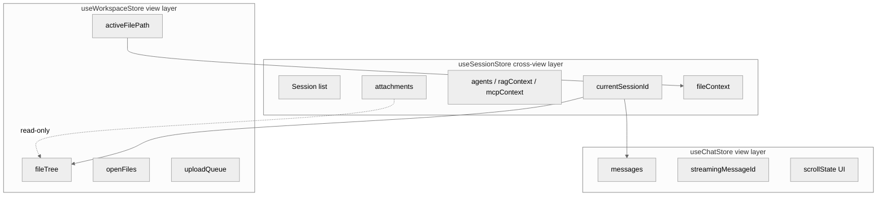

# ADR-001: Session Store Boundary

> This ADR records the responsibility boundaries and cross-store synchronization mechanism of `useSessionStore`, `useChatStore`, and `useWorkspaceStore`. It is a key decision document for PLAN-029-XH-unified-session-architecture.

## 1. Decision Topic

PLAN-029 needs to introduce a unified Session layer between chat and workspace while preserving the rendering-state autonomy of both views. The core decisions are:

- How should state be layered?
- Where does cross-view state live?
- Where does view-layer state live?
- How do stores synchronize?

## 2. Options

| Option | Description | Pros | Cons |
|--------|-------------|------|------|
| A. Merge all state into `useSessionStore` | Move all chat/workspace logic up | Single source of truth | Over-engineered Session layer; view details pollute the domain layer |
| B. `useSessionStore` cross-view + chat/workspace view layer | Separate shared state from view state | Avoids over-engineering; preserves view-layer autonomy | Requires clear synchronization boundaries |
| C. Keep independent stores and sync via event bus | Do not change existing store structure | Low structural change | Easy to miss events; poor state consistency; rejected |

## 3. Choice: Option B

Choose **B**: `useSessionStore` carries cross-view core state; `useChatStore` and `useWorkspaceStore` are downgraded to view-layer state stores.

### 3.1. Rationale

- The chat conversation flow and the workspace file editor are different interaction paradigms and should not be degraded into each other.
- The view layer needs autonomy over scroll position, editor tabs, file tree expansion, etc.
- The Session layer should only contain state that is still needed when switching to another view.
- Avoids a single bloated store and preserves testability.

## 4. Store Responsibility Boundaries

### 4.1. useSessionStore (Cross-View Core State)

Located at `packages/ui/src/stores/session.ts`.

**Owned state**:

| State | Type | Description |
|-------|------|-------------|
| `sessions` | `Session[]` | List of all Sessions |
| `currentSessionId` | `string \| null` | Currently active Session ID |
| `searchQuery` | `string` | Sidebar search query |
| `attachments` | `Record<sessionId, AttachmentFile[]>` | Attachments per Session (not persisted) |
| `fileContexts` | `Record<sessionId, FileContext>` | File context snapshot per Session |

**Core methods**:

- `createSession()` / `selectSession(id)` / `deleteSession(id)` / `renameSession(id, title)`
- `updateSessionContext(id, context)` / `setSessionAgents(id, agentIds)` / `setRAGContext(id, ragContext)` / `setMCPContext(id, mcpContext)` / `setFileContext(id, fileContext)`
- `addAttachment(id, attachment)` / `removeAttachment(id, attachmentId)` / `clearAttachments(id)` / `getAttachments(id)`

**Note**: `attachments` and `fileContexts` are not persisted via `localStorage`. PLAN-030 will implement the backend Session-scoped attachment store; the frontend currently only keeps runtime references.

### 4.2. useChatStore (View Layer: Message Flow)

Located at `packages/ui/src/stores/chat.ts`.

**Owned state**:

| State | Type | Description |
|-------|------|-------------|
| `messages` | `Record<sessionId, Message[]>` | Messages grouped by Session |
| `streamingMessageId` | `Record<sessionId, string \| null>` | Current streaming message ID |

**Core methods**:

- `getMessages(sessionId)` / `addMessage(sessionId, message)` / `addMarker(sessionId, marker)`
- `createStreamingMessage(sessionId)` / `appendToken(sessionId, token)` / `finalizeStreaming(sessionId)`
- `clearSession(sessionId)` / `deleteSession(sessionId)`

**Boundary**: the chat store does not store Session metadata, Agent state, or RAG/MCP configuration. It takes `sessionId` as a parameter, provided by callers (`ChatView` / `ChatPanel`) from `useSessionStore`.

### 4.3. useWorkspaceStore (View Layer: File Editor)

Located at `packages/ui/src/stores/workspace.ts`.

**Owned state**:

| State | Type | Description |
|-------|------|-------------|
| `fileTree` | `FileNode[]` | File tree |
| `expandedPaths` | `Set<string>` | Expanded directory paths |
| `openFiles` | `Map<string, OpenFile>` | Open files |
| `activeFilePath` | `string \| null` | Currently active file |
| `uploadQueue` | `UploadItem[]` | Upload queue |
| `showImportDialog` | `boolean` | Import dialog visibility |

**Core methods**:

- `loadTree()` / `refreshTree()` / `toggleExpand(path)` / `highlightFile(path)`
- `openFile(path)` / `closeFile(path)` / `updateFileContent(path, content)` / `saveFile(path)`
- `createFile(parentDir, name)` / `deleteNode(path)` / `splitPdf(path)` / `loadFullContent(path)`
- `syncActiveFileToSession()`: syncs current file context to `useSessionStore`

**Boundary**: the workspace store does not store Session metadata or Agent state. It binds to the current Session via `sessionStore.currentSessionId` and writes file context back to the Session layer via `setFileContext`.

## 5. Cross-Store Synchronization Mechanism

### 5.1. Reading Shared State

View components (`ChatView`, `WorkspaceView`, `ChatPanel`) read `useSessionStore` directly:

```typescript
const sessionStore = useSessionStore()
const sessionId = computed(() => sessionStore.currentSessionId)
const attachments = computed(() => sessionStore.currentSessionAttachments)
const fileContext = computed(() => sessionStore.currentSessionFileContext)
```

`useChatStore` and `useWorkspaceStore` also read cross-view state via `useSessionStore` internally, but do **not** cache their own copies to avoid multiple sources of truth.

### 5.2. Writing Shared State

- Creating/deleting/renaming a Session: only `useSessionStore` does this.
- Uploading an attachment: `ChatPanel` calls `sessionStore.addAttachment(id, attachment)` and also binds the attachment to the current Message.
- Updating file context: `useWorkspaceStore.syncActiveFileToSession()` calls `sessionStore.setFileContext(...)`.
- Updating Agent/RAG/MCP context: view or settings components call the dedicated `useSessionStore` methods.

### 5.3. No Event Bus

Pinia’s reactive stores are themselves the synchronization mechanism. Stores can read each other directly, eliminating the need for an extra event bus and reducing missed-event and ordering issues.

## 6. Impact and Risks

| Impact | Description | Mitigation |
|--------|-------------|------------|
| Testing | `useSessionStore` needs isolated tests for cross-view state transitions | New assertions added in `sessionStore.spec.ts` |
| Performance | Computed properties like `currentSessionAttachments` recompute on view switch | Data volume is small; impact is negligible |
| Data consistency | Workspace has read-only access to attachments, avoiding write conflicts | Attachment writes are centralized in chat/upload components |
| Backend boundary | Frontend attachments are not persisted and are lost on reload | PLAN-030 will implement backend persistence |

## 7. State Layering Diagram



## 8. References

- RFC-001-session-domain-model.md
- DEV-015-session-views.md
- PLAN-029-XH-unified-session-architecture
