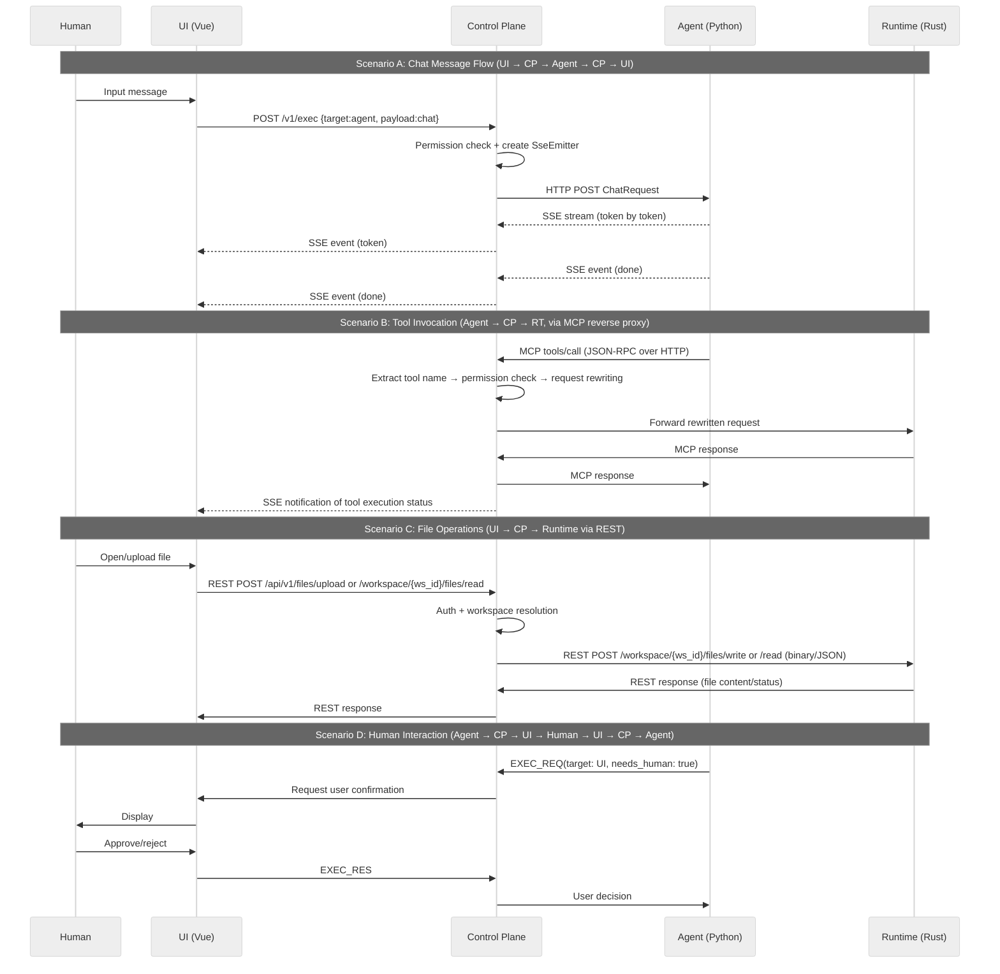
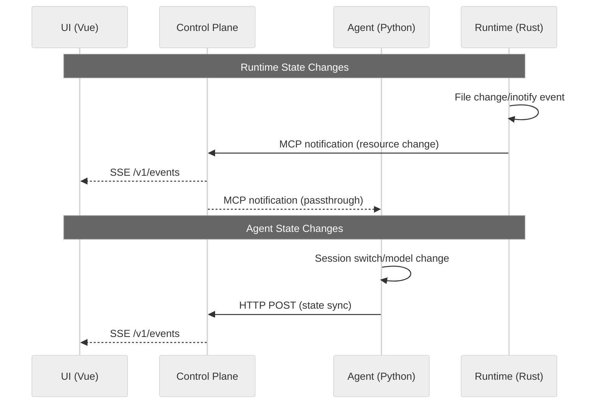

# DEV-001: xihe Agent System Architecture

> xihe is a general-purpose Agent runtime platform that provides multi-Agent orchestration, tool invocation, sandbox execution, permission control, and other capabilities.
> The project uses exam preparation (postgraduate entrance exam) as its initial entry point, but the architectural design is not limited to this — any scenario requiring Agent capabilities can use xihe.

## 1. Architecture Overview

xihe adopts a **four-module Hub-Module architecture**. The core design philosophy is **decoupling** — each module evolves, deploys, and uses its own technology stack independently.

## 2. Four Modules in Detail

### 2.1. UI Module — Vue/TypeScript

**Responsibility**: The entry point for human user interaction, covering Web, TUI, and potential future IDE Extension across multiple terminals.

| Aspect | Decision |
|--------|----------|
| Core Framework | Vue 3 + TypeScript (Composition API) |
| Package Manager | pnpm (workspace monorepo) |
| Build Tool | Vite 8 |
| Routing | Vue Router |
| State Management | Pinia + pinia-plugin-persistedstate |
| Component Library | shadcn-vue (unstyled accessible components via reka-ui) + Tailwind CSS v4, including Button, Card, Dialog, Input, MessageScroller, etc. |
| Icons | @lucide/vue + @iconify/vue |
| CSS Solution | Tailwind CSS v4 + HSL theme variables, supports dark mode. Utilities: class-variance-authority, clsx, tailwind-merge |
| Markdown Rendering | remark/rehype pipeline + Shiki syntax highlighting + KaTeX math formulas |
| AI Integration | Vercel AI SDK (for streaming communication with Control Plane/Agent) |
| Testing | Vitest + @vue/test-utils |
| Code Standards | oxlint + oxfmt |
| Communication | Only communicates with Control Plane (`EventSource` SSE + `fetch` POST), does not directly call Agent or Runtime |
| Constraints | Zero system calls, pure presentation + input collection. All business logic on the backend |

**Key Interfaces**:

- User Input → Control Plane (control commands, Agent commands)
- Control Plane → UI (status updates, execution results, approval requests)
- Control Plane → UI (Agent's intermediate thinking/decision streams)

### 2.2. Agent Module — Python / LangChain

**Responsibility**: LLM invocation, multi-Agent orchestration, tool selection, planning decisions.

| Aspect | Decision |
|--------|----------|
| Tech Stack | Python + LangChain + litellm (ChatLiteLLM, 100+ LLM Providers) |
| Build Tool | uv (Python project management, replaces pip/poetry) |
| Core | Multi-Agent orchestration (Agent Swarm / planning-execution loop) |
| Deployment | **Long-running backend service** (not CLI), no cold start issues |
| Boundary | Does not touch the file system or Shell — only does "thinking" |

**Key Capabilities**:

- Tool selection: Obtains the tool list registered by Runtime through Control Plane, then sends instructions to Control Plane after making decisions
- Multi-Agent: Supports delegation, parallel execution, and result merging between Agents
- Memory/Context: Session management (Control Plane assisted / self-owned storage)
- MCP Integration: Agent uses `langchain-mcp-adapters`'s `StreamableHTTPConnection` to treat CP as a unified MCP entry point. All tool calls (Runtime built-in tools + user-configured STDIO MCP servers) go through CP's three-layer routing (CP authentication → Runtime Gateway per-workspace dispatch → in-container `xihe-mcp-bridge` STDIO bridging). Agent only needs to configure one MCP endpoint (CP address) and is unaware of backend tool distribution. See [DEV-005-mcp-architecture.md](DEV-005-mcp-architecture.md)
- **LLM Provider Management**: Unified encapsulation via `langchain-litellm` (`ChatLiteLLM(BaseChatModel)`), with `litellm` automatically routing to 100+ Providers (OpenAI, DeepSeek, Anthropic, Xiaomi MiMo, Ollama, etc.) at the bottom layer. Adding new Providers requires no Agent code changes — just add a record to the frontend `BUILTIN_PROVIDERS`.
- **Internal Freedom**: LangChain ecosystem, custom Agents, new framework replacements — none affect other modules

### 2.3. Runtime Module — Rust

**Responsibility**: Sandbox execution environment for low-level system capabilities, exposing two sets of interfaces externally.

| Aspect | Decision |
|--------|----------|
| Tech Stack | Rust |
| Build Tool | cargo |
| Core | File system operations, Shell execution, process management |
| Security | Sandbox isolation (namespace/cgroup/seccomp), supports multi-tenancy. Only `execute_command` subprocesses enter the sandbox; the Runtime main process runs outside the sandbox |
| Deployment | Independent process (Axum), simultaneously exposes REST API + MCP Server interfaces |

**Dual Interface Design**:

```
Runtime
├── REST API          ← For UI/CP: file operations, uploads, management, and other command-type operations
│   Protocol: HTTP + JSON / raw binary
│   Consumer: UI → CP → Runtime
│   Advantage: Binary direct transfer with no encoding overhead, flexible path parameters, clear semantics
│
└── MCP Server        ← For Agent: tool invocation
    Protocol: MCP Streamable HTTP (JSON-RPC)
    Consumer: Agent → CP(MCP Proxy) → Runtime
    Advantage: Standard MCP protocol, tool auto-discovery, JSON Schema auto-generation
```

Both interfaces share underlying core functions like `fs.rs` — the same business logic, two transport protocols. Design principle: **REST API scope includes MCP Server scope** — all functions corresponding to MCP tools have corresponding REST endpoints, but REST can additionally provide capabilities that MCP protocol cannot easily express (such as binary transfer, large file streaming).

**REST API Endpoints** (registered by Axum router):

| Endpoint | Consumer | Purpose |
|----------|----------|---------|
| `POST /workspace/{ws_id}/files/read` | UI → CP | Read file content (optional `max_bytes` truncation) |
| `POST /workspace/{ws_id}/files/write/{*path}` | UI → CP | Write file (binary body) |
| `POST /workspace/{ws_id}/files/list` | UI → CP | List directory |
| `POST /workspace/{ws_id}/files/delete` | UI → CP | Delete file |
| `POST /workspace/{ws_id}/files/mkdir` | UI → CP | Create directory |
| `POST /workspace/{ws_id}/files/stat` | UI → CP | File metadata |
| `GET /health` | CP | Health check |
| `POST /workspace/{ws_id}/mcp` | Agent (via CP) | System MCP tool invocation (per-workspace) |
| `POST /workspace/{ws_id}/mcp/spawn` | CP | Start in-container STDIO MCP bridge |
| `DELETE /workspace/{ws_id}/mcp/spawn/{server_id}` | CP | Stop STDIO MCP bridge |
| `GET /workspace/{ws_id}/mcp/spawn` | CP | List active STDIO servers |
| `POST /workspace/{ws_id}/mcp/stdio/{server_id}` | Agent (via CP) | Route to in-container STDIO bridge |
| `POST /workspace/create` | CP | Create workspace |
| `POST /workspace/delete` | CP | Delete workspace (including bridge cleanup) |

**MCP Server** (`rmcp` SDK + `#[tool]` macro): Automatically generates JSON Schema. Runtime has three binaries:
- `xihe-runtime`: Gateway main process, registers `/workspace/{ws_id}/mcp` series routes
- `xihe-container-runtime`: In-container HTTP service, handles built-in file/command tools
- `xihe-mcp-bridge`: In-container STDIO bridge, exposes user-configured STDIO MCP servers as HTTP endpoints

Tool names are mapped by CP reverse proxy when building the tool→server mapping table. When Agent calls a tool, CP looks up the table for routing. See [DEV-005-mcp-architecture.md](DEV-005-mcp-architecture.md).

| Tool Category | Examples |
|---------------|----------|
| File System | read_file, list_directory, glob, grep, read_media |
| Shell | execute_command (subprocess enters sandbox, with timeout) |
| Process | spawn, kill, signal |
| Environment | env vars, workspace info |

**State Flow Maintains MCP**: Runtime state changes (file events, etc.) are sent via MCP notifications, not REST. CP transparently forwards notifications to Agent (MCP) and UI (SSE). See §3.2.

### 2.4. Control Plane Module — System Core

**Responsibility**: Control Plane (abbreviated CP) is the heart of the system, responsible for routing + permission control + data processing + state broadcasting + session management + **unified configuration management**. Abbreviated as CP in the chain diagrams and protocol examples below.

| Aspect | Decision |
|--------|----------|
| Tech Stack | Java + Spring Boot + GraalVM |
| Build Tool | Maven (mvn) |
| Core | Chat message relay + MCP HTTP reverse proxy + permission arbitration + state broadcasting + audit logging, HTTP/SSE + MCP Streamable HTTP three channels |
| Data | Session state, routing tables, tool registry, permission policies, processing rules |
| ConfigService | **CP built-in unified configuration management layer**, all modules read runtime configuration through CP API. 3-tier ownership: system/admin/user. See DEV-002 §2.4 |
| Constraints | **Does not do module-specific business logic**, only handles routing, permission control, data processing, configuration management, and other cross-cutting concerns |

**ConfigService Architecture**: See [DEV-002-developer-guide.md](DEV-002-developer-guide.md) §2.4. Three modules access CP ConfigService through different clients:

| Module | Client | Access Method |
|--------|--------|---------------|
| **Control Plane** | `ConfigService.java` | Built-in `@Service`, imports system configuration from `env.{profile}.jsonc` at startup |
| **Agent** | `config_client.py` | CP API `GET /api/v1/config`, fetches full cache at startup |
| **Runtime** | `config_client.rs` | CP API `GET /api/v1/config`, fetches and periodically refreshes at startup |

**CP Three-Channel Responsibilities**:

- **Chat Channel** (`POST /v1/exec` + `SSE /v1/events`): UI commands relayed through CP → Agent, Agent streaming responses distributed through CP to UI
- **MCP Reverse Proxy Channel** (`POST /mcp`): Agent's MCP tool calls parsed by CP as JSON-RPC → tool name extracted → permission check → request rewriting → three-layer routing forwarding:
  - **Layer 1 (CP)**: Authentication + tool-name routing, system tools → Runtime `/workspace/{ws_id}/mcp`, user STDIO tools → `/workspace/{ws_id}/mcp/stdio/{server_id}`
  - **Layer 2 (Runtime Gateway)**: Per-workspace dispatch, `CURRENT_WS_ID` task-local injection
  - **Layer 3 (In-container bridge)**: `xihe-mcp-bridge` manages STDIO subprocesses, HTTP ↔ STDIN/STDOUT bridging
  - See [DEV-005-mcp-architecture.md](DEV-005-mcp-architecture.md)
- **State Distribution Channel**: Runtime MCP notifications distributed through CP to UI (SSE) and Agent (MCP notification passthrough)

See Sprint 1 `DESIGN-007-mcp-gateway-reverse-proxy.md`.

**Transport Protocols**:

| Link | Transport Protocol | Reason |
|------|-------------------|--------|
| UI ↔ CP | HTTP + SSE + POST | Commands sent via `fetch POST`, streaming responses and status pushes received via `EventSource` (SSE). This is a production-proven pattern validated by ChatGPT, Claude, and other LLM websites, natively supported by browsers with no infrastructure friction |
| CP ↔ Agent (Chat) | HTTP + SSE | Agent receives CP-forwarded commands as an HTTP Server, streaming responses returned token-by-token via SSE |
| CP ↔ Agent (Tools) | MCP Streamable HTTP | Agent connects to CP reverse proxy via MCP Client, all tool calls unified through JSON-RPC over HTTP |
| **CP ↔ Runtime (REST)** | **HTTP** | UI-initiated file read/write/upload/management operations forwarded through CP REST API to Runtime REST endpoints. Supports binary direct transfer |
| **CP ↔ Runtime (MCP)** | **MCP Streamable HTTP** | Agent's tool calls reverse-proxied through CP to Runtime MCP Server. Runtime state changes notified to CP via MCP notifications |
| CP ↔ External MCP Server | MCP Streamable HTTP | External tools (websearch, etc.) transparently proxied by CP; Agent is unaware of external addresses |

### 2.5. Communication Protocol Summary

MVP uses the following protocols, each with a clear purpose:

| Protocol | Purpose | Link |
|----------|---------|------|
| HTTP POST + SSE | Chat messages: command `POST` → streaming response `SSE` | UI ↔ CP ↔ Agent |
| MCP Streamable HTTP | Agent tool invocation: JSON-RPC over HTTP, unified through CP reverse proxy | Agent → CP → Runtime / External MCP Server |
| MCP notification | State synchronization: Runtime events distributed through CP to UI and Agent | Runtime → CP → UI / Agent |
| **HTTP (REST)** | **File operations/upload/management command-type operations: binary direct transfer** | **UI → CP → Runtime** |

> Runtime dual interface design: Agent tool invocation goes through MCP, UI file operations go through REST. State flow maintains MCP notification (§3.2), unchanged by the introduction of REST API.
>
> MVP uses zero additional infrastructure (no message queues, no WebSocket gateway). Modules connect directly through HTTP endpoints. Enterprise-grade cluster scaling can later introduce message middleware like Centrifugo as needed.

### 2.6. Design Notes

**Unified MCP Reverse Proxy** — Agent directs all MCP calls to CP's single entry point. CP determines the target backend (Runtime / external service) based on tool name prefix, performs permission checks, and forwards. Agent is unaware of backend tool distribution; external tool passthrough can be switched to authenticated mode at any time. See Sprint 1 `DESIGN-007-mcp-gateway-reverse-proxy.md`.

**Tool Name Namespace** — CP adds backend prefix to tool names during `tools/list` (`runtime__read_file`), and parses the prefix during `tools/call` for routing to the corresponding backend. See Sprint 1 `DESIGN-009-tool-namespace.md`.

**Tool Auto-Discovery** — Runtime exposes tool Schema through standard MCP `tools/list`. Agent auto-discovers through CP's MCP Client, requiring no manual synchronization. When Runtime adds new tools, they are automatically exposed with zero configuration on the Agent side.

**Zero MCP SDK Dependency (CP Side)** — CP acts as a pure HTTP reverse proxy with no dependency on any MCP SDK. CP directly parses JSON-RPC request bodies to extract `method`/`params`, performs permission checks and rewriting, then forwards. See Sprint 1 `DESIGN-001-decisions.md` §4.

## 3. Two-Flow Model

All inter-module communication falls into two types of flows:

1. **Command Flow** — Module A requests Module B to execute, with a complete request → execute → response lifecycle
2. **State Flow** — Modules asynchronously broadcast state changes, with no response expected, one-to-many distribution

### 3.1. Command Flow

**Definition**: RPC pattern. Module A requests Module B to perform an operation. B can be any module — RT (tool), Agent (task), UI (human interaction). Responses are divided into **one-shot** (complete result) and **streaming** (token-by-token output, real-time stdout) types.



### 3.2. State Flow

**Definition**: Asynchronous state changes actively broadcast by modules. All modules are both publishers and subscribers, distributed through CP based on subscriptions.



## 4. Architectural Advantages

1. **Multi-process Decoupling** — Compared to the single-process monoliths of Codex/OpenCode/PI/Kimi, xihe's modules can be independently deployed, scaled, and isolated. Agent crashes don't affect UI; Runtime OOM doesn't affect Agent.
2. **Multi-language Best-of-Breed** — Vue for UI (most mature web ecosystem), LangChain/Python for Agent (richest AI ecosystem), Java + Spring Boot for Control Plane (most mature server ecosystem, GraalVM native startup). Codex is locked to all-Rust (changing LLM requires modifying two crate layers), OpenCode/PI are locked to all-TS (no performance-sensitive layer).
3. **Explicit Message Routing** — Control Plane is the sole communication hub, naturally providing observability (audit logging, traffic monitoring). Compared to Codex/OpenCode's in-process implicit calls, xihe's message paths are fully traceable, interceptable, and replayable.
4. **Native Multi-tenancy** — Multi-process + Linux namespace is OS-level tenant isolation with zero overhead. Codex's sandbox is strong but designed only for single-user.
5. **Sandbox is First-Class** — Rust namespace/cgroup/seccomp is written into the architecture from day one, not added as a patch afterward. Compared to OpenCode/PI's no-sandbox design, xihe has native defense against LLM "hallucination execution."
6. **Native Multi-terminal Support** — Web, TUI, and mobile apps only need to implement Control Plane's protocol, without concerning themselves with backend language and implementation.

### 4.1. File Loading Degradation Strategy

Loading large files entirely to the frontend causes OOM (PDF >10MB pdfjs.render and text >10MB JSON parse).

**Strategy Matrix**:

| File Type | Size Range | Strategy | Path |
|-----------|-----------|----------|------|
| PDF | <10MB | Full load | MCP `runtime__read_file` |
| PDF | 10MB–500MB | CP-side PDFBox splits into 10-page groups, loads current group | UI → CP(/upload) → PDFBox → Runtime(REST write) |
| PDF | >500MB or >500 pages | Reject splitting, prompt user to download | CP-side Content-Length check |
| Text/Code | <10MB | Full load | REST `read` (no max_bytes) |
| Text/Code | 10MB–100MB | Server-side max_bytes=1MB truncation | REST `read` (max_bytes=1MB) |
| Text/Code | ≥100MB | Frontend intercept, Toast, empty content | Frontend fileService.ts check |

**Key Design Decisions**:

1. **Text truncation goes through REST, not MCP** — Runtime REST read endpoint supports `max_bytes` parameter; MCP `runtime__read_file` maintains full read (Agent needs complete content).
2. **PDF splitting belongs to CP** — CP (Java + PDFBox) splits during upload or lazily, then writes chunk files through Runtime REST API. Runtime is not coupled with PDF naming conventions.
3. **File deletion cascades cleanup** — CP side looks up and cleans up same-name chunks (`{name}.p*.pdf`) when deleting files.
4. **Chunk naming convention**: `{name}.p{start}-{end}.pdf`, e.g., `report.p1-10.pdf`.

---

## 5. Protocol Definition (Draft)

All inter-module communication follows a unified **message contract**:

```typescript
interface Message {
  id: string
  type: 'EXEC_REQ' | 'EXEC_RES' | 'STATE_SYNC'
  source: 'ui' | 'cp' | 'agent' | 'runtime'
  target: 'ui' | 'cp' | 'agent' | 'runtime' | 'broadcast'
  timestamp: number
  payload: unknown
}
```

> Detailed protocol in `DEV-002-message-protocol.md` (to be written).

---

## 6. Chat UI Component Architecture

The chat interface is implemented as a layered component library in `packages/ui/src/components/ui/`:

| Component Family | Purpose | Key Features |
|-----------------|---------|-------------|
| `message-scroller/` | Scroll container | Anchor / auto-follow / prepend preservation / message-level jump / visibility tracking |
| `message/` | Message card | Message / MessageGroup / MessageAvatar / MessageContent / MessageHeader / MessageFooter |
| `bubble/` | Message bubble | user / assistant / system variants managed by cva |
| `attachment/` | Attachment display | Media / file / action buttons with state / size / orientation variants |
| `marker/` | Time / status marker | Divider variant managed by cva |

Scroll behavior core is in `packages/ui/src/composables/messageScroller*.ts` and `packages/ui/src/lib/messageScrollerGeometry.ts`:

- **Mode state machine**: `following-bottom` → `free-scrolling` → `anchored-to-message` → `settling-jump`
- **User scroll intent**: Listens to wheel / touchmove / PageUp/PageDown/Home/End keys
- **New turn anchoring**: Scrolls to top of anchored item when new messages arrive, preserving previous context via `scrollPreviousItemPeek`
- **Prepend preservation**: `preserveScrollOnPrepend` keeps the current viewport anchor when history is prepended
- **Visibility tracking**: Lazy `IntersectionObserver` subscription provides `currentAnchorId` and `visibleMessageIds`
- **Performance strategy**: `shallowRef` + manual `data-*` attribute sync avoids full Vue subtree reactivity during high-frequency scroll updates

ChatView integration:

- `ChatView.vue` wraps `MessageList` with `MessageScrollerProvider`
- `MessageList.vue` replaces the old `@tanstack/vue-virtual` container with `MessageScroller` / `Viewport` / `Content` / `Item`
- User message `MessageScrollerItem` binds `:scroll-anchor="true"` as the scroll anchor for new turns
- When SSE streaming starts, `chatStore.createStreamingMessage()` immediately creates a real assistant message; `appendToken()` appends directly to that message's `content`, eliminating the separate `streamingContent` pseudo-message

See `plans/PLAN-024-XH-chat-components.md` and `plans/PLAN-025-XH-chat-integration.md` for details.
