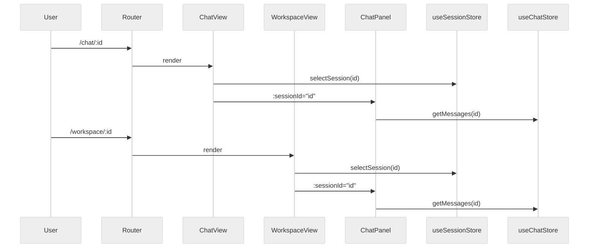

# DEV-015: Session Views Design

> This document describes the view-layer implementation of PLAN-029-XH-unified-session-architecture: routing, `ChatPanel` embedding, and chat ↔ workspace switching. It is aimed at frontend developers and assumes the reader has already read RFC-001 and ADR-001.
>
> **PLAN-222 v1 correction (2026-09-02)**: Chat uses `sessionId`, Workspace uses `workspaceId`; server APIs are the canonical source for Session/Message data, and the old business localStorage design no longer applies.

## 1. Routing Design

### 1.1. Route Table

```typescript
// packages/ui/src/router/index.ts
{
  path: '/chat',
  component: AppLayout,
  children: [
    { path: '', redirect: '/chat/default' },
    { path: 'new', redirect: '/chat/default' },
    { path: ':sessionId', name: 'chat', component: ChatView },
  ],
},
{
  path: '/workspace/:workspaceId?',
  name: 'workspace',
  component: AppLayout,
  children: [
    { path: '', name: 'workspace-session', component: WorkspaceView },
  ],
},
```

### 1.2. Design Decisions

- Keep `/chat/:sessionId` and `/workspace/:workspaceId` side by side; do not unify into `/session/:id` for now.
- `/workspace/:workspaceId?` uses an optional parameter so the old `/workspace` entry still works.
- Both routes share `AppLayout`, keeping the sidebar and global state consistent.

### 1.3. Default Home Page

`/` still redirects to `/chat`, since chat remains the most common entry point. The workspace is intended to be entered from chat.

## 2. Component Layering

### 2.1. ChatPanel.vue (Embeddable Chat Panel)

`packages/ui/src/components/chat/ChatPanel.vue`

- Responsibility: provide the message list, input box, and SSE streaming messages.
- Receives a `sessionId` prop and reads `useChatStore`, `useAgentStore`, and `useSessionStore` internally.
- Does not include a full-screen header or navigation buttons.
- When uploading attachments, also calls `sessionStore.addAttachment(...)` to lift attachments to the Session layer.

### 2.2. ChatView.vue (Full-Screen Chat View)

`packages/ui/src/components/chat/ChatView.vue`

- Responsibility: the full-screen chat page.
- Contains a top header (Session title, Agent status).
- Embeds `ChatPanel :session-id="currentSessionId"` internally.
- Reads the current Workspace from the `workspaceId` route; Session creation/selection goes through the server API and never treats a Session ID as a Workspace ID.

### 2.3. WorkspaceView.vue (File Editor + Embedded Chat)

`packages/ui/src/components/workspace/WorkspaceView.vue`

- Responsibility: the main workspace page.
- Left: file tree; center: code editor; right: embedded `ChatPanel`.
- Reads the current Workspace from the `workspaceId` route; the embedded panel uses the server-owned current Session.
- When `activeFilePath` changes, calls `workspaceStore.syncActiveFileToSession()` to write the file context back to the Session layer.

### 2.4. WorkspaceToolbar.vue (Workspace Toolbar)

`packages/ui/src/components/workspace/WorkspaceToolbar.vue`

- Added Session dropdown selector: switches the current Session while retaining `/workspace/:workspaceId`.
- Added "Switch to chat" button: navigates to `/chat/:currentSessionId`.
- Retains refresh and upload buttons.

### 2.5. Sidebar.vue (Sidebar)

`packages/ui/src/components/sidebar/Sidebar.vue`

- "New Chat" button: creates a new Session and navigates to `/chat/:sessionId`.
- Session list: clicking navigates to `/chat/:sessionId`.
- "Workspace" button: navigates to `/workspace/:currentWorkspaceId`; fails closed when the Workspace is missing.

## 3. Chat SSE Lifecycle (PLAN-230)

Session-scoped persistent SSE replaces the former per-run one-shot connection:

- **Ownership**: `GET /api/v1/events?sessionId=` maintains one live emitter per session (CP `SseEmitterManager` stores `{sessionId, generation, emitter}` with `compareAndRemove`; a new connection replaces the old one with `chat_sse_replaced`, stale `onCompletion` ignored as `chat_sse_stale_cleanup_ignored`).
- **Reuse**: `done` ends the current `runId` only — the session SSE stays open; the next `POST /api/v1/chat` reuses the same connection. A `heartbeat` every 15s is transport-only — never enters `MessagePart`, never resets run counters, never persisted.
- **Gate & concurrency**: `POST /api/v1/chat` checks `hasEmitter` before persisting (`409 SSE_SUBSCRIPTION_REQUIRED`) and acquires a single-flight lease via `activeRuns.putIfAbsent` (`409 CHAT_IN_PROGRESS`); on success a `runId` is generated and explicitly propagated via `X-Request-Id`/`X-Chat-Run-Id` to the Agent — no `MDC` inheritance across async threads.
- **UI transport**: `chatTransport` single-flights per `sessionId` (`connectionGeneration` + `intentionalStops`), with unified `fetch-event-source` retry (explicit 250ms→5s backoff on `onerror`, at most one reconnect on `onclose`), `useSSE.ensureConnected()` with at most one `SSE_SUBSCRIPTION_REQUIRED` recovery; `SSEStream` replaces streaming parts on every `token` via `replaceStreamingParts`, fixing the old `lastSentCount`-only-on-`parts.length` truncation for long single-part texts.
- **Streaming & dedup**: Agent `XiheLiteLLM._astream()` sets `streaming=True` so `astream_events` yields `on_chat_model_stream`; `LangGraphEventAdapter` tracks `streamed` per `run_id`; `on_chat_model_end` falls back to a single `token` only when no stream chunks were emitted, preventing duplicate appends.
- **Lifecycle bounds**: Mount / `sessionId` switch → at most one `connect` attempt; unmount / switch / session delete → `abort` and remove only that emitter; `401` → clear auth and navigate to login; network jitter → backoff reconnect (cap 5s, reset on success). `Last-Event-ID` replay is not implemented in this phase; runs interrupted mid-stream must reload canonical `/messages` after `done`.

## 4. ChatPanel Embedding Details

### 4.1. Why Extract ChatPanel

- `ChatView.vue` contains full-screen header and layout logic, making it unsuitable for direct embedding into the workspace.
- `ChatPanel.vue` keeps only the message list, input box, and SSEStream, taking up little space and fitting into the right-side panel.
- Avoids code duplication: both `ChatView` and `WorkspaceView` share the same message flow logic.

### 3.2. Embedding Layout

```vue
<!-- WorkspaceView.vue -->
<div class="flex h-full">
  <div class="w-60 shrink-0 border-r"><FileTreePanel /></div>
  <div class="flex-1 flex flex-col"><WorkspaceToolbar /><FileEditor /></div>
  <div class="w-96 border-l flex flex-col shrink-0">
    <ChatPanel :session-id="sessionId" />
  </div>
</div>
```

The right-side panel is currently fixed at `w-96` (384px). It can later be made resizable.

## 5. Chat ↔ Workspace Switching

### 5.1. Switching Within the Same Session

All switching entries are based on `sessionStore.currentSessionId`:

- From chat to workspace: click the Workspace button in the Sidebar or the back button in WorkspaceToolbar.
- From workspace back to chat: click the "Current Session Title" button in WorkspaceToolbar.

### 5.2. State Synchronization Guarantees

- Session metadata (`currentSessionId`, `title`, `context`) is maintained by `useSessionStore`.
- Message history: `ChatPanel` always reads via `chatStore.getMessages(sessionId)`, so it is consistent across views.
- Attachments: `sessionStore.currentSessionAttachments` is shared between both views.
- File context: `workspaceStore.syncActiveFileToSession()` writes workspace state back to the Session layer, where chat can read it.

## 6. View-Layer Data Flow



## 7. Development Conventions

- When adding new view components, prefer reading Session metadata from `useSessionStore` and do not manipulate Session-related state in `useChatStore` directly.
- `ChatPanel` is the only embeddable chat component; do not embed `ChatView` directly elsewhere.
- The attachment write entry point is unified in `ChatPanel.handleSend`; the workspace reads attachments only.
- The file context write entry point is unified in `useWorkspaceStore.syncActiveFileToSession`.

## 8. Future Extensions

| Extension | Description | Owner |
|-----------|-------------|-------|
| Resizable right-side panel | Improve workspace layout flexibility | Future UI improvement |
| Unified route `/session/:id` | Long-term evaluation; keep dual routes for now | Future PLAN |
| Drag workspace files into chat | Requires backend attachment support | PLAN-031 |
| Multiple Sessions side by side | Open multiple workspaces/chats simultaneously | Future design |

## 9. References

- RFC-001-session-domain-model.md
- ADR-001-session-store-boundary.md
- PLAN-029-XH-unified-session-architecture
