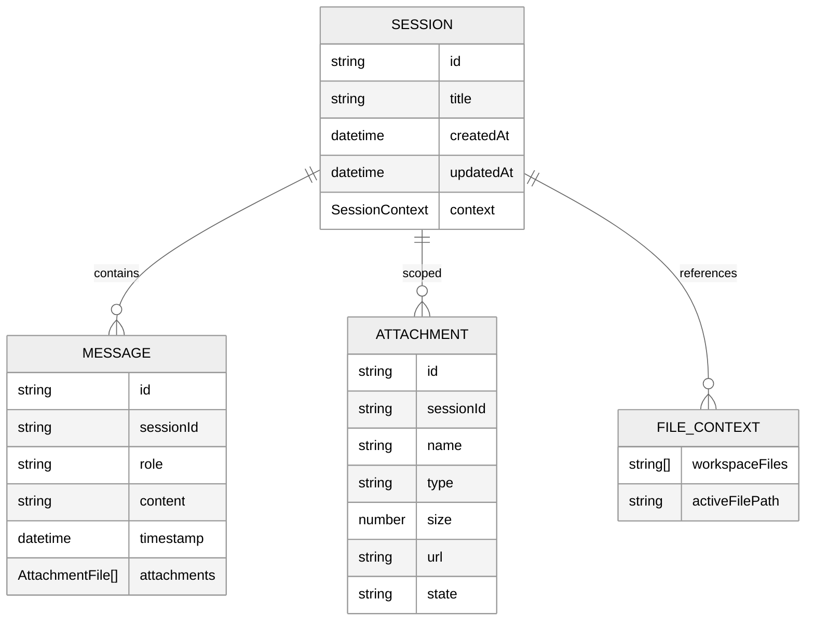
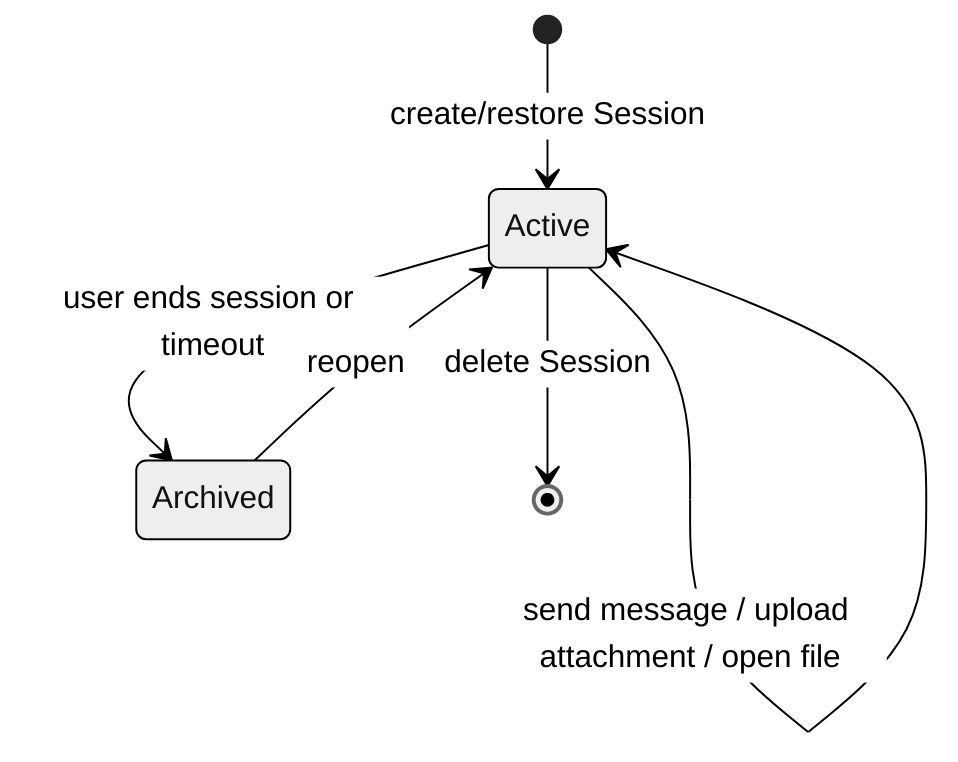

# RFC-001: Session Domain Model

> This RFC defines the unified Session domain model, state diagram, lifecycle, and relationships to Message, Attachment, and File for the xihe UI. It is the core design output of PLAN-029-XH-unified-session-architecture and sets boundary conventions for PLAN-030 (attachment backend) and PLAN-031 (attachment frontend).

## 1. Background

Before PLAN-029, xihe had two independent entry points:

- `/chat/:sessionId` for the conversation flow, managed by `useChatStore`.
- `/workspace` for the file editor, managed by `useWorkspaceStore`.

As Agent orchestration, RAG, MCP, attachments, and other concepts entered both views, duplicated state and broken context became unacceptable. This RFC unifies chat and workspace as **different views of the same Session**.

## 2. Core Entities

### 2.1. Session

A Session is a coherent working context for a user in xihe. It is independent of any specific view and carries the following information:

| Field | Type | Description |
|-------|------|-------------|
| `id` | `string` | Unique identifier (UUID) |
| `title` | `string` | Editable session title |
| `createdAt` | `ISO 8601 string` | Creation time |
| `updatedAt` | `ISO 8601 string` | Last update time |
| `modelId` | `string?` | (Deprecated) legacy model binding, moved to `configStore` |
| `context` | `SessionContext?` | Cross-view context (agents, RAG, MCP, files) |

### 2.2. SessionContext

```typescript
interface SessionContext {
  agents: string[]
  ragContext?: RAGContext
  mcpContext?: MCPContext
  fileContext?: FileContext
}
```

| Field | Type | Description |
|-------|------|-------------|
| `agents` | `string[]` | Agent module IDs enabled for this Session |
| `ragContext` | `RAGContext?` | RAG knowledge base and search switch |
| `mcpContext` | `MCPContext?` | MCP server/tool selection context |
| `fileContext` | `FileContext?` | Workspace file context snapshot |

### 2.3. RAGContext / MCPContext / FileContext

```typescript
interface RAGContext {
  knowledgeBaseIds?: string[]
  searchEnabled?: boolean
}

interface MCPContext {
  serverIds?: string[]
  toolFilter?: string[]
}

interface FileContext {
  workspaceFiles?: string[]
  activeFilePath?: string
}
```

`FileContext` is written by the workspace and read by chat/Agent so that the conversation can reference the currently open files.

## 3. Relationships to Surrounding Entities



### 3.1. Session and Message

- One Session contains multiple Messages.
- The Message lifecycle (create, stream append, finalize) is managed by `useChatStore`.
- Messages are linked to a Session via the `sessionId` field but are **not** stored inside the Session object.

### 3.2. Session and Attachment

- Attachments are **Session-scoped**, not message-scoped or workspace-scoped.
- Files uploaded in chat are written both to `sessionStore.attachments` and the current Message.
- The workspace has **read-only access** to Session attachments, so it can use them as Agent context.
- PLAN-030 will implement the backend Session-scoped attachment store; PLAN-029 only defines the frontend access boundary.

### 3.3. Session and File

- The workspace filesystem is managed by the Runtime; the Session does not own file content.
- The Session stores references to currently open files via `fileContext`, so chat/Agent can know what the user is looking at.

## 4. State Diagram



- **Active**: the Session the user is currently interacting with; both chat and workspace views point to it.
- **Archived**: no longer loaded in the frontend, but data may still live in backend/local storage.
- Deletion is a frontend operation that removes the Session from the `sessions` list; backend cleanup is decided by PLAN-030.

## 5. Lifecycle

1. **Create**: when the user opens Xihe or clicks “New Chat”, `useSessionStore.createSession()` creates a Session.
2. **Select**: clicking in the sidebar or switching routes calls `selectSession(id)` to activate the Session.
3. **Chat**: under `/chat/:sessionId`, messages are appended to `chatStore.messages[sessionId]`.
4. **Switch to workspace**: `/workspace/:sessionId` shares the same Session; the embedded `ChatPanel` continues to show the message history.
5. **Work with files in workspace**: `fileContext` is updated, and the Agent can answer based on the current file context.
6. **Switch back to chat**: the same Session’s messages and attachments remain consistent.
7. **End**: the user deletes the Session or closes the app; local message and attachment state is released.

## 6. Boundary Conventions

| Scope | Convention |
|-------|------------|
| Message ownership | Messages belong to a Session but are stored by `useChatStore` indexed by `sessionId` |
| Attachment ownership | Attachments belong to a Session and are managed by `useSessionStore.attachments` |
| File ownership | Physical files are managed by Runtime; the Session only stores references |
| Agent context | `SessionContext.agents` determines which Agents are available in the Session |
| RAG/MCP context | Configuration comes from `configStore`; runtime selection is written into `SessionContext` |

## 7. Backward Compatibility

- The `Session` type adds optional fields such as `context`; existing `xihe-sessions` localStorage is not broken.
- When an old Session record is first accessed, `ensureSession()` automatically backfills the `context`.
- The `modelId` field is kept but deprecated; session-model binding is now handled by `configStore`.

## 8. References

- PLAN-029-XH-unified-session-architecture
- ADR-001-session-store-boundary.md
- DEV-015-session-views.md
