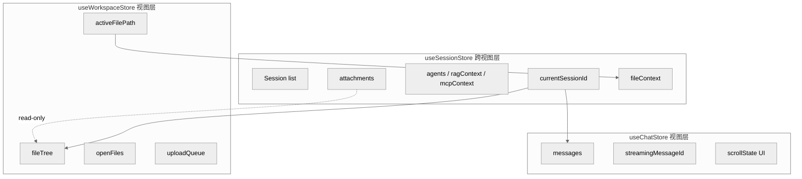

# ADR-001: Session Store 边界

> 本 ADR 记录 `useSessionStore`、`useChatStore`、`useWorkspaceStore` 的职责边界与跨 store 同步机制。它是 PLAN-029-XH-unified-session-architecture 的关键决策文档。

## 1. 决策事项

PLAN-029 需要在 chat 与 workspace 之间引入统一的 Session 层，同时保留两个视图各自的渲染状态自治性。核心决策是：

- 状态如何分层？
- 跨视图状态放在哪里？
- 视图层状态放在哪里？
- 不同 store 之间如何同步？

## 2. 选项

| 选项 | 描述 | 优点 | 缺点 |
|------|------|------|------|
| A. 合并所有状态到 `useSessionStore` | chat/workspace 的逻辑全部上移 | 单一真相源 | Session 层过度设计，视图细节污染领域层 |
| B. `useSessionStore` 跨视图 + chat/workspace 视图层 | 共享状态与视图状态分离 | 避免过度设计，保留视图层自治 | 需要定义清晰的同步边界 |
| C. 保持独立 store，通过事件总线同步 | 不改现有 store 结构 | 容易遗漏事件，状态一致性差 | 已被排除 |

## 3. 选择：选项 B

选择 **B**：`useSessionStore` 承载跨视图核心状态；`useChatStore` 与 `useWorkspaceStore` 降级为视图层状态 store。

### 3.1. 选择理由

- chat 的对话流与 workspace 的文件编辑器是不同交互范式，不应互相降级。
- 视图层需要保留滚动位置、编辑器标签、文件树展开状态等自治状态。
- Session 层只应包含“换到另一个视图仍然需要”的状态。
- 避免单一 store 过度膨胀，保持可测试性。

## 4. Store 职责边界

### 4.1. useSessionStore（跨视图核心状态）

位于 `packages/ui/src/stores/session.ts`。

**拥有的状态**：

| 状态 | 类型 | 说明 |
|------|------|------|
| `sessions` | `Session[]` | 所有 Session 列表 |
| `currentSessionId` | `string \| null` | 当前激活 Session ID |
| `searchQuery` | `string` | 侧边栏搜索词 |
| `attachments` | `Record<sessionId, AttachmentFile[]>` | 每个 Session 的附件（非持久化） |
| `fileContexts` | `Record<sessionId, FileContext>` | 每个 Session 的文件上下文快照 |

**核心方法**：

- `createSession()` / `selectSession(id)` / `deleteSession(id)` / `renameSession(id, title)`
- `updateSessionContext(id, context)` / `setSessionAgents(id, agentIds)` / `setRAGContext(id, ragContext)` / `setMCPContext(id, mcpContext)` / `setFileContext(id, fileContext)`
- `addAttachment(id, attachment)` / `removeAttachment(id, attachmentId)` / `clearAttachments(id)` / `getAttachments(id)`

**注意**：业务 Session/Message/附件以服务端 API 为 canonical source；Pinia 只保留当前视图的响应式投影和临时引用，不通过 `localStorage` 恢复业务数据。Workspace 文件内容由 Runtime 管理。

### 4.2. useChatStore（视图层：消息流）

位于 `packages/ui/src/stores/chat.ts`。

**拥有的状态**：

| 状态 | 类型 | 说明 |
|------|------|------|
| `messages` | `Record<sessionId, Message[]>` | 按 Session 分组的消息 |
| `streamingMessageId` | `Record<sessionId, string \| null>` | 当前流式消息 ID |

**核心方法**：

- `getMessages(sessionId)` / `addMessage(sessionId, message)` / `addMarker(sessionId, marker)`
- `createStreamingMessage(sessionId)` / `appendToken(sessionId, token)` / `finalizeStreaming(sessionId)`
- `clearSession(sessionId)` / `deleteSession(sessionId)`

**边界**：chat store 不保存 Session 元数据、Agent 状态、RAG/MCP 配置。它需要 `sessionId` 作为参数，由调用方（`ChatView` / `ChatPanel`）从 `useSessionStore` 获取。

### 4.3. useWorkspaceStore（视图层：文件编辑器）

位于 `packages/ui/src/stores/workspace.ts`。

**拥有的状态**：

| 状态 | 类型 | 说明 |
|------|------|------|
| `fileTree` | `FileNode[]` | 文件树 |
| `expandedPaths` | `Set<string>` | 展开的目录路径 |
| `openFiles` | `Map<string, OpenFile>` | 已打开文件 |
| `activeFilePath` | `string \| null` | 当前激活文件 |
| `uploadQueue` | `UploadItem[]` | 上传队列 |
| `showImportDialog` | `boolean` | 导入对话框显隐 |

**核心方法**：

- `loadTree()` / `refreshTree()` / `toggleExpand(path)` / `highlightFile(path)`
- `openFile(path)` / `closeFile(path)` / `updateFileContent(path, content)` / `saveFile(path)`
- `createFile(parentDir, name)` / `deleteNode(path)` / `splitPdf(path)` / `loadFullContent(path)`
- `syncActiveFileToSession()`：将当前文件上下文同步到 `useSessionStore`

**边界**：workspace store 不保存 Session 元数据、Agent 状态。它通过 `sessionStore.currentSessionId` 绑定到当前 Session，并通过 `setFileContext` 把文件上下文回写到 Session 层。

## 5. 跨 Store 同步机制

### 5.1. 读取共享状态

视图组件（`ChatView`、`WorkspaceView`、`ChatPanel`）直接读取 `useSessionStore`：

```typescript
const sessionStore = useSessionStore()
const sessionId = computed(() => sessionStore.currentSessionId)
const attachments = computed(() => sessionStore.currentSessionAttachments)
const fileContext = computed(() => sessionStore.currentSessionFileContext)
```

`useChatStore` 与 `useWorkspaceStore` 内部也通过 `useSessionStore` 读取跨视图状态，但**不**缓存副本，以避免多真相源。

### 5.2. 写入共享状态

- 创建/删除/重命名 Session：只能由 `useSessionStore` 完成。
- 上传附件：由 `ChatPanel` 调用 `sessionStore.addAttachment(id, attachment)`，同时把附件绑定到当前 Message。
- 更新文件上下文：由 `useWorkspaceStore.syncActiveFileToSession()` 调用 `sessionStore.setFileContext(...)`。
- 更新 Agent/RAG/MCP 上下文：由视图层或设置组件调用 `useSessionStore` 的专门方法。

### 5.3. 不采用事件总线

Pinia 的响应式 store 本身就是同步机制。store 之间直接读取状态即可，无需额外事件总线。这减少了遗漏事件和时序问题。

## 6. 影响与风险

| 影响 | 说明 | 缓解 |
|------|------|------|
| 测试 | `useSessionStore` 需要单独测试跨视图状态转换 | 已在 `sessionStore.spec.ts` 中新增断言 |
| 性能 | `currentSessionAttachments` 等计算属性在视图切换时重新计算 | 数据量小，影响可忽略 |
| 数据一致性 | workspace 只读访问附件，避免写入冲突 | 写入附件的入口统一在 chat/上传组件 |
| 后端边界 | CP 持久化 Session/Message/附件数据，Runtime 管理 Workspace 文件 | UI store 在刷新/切用户后从服务端重新加载，不把 localStorage 当真相源 |

## 7. 状态分层图



## 8. 参考

- RFC-001-session-domain-model.md
- DEV-015-session-views.md
- PLAN-029-XH-unified-session-architecture
