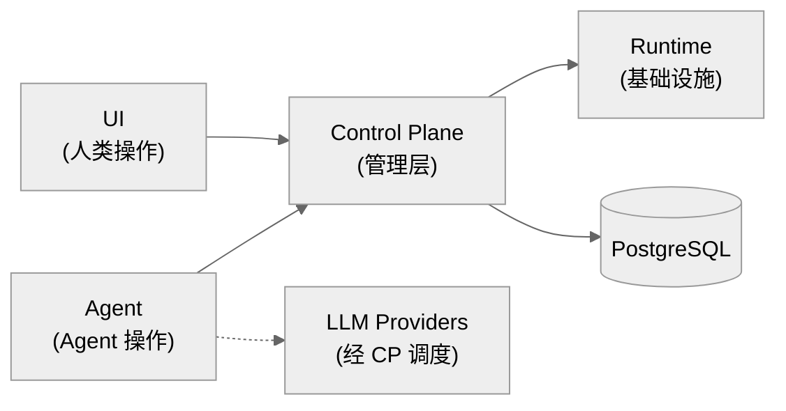
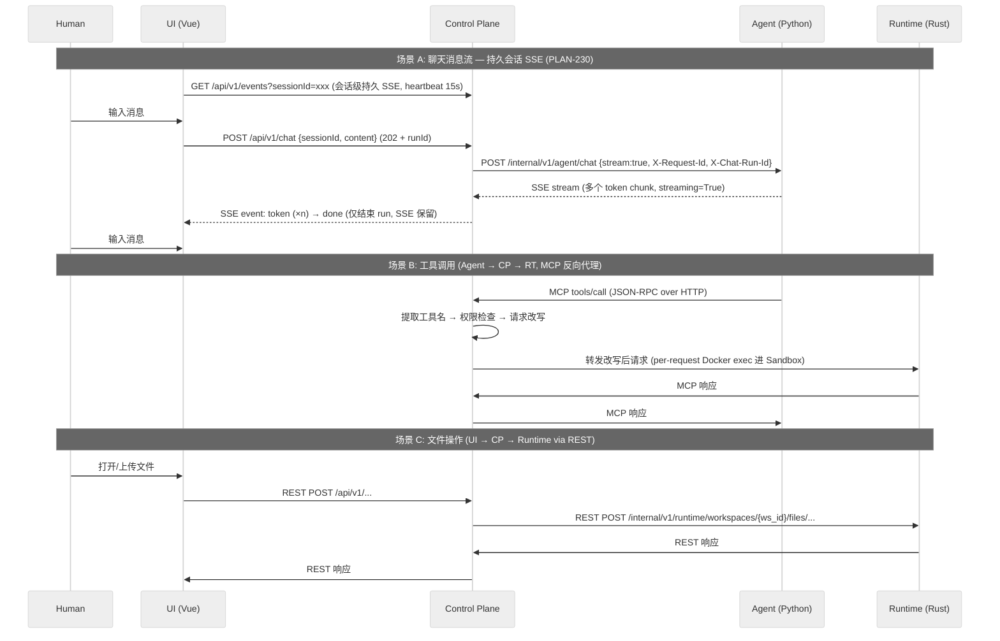

# DEV-001: xihe Agent 系统架构

> 面向新人阅读：5 分钟建立全系统心智模型（四模块分工 + 两流 + 协议总表）。模块细节见 DEV-010/013/014/015/016/017。
>
> xihe 是一个通用 Agent 运行时平台，提供多 Agent 编排、工具调用、沙盒执行、权限控制等能力。四模块 Hub-Module 架构：各模块独立演进、独立部署、独立技术栈。模块专篇：UI 见 DEV-010、Agent 见 DEV-013、CP 见 DEV-014、Runtime 见 DEV-015、MCP 见 DEV-016、Session 见 DEV-017；本文只保留总览与跨模块契约。

## 1. 四模块详解

### 1.1. UI 模块 — Vue/TypeScript

职责：人类交互入口。

| 方面 | 选型 |
|------|------|
| 框架 / 语言 | Vue 3 + TypeScript（Composition API） |
| 包管理 / 构建 | pnpm / Vite 8 |
| 路由 / 状态 | Vue Router / Pinia + persistedstate |
| 组件 / 样式 | reka-ui + Tailwind CSS v4 |
| 图标 / 富文本 | @lucide/vue / remark + rehype + Shiki + KaTeX |
| 测试 / 规范 | Vitest + @vue/test-utils / oxlint |

通信：

- 只与 CP 对话（`fetch POST` + 持久 `EventSource` SSE），不直接调用 Agent 或 Runtime。
- 零系统调用：纯展示 + 输入采集。

### 1.2. Agent 模块 — Python / LangChain

职责：LLM 调用（直调 provider，不经 CP，见 DEV-013 §2.3）、多 Agent 编排、工具选择、规划决策。Python + LangChain + litellm（`ChatLiteLLM`，100+ Provider）、uv、长驻后端服务；不碰文件系统/Shell，只做"思考"。

| 方面 | 选型 |
|------|------|
| 语言 / 包管理 | Python + uv |
| 编排 / LLM | LangChain + litellm（`ChatLiteLLM`，100+ Provider） |
| 部署 / 边界 | 长驻后端服务；不碰文件系统/Shell，只做“思考” |

关键能力：

- 经 CP 获取工具清单并决策；Agent 间委派 / 并行 / 合并。
- Event Sourcing 上下文（PLAN-035）：只消费 CP 投影的 `AgentContext` 快照。
- MCP 集成经 CP 单一入口。
- `AgentRunner` / `BaseAgentTool` / `EventAdapter` / `LLMProvider` 接口隔离实现。

详见 DEV-013。

### 1.3. Runtime 模块 — Rust

职责：沙盒化执行环境。Rust + cargo；文件系统、Shell、进程管理。

**执行模型（PLAN-235）**：Strict / Coding / Isolated 三 profile 的 Workspace 文件、命令、PDF、后台操作**全部经 `WorkspaceExecutionRouter` 以 per-request Docker exec 在 Sandbox 内执行**。详见 DEV-015。

| 约束 | 说明 |
|------|------|
| 无 host fallback | Runtime host 进程不直接读写 WorkspaceStorage |
| 无旁路通道 | 无 HTTP 通道 / instance token / 长驻 worker |
| Strict 隔离 | `network_mode=none`，不发布端口 |

三 binary：

| Binary | 角色 |
|--------|------|
| `xihe-runtime` | Gateway 主进程 |
| `xihe-container-runtime` | 容器内执行器（`--oneshot` 单帧 EOF） |
| `xihe-mcp-bridge` | 容器内 STDIO bridge |

CP→Runtime REST 端点（Axum，`/internal/v1/runtime/...`）：

| 用途 | 方法 | 路径 |
|------|------|------|
| 创建 / 删除 workspace | POST | `workspaces` / `workspaces/delete` |
| workspace 状态 | GET | `workspaces/{ws_id}/status` |
| MCP 调用 | any | `workspaces/{ws_id}/mcp`，`/remote-mcp/...` |
| bridge 管理 | POST / GET / DELETE | `mcp/spawn`、`mcp/spawn/{server_id}`、`mcp/stdio/{server_id}` |
| 文件操作 | POST（body 传参） | `files/{read,list,delete,mkdir,stat}` |
| 文件写入 | POST（二进制，路径参数） | `files/write/{*path}` |
| 健康 | GET | `/health`、`/ready` |

MCP 工具（rmcp `#[tool]`，24 个）：

| 组 | 工具 |
|----|------|
| 文件 | read_file、read_file_range、write_file、list_directory、get_file_info、mkdir、delete_file、delete_directory、move_file、copy_file |
| 检索 | glob、grep、edit_file、extract_pdf_text、web_fetch |
| 命令 | execute_command、read_command_output、watch_directory |
| 后台 | start_background_process、list_background_processes、get_background_process、cancel_background_process |

### 1.4. Control Plane 模块 — 系统核心

职责：路由 + 权限控制 + 数据加工 + 状态广播 + 会话管理 + 统一配置管理。

| 方面 | 选型 |
|------|------|
| 语言 / 构建 | Java + Spring Boot、Maven |
| 能力 | 聊天中转 + MCP 反向代理 + 权限裁决 + 审计 |
| 协议 | HTTP/SSE + MCP Streamable HTTP 三通道 |
| 配置 | ConfigService 三层所有权（详见 DEV-003） |
| 约束 | **不做模块专属业务逻辑** |

CP 三通道：

| 通道 | 契约 |
|------|------|
| 聊天 | `POST /api/v1/chat` + 持久 `GET /api/v1/events?sessionId=`（PLAN-230：单会话单活 emitter + generation、`done` 只结束 run、`heartbeat` 15s、409 准入/单并发） |
| MCP 反向代理 | `POST /api/v1/mcp`（认证 + tool-name 路由 + 三层转发） |
| 状态分发 | Runtime notification → UI SSE / Agent 透传 |

详见 DEV-014。

### 1.5. 通信协议总结

| 协议 | 用途 | 链路 | 关键契约 |
|------|------|------|----------|
| 持久 SSE + `POST /api/v1/chat` | 聊天：`GET /api/v1/events?sessionId=` 建会话长连接；`token` 增量 → `done` 结束 run，SSE 保留 | UI ↔ CP ↔ Agent | `done` ≠ 关 SSE；单活 emitter + generation；单并发 run |
| MCP Streamable HTTP | Agent 工具调用（JSON-RPC over HTTP，经 CP 反代） | Agent → CP → Runtime / 外部 | tool-name 路由 |
| MCP notification | 状态同步 | Runtime → CP → UI / Agent | — |
| HTTP (REST) | 文件操作/上传/管理（二进制直传） | UI → CP → Runtime | `/internal/v1/runtime/...` |

MVP 零额外基础设施（无消息队列/WS 网关）；后续可按需引入消息中间件做集群扩展。

### 1.6. 设计备注

- **统一 MCP 反向代理**：Agent 所有 MCP 调用指向 CP 单一入口，按工具名前缀路由后端；Agent 不感知后端分布。（历史设计名：DESIGN-007）
- **工具名命名空间**：`ToolNameRewriter`（`read_file` ↔ `runtime__read_file`）已实现且有单测，但当前 `McpProxyController` 未接线（实际经 `RequestRewriter` 按原名合并转发）；如需启用前缀路由须先接线。（历史设计名：DESIGN-009）
- **工具自发现**：Runtime 经标准 `tools/list` 暴露 Schema，Agent 经 CP 自动发现，零手动同步。
- **零 MCP SDK 依赖（CP 侧）**：CP 纯 HTTP 反代，直接解析 JSON-RPC 做权限检查与改写。（历史设计名：DESIGN-001）

## 2. 两流模型

1. **指令流** — RPC 模式：request → execute → response；响应分一次性与流式（逐 token / 实时 stdout）。
2. **状态流** — 异步广播，无响应预期，一对多经 CP 分发。

状态流：Runtime 文件事件 → MCP notification → CP → UI（`GET /api/v1/events?sessionId=`）/ Agent（透传）；Agent 会话切换/模型变更 → HTTP POST → CP → UI SSE。

## 3. 架构优势

1. **多进程解耦** — 模块独立部署/扩缩/故障隔离；Agent Crash 不影响 UI，Runtime OOM 不影响 Agent。
2. **多语言各取所长** — Vue（Web 生态）、LangChain/Python（AI 生态）、Java + Spring Boot（服务端生态）。
3. **显式消息路由** — CP 是唯一通信枢纽，消息路径全程可追踪、可拦截、可 replay。
4. **原生多租户** — 多进程 + Linux namespace 操作系统级隔离。
5. **沙盒一等设计** — namespace/cgroup/seccomp + PLAN-235 全 profile 进 Sandbox，对 LLM"幻觉执行"原生防御。
6. **多终端天然支持** — Web/TUI/App 只需实现 CP 协议。

## 4. 统一 Session 与附件（摘要，详见 DEV-017）

chat 与 workspace 是同一 Session 的不同视图：

- Chat 用 `/chat/:sessionId`，Workspace 用 `/workspace/:workspaceId`。
- `useSessionStore` 承载服务端 Session 投影；`useChatStore`/`useWorkspaceStore` 为视图层状态。
- 附件持久化到后端 Session 专属空间（`{base}/{sessionId}/{fileId}`），刷新仍可渲染。

## 5. 远程 MCP 与 OAuth 边界（摘要，详见 DEV-016/DEV-014）

- UI 发起 Authorization Code + PKCE；CP 保存加密 refresh token，按 user/workspace/server 发短期 access token。
- Agent 只连 CP logical MCP endpoint；Runtime host-side connector 负责远程 MCP 出网；workspace sandbox 不直接出网。
- Fake OAuth/Fake MCP 只作真实 integration/E2E fixture。
