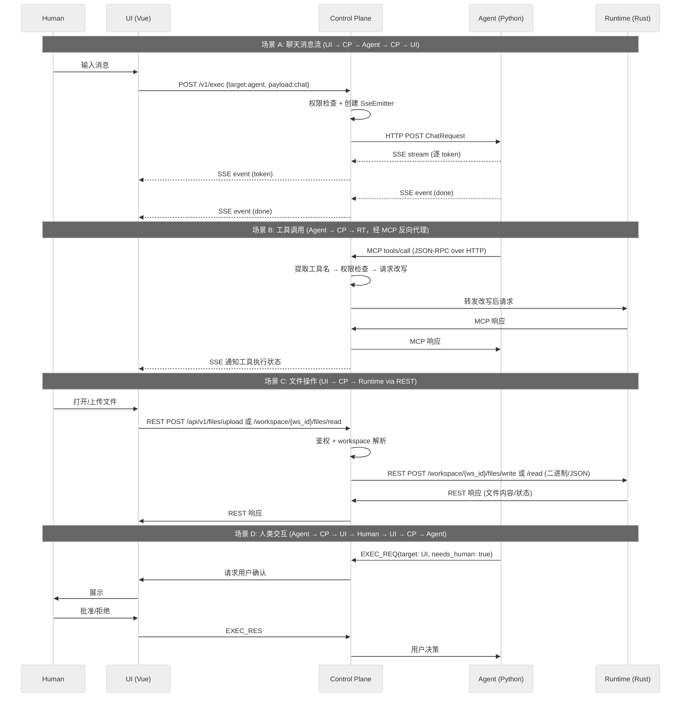
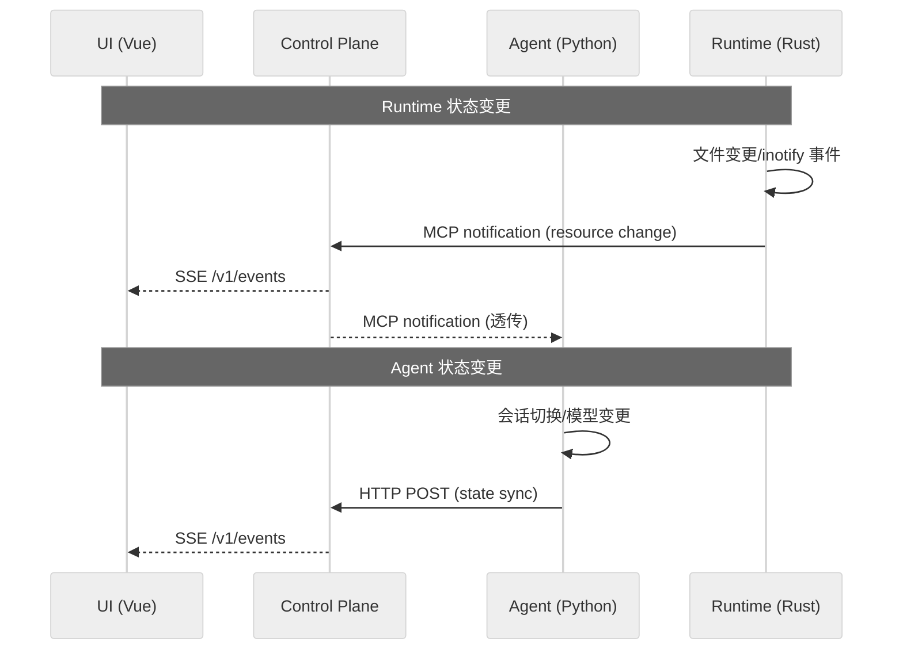

# DEV-001: xihe Agent 系统架构

> xihe 是一个通用 Agent 运行时平台，提供多 Agent 编排、工具调用、沙盒执行、权限控制等能力。
> 项目以考研学习为初始切入口，但架构设计不限于此——任何需要 Agent 能力的场景均可使用。

## 1. 架构总览

xihe 采用 **四模块 Hub-Module 架构**，核心设计理念是**解耦**——每个模块独立演进、独立部署、独立技术栈。

## 2. 四模块详解

### 2.1. UI 模块 — Vue/TypeScript

**职责**：与人类用户交互的入口，覆盖 Web、TUI、未来可能的 IDE Extension 等多终端。

| 方面 | 决策 |
|------|------|
| 核心框架 | Vue 3 + TypeScript（Composition API） |
| 包管理器 | pnpm（workspace monorepo） |
| 构建工具 | Vite 8 |
| 路由 | Vue Router |
| 状态管理 | Pinia + pinia-plugin-persistedstate |
| 组件库 | shadcn-vue（基于 reka-ui 的无样式可访问组件）+ Tailwind CSS v4，含 Button、Card、Dialog、Input、MessageScroller 等组件族 |
| 图标 | @lucide/vue + @iconify/vue |
| CSS 方案 | Tailwind CSS v4 + HSL 主题变量，支持暗色模式。辅助工具：class-variance-authority、clsx、tailwind-merge |
| Markdown 渲染 | remark/rehype 管线 + Shiki 语法高亮 + KaTeX 数学公式 |
| AI 集成 | Vercel AI SDK（用于与 Control Plane/Agent 的流式通信） |
| 测试 | Vitest + @vue/test-utils |
| 代码规范 | oxlint + oxfmt |
| 通信 | 只与 Control Plane 对话（`EventSource` SSE + `fetch` POST），不直接调用 Agent 或 Runtime |
| 约束 | 零系统调用，纯展示 + 输入采集。所有业务逻辑在后端 |

**关键接口**：

- 用户输入 → Control Plane（控制指令、Agent 指令）
- Control Plane → UI（状态更新、执行结果、审批请求）
- Control Plane → UI（Agent 的中间思考/决策流）

### 2.2. Agent 模块 — Python / LangChain

**职责**：LLM 调用、多 Agent 编排、工具选择、规划决策。

| 方面 | 决策 |
|------|------|
| 技术栈 | Python + LangChain + litellm（ChatLiteLLM，100+ LLM Provider） |
| 构建工具 | uv（Python 项目管理，替代 pip/poetry） |
| 核心 | 多 Agent 编排（Agent Swarm / 规划 - 执行循环） |
| 部署 | **长驻后端服务**（非 CLI），无冷启动问题 |
| 边界 | 不碰文件系统、不碰 Shell——只做"思考" |

**关键能力**：

- 工具选择：通过 Control Plane 获取 Runtime 注册的工具清单，决策后发指令给 Control Plane
- 多 Agent：支持 Agent 间的委派、并行、结果合并
- 记忆/上下文：会话管理（Control Plane 辅助/自有存储）
- MCP 集成：Agent 通过 `langchain-mcp-adapters` 的 `StreamableHttpConnection` 将 CP 作为统一 MCP 入口，所有工具调用（Runtime 内置工具 + 用户配置的 STDIO MCP server）均经过 CP 三层路由（CP 认证 → Runtime Gateway per-workspace 分发 → 容器内 `xihe-mcp-bridge` STDIO 桥接）。Agent 仅需配置一个 MCP 端点（CP 地址），不感知后端工具分布。详见 [DEV-005-mcp-architecture.md](DEV-005-mcp-architecture.md)
- **LLM Provider 管理**：通过 `langchain-litellm`（`ChatLiteLLM(BaseChatModel)`）统一封装，底层由 `litellm` 自动路由到 100+ Provider（OpenAI、DeepSeek、Anthropic、小米 MiMo、Ollama 等）。新增 Provider 无需修改 Agent 代码——前端 `BUILTIN_PROVIDERS` 加一条记录即可。
- **内部可随意折腾**：LangChain 生态、自定义 Agent、新框架替换都不影响其他模块

### 2.3. Runtime 模块 — Rust

**职责**：底层系统能力的沙盒化执行环境，对外暴露两套接口。

| 方面 | 决策 |
|------|------|
| 技术栈 | Rust |
| 构建工具 | cargo |
| 核心 | 文件系统操作、Shell 执行、进程管理 |
| 安全 | 沙盒隔离（namespace/cgroup/seccomp），支持多租户。仅 `execute_command` 子进程进入沙盒，Runtime 主进程在沙盒外运行 |
| 部署 | 独立进程（Axum），同时暴露 REST API + MCP Server 两套接口 |

**双接口设计**：

```
Runtime
├── REST API          ← 面向 UI/CP：文件操作、上传、管理等指令型操作
│   协议: HTTP + JSON / 原始二进制
│   消费者: UI → CP → Runtime
│   优势: 二进制直传无编码开销、路径参数灵活、语义清晰
│
└── MCP Server        ← 面向 Agent：工具调用
    协议: MCP Streamable HTTP (JSON-RPC)
    消费者: Agent → CP(MCP Proxy) → Runtime
    优势: 标准 MCP 协议、工具自发现、JSON Schema 自动生成
```

两个接口共享底层 `fs.rs` 等核心函数，同一套业务逻辑、两套传输协议。设计原则：**REST API 范围包含 MCP Server 范围**——所有 MCP tool 对应的功能都有对应的 REST 端点，但 REST 可以额外提供 MCP 协议不便于表达的能力（如二进制传输、大文件流）。

**REST API 端点**（由 Axum router 注册）：

| 端点 | 消费者 | 用途 |
|------|--------|------|
| `POST /workspace/{ws_id}/files/read` | UI → CP | 读取文件内容（可选 `max_bytes` 截断） |
| `POST /workspace/{ws_id}/files/write/{*path}` | UI → CP | 写入文件（二进制 body） |
| `POST /workspace/{ws_id}/files/list` | UI → CP | 列出目录 |
| `POST /workspace/{ws_id}/files/delete` | UI → CP | 删除文件 |
| `POST /workspace/{ws_id}/files/mkdir` | UI → CP | 创建目录 |
| `POST /workspace/{ws_id}/files/stat` | UI → CP | 文件元信息 |
| `GET /health` | CP | 健康检查 |
| `POST /workspace/{ws_id}/mcp` | Agent (via CP) | 系统 MCP 工具调用（per-workspace） |
| `POST /workspace/{ws_id}/mcp/spawn` | CP | 启动容器内 STDIO MCP bridge |
| `DELETE /workspace/{ws_id}/mcp/spawn/{server_id}` | CP | 停止 STDIO MCP bridge |
| `GET /workspace/{ws_id}/mcp/spawn` | CP | 列出活跃 STDIO server |
| `POST /workspace/{ws_id}/mcp/stdio/{server_id}` | Agent (via CP) | 路由到容器内 STDIO bridge |
| `POST /workspace/create` | CP | 创建工作区 |
| `POST /workspace/delete` | CP | 删除工作区（含 bridge 清理） |

**MCP Server**（`rmcp` SDK + `#[tool]` macro）：自动生成 JSON Schema。Runtime 有三个 binary：
- `xihe-runtime`：Gateway 主进程，注册 `/workspace/{ws_id}/mcp` 系列路由
- `xihe-container-runtime`：容器内 HTTP 服务，处理 built-in 文件/命令工具
- `xihe-mcp-bridge`：容器内 STDIO bridge，将用户配置的 STDIO MCP server 暴露为 HTTP 端点

工具名经 CP 反向代理时构建 tool→server 映射表，Agent 调用时 CP 查表路由。详见 [DEV-005-mcp-architecture.md](DEV-005-mcp-architecture.md)。

| 工具类别 | 示例 |
|---------|------|
| 文件系统 | read_file, list_directory, glob, grep, read_media |
| Shell | execute_command（子进程进沙盒，含 timeout） |
| 进程 | spawn, kill, signal |
| 环境 | env vars, workspace info |

**状态流保持 MCP**：Runtime 的状态变更（文件事件等）通过 MCP notification 发送，不走 REST。CP 透传 notification 到 Agent（MCP）和 UI（SSE）。详见 §3.2。

### 2.4. Control Plane 模块 — 系统核心

**职责**：Control Plane（简称 CP）是系统的心脏，负责路由 + 权限控制 +
数据加工 + 状态广播 + 会话管理 + **统一配置管理**。下文链路图和协议示例中统一记为 CP。

| 方面 | 决策 |
|------|------|
| 技术栈 | Java + Spring Boot + GraalVM |
| 构建工具 | Maven（mvn） |
| 核心 | 聊天消息中转 + MCP HTTP 反向代理 + 权限裁决 + 状态广播 + 审计日志，HTTP/SSE + MCP Streamable HTTP 三通道 |
| 数据 | 会话状态、路由表、工具注册表、权限策略、加工规则 |
| ConfigService | **CP 内置统一配置管理层**，所有模块通过 CP API 读取运行时配置。3-tier 所有权：system/admin/user。详见 DEV-002 §2.4 |
| 约束 | **不做模块专属业务逻辑**，只做路由、权限控制、数据加工、配置管理等跨面关注点 |

**ConfigService 架构**：详见 [DEV-002-developer-guide.md](DEV-002-developer-guide.md) §2.4。三个模块通过不同客户端访问 CP ConfigService：

| 模块 | 客户端 | 访问方式 |
|------|--------|---------|
| **Control Plane** | `ConfigService.java` | 内建 `@Service`，启动时从 `env.{profile}.jsonc` 导入 system 配置 |
| **Agent** | `config_client.py` | CP API `GET /api/v1/config`，启动时拉取全量缓存 |
| **Runtime** | `config_client.rs` | CP API `GET /api/v1/config`，启动时拉取并定期刷新 |

**CP 三通道职责**：

- **聊天通道**（`POST /v1/exec` + `SSE /v1/events`）：UI 指令经 CP 中转 → Agent，Agent 流式响应经 CP 分发到 UI
- **MCP 反向代理通道**（`POST /mcp`）：Agent 的 MCP 工具调用经 CP 解析 JSON-RPC → 提取工具名 → 权限检查 → 请求改写 → 三层路由转发：
  - **第 1 层（CP）**：认证 + tool-name 路由，系统工具 → Runtime `/workspace/{ws_id}/mcp`，用户 STDIO 工具 → `/workspace/{ws_id}/mcp/stdio/{server_id}`
  - **第 2 层（Runtime Gateway）**：per-workspace 分发，`CURRENT_WS_ID` task-local 注入
  - **第 3 层（容器内 bridge）**：`xihe-mcp-bridge` 管理 STDIO 子进程，HTTP ↔ STDIN/STDOUT 桥接
  - 详见 [DEV-005-mcp-architecture.md](DEV-005-mcp-architecture.md)
- **状态分发通道**：Runtime 的 MCP notification 经 CP 分发到 UI（SSE）和 Agent（MCP notification 透传）

详见 Sprint 1 `DESIGN-007-mcp-gateway-reverse-proxy.md`。

**传输协议**：

| 链路 | 传输协议 | 原因 |
|------|---------|------|
| UI ↔ CP | HTTP + SSE + POST | 指令通过 `fetch POST` 发送，流式响应和状态推送通过 `EventSource`（SSE）接收。这是 ChatGPT、Claude 等 LLM 网站验证过的生产模式，浏览器原生支持，过基础设施无阻力 |
| CP ↔ Agent（聊天） | HTTP + SSE | Agent 作为 HTTP Server 接收 CP 转发指令，流式响应通过 SSE 逐 token 返回 |
| CP ↔ Agent（工具） | MCP Streamable HTTP | Agent 通过 MCP Client 连接 CP 反向代理，所有工具调用统一走 JSON-RPC over HTTP |
| **CP ↔ Runtime（REST）** | **HTTP** | UI 发起的文件读写/上传/管理等指令型操作，通过 CP REST API 转发到 Runtime REST 端点。支持二进制直传 |
| **CP ↔ Runtime（MCP）** | **MCP Streamable HTTP** | Agent 的工具调用经 CP 反向代理到 Runtime MCP Server。Runtime 状态变更经 MCP notification 通知 CP |
| CP ↔ 外部 MCP Server | MCP Streamable HTTP | 外部工具（websearch 等）由 CP 透传，Agent 不感知外部地址 |

### 2.5. 通信协议总结

MVP 采用以下协议，各有明确用途：

| 协议 | 用途 | 链路 |
|------|------|------|
| HTTP POST + SSE | 聊天消息：指令 `POST` → 流式响应 `SSE` | UI ↔ CP ↔ Agent |
| MCP Streamable HTTP | Agent 工具调用：JSON-RPC over HTTP，统一经 CP 反向代理 | Agent → CP → Runtime / 外部 MCP Server |
| MCP notification | 状态同步：Runtime 事件经 CP 分发到 UI 和 Agent | Runtime → CP → UI / Agent |
| **HTTP (REST)** | **文件操作/上传/管理等指令型操作：二进制直传** | **UI → CP → Runtime** |

> Runtime 双接口设计：Agent 工具调用走 MCP，UI 文件操作走 REST。状态流保持 MCP notification（§3.2），不因 REST API 的引入而改变。
>
> MVP 零额外基础设施（无消息队列、无 WebSocket 网关），各模块直接通过 HTTP 端点互联。后续可按需引入 Centrifugo 等消息中间件实现企业级集群扩展。

### 2.6. 设计备注

**统一 MCP 反向代理** — Agent 将所有 MCP 调用指向 CP 单一入口。CP 根据工具名前缀判断目标后端（Runtime / 外部服务），做权限检查后转发。Agent 不感知后端工具分布，外部工具的透传可随时切换为鉴权模式。详见 Sprint 1 `DESIGN-007-mcp-gateway-reverse-proxy.md`。

**工具名命名空间** — CP 在 `tools/list` 时给工具名加后端前缀（`runtime__read_file`），在 `tools/call` 时解析前缀路由到对应后端。详见 Sprint 1 `DESIGN-009-tool-namespace.md`。

**工具自发现** — Runtime 通过标准 MCP `tools/list` 暴露工具 Schema，Agent 通过 CP 的 MCP Client 自动发现，无需手动同步。Runtime 新增工具时自动暴露，Agent 侧零配置。

**零 MCP SDK 依赖（CP 侧）** — CP 作为纯 HTTP 反向代理，不依赖任何 MCP SDK。CP 直接解析 JSON-RPC 请求体提取 `method`/`params`，做权限检查和改写后转发。详见 Sprint 1 `DESIGN-001-decisions.md` §4。

## 3. 两流模型

所有模块间的通信归为两种流：

1. **指令流** — 模块 A 请求模块 B 执行，含完整的 request → execute → response 生命周期
2. **状态流** — 模块异步广播状态变更，无响应预期，一对多分发

### 3.1. 指令流

**定义**：RPC 模式。模块 A 请求模块 B 执行某操作，B 可以是任意模块——RT（工具）、Agent（任务）、UI（人类交互）。响应分为**一次性**（完整结果）和**流式**（逐 token 输出、实时 stdout）两种。



### 3.2. 状态流

**定义**：模块主动广播的异步状态变更。所有模块既是发布者也是订阅者，经 CP 按订阅分发。



## 4. 架构优势

1. **多进程解耦** — 相比 Codex/OpenCode/PI/Kimi 的单进程单体，xihe 的模块可独立部署、独立扩缩、独立故障隔离。Agent Crash 不影响 UI，Runtime OOM 不影响 Agent。
2. **多语言各取所长** — Vue 做 UI（Web 生态最成熟）、
  LangChain/Python 做 Agent（AI 生态最丰富）、
  Java + Spring Boot 做 Control Plane（服务端生态最成熟、GraalVM 原生启动）。
  Codex 被全 Rust 锁定（换 LLM 需改两层 crate），
  OpenCode/PI 被全 TS 锁定（无性能敏感层）。
3. **显式消息路由** — Control Plane 是唯一的通信枢纽，天然提供可观测性
   （审计日志、流量监控）。对比 Codex/OpenCode 的进程内隐式调用，
   xihe 的消息路径全程可追踪、可拦截、可 replay。
4. **原生多租户** — 多进程 + Linux namespace 是操作系统级的租户隔离，零额外开销。Codex 的沙盒虽强但只为单用户设计。
5. **沙盒是一等设计** — Rust namespace/cgroup/seccomp 从第一天写入架构，而非事后加补丁。对比 OpenCode/PI 的无沙盒设计，xihe 对 LLM 的"幻觉执行"有原生防御能力。
6. **多终端天然支持** — Web、TUI、手机 App 只需实现 Control Plane 的协议，
  不用关心后端的语言和实现。

### 4.1. 文件加载降级策略

大文件全量加载到前端会导致 OOM（PDF >10MB 的 pdfjs.render 和文本 >10MB 的 JSON parse）。

**策略矩阵**：

| 文件类型 | 大小范围 | 策略 | 链路 |
|---------|---------|------|------|
| PDF | <10MB | 全量加载 | MCP `runtime__read_file` |
| PDF | 10MB~500MB | CP 端 PDFBox 拆为 10 页/组，加载当前组 | UI → CP(/upload) → PDFBox → Runtime(REST write) |
| PDF | >500MB 或 >500 页 | 拒绝拆分，提示用户下载 | CP 端 Content-Length 检查 |
| 文本/代码 | <10MB | 全量加载 | REST `read` (无 max_bytes) |
| 文本/代码 | 10MB~100MB | 服务端 max_bytes=1MB 截断 | REST `read` (max_bytes=1MB) |
| 文本/代码 | ≥100MB | 前端拦截，Toast，空内容 | 前端 fileService.ts 判断 |

**关键设计决策**：

1. **文本截断走 REST，不走 MCP** — Runtime REST read endpoint 支持 `max_bytes` 参数，MCP `runtime__read_file` 保持全量读取（Agent 需要完整内容）。
2. **PDF 拆分归属 CP** — CP (Java + PDFBox) 上传时或懒拆分后，通过 Runtime REST API 写入 chunk 文件。Runtime 不耦合 PDF 命名约定。
3. **文件删除级联清理** — CP 侧在删除文件时查找并清理同名 chunk（`{name}.p*.pdf`）。
4. **chunk 命名规则**：`{name}.p{start}-{end}.pdf`，例如 `report.p1-10.pdf`。

---

## 5. 协议定义（草案）

所有模块间的通信遵循统一的**消息契约**：

```typescript
interface Message {
  id: string
  type: 'EXEC_REQ' | 'EXEC_RES' | 'STATE_SYNC'
  source: 'ui' | 'cp' | 'agent' | 'runtime'
  target: 'ui' | 'cp' | 'agent' | 'runtime' | 'broadcast'
  timestamp: number
  payload: unknown
}
```

> 详细协议见 `DEV-002-message-protocol.md`（待编写）。

---

## 6. Chat UI 组件架构

聊天界面采用分层组件库实现，位于 `packages/ui/src/components/ui/`：

| 组件族 | 用途 | 关键特性 |
|--------|------|---------|
| `message-scroller/` | 滚动容器 | 锚定/自动跟随/预加载保持/消息级跳转/可见性追踪 |
| `message/` | 消息卡片 | Message / MessageGroup / MessageAvatar / MessageContent / MessageHeader / MessageFooter |
| `bubble/` | 消息气泡 | user / assistant / system 变体，cva 管理 |
| `attachment/` | 附件展示 | 媒体/文件/动作按钮，state/size/orientation 变体 |
| `marker/` | 时间/状态标记 | 分隔线变体，cva 管理 |

滚动行为核心位于 `packages/ui/src/composables/messageScroller*.ts` 与 `packages/ui/src/lib/messageScrollerGeometry.ts`：

- **模式状态机**：`following-bottom` → `free-scrolling` → `anchored-to-message` → `settling-jump`
- **用户滚动意图**：监听 wheel / touchmove / PageUp/PageDown/Home/End 等按键
- **新回合锚定**：新消息到达时滚动到锚定项顶部，并通过 `scrollPreviousItemPeek` 保留上文上下文
- **预加载保持**：`preserveScrollOnPrepend` 在历史消息前置时保持当前可视锚点
- **可见性追踪**：懒订阅的 `IntersectionObserver` 提供 `currentAnchorId` 与 `visibleMessageIds`
- **性能策略**：`shallowRef` + 手动 `data-*` 属性同步，避免高频滚动触发 Vue 全子树响应

ChatView 集成方式：

- `ChatView.vue` 使用 `MessageScrollerProvider` 包裹 `MessageList`
- `MessageList.vue` 用 `MessageScroller` / `Viewport` / `Content` / `Item` 替换旧的 `@tanstack/vue-virtual` 容器
- 用户消息的 `MessageScrollerItem` 绑定 `:scroll-anchor="true"`，作为新回合的滚动锚点
- SSE 流式开始时 `chatStore.createStreamingMessage()` 立即创建真实 assistant 消息，`appendToken()` 直接追加到该消息的 `content`，无需独立的 `streamingContent` 伪消息

详见 `plans/PLAN-024-XH-chat-components.md` 与 `plans/PLAN-025-XH-chat-integration.md`。

## 7. 统一 Session 与附件持久化架构

随着 chat 与 workspace 的能力趋同，Xihe 引入**跨视图统一 Session 层**，避免 Agent、RAG、MCP、附件等概念在 chat 与 workspace 中重复落地。

### 7.1 统一 Session 层

- chat 与 workspace 被视为**同一 Session 的不同视图**，分别通过 `/chat/:sessionId` 与 `/workspace/:sessionId` 访问。
- `useSessionStore` 承载跨视图核心状态：session 元数据、Agent 编排、RAG/MCP 上下文、附件列表、文件上下文。
- `useChatStore` 与 `useWorkspaceStore` 降级为视图层状态：前者保留消息流与 UI 状态，后者保留文件树、编辑器与上传队列。
- workspace 通过可嵌入的 `ChatPanel.vue` 直接复用 chat 的对话能力，无需复制组件树。

详细设计见：
- [RFC-001-session-domain-model.md](RFC-001-session-domain-model.md)
- [ADR-001-session-store-boundary.md](ADR-001-session-store-boundary.md)
- [DEV-015-session-views.md](DEV-015-session-views.md)
- `plans/PLAN-029-XH-unified-session-architecture.md`

### 7.2 消息附件持久化

早期 chat 附件仅使用 `URL.createObjectURL` 生成 Blob URL，刷新后失效。PLAN-030/031 实现了端到端附件持久化：

**后端（PLAN-030）**

- 扩展 `File` entity：新增 `sessionId`、`messageId`，`workspaceId` 改为 nullable；附件物理存储在 `{cp.attachments-base-path}/{sessionId}/{fileId}`，与 workspace 文件树隔离。
- 扩展 `Message` entity：新增 `attachments` JSON 列保存 `{ fileId, name, type, size }[]`。
- 新增 API：
  - `POST /api/v1/sessions/{sessionId}/attachments` — 批量 multipart 上传，返回部分成功结果
  - `GET /files/{fileId}` — 服务历史附件流
  - `GET /api/v1/sessions/{sessionId}/messages` — 加载历史消息（含附件）
  - `DELETE /api/v1/sessions/{sessionId}/messages/{messageId}` — 删除消息
- 安全与生命周期：白名单扩展名校验、500MB 单文件上限、跨 session 访问防护、session 删除级联清理、orphan 附件 24h 后定时清理。
- `/chat` 接收 `attachments: fileId[]` 并将附件元数据转发给 Agent。

**前端（PLAN-031）**

- `AttachmentService` 集中处理批量上传、前端白名单/大小校验、reactive 上传任务状态、删除与元数据查询。
- `InputArea.vue` 选择文件后批量上传；若输入框有文本，文本与附件合并为一条消息发送；否则发送纯附件消息。
- `MessageItem.vue` 使用 `/files/{fileId}` 渲染持久化附件，支持删除消息。
- `ChatView.vue` 挂载时从后端加载历史消息并覆盖 localStorage，保证刷新后附件仍可见。

详见 `plans/PLAN-030-XH-chat-attachment-backend.md` 与 `plans/PLAN-031-XH-chat-attachment-frontend.md`。

