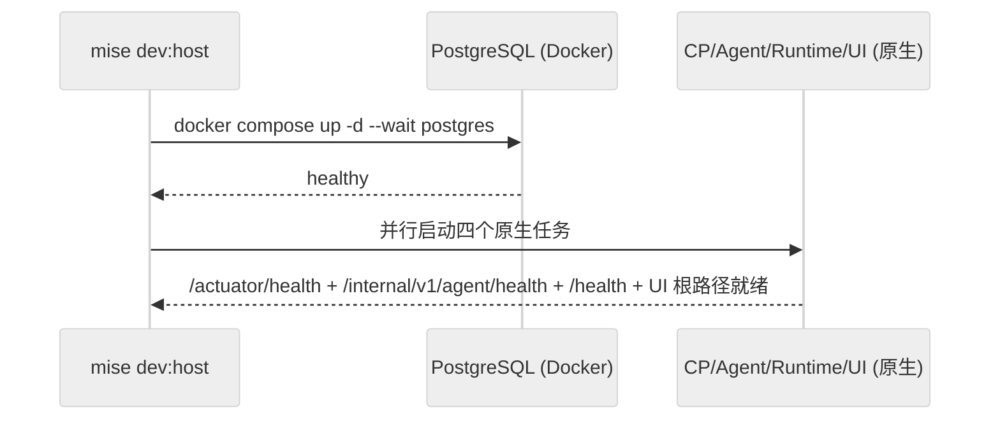

# DEV-002: 开发者指南

> 环境搭建、运行模式与全栈调试。配置管理详见 DEV-003，日志详见 DEV-004，测试策略见 DEV-020/021/022/023。

## 1. 项目结构

```text
xihe/
├── packages/
│   ├── ui/                    # Vue 3 + Vite + Tailwind + reka-ui
│   │   ├── src/               # components / composables / stores / router / i18n / mocks / types
│   │   └── e2e/               # Playwright（mock/ + real/）
│   ├── control-plane/         # Java 25 + Spring Boot 4 + Maven
│   │   └── src/main/java/.../cp/  # auth / chat / mcp / config / context / files / session / audit
│   ├── agent/                 # Python 3.12 + LangChain/LangGraph + uv
│   │   └── src/xihe_agent/    # interfaces / agent_runner / adapters / context / tools / llm / rag / registry
│   └── runtime/               # Rust 1.88 edition 2024 + cargo
│       └── src/               # main / executor / workspace / container_runtime / fs / sandbox / mcp_bridge / hydrate
├── docs/i18n/{zh-Hans,en}/    # 公开文档（编号规则见 DEV-030）
├── scripts/                   # dev-host / reset-admin / scan-log-secrets 等辅助脚本
├── docker/images/workspace/   # xihe/workspace 容器镜像
├── mise.toml                  # 工具链与跨模块任务
└── docker-compose.yml         # 全容器基线编排
```

根 `pnpm-workspace.yaml` 仍有效（`packages/*` 约束 + 构建白名单），但日常不走 pnpm workspace 安装：UI 依赖仅在 `packages/ui/` 内用 pnpm 管理。`Taskfile.yml` 仅保留作向后兼容（首行已声明弃用），统一入口为 `mise run ...`。

## 2. 环境与安装

```bash
mise install
mise run setup
cp .env.example .env.dev
# 编辑 .env.dev（端口/DB/JWT/Workspace 根等，详见 DEV-003 §2）
```

前置：Node 22+ / pnpm 10+ / Python 3.12+ + uv / Java 25+ + Maven 3.9 / Rust 1.88+ / Docker（Desktop for Windows 需 WSL2 集成）。

模块级等价命令：`cd packages/ui && pnpm install --ignore-workspace`；`cd packages/agent && uv sync --all-extras`；`cd packages/control-plane && mvn dependency:resolve`；`cd packages/runtime && cargo fetch`。

## 3. 运行模式

### 模式 A：`dev:host` 日常开发（推荐）

```bash
mise run dev:host
```



锚点：`mise.toml: dev:host` + `scripts/dev-host.ps1`。PostgreSQL 跑在 Docker，其余 CP/Agent/Runtime/UI 由 mise 原生并行管理。Runtime 用 `XIHE_WORKSPACE_HOST_ROOT`（默认 `A03-xihe/.xihe-workspaces`）作宿主 WorkspaceStorage 根；`/health` 为 liveness，`/ready` 不等待全部 Sandbox 物化；Workspace 按 `workspaceId` 首次操作时懒物化。

常用：`mise run dev:host:watch`（健康监督 + 故障重启任务组）、`mise run dev:host:stop`（停 PG；先 Ctrl+C 停原生任务）、`mise run dev:reset`（默认 dry-run；`-Reset` 后备份重建 dev 数据，workspace 进回收站，不删 device identity）、`mise run reset-admin`（重置 dev `admin@xihe.local` 密码，随机 24 字节 base64url，免重启）。

### 模式 B：Docker Compose 全栈（一次性基线）

```bash
docker compose up -d --build   # 或 mise run dev:full（自动导入 config.import.local.jsonc）
```

启动 postgres + control-plane + agent + runtime（UI 宿主）。端口映射：CP 8080→12631、Agent 8000→12632、Runtime 8001→12633、PG 5432→12634。资源约束 pg 512m / cp 768m / agent 640m / runtime 128m，沙盒 512MB + 2 CPU。**Compose 不提供 Runtime 建 Sandbox 所需的 Docker Engine socket 与 WorkspaceStorage 映射，不能替代 `dev:host` 主链路。**

### 模式 C：单模块宿主测试

CP 支持 H2 内存库零配置启动（`XIHE_CP_DATASOURCE_URL="jdbc:h2:mem:xihe;..." mvn spring-boot:run -f packages/control-plane/pom.xml`）；文件级命令见 A03-xihe/AGENTS.md（UI lint/typecheck/test:unit、Agent 单文件 pytest、CP 单类 mvn、Runtime `cargo test --lib`）。

## 4. 全栈调试（自 DEV-005-fullstack 并入）

```bash
# 1. 启动（日常用 dev:host；Compose 基线用 dev:full）
mise run dev:host

# 2. 逐端点验证（公开 /api/v1，服务间 /internal/v1）
TOKEN=$(curl -s -X POST "http://localhost:12631/api/v1/auth/login" \
  -H 'Content-Type: application/json' \
  -d '{"email":"...","password":"..."}' | python3 -c "import sys,json; print(json.load(sys.stdin).get('accessToken',''))")
curl -s -H "Authorization: Bearer $TOKEN" "http://localhost:12631/api/v1/events?sessionId=test" --max-time 3
curl -s 'http://localhost:12631/api/v1/models' -H "Authorization: Bearer $TOKEN"
curl -s -X POST 'http://localhost:12631/api/v1/chat' -H "Authorization: Bearer $TOKEN" \
  -H 'Content-Type: application/json' -d '{"sessionId":"test","content":"hi"}'
```

| 陷阱 | 排查 |
|------|------|
| 404 路径 | Vite 不再重写 API 路径；统一用 `docs/api/openapi.yaml` 的 `/api/v1`（公开）/ `/internal/v1`（服务间） |
| SSE 401 | JWT filter 需支持 query param token；401 后 `chatTransport` 清 token 跳 `/login`，勿循环重试 |
| `409 SSE_SUBSCRIPTION_REQUIRED` | 先 `GET /api/v1/events?sessionId=` 再 chat；`SSEStream` 发送前手工确认连接（UI 无自动 409 重试分支，见 DEV-010 §4） |
| 连续第二条 409 | 查 `SseEmitterManager` generation 递增 + `removeIfCurrent` 身份比对；正常为 `replaced` + 新 `registered`（历史文档旧称，已按源码 `removeIfCurrent` 统一） |
| `done` 后 SSE 关闭 | 确认 `ChatController` 仅在断开/session 删除/不可写时 `complete` |
| 长回复卡首字符 | `SSEStream` 按 hint 分流（reasoning/text 追加、无 hint 经 parser 整量替换；旧 `lastSentCount` 追加已废弃，见 DEV-010 §4） |
| 无增量流式 | `XiheLiteLLM` 须 `streaming=True`（`on_chat_model_stream`）；`on_chat_model_end` 仅 fallback |
| 日志泄露 | `litellm.suppress_debug_info=True` + `log_redact` + `node scripts/scan-log-secrets.mjs`（读取失败即失败） |

Chat SSE 结构化事件与日志字段见 DEV-004 §6.3；UI 传输层见 DEV-010 §4；跨层协议核对（Controller 契约/JWT/ConfigClient key/LLM `provider/model` 格式）改一层查一层。

## 5. 测试入口

- 单元：`mise run test`（UI + Agent + CP + Runtime lib）；`mise run validate`（lint + typecheck + build + test，Docker 自动管理）。
- 集成：`mise run test:integration`（T2；T3 需 Docker）。
- E2E：`mise run test:e2e`（Compose-compatible，排除 `@host`）；`mise run test:e2e:host`（需先 `dev:host`，每轮隔离 DB/host root，成功/失败/中断必 teardown）。
- 全量：`mise run validate:full`。策略详见 DEV-020/021/022/023。
