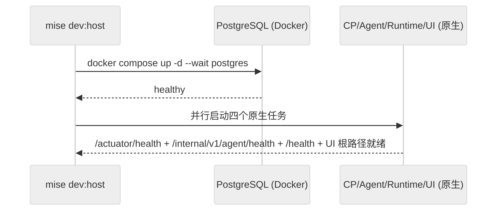

# DEV-002: 开发者指南

> 环境搭建、运行模式与全栈调试。配置管理详见 DEV-003，日志详见 DEV-004，测试策略见 DEV-020/021/022/023。

## 1. 项目结构

```text
xihe/
├── packages/
│   ├── ui/                    # Vue 3 + Vite + Tailwind + reka-ui
│   │   ├── src/               # components / composables / stores / router / i18n / mocks / types
│   │   └── e2e/               # Playwright（mock/ + real/）
│   ├── control-plane/         # Java 25 + Spring Boot 4 + Maven
│   │   └── src/main/java/.../cp/  # auth / chat / mcp / config / context / files / session / audit
│   ├── agent/                 # Python 3.12 + LangChain/LangGraph + uv
│   │   └── src/xihe_agent/    # interfaces / agent_runner / adapters / context / tools / llm / rag / registry
│   └── runtime/               # Rust 1.88 edition 2024 + cargo
│       └── src/               # main / executor / workspace / container_runtime / fs / sandbox / mcp_bridge / hydrate
├── docs/i18n/{zh-Hans,en}/    # 公开文档（编号规则见 DEV-030）
├── scripts/                   # dev-host / reset-admin / scan-log-secrets 等辅助脚本
├── docker/images/workspace/   # xihe/workspace 容器镜像
├── mise.toml                  # 工具链与跨模块任务
└── docker-compose.yml         # 全容器基线编排
```

包管理规则：

- 根 `pnpm-workspace.yaml` 仍有效（`packages/*` 约束 + 构建白名单），但日常不走 pnpm workspace 安装：UI 依赖仅在 `packages/ui/` 内用 pnpm 管理。
- `Taskfile.yml` 已移除（PLAN-245 M5），统一入口为 `mise run ...`。

## 2. 环境与安装

```bash
mise install
mise run setup
cp .env.example .env.dev
# 编辑 .env.dev（端口/DB/JWT/Workspace 根等，详见 DEV-003 §2）
```

前置：Node 22+ / pnpm 10+ / Python 3.12+ + uv / Java 25+ + Maven 3.9 / Rust 1.88+ / Docker（Desktop for Windows 需 WSL2 集成）。

模块级等价命令：

| 模块 | 命令 |
|------|------|
| UI | `cd packages/ui && pnpm install --ignore-workspace` |
| Agent | `cd packages/agent && uv sync --all-extras` |
| CP | `cd packages/control-plane && mvn dependency:resolve` |
| Runtime | `cd packages/runtime && cargo fetch` |

## 3. 运行模式

### 模式 A：`dev:host` 日常开发（推荐）

```bash
mise run dev:host
```



要点（锚点：`mise.toml: dev:host` + `scripts/dev-host.ps1`）：

- PostgreSQL 跑在 Docker，其余 CP/Agent/Runtime/UI 由 mise 原生并行管理。
- Runtime 用 `XIHE_WORKSPACE_HOST_ROOT`（默认 `A03-xihe/.xihe-workspaces`）作宿主 WorkspaceStorage 根。
- `/health` 为 liveness，`/ready` 不等待全部 Sandbox 物化；Workspace 按 `workspaceId` 首次操作时懒物化。

常用命令：

| 命令 | 说明 |
|------|------|
| `mise run dev:host:watch` | 健康监督 + 故障重启任务组 |
| `mise run dev:host:stop` | 停 PG；先 Ctrl+C 停原生任务 |
| `mise run dev:reset` | 默认 dry-run；`-Reset` 后备份重建 dev 数据，workspace 进回收站，不删 device identity |
| `mise run reset-admin` | 重置 dev `admin@xihe.local` 密码，随机 24 字节 base64url，免重启 |

### 模式 B：Docker Compose 全栈（一次性基线）

> ⚠️ **拓扑限制（先读）**：当前 Compose 不提供 Runtime 建 Sandbox 所需的 Docker Engine socket 与容器内 WorkspaceStorage 映射（`docker-compose.yml` 中 runtime 仅挂载 `./logs/runtime:/logs`）。因此 Compose 模式**不能替代 `dev:host` 主链路**，workspace/MCP/截图类验证必须在 host 模式执行，不得把 Compose 失败归因于 host v1。

```bash
docker compose up -d --build   # 或 mise run dev:full（CP ready 后按导入语义处理 config.import.local.jsonc，见下）
```

启动 postgres + control-plane + agent + runtime（UI 宿主）。端口映射：CP 8080→12631、Agent 8000→12632、Runtime 8001→12633、PG 5432→12634。资源约束 pg 512m / cp 768m / agent 640m / runtime 128m，沙盒 512MB + 2 CPU。

`dev:full` 导入语义（`scripts/dev-all.sh`）：默认**不自动导入**——`DataSeeder` 为 `admin@xihe.local` 生成随机密码且不打印，脚本无法登录。启动后执行 `mise run reset-admin` 获取密码并手动 `POST /api/v1/config/import`；或设置 `XIHE_DEV_ADMIN_PASSWORD`（仅经 OS 环境变量注入，禁止写入脚本/git/日志）显式启用自动导入。

### 模式 C：单模块宿主测试

CP 支持无外部数据库的 H2 独立启动（需同时覆盖 datasource URL/driver/dialect 并关闭 Flyway，PowerShell 示例）：

```powershell
# 仅启动 CP，使用内存 H2，不依赖 PostgreSQL 或 Docker
$env:XIHE_CP_DATASOURCE_URL = 'jdbc:h2:mem:xihe;MODE=PostgreSQL;DATABASE_TO_LOWER=TRUE;DEFAULT_NULL_ORDERING=HIGH;DB_CLOSE_DELAY=-1'
$env:XIHE_CP_DATASOURCE_DRIVER = 'org.h2.Driver'
$env:XIHE_CP_DATASOURCE_USERNAME = 'sa'
$env:XIHE_CP_DATASOURCE_PASSWORD = ''
$env:XIHE_CP_JPA_DIALECT = 'org.hibernate.dialect.H2Dialect'
$env:SPRING_FLYWAY_ENABLED = 'false'
$env:SPRING_JPA_HIBERNATE_DDL_AUTO = 'create-drop'

mvn -f packages/control-plane/pom.xml spring-boot:run
```

文件级命令见 A03-xihe/AGENTS.md（UI lint/typecheck/test:unit、Agent 单文件 pytest、CP 单类 mvn、Runtime `cargo test --lib`）。

## 4. 全栈调试（自 DEV-005-fullstack 并入）

```bash
# 1. 启动（日常用 dev:host；Compose 基线用 dev:full）
mise run dev:host

# 2. 逐端点验证（公开 /api/v1，服务间 /internal/v1）
# 以下为 Bash/Git Bash 示例（Windows 建议在 Git Bash 中执行）
```

```bash
# 2.1 登录并提取 JWT accessToken；登录失败时后续请求会得到 401
#   -sS：静默但保留错误输出；-X POST：登录接口；-H：JSON 头
TOKEN=$(
  curl -sS -X POST "http://localhost:12631/api/v1/auth/login" \
    -H 'Content-Type: application/json' \
    -d '{"email":"...","password":"..."}' |
  python3 -c 'import sys,json; print(json.load(sys.stdin)["accessToken"])'
)

# 2.2 创建一个真实 Session（/events 要求 Session 已属于当前用户和 Workspace，不会自动创建）
SESSION_ID=$(
  curl -sS -X POST "http://localhost:12631/api/v1/sessions" \
    -H "Authorization: Bearer $TOKEN" \
    -H 'Content-Type: application/json' \
    -d '{"title":"curl verification"}' |
  python3 -c 'import sys,json; print(json.load(sys.stdin)["id"])'
)

# 2.3 终端 A：保持 SSE 长连接（阻塞；用第二个终端执行 2.4/2.5）
#   -N 禁止 curl 缓冲输出，实时看到 connected/token/done
#   仅测试 SSE 握手时可在命令末尾追加 --max-time 3（超时退出属预期）
curl -sS -N \
  -H 'Accept: text/event-stream' \
  -H "Authorization: Bearer $TOKEN" \
  "http://localhost:12631/api/v1/events?sessionId=$SESSION_ID"
```

```bash
# 2.4 终端 B：查询模型列表
curl -sS -H "Authorization: Bearer $TOKEN" "http://localhost:12631/api/v1/models"

# 2.5 终端 B：提交聊天任务（返回 202 + runId；token/done 在终端 A 的 SSE 中返回）
curl -sS -X POST "http://localhost:12631/api/v1/chat" \
  -H "Authorization: Bearer $TOKEN" \
  -H 'Content-Type: application/json' \
  -d "{\"sessionId\":\"$SESSION_ID\",\"content\":\"hi\"}"
```

| 陷阱 | 排查 |
|------|------|
| 404 路径 | Vite 不再重写 API 路径；统一用 `docs/api/openapi.yaml` 的 `/api/v1`（公开）/ `/internal/v1`（服务间） |
| SSE 401 | JWT filter 需支持 query param token；401 后 `chatTransport` 清 token 跳 `/login`，勿循环重试 |
| `409 SSE_SUBSCRIPTION_REQUIRED` | 先 `GET /api/v1/events?sessionId=` 再 chat；`SSEStream` 发送前手工确认连接（UI 无自动 409 重试分支，见 DEV-010 §4） |
| 连续第二条 409 | 查 `SseEmitterManager` generation 递增 + `removeIfCurrent` 身份比对；正常为 `replaced` + 新 `registered`（历史文档旧称，已按源码 `removeIfCurrent` 统一） |
| `done` 后 SSE 关闭 | 确认 `ChatController` 仅在断开/session 删除/不可写时 `complete` |
| 长回复卡首字符 | `SSEStream` 按 hint 分流（reasoning/text 追加、无 hint 经 parser 整量替换；旧 `lastSentCount` 追加已废弃，见 DEV-010 §4） |
| 无增量流式 | `XiheLiteLLM` 须 `streaming=True`（`on_chat_model_stream`）；`on_chat_model_end` 仅 fallback |
| 日志泄露 | `litellm.suppress_debug_info=True` + `log_redact` + `node scripts/scan-log-secrets.mjs`（读取失败即失败） |

Chat SSE 结构化事件与日志字段见 DEV-004 §6.3；UI 传输层见 DEV-010 §4；跨层协议核对（Controller 契约/JWT/ConfigClient key/LLM `provider/model` 格式）改一层查一层。

## 5. 测试入口

- 单元：`mise run test`（UI + Agent + CP + Runtime lib）；`mise run validate`（lint + typecheck + build + test，Docker 自动管理）。
- 集成：`mise run test:integration`（T2；T3 需 Docker）。
- E2E：`mise run test:e2e`（Compose-compatible，排除 `@host`）；`mise run test:e2e:host`（需先 `dev:host`，每轮隔离 DB/host root，成功/失败/中断必 teardown）。
- 全量：`mise run validate:full`。策略详见 DEV-020/021/022/023。

## 6. Rust 构建缓存策略

> 约束：H 盘为开发专供，不迁移 `CARGO_TARGET_DIR`。`packages/runtime/target/` 在 stable cargo 下无自动回收（`-Zgc` 仅管 `~/.cargo` 全局缓存，不管本地 `target/`），叠加 Windows PDB（150~200MB/个）+ 4 bin + 11 test target，多 hash 孤儿可堆到 40GB（2026-09-05 实测 39.5GB，H 剩 1.6GB）。单次编译不需要 40GB，常态活集约 6~10GB。

水位线（`target/`）：正常 ≤12GB，告警 15GB，强制 20GB；H 余量 <5GB 直接走强制。

日常（双周，无重编代价）：`mise run clean:runtime-sweep`（`cargo sweep --time 7 && cargo sweep --maxsize 12GB`，只删孤儿 rlib/pdb/rmeta，活指纹保留）。前提一次性 `cargo install cargo-sweep`。注意 `--time 14` 在高频构建下可能清零（孤儿全部 <14 天），以 `--maxsize` 为准。

月度/告警（小代价）：删 `target/debug/incremental`（sweep 不处理增量目录，它是最大头，实测 20.3GB/286 个残留目录）。代价下次本地增量构建 +1~2min，deps 指纹不受影响，不触发全量重编。

特殊：工具链切换（mise pin 1.88 vs 本机 rustup 漂移即产生整套孤儿）/ `Cargo.lock` 大升级后 `cargo clean -p xihe-runtime`；诡异链接错误 `cargo clean`；`build:runtime` 发版后 `cargo clean --release`（release 产物日常用不到，实测 sweep 后 release 1.9GB→0.1GB）。

实测（2026-09-05）：`target` 39.5→4.1GB（sweep 清 deps 孤儿 ~17GB + 增量清除 ~20GB），H 余量 1.6→27.3GB；sweep 后离线增量构建 70s（deps 复用、无重编）、`cargo test --lib` 137 passed/17s、`cargo check --all-targets` 52s。

注意：构建尾段若报 `failed to remove ...exe（os error 5 拒绝访问）`，为 `mise run dev:host` 常驻的 xihe-runtime 进程占住旧 exe，属预期行为；停栈后重链即可，不影响上述验证结论。
