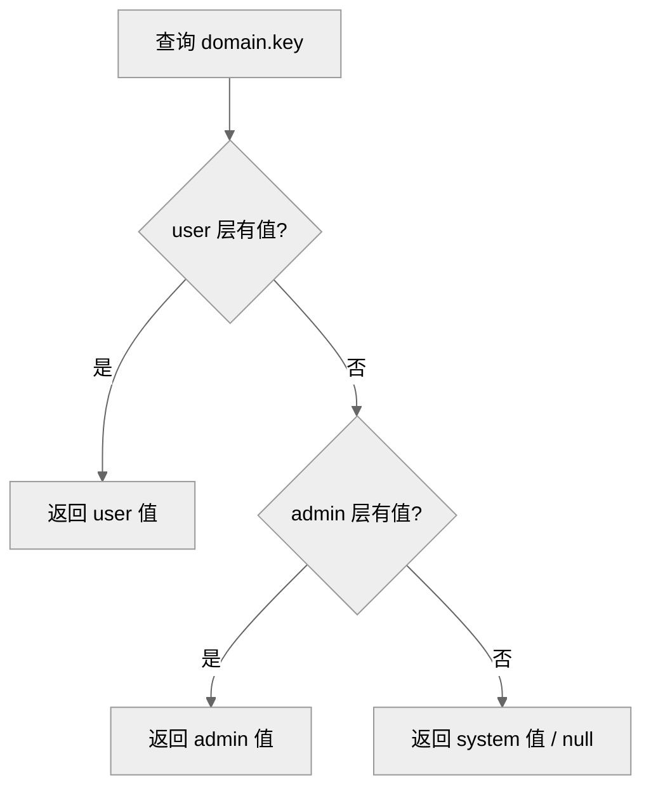

# DEV-003: 配置管理

> 面向开发者与运维：一次讲清配什么、放哪层、怎么改。前置阅读：DEV-002 §3（运行模式）。
>
> CP ConfigService 是统一的配置管理入口。两层模型：**环境变量**（运行前固定：端口/DB/JWT）+ **ConfigService**（运行时可改：API key/模型/日志）。端点以 `docs/api/openapi.yaml` 为准。

## 1. 三层所有权（System / Admin / User）

ConfigService 按三层所有权 × 领域（Domain）组织配置：

| Domain | System | Admin | User | 备注 |
|--------|--------|-------|------|------|
| `logging` / `llm-provider` / `embedding` / `user-preference` / `rag` / `workspace-config` | ✅ | ✅ | ✅ | 有 schema |
| `infrastructure` | ✅（种子） | ❌ | ❌ | 无 schema，仅 system 层种子写入 |
| `mcp` | — | — | — | 走 workspace 轴（`layer=workspace`），不在 S/A/U 三层 |

**取值优先级：user > admin > system**（同名 key 高层覆盖低层；`ConfigService.resolveDomain` 按序首命中生效）：



锚点：`ConfigService.java: RESOLVE_ORDER + resolveDomain`。

UI 入口 `/settings/config` 分 3 个 tab 对应三层。

## 2. 引导环境变量（.env.dev）

仅基础设施启动变量走 OS 环境变量（`.env.example` → `.env.dev`，gitignore，不可运行时修改）：

| 变量 | 说明 |
|------|------|
| `XIHE_CP_PORT` / `XIHE_AGENT_PORT` / `XIHE_RUNTIME_PORT` / `XIHE_UI_PORT` | 四模块端口（12631/12632/12633/12630，PG 12634） |
| `XIHE_CP_URL` / `XIHE_CP_API_TOKEN` | Agent/Runtime 回连 CP 的地址与 service token |
| `XIHE_CP_DATASOURCE_URL` / `XIHE_CP_DATASOURCE_USERNAME` / `XIHE_CP_DATASOURCE_PASSWORD` | CP 数据库连接 |
| `XIHE_CP_JWT_SECRET` | JWT 签名密钥（仅 CP 自身初始化） |
| `XIHE_WORKSPACE_HOST_ROOT` | host workspace 根（默认 `A03-xihe/.xihe-workspaces`；由 mise/scripts 注入，非 `.env` 模板项） |
| `XIHE_LOAD_DOTENV` | `0`：各模块不从 `.env` 读取应用层配置 |
| `XIHE_LOG_LEVEL` / `XIHE_LOG_LEVEL_<MODULE>` | 日志等级回退链（详见 DEV-004） |

生效优先级：OS 引导变量 → `.env.dev` → ConfigService / UI Settings。

## 3. ConfigService（运行时配置）

应用层配置（LLM provider、API key、model、log level、embedding 等）全部经 CP ConfigService 管理：

**方式 A：CP API**（运行时修改，立即生效）

```bash
# 设置 admin 级配置
curl -X PUT http://localhost:12631/api/v1/config/admin/llm-provider \
  -H "Content-Type: application/json" \
  -H "Authorization: Bearer $TOKEN" \
  -d '{"deepseekApiKey": "sk-xxx", "defaultProvider": "deepseek"}'
```

**方式 B：JSONC 导入**（批量初始化）

```bash
cp config.import.example.jsonc config.import.local.jsonc  # 填入 API key
curl -X POST http://localhost:12631/api/v1/config/import \
  -H "Content-Type: application/json" \
  -H "Authorization: Bearer $TOKEN" \
  -d @config.import.local.jsonc
```

`mise run dev:full` 自动导入 `config.import.local.jsonc`（如存在）；日常 `dev:host` 通过 UI Settings 或 API 修改。

各模块客户端（内部端点前缀 `/internal/v1/config/{layer}/{domain}`）：

| 模块 | 客户端 | 行为 |
|------|--------|------|
| CP | 内建 `ConfigService` | 直接读库 |
| Agent | `config_client.py` | 启动拉取缓存 |
| Runtime | `config_client.rs` | 启动拉取 + 定期刷新 |
