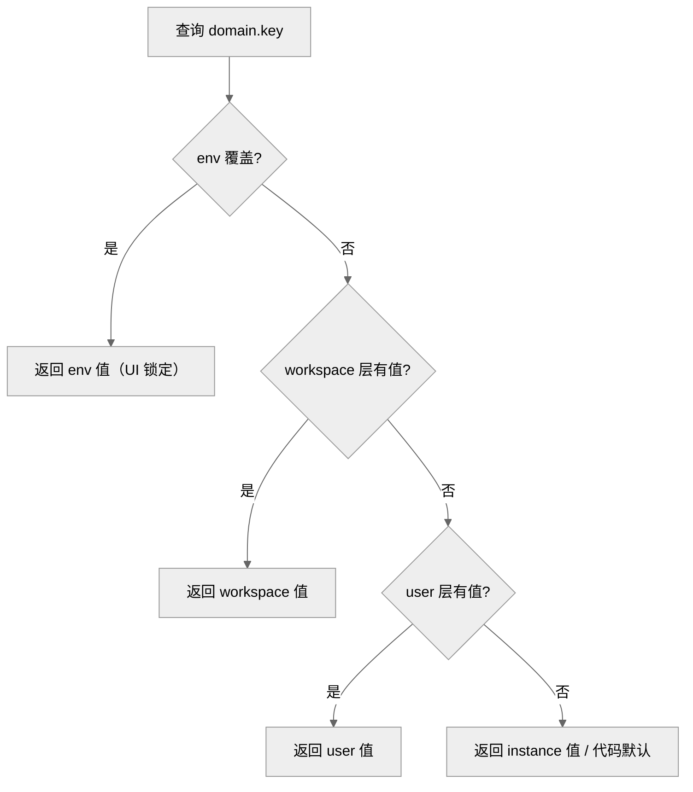

# DEV-003: 配置管理

> 面向开发者与运维：一次讲清配什么、放哪层、怎么改。前置阅读：DEV-002 §3（运行模式）。
>
> 现行模型（PLAN-0307 已落地）：**三层 `instance / workspace / user`**（解析链 `workspace > user > instance > 代码默认`）+ 凭证 **BYOK**（`provider_connections` 加密表，两级 `WORKSPACE > USER`，SYSTEM 已废除）+ **env 覆盖锁定**（env 为最高部署权威，UI 显示 env 生效值并禁用该项）。端点以 `docs/api/openapi.yaml` 为准。

## 1. 三层所有权与八域

ConfigService 按三层作用域 × 领域（Domain）组织配置；域集合满足 `instance(8) ⊇ user(7) ⊇ workspace(5)`：

| Domain | instance | user | workspace | 备注 |
|--------|----------|------|-----------|------|
| `llm-provider` | ✅ | ✅ | ✅ | provider/模型/base URL/采样参数；**无任何 `*ApiKey` 键** |
| `context-policy` | ✅ | ✅ | ✅ | 压缩策略；结构化值为 JSON 文本 |
| `embedding` | ✅ | ✅ | ✅ | `model` / `dimensions` |
| `rag` | ✅ | ✅ | ✅ | `chunkSize` / `chunkOverlap` / `topK` / `minScore` |
| `agent-runtime` | ✅ | ✅ | ✅ | `useRegistry` / `useSupervisor` / `workersDir`；`instructions` **仅 instance**（决策 #17） |
| `agent-profile` | ✅（默认） | ✅（个人） | ❌ | `userName` |
| `user-preference` | ✅（默认） | ✅（个人） | ❌ | `theme` / `language` |
| `logging` | ✅ | ❌ | ❌ | instance 层唯一权威，可热更（决策 #23） |

已裁撤域：`infrastructure`（→ env）、`workspace-config`（→ env / 工作区 API）、`mcp`（→ `mcp_stdio_servers` / `mcp_remote_servers` 表，决策 #27）；键迁移：`llm-provider.contextPolicy` → `context-policy`、`user-preference.{defaultModel,maxTokens,temperature}` → `llm-provider`（决策 #13/#16/#39）。

**写权限**：instance = ADMIN；user = 本人；workspace = 该 workspace 的 owner（决策 #37）。**读掩码**：非 ADMIN 读 `agent-runtime`（含 `instructions`）被隐藏/掩码（决策 #33），含密字段按 admin 与否脱敏。

**解析链（单键通道，CP 进程内）**：

```text
per-call（run payload overrides / 转发头）
  > CLI --set（M3 目标）
  > env（部署权威；命中即锁定）
  > workspace > user > instance
  > 代码默认
```



锚点：`ConfigService.resolve()` / `EnvOverlayRegistry`（env↔DB 键映射唯一登记点）。

UI 入口 `/settings/config` 为**三个设置条目**：实例（仅 ADMIN，8 域）、工作区（当前 workspace，5 域）、个人（user 层 7 域）。读取统一 `GET /api/v1/config/{domain}?layer=<instance|workspace|user>&includeMeta=true`——`envOverridden` 列出被 env 覆盖的键及其 env 生效值，UI 对这些键禁用编辑并展示 env 值；保存体自动剔除锁定键。`includeMeta=true` 在 resolved（不带 layer）与单层视图下都返回该元数据。

## 2. 启动环境变量（.env.dev）

仅基础设施启动变量走进程启动环境变量（指服务启动前由 Shell、mise、`.env.dev` 或脚本注入进程的变量，修改后通常需重启；`.env.example` → `.env.dev`，gitignore，不可运行时修改）：

| 变量 | 说明 |
|------|------|
| `XIHE_CP_PORT` / `XIHE_AGENT_PORT` / `XIHE_RUNTIME_PORT` / `XIHE_UI_PORT` | 四模块端口（12631/12632/12633/12630，PG 12634） |
| `XIHE_CP_URL` / `XIHE_CP_API_TOKEN` | Agent/Runtime 回连 CP 的地址与 service token |
| `XIHE_CP_DATASOURCE_URL` / `XIHE_CP_DATASOURCE_USERNAME` / `XIHE_CP_DATASOURCE_PASSWORD` | CP 数据库连接 |
| `XIHE_CP_JWT_SECRET` | JWT 签名密钥（仅 CP 自身初始化） |
| `XIHE_WORKSPACE_HOST_ROOT` | host workspace 根（默认 `A03-xihe/.xihe-workspaces`；由 mise/scripts 注入，非 `.env` 模板项） |
| `XIHE_LOAD_DOTENV` | `0`：各模块不从 `.env` 读取应用层配置 |
| `XIHE_LOG_LEVEL` / `XIHE_LOG_LEVEL_<MODULE>` | 日志启动引导等级（运行期权威为 DB `logging` 域，详见 DEV-004） |

**业务域键禁入 env（硬约束）**：业务配置（模型/provider/域参数）以 DB 为唯一权威；env 与 DB 的重合属兜底路径，必须显式暴露（决策 #22）。当前注册表唯一重合键为 `embedding.model ← XIHE_EMBEDDING_MODEL`：命中时 CP resolved/effective 使用 env 值，UI 锁定显示（绕 UI 改 DB 无效），日志记录冲突与胜者。目标态为逐步把业务键移出 `.env*`。

**Agent env 兜底（离线/无租约路径，决策 #40）**：`XIHE_{PROVIDER}_API_KEY`（`openai`/`deepseek`/`xiaomi`/`anthropic`/`dashscope`）与 `llm-provider` 的非密钥 base/model 共同构成无 CP 租约时的兜底；**常规路径是 `provider_connections` 租约**（见 §3）。无租约且无兜底 key 的 run 在 `/chat` fail-closed 返回 503 `LLM_NOT_CONFIGURED`。

**配置归属速查**：

| 配置类别 | 归属 | 生效方式 |
|---------|------|---------|
| 端口、DB 连接、JWT secret、模块间 URL、service token、Workspace 根 | 启动环境变量 / `.env.dev` | 重启生效 |
| API key 等凭证 | `provider_connections`（CP 加密表，UI/API 管理，租约下发） | 运行时即时 |
| 模型、采样参数、context-policy、embedding、rag、agent 行为、user-preference | ConfigService（DB 三层） | 运行时即时（Agent 周期 pull + run 覆盖） |
| 日志等级 | ConfigService `logging` 域（instance）；启动早期回退 env | 热更（CP logback / Agent reload） |
| Agent env 兜底键 | Agent 进程 env | 仅无租约/CP 不可达时 |

## 3. ConfigService（运行时配置）

**方式 A：CP API**（运行时修改，立即生效）

```bash
# 实例层（ADMIN）：非密钥域配置
curl -X PUT http://localhost:12631/api/v1/config/instance/llm-provider \
  -H "Content-Type: application/json" \
  -H "Authorization: Bearer $TOKEN" \
  -d '{"defaultProvider": "deepseek", "defaultModel": "deepseek-chat"}'

# 用户层（本人）：个人覆盖
curl -X PUT http://localhost:12631/api/v1/config/user/llm-provider \
  -H "Content-Type: application/json" -H "Authorization: Bearer $TOKEN" \
  -d '{"defaultModel": "deepseek-reasoner"}'

# 工作区层（owner）：工作区覆盖（workspaceId 查询串或 X-Workspace-Id 头）
curl -X PUT "http://localhost:12631/api/v1/config/workspace/rag?workspaceId=$WS" \
  -H "Content-Type: application/json" -H "Authorization: Bearer $TOKEN" \
  -d '{"topK": "8"}'
```

凭证**不写 config 层**（`rejectProviderSecrets` 会以 403 拒绝任何 `*ApiKey`/secret/password/token 类键），统一走 `provider_connections`：

```bash
# 创建凭证连接（USER 默认；WORKSPACE 需为该 workspace owner；SYSTEM 已废除）
curl -X POST http://localhost:12631/api/v1/provider-connections \
  -H "Content-Type: application/json" -H "Authorization: Bearer $TOKEN" \
  -d '{"providerId": "deepseek", "apiKey": "sk-xxx", "scope": "WORKSPACE", "baseUrl": "https://api.deepseek.com"}'
```

**方式 B：JSONC 导入**（批量初始化）

```bash
cp config.import.example.jsonc config.import.local.jsonc  # 按八域模型填写非密钥配置（凭证走 provider_connections）
curl -X POST "http://localhost:12631/api/v1/config/import?layer=instance" \
  -H "Content-Type: application/json" \
  -H "Authorization: Bearer $TOKEN" \
  -d @config.import.local.jsonc
```

`mise run dev:host` 与 `mise run dev:full` 均在 CP ready 后自动导入 `config.import.local.jsonc`（如存在，需 `XIHE_DEV_ADMIN_PASSWORD`，否则跳过并提示）；也可通过 UI Settings 或 API 手动修改。导入为**按域合并覆盖**（只更新携带的键），旧模板若含 `*ApiKey` 会被 403 拒绝——删除这些键即可。

**导入导出契约（决策 #36/#37，T2.21/T2.25）**：导出 `GET /api/v1/config/export?layer=instance&includeSecrets=<bool>`（ADMIN）—— config KV + `provider-connections` 元数据（label/status/modelDiscovery/manualModels/enabled/ownerType/ownerId/baseUrl）；`includeSecrets=false` 仅排除明文 `apiKey`，**任何模式都不输出库内密文**；导出写 AUDIT sink（actor/时间/是否含密钥，不记响应体）且响应 `Cache-Control: no-store`。导入**不恢复任何凭证**——`provider-connections` 条目整体跳过并在响应 `{imported, skipped, warnings}` 中列出（owner id 跨实例不可映射），需人工经凭证 API/UI 重建。导出产物落盘使用 `config.export*.jsonc`（gitignored）。UI 实例页内提供导出（含可选明文密钥开关）与导入（文件 + WARN 清单）入口。

**配置 key 三方同步（硬约束）**：新增/修改 domain key 必须同步三处——（a）CP `config-schemas/*.json`（JSON Schema，同时约束 import 与 UI 保存）、（b）`config.import.example.jsonc` 模板、（c）UI `/settings/config` 表单；任一漏改会导致 import 与保存同时 400。

各模块客户端（层封闭，决策 #19）：instance/workspace 合并值经 `GET /internal/v1/config/effective/{domain}` 拉取（CP 按 workspace 上下文合并，含 env 覆盖）；user/workspace 覆盖随 run payload push（`userOverrides`/`workspaceOverrides`，决策 #3a；env 锁定键由 CP 剔除）：

| 模块 | 客户端 | 行为 |
|------|--------|------|
| CP | 内建 `ConfigService` | 直接读库 |
| Agent | `config_client.py` | 启动/周期拉取 workspace-bound effective；chat run 按 payload overrides 合成（instance → user → workspace，无副作用） |
| Runtime | 无 config client（决策 #4） | 物理配置走 env/CLI（决策 #29） |

## 4. Agent readiness 与模型目录

配置同步成功只表示 CP/Agent 配置来源可达，不表示 provider 可以实际调用。Agent 将 HTTP liveness、配置同步和 `llmReady` 分开暴露：

| `llmReady` | 含义 | 新 Chat 行为 |
|------------|------|------------|
| `unknown` | 必需 domain 同步失败、响应无效或状态未知 | fail-closed，返回 503 |
| `missing_credentials` | 当前 provider 无实例凭证/无目录条目（BYOK）——readiness 不再因此阻断 | 允许进入 run；**无租约且无 env 兜底 key 时在 `/chat` 返回 503 `LLM_NOT_CONFIGURED`**（决策 #40，fail-closed 下移到真实调用路径） |
| `invalid_credentials` | provider `/models` 或 Chat 返回认证失败 | 返回 `LLM_CREDENTIALS_INVALID` |
| `unreachable` | provider 超时或网络不可达 | 返回 `LLM_PROVIDER_UNREACHABLE` |
| `model_unavailable` | 默认/选择的模型不在可用 chat catalog | 返回 `LLM_MODEL_UNAVAILABLE` |
| `ready` | provider preflight 和当前模型均可用；**catalog 无该 provider（BYOK 无实例级凭证）时同样为 ready** | 允许新 Chat |

Agent 启动和周期 refresh 使用同一 atomic runtime snapshot。模型目录通过 `/internal/v1/agent/models` 返回 provider 状态、`chat` capability、`verifiedAt` 和 `configRevision`，不返回 key 或 base URL；UI 只展示 ready 且 `chat=true` 的模型。provider 目录条目来源于当前上下文可见的 READY `provider_connections`（CP `/api/v1/models` 汇总）。

凭证只归 `provider_connections`（加密存储 + 租约）：USER 可读取脱敏配置与安全 provider 状态，但不能写入 `llm-provider` 凭证键；ConfigAudit 对 provider 凭证只保存 `present/missing` 和不可逆 fingerprint。ADMIN 配置 GET 的 raw-read 例外仅限配置 API 响应本身，不得扩展到 health、catalog、日志、trace 或截图证据。
