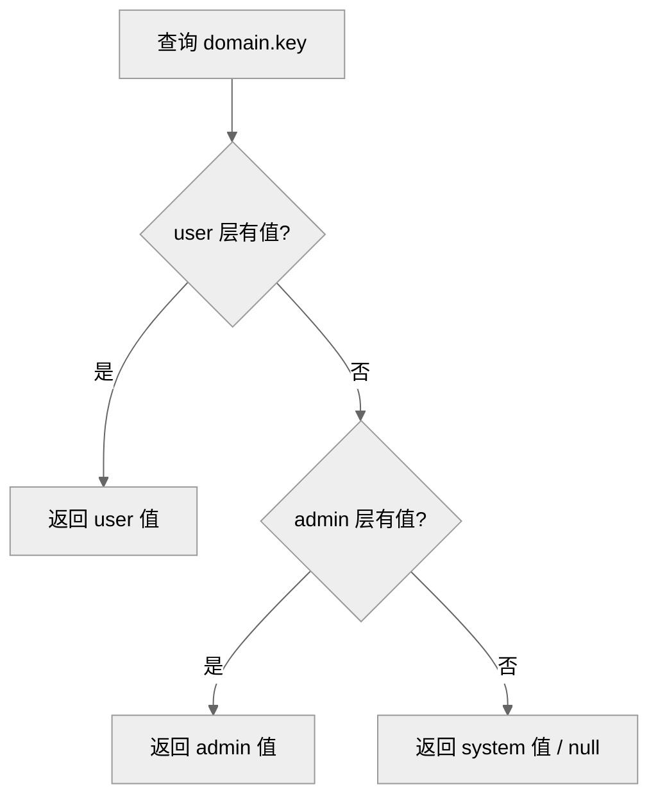

# DEV-003: 配置管理

> 面向开发者与运维：一次讲清配什么、放哪层、怎么改。前置阅读：DEV-002 §3（运行模式）。
>
> CP ConfigService 是统一的配置管理入口。两层模型：**环境变量**（运行前固定：端口/DB/JWT）+ **ConfigService**（运行时可改：API key/模型/日志）。端点以 `docs/api/openapi.yaml` 为准。

## 1. 三层所有权（System / Admin / User）

ConfigService 按三层所有权 × 领域（Domain）组织配置：

| Domain | System | Admin | User | 备注 |
|--------|--------|-------|------|------|
| `logging` / `llm-provider` / `embedding` / `user-preference` / `rag` / `workspace-config` | ✅ | ✅ | ✅ | 有 schema |
| `infrastructure` | ✅（种子） | ❌ | ❌ | 无 schema，仅 system 层种子写入 |
| `mcp` | — | — | — | 走 workspace 轴（`layer=workspace`），不在 S/A/U 三层 |

**取值优先级：user > admin > system**（同名 key 高层覆盖低层；`ConfigService.resolveDomain` 按序首命中生效）：



锚点：`ConfigService.java: RESOLVE_ORDER + resolveDomain`。

UI 入口 `/settings/config` 分 3 个 tab 对应三层。

## 2. 启动环境变量（.env.dev）

仅基础设施启动变量走进程启动环境变量（"启动环境变量"指服务启动前由 Shell、mise、`.env.dev` 或脚本注入进程的变量，修改后通常需重启；`.env.example` → `.env.dev`，gitignore，不可运行时修改）：

| 变量 | 说明 |
|------|------|
| `XIHE_CP_PORT` / `XIHE_AGENT_PORT` / `XIHE_RUNTIME_PORT` / `XIHE_UI_PORT` | 四模块端口（12631/12632/12633/12630，PG 12634） |
| `XIHE_CP_URL` / `XIHE_CP_API_TOKEN` | Agent/Runtime 回连 CP 的地址与 service token |
| `XIHE_CP_DATASOURCE_URL` / `XIHE_CP_DATASOURCE_USERNAME` / `XIHE_CP_DATASOURCE_PASSWORD` | CP 数据库连接 |
| `XIHE_CP_JWT_SECRET` | JWT 签名密钥（仅 CP 自身初始化） |
| `XIHE_WORKSPACE_HOST_ROOT` | host workspace 根（默认 `A03-xihe/.xihe-workspaces`；由 mise/scripts 注入，非 `.env` 模板项） |
| `XIHE_LOAD_DOTENV` | `0`：各模块不从 `.env` 读取应用层配置 |
| `XIHE_LOG_LEVEL` / `XIHE_LOG_LEVEL_<MODULE>` | 日志等级回退链（详见 DEV-004） |

生效优先级：启动环境变量 → `.env.dev` → ConfigService / UI Settings（按变量归属分别生效，见下表）。

**配置归属速查**：

| 配置类别 | 归属 | 生效方式 |
|---------|------|---------|
| 端口、DB 连接、JWT secret、模块间 URL、service token、Workspace 根 | 启动环境变量 / `.env.dev` | 重启生效 |
| Provider/API key、模型、部分日志等级、embedding、user-preference | ConfigService（运行时） | 立即生效 |
| Agent LLM 环境变量兜底（`XIHE_LLM_PROVIDER`、`XIHE_MODEL`、`XIHE_*_API_KEY` 等） | Agent env fallback（`llm/base.py`） | 仅 ConfigClient 不可用或对应 key 缺失时兜底，双轨并存为已知现状 |

## 3. ConfigService（运行时配置）

应用层配置（LLM provider、API key、model、log level、embedding 等）全部经 CP ConfigService 管理：

**方式 A：CP API**（运行时修改，立即生效）

```bash
# 设置 admin 级配置
curl -X PUT http://localhost:12631/api/v1/config/admin/llm-provider \
  -H "Content-Type: application/json" \
  -H "Authorization: Bearer $TOKEN" \
  -d '{"deepseekApiKey": "sk-xxx", "defaultProvider": "deepseek"}'
```

**方式 B：JSONC 导入**（批量初始化）

```bash
cp config.import.example.jsonc config.import.local.jsonc  # 按八域模型填写非密钥配置（凭证走 provider_connections）
curl -X POST http://localhost:12631/api/v1/config/import \
  -H "Content-Type: application/json" \
  -H "Authorization: Bearer $TOKEN" \
  -d @config.import.local.jsonc
```

`mise run dev:host` 与 `mise run dev:full` 均在 CP ready 后自动导入 `config.import.local.jsonc`（如存在，需 `XIHE_DEV_ADMIN_PASSWORD`，否则跳过并提示）；也可通过 UI Settings 或 API 手动修改。

**导入导出契约（决策 #36/#37，T2.21/T2.25）**：导出 `GET /api/v1/config/export?layer=instance&includeSecrets=<bool>`（ADMIN）—— config KV + `provider-connections` 元数据（label/status/modelDiscovery/manualModels/enabled/ownerType/ownerId/baseUrl）；`includeSecrets=false` 仅排除明文 `apiKey`，**任何模式都不输出库内密文**；导出写 AUDIT sink（actor/时间/是否含密钥，不记响应体）且响应 `Cache-Control: no-store`。导入**不恢复任何凭证**——`provider-connections` 条目整体跳过并在响应 `{imported, skipped, warnings}` 中列出（owner id 跨实例不可映射），需人工经凭证 API/UI 重建。导出产物落盘使用 `config.export*.jsonc`（gitignored）。

各模块客户端（层封闭，决策 #19）：instance/workspace 合并值经 `GET /internal/v1/config/effective/{domain}` 拉取（CP 按 workspace 上下文合并，含 env 覆盖）；user/workspace 覆盖随 run payload push（`userOverrides`/`workspaceOverrides`，决策 #3a，env 锁定键由 CP 剔除）：

| 模块 | 客户端 | 行为 |
|------|--------|------|
| CP | 内建 `ConfigService` | 直接读库 |
| Agent | `config_client.py` | 启动/周期拉取 workspace-bound effective；chat run 按 payload overrides 合成（instance → user → workspace，无副作用） |
| Runtime | 无 config client（决策 #4） | 物理配置走 env/CLI（决策 #29） |

## 4. Agent readiness 与模型目录

配置同步成功只表示 CP/Agent 配置来源可达，不表示 provider 可以实际调用。Agent 将 HTTP liveness、配置同步和 `llmReady` 分开暴露：

| `llmReady` | 含义 | 新 Chat 行为 |
|------------|------|------------|
| `unknown` | 必需 domain 同步失败、响应无效或状态未知 | fail-closed，返回 503 |
| `missing_credentials` | 当前 provider 没有 key | 返回 `LLM_NOT_CONFIGURED` |
| `invalid_credentials` | provider `/models` 或 Chat 返回认证失败 | 返回 `LLM_CREDENTIALS_INVALID` |
| `unreachable` | provider 超时或网络不可达 | 返回 `LLM_PROVIDER_UNREACHABLE` |
| `model_unavailable` | 默认/选择的模型不在可用 chat catalog | 返回 `LLM_MODEL_UNAVAILABLE` |
| `ready` | provider preflight 和当前模型均可用 | 允许新 Chat |

Agent 启动和周期 refresh 使用同一 atomic runtime snapshot。模型目录通过 `/internal/v1/agent/models` 返回 provider 状态、`chat` capability、`verifiedAt` 和 `configRevision`，不返回 key 或 base URL；UI 只展示 ready 且 `chat=true` 的模型。

Provider credential 只归 CP admin layer。USER 可以读取脱敏配置和安全 provider 状态，但不能写入 `llm-provider` secret；ConfigAudit 对 provider secret 只保存 `present/missing` 和不可逆 fingerprint。开发 MVP 的 ADMIN 配置 GET raw-read 例外不得扩展到 health、catalog、日志、trace 或截图证据。
