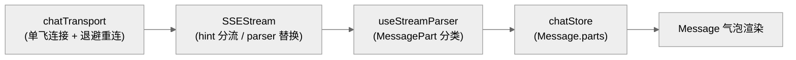

# DEV-010: UI 架构

> Vue 3 + Pinia + vue-router + Vite + Tailwind CSS 4 + reka-ui。UI 只与 CP 对话（`fetch POST` + 持久 SSE），不直接调用 Agent 或 Runtime。与 DEV-017 以"UI 实现 vs Session 领域"分界：路由/视图/组件/传输层归本文，store 职责边界与跨视图同步归 DEV-017。

## 1. 路由与布局

`packages/ui/src/router/index.ts`：

| 路由 | 组件 | 说明 |
|------|------|------|
| `/` | redirect | → `/chat/default`，chat 是默认入口 |
| `/chat/:sessionId`（父 `/chat`，`new`/空重定向到 `/chat/default`） | ChatView（AppLayout 内） | 全屏对话 |
| `/workspace/:workspaceId?` | WorkspaceView（AppLayout 内） | 文件编辑器 + 内嵌对话；参数可选，兼容旧 `/workspace` 入口 |

两路由共用 `AppLayout`（侧边栏 + 全局状态一致）。Chat 用 `sessionId`，Workspace 用 `workspaceId`，禁止互充（PLAN-222）。

## 2. 视图分层

- **ChatView**（`components/chat/ChatView.vue`）：全屏 chat，含标题栏；内嵌 `ChatPanel :session-id`；挂载时从后端加载历史消息。
- **WorkspaceView**（`components/workspace/WorkspaceView.vue`）：左文件树（`w-60`，`FileTree` + reka-ui `TreeRoot/TreeItem` 受控 expanded）+ 中编辑器/工具栏 + 右 `ChatPanel`（`w-96` 固定宽）；无 workspace 时显示空态（决策 11：唯一的创建入口）+ `WorkspaceCreateDialog`（名称/描述/profile 三选/image 只读白名单）；`WorkspaceSettingsDialog`（改名/PATCH、删除/DELETE + 二次确认）；移动端（<768px）为独立 IA（§7：树 Sheet + Chat 底部抽屉）。
- **ChatPanel**（`components/chat/ChatPanel.vue`）：唯一可嵌入对话组件（消息列表 + 输入框 + SSEStream）；接收 `sessionId` prop；附件写入入口 `handleSend`。
- **WorkspaceToolbar**：Session 下拉（保留 workspace route 切换）+ 「切换回 chat」按钮 + Environment 入口 + Workspace settings 入口 + 上传/刷新。
- **FileNodeMenu**（`components/workspace/FileNodeMenu.vue`）：reka-ui `ContextMenu` 封装；文件：Rename/Move/Duplicate/Copy Path/Delete；目录：New File/New Directory/Rename/Move；文本走 `write_file` MCP，二进制走 `POST /api/v1/files/upload` FormData（PLAN-262 M0/B-3）。
- **Sidebar**：「New Chat」创建 Session；Session 列表点击跳 `/chat/:sessionId`；「Workspace」按钮跳 `/workspace/:currentWorkspaceId`（缺失时 fail-closed）。

## 3. 五组件族

位于 `packages/ui/src/components/ui/`，聊天界面自研组件（已替代旧第三方虚拟列表方案）：

设计经验（shadcn-vue 官方组件对照，详见 PLAN-243 附录 A）：

- **分层纪律**：对齐/头像/时间戳上浮 Message，Bubble 只管 surface（自研已做到，予以确认）。
- **状态显式化**：上传态用 `state` prop 驱动，不从 service 派生。
- **无障碍基线**：装饰图标 `aria-hidden`、不可用按钮 `inert` + `tabindex=-1`、思考态 `role=status`（缺失项，做 a11y pass 时补）。
- **BubbleGroup**：同发送者连发合并，治工具调用 burst 刷屏。
- **Footer actions 位**：copy/retry/feedback 标准位置，hover 栏向其收敛。
- **耦合结论**：五族本体零 store 引用（已取证）；耦合在容器层属正常分离；MessageItem 身兼三职可拆（观察项）。

| 组件族 | 用途 |
|--------|------|
| `message-scroller/` | 滚动容器：following-bottom → free-scrolling → anchored-to-message → settling-jump 状态机；`shallowRef` + `data-*` 避免高频响应 |
| `message/` | 消息卡片：Message / MessageGroup / Avatar / Content / Header / Footer |
| `bubble/` | user / assistant / system 气泡，cva 管理 |
| `attachment/` | 媒体/文件/动作按钮，state/size/orientation 变体 |
| `marker/` | 时间/状态分隔线 |

## 4. 传输层（会话级持久 SSE，PLAN-230）

> 分层原则：**传输基元全用第三方，自研只做会话语义**。基元：`@microsoft/fetch-event-source`（UI）、Spring `SseEmitter`（CP）、HTTP SSE；自研约 800 行：chatTransport（单飞/退避）+ useSSE + SSEStream + useStreamParser，以及 CP `SseEmitterManager`（单活/generation/租约/409）。市面方案（AI SDK useChat、TanStack ChatClient）解决的是标准协议通用聊天，自创会话语义无现货；跟踪 TanStack AI（见 PLAN-243 TD-2），多设备/多会话时重估。

- **chatTransport**（`services/chatTransport.ts`）：按 `sessionId` 单飞连接（`connectionGeneration` + `intentionalStops`）；`onerror` 指数退避（250ms 起，上限 5s）；`onclose` 调度重连（无次数上限，`intentionalStops` 才停）；401 清 token 跳 `/login`。
- **useSSE**（`composables/useSSE.ts`，返回 `connect/disconnect/sendMessage`，未提供连接确保方法）：发送前由 `SSEStream` 手工确认连接（未连则 `connectSession` + 等待）；CP 侧 409（`SSE_SUBSCRIPTION_REQUIRED` / `CHAT_IN_PROGRESS`）由调用方处理，UI 无自动 409 重试分支。
- **SSEStream**：带 hint（`reasoning`/`text`）的 token 走 `chatStore.appendToParts` 追加；无 hint 时经 `useStreamParser.handleToken` 再 `replaceStreamingParts` 整量替换；`done` 仅结束 run；`heartbeat` 15s 不进业务气泡。
- **useStreamParser**（`composables/`）：token 实时分类为 `MessagePart[]`（`text`/`reasoning`/`citation`/`artifact`）；`Message.parts` 替代旧 `marked`；代码渲染经 `MarkstreamCodeBlockAdapter` + `parts/TextPart`。

## 5. 附件 UI 流 / i18n / 主题

- **附件**：`services/attachmentService.ts`（函数模块）批量上传 `POST /api/v1/sessions/{sessionId}/attachments` + 前端白名单/大小校验；上传入口在 `InputArea`（`ChatPanel.handleSend` 只负责发消息 + 透传 fileIds）；`InputArea` 有文本则合并发送、无文本则纯附件消息；`MessageItem` 用 `/api/v1/files/{fileId}` 渲染；workspace 文件经 `POST /api/v1/files/upload` 可写（附件只读约定见 DEV-017）。
- **图片**：拖拽/选择自动 Canvas 压缩（`maxDimension(file, 2048)`）；PDF 经 pdfjs-dist（动态 import）预览 + 文本提取。
- **i18n**：`t()` 国际化，`zh-CN`/`en-US` 双 locale；约定 `t()` 消息避免 `{...}` 占位（部分历史文案仍含，已知例外）。
- **主题**：dark / light / system（`ConfigSettings` 下拉选择）；reka-ui（shadcn-vue 封装层共存）+ Tailwind v4 HSL 变量。
- **反馈**：Toast（vue-sonner）为主要反馈渠道；另有确认弹窗（ApprovalModal/ConfirmModal）与表单内联错误；日志 console / IndexedDB 10k 两路有效，telemetry 发送当前禁用（详见 DEV-004）。

## 6. ChatRun 与 toolMode

`ChatPanel` 默认使用 `toolMode=none`；`ChatView` 不提供工具总开关，`WorkspaceView` 才显式传入 `toolMode=workspace`。`SSEStream` 将 `provider`、`model`、`toolMode` 和新的 `Idempotency-Key` 一并提交。

发送状态分为 transport run 与 assistant content 两层：CP 返回 `runId` 后才加入 user message，首个 token/reasoning/artifact 才创建 assistant。`error`、`partial`、`ambiguous` 会结束发送态并保留可恢复状态；空 assistant 直接移除，inline error 与 Toast 使用同一 payload。

## 7. Workspace 移动端独立 IA（PLAN-262 决策 15）

移动端（`<768px`，Tailwind `md:` 断点）不是桌面三栏的响应式压缩，而是独立信息架构：

- **单栏栈**：顶栏汉堡按钮（唤出文件树 Sheet）+ 面包屑 + Environment 入口；编辑器全屏；桌面左右栏 `hidden md:flex` 隐藏。
- **文件树**：`Sheet side="left"` 全高抽屉（`MobileWorkspaceSheet.vue`），树组件与桌面共用 `FileTree`（同一 store/受控 expanded）。
- **Chat**：底部抽屉（`MobileChatSheet.vue`，`Sheet side="bottom"` `h-[75vh]`）+ 右下角浮动 Chat 按钮；与桌面 `ChatPanel` 共用 Session store。
- **右键菜单**：移动端长按触发 ContextMenu（reka-ui 原生语义），复杂操作走底部操作 Sheet。
- **弹窗**：Create/Settings/Prepare 在移动端全屏 Sheet 化（`SheetContent side="bottom"`）。
- **验收**：桌面 1440 为 M3/M4 Visual 基线；移动 390px 独立 Playwright viewport + 截图验收（PLAN-262 §5.1）。

## 8. workspace 复杂 UI 基座（PLAN-262 决策 14）

workspace 文件管理 UI 基于 reka-ui 无头原语 + `shadcn-vue add` 拷贝式封装（`components/ui/context-menu/`、`components/ui/tree/`），**零新增运行时依赖**：

- **ContextMenu**（`ContextMenu/ContextMenuTrigger/Content/Item/Separator`）：键盘导航/焦点管理/ARIA/子菜单内置；`@select` 为选择事件（`preventDefault` 可阻止关闭）；长按=移动端右键。
- **Tree**（`TreeRoot/TreeItem`，受控 `v-model:expanded`）：`getKey=node.path`、`getChildren=node.children`；`expandedPaths`（store `Set`）↔ 数组双向映射；`update:expanded` 在搜索态下不回写（搜索展开为临时并集）。
- **约束**：`TreeVirtualizer` 封装已就位但默认关闭（当前树全量递归加载，虚拟化收益待大数据量验证）；`AlertDialogAction` 点击无条件关闭——需“校验失败保持打开”的场景（如删除二次确认）必须用普通 destructive `Button`（PLAN-262 E-3）。
- **测试约束**：reka-ui MenuItem 的程序化选择在 jsdom 下不可行（内部 armed ref 无法被合成事件置位，6 种组合已验证）；组件交互连接层由 Playwright 覆盖，单测只覆盖菜单内容判定与 store 分支（PLAN-262 §5.1 备注）。
