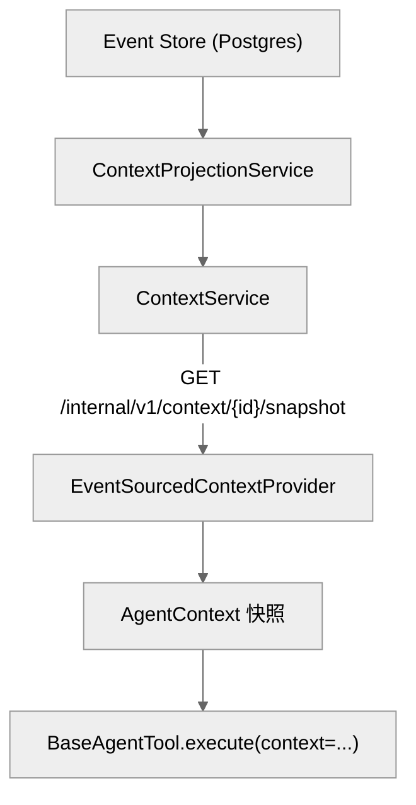

# DEV-013: Agent 架构与接口抽象

## 1. 概述

Agent 模块负责 LLM 编排、工具调用与上下文管理。为降低对 LangChain/LangGraph 的耦合，模块内引入了一层抽象接口（PLAN-033），并将对话上下文升级为 Event Sourcing 架构（PLAN-035）。

核心目标：

1. **可替换的编排框架** — 通过 `AgentRunner` 接口隔离 LangGraph 实现。
2. **可替换的工具实现** — 通过 `BaseAgentTool` 接口隔离 `BaseTool`。
3. **可观测、可恢复的对话状态** — 通过 CP Event Store 持久化事件，CP Projection Service 生成快照。

## 2. 接口层

接口定义集中在 `packages/agent/src/xihe_agent/interfaces/`，该目录下**不直接 import `langchain*`**。

| 接口 | 文件 | 职责 |
|------|------|------|
| `AgentRunner` | `interfaces/agent_runner.py` | Agent 编排抽象：`stream()` / `create_agent()` / `reset()` |
| `BaseAgentTool` / `ToolSpec` | `interfaces/tool.py` | 工具抽象：`execute()` + JSON Schema 声明 |
| `EventAdapter` | `interfaces/event_adapter.py` | 将框架原始事件翻译为 SSE `AgentEvent` |
| `LLMProvider` | `interfaces/llm.py` | LLM 后端抽象：`complete()` / `stream_complete()` / `with_model()` |
| `Message` / `TextMessage` | `interfaces/message.py` | 最小消息协议：`role` + `content` |
| `Event` / `EventEnvelope` | `interfaces/event.py` | 持久化域事件 |
| `EventStore` | `interfaces/event_store.py` | 事件存储抽象：append / read / fork |
| `AgentContext` / `ContextEpoch` / `ContextProvider` | `interfaces/context.py` | 事件投影后的上下文快照 |

### 2.1 AgentRunner

`AgentRunner.stream(messages, config)` 接收 `Message` 列表和 `RunnerConfig`，返回 SSE 层 `AgentEvent` 流。

其中 `RunnerConfig.context` 由 `ContextProvider.load()` 提供。

当前实现 `LangGraphRunner`（`agent_runner/langgraph_runner.py`）：

- 内部使用 LangGraph 的 `create_react_agent` + `astream_events`。
- 经 `EventAdapter` 将原始事件翻译为 SSE 事件。

### 2.2 BaseAgentTool

所有工具均实现 `BaseAgentTool`：

- `MCPAgentTool`（`adapters/mcp_client.py`）— 包装 LangChain MCP 工具。
- `ApprovalAgentTool`（`adapters/approval_tool.py`）/ `GenerateImageAgentTool`（`tools/__init__.py`）— 自定义工具。
- `LCToolAdapter`（位于 `agent_runner/langgraph_runner.py`，非 `adapters/`）— 将任意 `BaseAgentTool` 适配回 LangChain `BaseTool`，供 `LangGraphRunner` 内部使用；`registry` 经自有 `_adapt_tools` 接入，`supervisor` 经本地 `_adapt` 接入。

LangChain 特定代码收敛到 `agent_runner/langgraph_runner.py` 和 `adapters/`（sse/approval/mcp_client）。

### 2.3 LLMProvider

`XiheLiteLLM` 与 `MockChatModel` 实现 `LLMProvider`，方法为 `complete()` / `stream_complete()`。

**调用路径（直调，不经 CP）**：Agent 经 litellm **直调** provider（api_base 写死各家 URL）；key/模型名来自 `LLMConfig.from_config_client()`（ConfigService 启动拉取）+ `XIHE_*_API_KEY` env 兜底。CP 只提供初始配置，不管每次传输；CP 也不组装 LLM 请求、不持有 provider key（BYOK 多租户之前不考虑 CP 代理，见 PLAN-243 Decision 1）。

- 为兼容 LangGraph 编排，`XiheLiteLLM` 仍继承 `ChatLiteLLM`。
- 未来切换到非 LangGraph 编排层时可移除该继承。

## 3. Event Sourcing 上下文管理

### 3.1 总体架构



锚点：`ContextProjectionService.java`、`ContextController.java:83`、`event_sourced_provider.py`。

- CP 是唯一真相源，负责事件持久化与投影。
- Agent 无状态，通过 `/internal/v1/context/{sessionId}/snapshot` 获取投影快照。
- 事件写入当前为同步；性能测试显示批量写入已足够快（~17k events/s），未引入异步队列。

### 3.2 事件类型

| 事件类型 | 触发时机 |
|----------|----------|
| `session.created` | 创建 session |
| `prompt.admitted` | 用户输入进入对话 |
| `llm.token` | 模型流式输出 |
| `tool.called` | 工具被调用 |
| `tool.result` | 工具返回 |
| `context.source_changed` | AGENTS.md 等 source 变更 |
| `epoch.started` / `epoch.replaced` | epoch 开始/替换 |
| `runtime.state_cleared` | `AgentRunner.reset()` |
| `session.forked` | 会话 fork |
| `compaction.applied` | 上下文压缩 |

两套事件命名空间不同，映射由 `LangGraphEventAdapter` 维护：

| 层 | 事件 |
|----|------|
| SSE 协议 `AgentEvent` | `token` / `tool_call` / `tool_result` / `status` / `error` / `done` |
| 持久化域 `Event` | 见 §3.2 事件表 |

### 3.3 AgentContext 投影

`AgentContext` 由 CP `ContextProjectionService` 从事件流生成，包含：

- `messages` — 当前对话消息列表。
- `epoch` — 当前系统上下文 epoch（`system_messages` + Context Sources）。
- `runtime_state` — 请求级运行时状态。
- `latest_sequence` — 已投影到的最新事件序列号。

Agent 侧分工：

- `EventSourcedContextProvider` 仅调用 CP `/snapshot` 端点。
- `CrashRecovery` 经 `EventStore.read()` 读事件，再调 `AgentContext.apply_event()` 重建状态。

### 3.4 Context Source 变更感知

CP `ContextSourceRefreshService` 的去重流程：

1. 读取 workspace `AGENTS.md`，计算 SHA-256 哈希。
2. 持久化到 `context_source_hashes` 表。
3. 仅当哈希变化时才追加 `context.source_changed` 事件，避免重复事件。

## 4. 崩溃恢复

Agent 启动恢复流程：

1. 读取 `XIHE_RECOVER_SESSION_IDS` 环境变量（逗号分隔的 session ID）。
2. `CrashRecovery.recover_many()` 从 CP Event Store 重放事件。
3. 重建 `AgentContext`。

```python
recover_ids = _parse_recover_session_ids()
if recover_ids:
    recovered = await crash_recovery.recover_many(recover_ids)
```

恢复后的上下文可用于继续会话或审计；实际对话续接应配合 UI/CP 的 session 恢复机制。

## 5. 工具与编排适配

### 5.1 Supervisor 与 Registry

`agent/supervisor.py` 与 `registry/registry.py` 的 public API 已迁移到 `BaseAgentTool`：

- 内部经 `_adapt_tools()` / `LCToolAdapter` 继续使用 LangGraph 编排。
- 这是当前编排实现的合理依赖，已被隔离在 public API 之后。

### 5.2 MCPClientManager

`MCPClientManager.tools` 返回 `list[BaseAgentTool]`（`MCPAgentTool` 包装），完成工具层 public API 与 LangChain 的解耦。

## 6. 相关文件

- `packages/agent/src/xihe_agent/interfaces/`
- `packages/agent/src/xihe_agent/agent_runner/langgraph_runner.py`
- `packages/agent/src/xihe_agent/context/`
- `packages/agent/src/xihe_agent/adapters/`
- `packages/control-plane/src/main/java/com/cc01cc/p/xihe/cp/context/`

## 7. 相关 PLAN

- `PLAN-033-XH-agent-module-decoupling.md`
- `PLAN-035-XH-agent-context-architecture.md`
