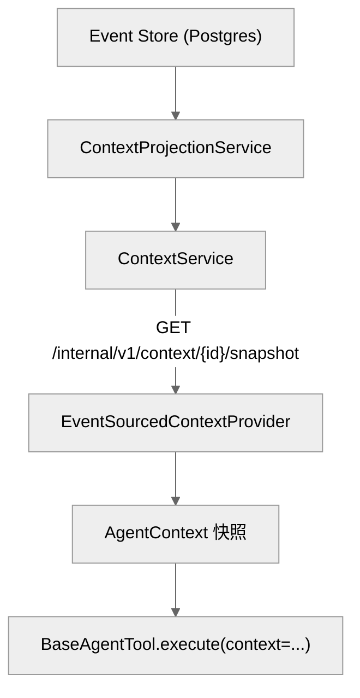

# DEV-013: Agent 架构与接口抽象

## 1. 概述

Agent 模块负责 LLM 编排、工具调用与上下文管理。为降低对 LangChain/LangGraph 的耦合，模块内引入了一层抽象接口（PLAN-033），并将对话上下文升级为 Event Sourcing 架构（PLAN-035）。

核心目标：

1. **可替换的编排框架** — 通过 `AgentRunner` 接口隔离 LangGraph 实现。
2. **可替换的工具实现** — 通过 `BaseAgentTool` 接口隔离 `BaseTool`。
3. **可观测、可恢复的对话状态** — 通过 CP Event Store 持久化事件，CP Projection Service 生成快照。

## 2. 接口层

接口定义集中在 `packages/agent/src/xihe_agent/interfaces/`，该目录下**不直接 import `langchain*`**。

| 接口 | 文件 | 职责 |
|------|------|------|
| `AgentRunner` | `interfaces/agent_runner.py` | Agent 编排抽象：`stream()` / `create_agent()` / `reset()` |
| `BaseAgentTool` / `ToolSpec` | `interfaces/tool.py` | 工具抽象：`execute()` + JSON Schema 声明 |
| `EventAdapter` | `interfaces/event_adapter.py` | 将框架原始事件翻译为 SSE `AgentEvent` |
| `LLMProvider` | `interfaces/llm.py` | LLM 后端抽象：`complete()` / `stream_complete()` / `with_model()` |
| `Message` / `TextMessage` | `interfaces/message.py` | 最小消息协议：`role` + `content` |
| `Event` / `EventEnvelope` | `interfaces/event.py` | 持久化域事件 |
| `EventStore` | `interfaces/event_store.py` | 事件存储抽象：append / read / fork |
| `AgentContext` / `ContextEpoch` / `ContextProvider` | `interfaces/context.py` | 事件投影后的上下文快照 |

### 2.1 AgentRunner

`AgentRunner.stream(messages, config)` 接收 `Message` 列表和 `RunnerConfig`，返回 SSE 层 `AgentEvent` 流。

其中 `RunnerConfig.context` 由 `ContextProvider.load()` 提供。

当前实现 `LangGraphRunner`（`agent_runner/langgraph_runner.py`）：

- 内部使用 LangGraph 的 `create_react_agent` + `astream_events`。
- 经 `EventAdapter` 将原始事件翻译为 SSE 事件。

### 2.2 BaseAgentTool

所有工具均实现 `BaseAgentTool`：

- `MCPAgentTool`（`adapters/mcp_client.py`）— 包装 LangChain MCP 工具。
- `ApprovalAgentTool`（`adapters/approval_tool.py`）/ `GenerateImageAgentTool`（`tools/__init__.py`）— 自定义工具。
- `LCToolAdapter`（位于 `agent_runner/langgraph_runner.py`，非 `adapters/`）— 将任意 `BaseAgentTool` 适配回 LangChain `BaseTool`，供 `LangGraphRunner` 内部使用；`registry` 经自有 `_adapt_tools` 接入，`supervisor` 经本地 `_adapt` 接入。

LangChain 特定代码收敛到 `agent_runner/langgraph_runner.py` 和 `adapters/`（sse/approval/mcp_client）。

### 2.3 LLMProvider

`XiheLiteLLM` 与 `MockChatModel` 实现 `LLMProvider`，方法为 `complete()` / `stream_complete()`。

**调用路径（直调，不经 CP）**：Agent 经 litellm **直调** provider；provider/model 来自 per-run 合成（CP `GET /internal/v1/config/effective/{domain}` 的 workspace-bound effective + run payload 的 user/workspace overrides；无租约时用 env 兜底 key，常规路径由 `provider_connections` 租约下发密钥，PLAN-0307 决策 #3a/#40）。CP 负责配置治理与 relay，不组装 LLM 请求；运行日志、catalog 和 health 不暴露 provider key/base URL。

- 为兼容 LangGraph 编排，`XiheLiteLLM` 仍继承 `ChatLiteLLM`。
- 未来切换到非 LangGraph 编排层时可移除该继承。

## 3. Event Sourcing 上下文管理

### 3.1 总体架构



锚点：`ContextProjectionService.java`、`ContextController.java:83`、`event_sourced_provider.py`。

- CP 是唯一真相源，负责事件持久化与投影。
- Agent 无状态，通过 `/internal/v1/context/{sessionId}/snapshot` 获取投影快照。
- 事件写入当前为同步；性能测试显示批量写入已足够快（~17k events/s），未引入异步队列。

### 3.1b 收缩管道与 prune（PLAN-0341）

- **装配**：`langgraph_runner.stream` 消费 CP 投影 keep-recent → `prune_history_tool_results`（固定窗 `pruneWindowChars` 默认 80K chars，可配）→ 写 `context.prune` 墓碑；`HISTORY_TRUNCATION_LIMIT=20` 仅装配熔断，窗口起点落在 tool 结果时回退对齐（`_align_truncation_start`）。
- **配置**：`context_policy.resolve` 读 effective `context-policy`（`defaults`/`models` JSON）：`maxInputTokens` 覆盖 litellm 窗、`pruneWindowChars`、`recoveryBand`、`tokenizerRef`（受信命名空间 allowlist）；日志 `context_policy_resolved source=config|default`。
- **SUM**：压缩摘要只在 `epoch.system_messages`；`AgentContext.apply_event("compaction.applied")` 截断 keep-recent 且不把摘要塞进 `messages`。

### 3.2 事件类型

| 事件类型 | 触发时机 |
|----------|----------|
| `session.created` | 创建 session |
| `prompt.admitted` | 用户输入进入对话 |
| `llm.token` | 模型流式输出 |
| `tool.called` | 工具被调用 |
| `tool.result` | 工具返回 |
| `context.source_changed` | AGENTS 等源变更（PLAN-0340：投影改为 **L1 槽替换**，不再追加 history；失败 `status=failed` 清 L1） |
| `epoch.started` / `epoch.replaced` | epoch 开始/替换 |
| `runtime.state_cleared` | `AgentRunner.reset()` |
| `session.forked` | 会话 fork |
| `compaction.applied` | 上下文压缩（PLAN-0341：`messages` 不再写入摘要，摘要仅 `epoch.system_messages`/`summary_hash`） |
| `context.prune` | prune 墓碑（PLAN-0341 T1.2：`tool_call_id`/hash/size/首尾 + `pruned`；投影按 hash 原地替换，防复活） |
| `context.compaction_circuit` | 恢复带熔断开/关（PLAN-0341 T1.3：`state=open|closed`；overflow 强制压缩绕过熔断） |
| `context.overflow_retry` | 溢出重跑审计（PLAN-0341 T1.1：runId + 预检 maxInputTokens） |
| `assistant.responded` | assistant 回复持久化（PLAN-294 M1；runner 流成功终态 append，投影映射为 ai 消息） |
| `llm.usage` | run 用量镜像（PLAN-294 M3；CP relay 写入，压缩门信号源。PLAN-0343：payload 增 `model`（`provider/model`，pricing 查表键）与 `cost/costCurrency/costSource/costNote`（CP 终态一次映射；unmapped→`cost=null`+告警，禁 0） |

两套事件命名空间不同，映射由 `LangGraphEventAdapter` 维护：

**调用链全局结构与 MCP 工具超时（PLAN-0308；结构来源 PLAN-0318 报告 §0.2）**

- **全局结构（星型，CP 居中）**：任意两模块无直连——Agent 只连 CP 的 MCP 端点，UI 只调 CP 公开接口，Runtime 只被 CP 调用（反向：Runtime/Agent → CP 心跳与拉配置）。**超时嵌套是三层不是两层**：工具调用 = Agent 等 CP → CP 等 Runtime → Runtime 等容器进程；中继层从头等到尾，每多一个模块多一层等待。**保持同步核心**：MCP 是请求/响应协议、LLM 循环必须拿到工具结果；长任务按策略边界走异步 job（发起段受预算、任务本体有时限、观测段短超时），传输层不做全链路异步（升级路径为绝对 deadline 传播）。
- **取值模型（决策 #25/#27）**：**CP 是唯一计算点**——预算 B 输入优先级 per-call > 数据库配置（`agent-runtime.systemToolTimeoutS` / remote `tool_timeout_s`）> 代码默认 30；CP 输出三跳最终等待值（Runtime = B、CP 转发 = B+2s、Agent = B+4s；固定余量仅兜内层挂死），经 run payload / 请求头下发。**模块侧只有三条判断（零算术）**：本模块 ENV 显式 → 用 ENV；per-call 性质标记存在 → 用下发值（压制本模块 ENV）；否则用下发值；都没有 → 代码默认。
- **上限（T3.1，2026-09-13）**：per-call 与数据库配置**同顶 30s**（`MAX_BUDGET_SECONDS`，代码常量）；per-call 超限 → CP 400 拒绝，遗留配置超限 → 告警后回落默认。超过 30s 的同步等待走异步 job，不放大预算。
- **传输兜底**：Agent 的 fastmcp 客户端显式 `timeout=3600s`（`SESSION_READ_HANG_BACKSTOP_S`），保证 SDK/会话默认值（`read=300s`）不抢先于逻辑授权值；权威等待界仍是 `asyncio.wait_for`。
- **头与关联键**：调用方 per-call 走入站头 `X-Xihe-Tool-Timeout-Per-Call`；出站 `X-Xihe-Tool-Timeout-S` / `-Origin` 只由 CP 设置并覆盖上游同名头（防绕过）；输出上限走 `X-Xihe-Tool-Output-Limit`；`toolCallId` 经 `X-Operation-Item-Id` 三层贯通。
- **错误署名**：超时错误写 `layer` / `effectiveSeconds` / `source`（env|cp|default）/ `valueOrigin`（per-call|config）/ `overriddenSeconds` / `origin=self|downstream`（容器守卫到界另带 `mechanism=guard`）；掐断层判定 = 时间线上最早的 `origin=self`（某跳 ENV 先到界属配置结果，非故障）。
- **已废弃表述**：旧的「四级解析链 + min 语义 + 冷启动 ×3（`firstToolCallDone`）」不再适用；冷启动宽限机制未实施，按 PLAN-0308 决策 #35 ④ **显式延期**（需要时再立）。
- 离线兜底：各模块 `XIHE_MCP_TOOL_TIMEOUT_S`（Agent）/ `XIHE_EXEC_COLLECT_TIMEOUT_S`（Runtime）/ `xihe.mcp.forward-timeout-s`（CP）仅作部署者**本跳覆盖**，正常路径由 CP 预算派生，各跳不做跨层比较。

| 层 | 事件 |
|----|------|
| SSE 协议 `AgentEvent` | `token` / `tool_call` / `tool_result` / `status` / `error` / `done`；工具事件携带 `toolCallId` + `origin`（`local`/`mcp`）供 CP 按通道事实记账，`request_approval` 工具事件抑制、以审批事件为正规记录 |
| 持久化域 `Event` | 见 §3.2 事件表 |

### 3.3 AgentContext 投影

`AgentContext` 由 CP `ContextProjectionService` 从事件流生成，包含：

- `messages` — 当前对话消息列表。
- `epoch` — 当前系统上下文 epoch（`system_messages` + Context Sources）。
- `runtime_state` — 请求级运行时状态。
- `latest_sequence` — 已投影到的最新事件序列号。

Agent 侧分工：

- `EventSourcedContextProvider` 仅调用 CP `/snapshot` 端点。
- `CrashRecovery` 经 `EventStore.read()` 读事件，再调 `AgentContext.apply_event()` 重建状态。

### 3.4 Context Source 变更感知（PLAN-0340）

CP `ContextSourceRefreshService`（**每 run** 在 `ChatController.execAsync` 的 `activeRuns` 串行域内调用）：

1. 经 Runtime 读 workspace 根 `AGENTS.md`，SHA-256（超 32KiB 截断标注）。
2. 对比 **session epoch `source_hash`**（首注入必发，不跨 session 抑制）；workspace 表仅作增量优化。
3. 变化 → `context.source_changed`（`created|updated` + `rendered_text` + sources）→ 投影 **L1 槽替换**；I/O 失败 → `status=failed` 清 L1；未变 → `unchanged` 不发事件。
4. Runtime `GET .../git-facts`（branch+HEAD，无 dirty）变化 → `context.env_updated` 存 epoch；U2 **不**因 env 告警。
5. Agent `_build_system_messages`：`L0 → L1(l1_rendered) → env 块 → SUM`；不受 20 条历史截断。

### 3.5 诊断回灌（PLAN-0342）

失败命令的原始输出在 Agent 侧转为结构化诊断并回灌（语言知识不下沉 Runtime，决策 #13）：

1. **提取（L0/L2）**：`LCToolAdapter._arun` 经 `extract_command_result` 容错解析 Runtime `CommandResult`（顶层或 `result`/`data`/`tool_result` 嵌套，`exit_code` 不可用即视为非命令结果）；仅非零退出按冻结规则 `path:line[:col]: message` 解析（path 需 path-like 锚定，severity 仅 error/warning/note，kind 由 command 保守推断）。未命中不猜测、原文不改写（L2，`confidence: low`）。
2. **去重与预算**：会话级 `DiagnosticsLedger` 按位置身份 `(file, line, column)` 做连续重复抑制——上一轮消失、之后复现的诊断重新回灌；解析成功的零退出记观察空集（回归信号）。预算：Top-N 20 / 单条 1k / 命令结果中段 48k 头尾保留（`truncate_middle` 仅作用于命令结果）。
3. **四通道**：① 模型可见 = 不可信信封内 `<diagnostics>` 文本块（`items` 非空才追加）；② 结构化 = `ToolMessage.artifact = {"diagnostics": bundle}`（`response_format="content_and_artifact"`，不进模型 wire）；③ durable = `tool.result` payload 触发时增 `diagnostics`；④ SSE = `tool_result.data.diagnostics`（`LangGraphEventAdapter` 从 artifact 复制，CP relay 原样透传）。bundle 形状 `{items, total, confidence}`（`items` 为 Top-N 切片，`total` 为截断前计数）。
4. **UI 呈现**：`ToolCallCard.vue` 有诊断时整卡自动展开，展示前 3 条 +「另有 N 条」；原文回退默认折叠；`useSSE` 兼容 `tool`/`toolCallId` 键名并写入本 run 内 `message.toolCalls`（历史消息不持久化 toolCalls）。
5. **边界**：只解析命令结果（其他工具内容不改写）；不解析 LLM 层失败；诊断不单独落盘（仅随事件 payload / SSE 透传）；跨 session 诊断账本（L1）后置。

## 4. 崩溃恢复

Agent 启动恢复流程：

1. 读取 `XIHE_RECOVER_SESSION_IDS` 环境变量（逗号分隔的 session ID）。
2. `CrashRecovery.recover_many()` 从 CP Event Store 重放事件。
3. 重建 `AgentContext`。

```python
recover_ids = _parse_recover_session_ids()
if recover_ids:
    recovered = await crash_recovery.recover_many(recover_ids)
```

恢复后的上下文可用于继续会话或审计；实际对话续接应配合 UI/CP 的 session 恢复机制。

## 5. 工具与编排适配

### 5.1 Supervisor 与 Registry

`agent/supervisor.py` 与 `registry/registry.py` 的 public API 已迁移到 `BaseAgentTool`：

- 内部经 `_adapt_tools()` / `LCToolAdapter` 继续使用 LangGraph 编排。
- 这是当前编排实现的合理依赖，已被隔离在 public API 之后。

### 5.2 MCPClientManager

`MCPClientManager.tools` 返回 `list[BaseAgentTool]`（`MCPAgentTool` 包装），完成工具层 public API 与 LangChain 的解耦。

### 5.3 Readiness、模型目录与工具模式（PLAN-247）

- Agent liveness 与 LLM readiness 分离；`unknown`、missing、invalid、unreachable 和 model unavailable 均不放行新 Chat。
- 配置 refresh 以 revision 为边界原子替换 runtime snapshot；provider model catalog 记录 status、reasonCode、capabilities 和 verifiedAt，不返回 key/base URL。
- `toolMode=none` 不调用 `_get_mcp_tools()`，也不注入 approval/image/MCP tools；只有 `toolMode=workspace` 才按请求 workspace 懒加载 MCP。MCP manager 发现结果不得跨 workspace 复用。

### 5.4 LLM 路由与工具能力（PLAN-0364）

- **路由来源唯一**：调用串为 `{route_provider}/{model}`，`route_provider` 来自 CP 租约（catalog 条目 `litellmProvider`）；Agent **不得**按工具/模型自行改写 slug（`XiheLiteLLM.bind_tools` 的 xiaomi→`openai/...` 静默切换已在 M3 移除）。
- **工具能力不匹配显式失败**：native `xiaomi_mimo` 无工具元数据，带工具请求由 litellm 抛 `UnsupportedParamsError`，Agent 经 `_classify_llm_exception` 映射为 `LLM_TOOL_ROUTE_UNSUPPORTED`；需要工具请使用 OpenAI 兼容连接（`litellmProvider: openai` + 显式 `baseUrl`）。
- **OpenAI wire 必须有显式 baseUrl**：`openai` / `custom_openai` / `openai_like` 在 `baseUrl` 为空或空白时于 `XiheLiteLLM.__init__` fail-fast（`LLMRouteConfigError` → `LLM_BASE_URL_MISSING`），禁止回落到 OpenAI 默认端点。

## 6. 相关文件

- `packages/agent/src/xihe_agent/interfaces/`
- `packages/agent/src/xihe_agent/agent_runner/langgraph_runner.py`
- `packages/agent/src/xihe_agent/context/`
- `packages/agent/src/xihe_agent/adapters/`
- `packages/control-plane/src/main/java/com/cc01cc/p/xihe/cp/context/`

## 7. 相关 PLAN

- PLAN-0340 上下文源与注入（L1）
- PLAN-0341 上下文管道与 prune（overflow/prune/SUM/熔断）— 本节 §3.1b
- PLAN-0342 诊断回灌与工具卡片呈现（L0/L2 + 四通道）— 本节 §3.5
- PLAN-0343 用量与成本契约（usage 事件注入 `model`=`provider/model`；CP 终态一次映射 cost，unmapped→`cost=null`+log warn；schemaVersion 仍 1）— 本节 §3 事件表 `llm.usage`
- PLAN-294 上下文事件流与自动压缩门

- `PLAN-033-XH-agent-module-decoupling.md`
- `PLAN-035-XH-agent-context-architecture.md`
