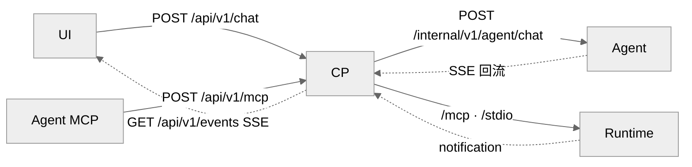

# DEV-014: CP 架构

> Control Plane（Java 25 + Spring Boot 4）是系统心脏：路由 + 认证 + MCP 反向代理 + 状态广播 + 会话管理 + 统一配置。约束：不做模块专属业务逻辑。与 DEV-016 以"CP 内部 vs 端到端工具路径"分界互引；端点以 `docs/api/openapi.yaml` 为准。

## 1. 三通道

- **聊天通道**：`POST /api/v1/chat`（`202` + `runId`，指令发送）+ `GET /api/v1/events?sessionId=`（会话级持久 SSE，流接收）；`POST /api/v1/exec` 并存。CP 中转 UI↔Agent，流式分发到 UI。**注意**：CP 只转运聊天流量（租约/透传/审计），不组装 LLM 请求、不代理模型调用——模型调用由 Agent 直调 provider（见 DEV-013 §2.3）。
- **MCP 反向代理通道**（`POST /api/v1/mcp`，另有同前缀 GET/DELETE）：JSON-RPC 解析 → 工具名提取 → 权限检查 → 请求改写 → 三层路由转发（详见 DEV-016）。CP 为纯 HTTP 反代，不依赖 MCP SDK。
- **状态分发通道**：Runtime MCP notification → CP 分发到 UI（SSE）与 Agent（透传）。

## 2. 会话级持久 SSE（PLAN-230）

- `SseEmitterManager` 按 `{sessionId, generation, emitter}` 存储，单会话单活；新连接替换旧连接（`chat_sse_replaced`），旧 `onCompletion` 用 `removeIfCurrent` 身份比对保护（误删记 `stale_cleanup_ignored`）。
- `POST /api/v1/chat` 先校验 `hasEmitter`（缺失 → `409 SSE_SUBSCRIPTION_REQUIRED`），再原子获取 `activeRuns` 单并发租约（冲突 → `409 CHAT_IN_PROGRESS`）。
- `done` 仅结束当前 `runId`，不关闭会话 SSE；`heartbeat` 15s 保活不进业务气泡。
- `requestId`/`runId` 由 `RequestIdFilter` 生成，经 `X-Request-Id`/`X-Chat-Run-Id` 显式透传至异步 `execAsync` 与 Agent（禁跨线程 MDC 继承）；`RequestIdFilter` 同时写 MDC `requestId` 并回写响应头。
- CP→Agent 聊天：`POST /internal/v1/agent/chat`（`stream:true`，SSE 回流）。

## 3. MCP 反代与工具命名空间

- `McpProxyController`：验 session-id HMAC 签名 + 提取 ws_id；`tools/list` 按原名合并系统工具 + 各 STDIO server 工具并建 tool→server 映射（5min TTL 缓存）；`tools/call` 查表路由；系统工具优先（同名用户工具跳过 + 告警）。
- `ToolNameRewriter`（`read_file` ↔ `runtime__read_file`）：已实现且有单测，但当前未被 controller 接线（`@Component` 零注入），实际按原名转发；启用前缀路由须先接线。
- 服务间调用统一 `Authorization: Bearer`；自有 JSON 用 camelCase + RFC 9457 Problem Details（`code` + `requestId`）。

## 4. OAuth 与 token broker

- UI 发起 Authorization Code + PKCE；CP 保存加密 refresh token，按 user/workspace/server 发放短期 access token；负责 refresh/revoke。
- Runtime host-side connector 只收短期 access token（workspace sandbox 不承载远程 OAuth）。

## 5. 会话 / 附件 / 文件 / 遥测

- **会话**：服务端 Session/Message 为 canonical source；`GET /api/v1/sessions/{sessionId}/messages` 加载历史（含附件）。
- **附件**：`File` 实体（`sessionId` + `messageId`，`workspaceId` nullable），物理路径 `{attachments-base-path}/{sessionId}/{fileId}`；`POST /api/v1/sessions/{sessionId}/attachments` 批量上传（白名单校验、500MB 上限）；`GET /api/v1/files/{fileId}` 取流（注意 `ChatAttachmentController` 返回的元数据 URL 缺 `/api/v1` 前缀，代码不一致待修，UI 依赖带前缀形式）；orphan 附件 24h 定时清理。
- **文件**：`WorkspaceFileController` 转发 Runtime REST（含二进制上传）；`GET /api/v1/workspaces/{workspaceId}/environment` 为只读诊断视图。
- **遥测**：`TelemetryController` 收前端日志（`POST /api/v1/telemetry/logs` 需 JWT；`/anonymous` 限流），写 `telemetry.log`。
- **审计**：`AuditLogger` 记录 MCP 工具调用与策略决策，持久化到 `audit.log`（脱敏 encoder），内存保留最近 1000 条查询视图。
- **健康**：`/actuator/health`；方法级 `@PreAuthorize`（禁类级，避免与 `/health` 冲突）。
