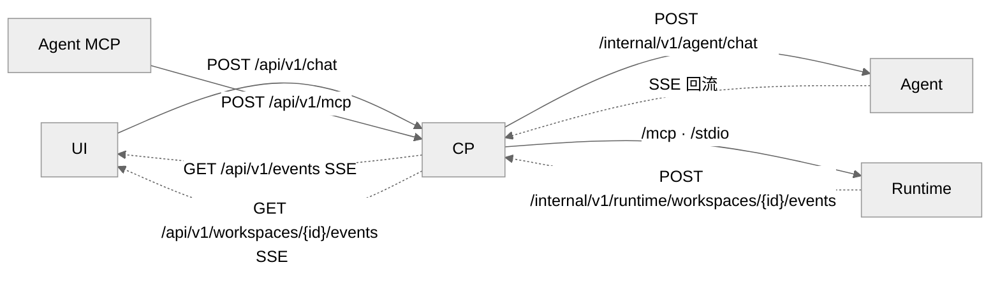

# DEV-014: CP 架构

> Control Plane（Java 25 + Spring Boot 4）是系统心脏：路由 + 认证 + MCP 反向代理 + 状态广播 + 会话管理 + 统一配置。约束：不做模块专属业务逻辑。与 DEV-016 以"CP 内部 vs 端到端工具路径"分界互引；端点以 `docs/api/openapi.yaml`/`docs/api/inventory.md` 为准，跨模块 ownership 和事件边界见根级 `spec/architecture/`、`spec/protocol/` 与 `spec/data/`；认证、授权、能力策略、审批和审计见根级 `spec/security/`（当前为 proposed）。

## 1. 三通道

- **聊天通道**：`POST /api/v1/chat`（`202` + `runId`，指令发送）+ `GET /api/v1/events?sessionId=`（会话级持久 SSE，流接收）。CP 中转 UI↔Agent，流式分发到 UI。**注意**：CP 只转运聊天流量（租约/透传/审计），不组装 LLM 请求、不代理模型调用——模型调用由 Agent 直调 provider（见 DEV-013 §2.3）。
- **MCP 反向代理通道**（`POST /api/v1/mcp`，另有同前缀 GET/DELETE）：JSON-RPC 解析 → 工具名提取 → 权限检查 → 请求改写 → 三层路由转发（详见 DEV-016）。CP 为纯 HTTP 反代，不依赖 MCP SDK。
- **状态分发通道**：Runtime/Workspace storage watcher → CP Workspace event ingress → UI Workspace SSE；ChatRun 仍独立使用 Session SSE，不把无 Session 文件事件塞入 Chat。

## 2. 会话级持久 SSE（PLAN-230）

- `SseEmitterManager` 按 `{sessionId, generation, emitter}` 存储，单会话单活；新连接替换旧连接（`chat_sse_replaced`），旧 `onCompletion` 用 `removeIfCurrent` 身份比对保护（误删记 `stale_cleanup_ignored`）。
- `POST /api/v1/chat` 先校验 `hasEmitter`（缺失 → `409 SSE_SUBSCRIPTION_REQUIRED`），再原子获取 `activeRuns` 单并发租约（冲突 → `409 CHAT_IN_PROGRESS`）。
- `done` 仅结束当前 `runId`，不关闭会话 SSE；`heartbeat` 15s 保活不进业务气泡。
- `requestId`/`runId` 由 `RequestIdFilter` 生成，经 `X-Request-Id`/`X-Chat-Run-Id` 显式透传至异步 `execAsync` 与 Agent（禁跨线程 MDC 继承）；`RequestIdFilter` 同时写 MDC `requestId` 并回写响应头。
- CP→Agent 聊天：`POST /internal/v1/agent/chat`（`stream:true`，SSE 回流）。

## 2.1 Workspace 级事件 SSE（PLAN-0350 首批）

- `GET /api/v1/workspaces/{workspaceId}/events` 按 `TenantContext` + Workspace membership 鉴权，不要求 Session 存在；订阅数按 Workspace 有界。
- Runtime 通过 `POST /internal/v1/runtime/workspaces/{workspaceId}/events` 上报归一化的相对路径/变更提示，CP 分配 Workspace-local `sequence` 并直接 fan-out。
- v1 不持久化 replay log；`Last-Event-ID` 发生 gap 时发送 `snapshot_required`，UI 通过既有 Workspace HTTP/MCP API 重建文件树和打开文件状态。
- 事件只携带摘要，不携带文件正文、完整目录树或宿主绝对路径；Workspace 删除提交后 CP 关闭相关订阅。

## 3. MCP 反代与工具命名空间

- `McpProxyController`：验 session-id HMAC 签名 + 提取 ws_id；`tools/list` 合并系统工具 + 各 STDIO server 工具 + 各 remote server 工具并建 tool→server 映射（5min TTL 缓存）+ sticky 别名落盘；`tools/call` 按三路（系统/stdio/remote）查表路由；命名 sticky（冲突仅新者加前缀，永不晋升）。
- `ToolNameRewriter`（`read_file` ↔ `serverId__read_file`）：冲突时命名策略，已接线（PLAN-242 M2；全量前缀不取）。
- 服务间调用统一 `Authorization: Bearer`；自有 JSON 用 camelCase + RFC 9457 Problem Details（`code` + `requestId`）。

## 4. OAuth 与 token broker

- UI 发起 Authorization Code + PKCE；CP 保存加密 refresh token，按 user/workspace/server 发放短期 access token；负责 refresh/revoke。
- Runtime host-side connector 只收短期 access token（workspace sandbox 不承载远程 OAuth）。

## 5. 会话 / 附件 / 文件 / 遥测

- **会话**：服务端 Session/Message 为 canonical source；`GET /api/v1/sessions/{sessionId}/messages` 加载历史（含附件）。
- **附件**：`File` 实体（`sessionId` + `messageId`，`workspaceId` nullable），物理路径 `{attachments-base-path}/{sessionId}/{fileId}`；`POST /api/v1/sessions/{sessionId}/attachments` 批量上传（白名单校验、500MB 上限）；`GET /api/v1/files/{fileId}` 取流（注意 `ChatAttachmentController` 返回的元数据 URL 缺 `/api/v1` 前缀，代码不一致待修，UI 依赖带前缀形式）；orphan 附件 24h 定时清理。
- **文件**：`WorkspaceFileController` 转发 Runtime REST（含二进制上传）；`GET /api/v1/workspaces/{workspaceId}/environment` 为只读诊断视图。
- **遥测**：`TelemetryController` 收前端日志（`POST /api/v1/telemetry/logs` 需 JWT；`/anonymous` 限流），写 `telemetry.log`。
- **审计**：`AuditLogger` 记录 MCP 工具调用与策略决策，持久化到 `audit.log`（脱敏 encoder），内存保留最近 1000 条查询视图。

## 6. ChatRun 与错误终态（PLAN-247）

- readiness gate、SSE subscription 和 single-flight 通过后，CP 才创建 `ChatRun` 与 user `Message`；gate 前失败不产生历史消息。
- `ChatRun` 以 `(userId, sessionId, Idempotency-Key)` 唯一约束并保存 request hash；重复同 payload 返回既有 run，不重复启动 Agent；同 key 不同 payload 返回 `IDEMPOTENCY_KEY_CONFLICT`。
- Agent provider failure 进入 `failed`/`partial`，流断开或缺少终态进入 `ambiguous`；`ambiguous` 不自动 retry，人工确认后使用新的幂等键。
- `/api/v1/exec` 已删除，所有聊天 caller 统一迁移至 `/api/v1/chat`。
- **健康**：`/actuator/health`；方法级 `@PreAuthorize`（禁类级，避免与 `/health` 冲突）。

## 6a. 用量与成本契约（PLAN-0343）

- **唯一计算点**：`ChatController.persistUsageExtension`（run 终态，usage 事件到达即映射）——`mapUsageCost` 查 ConfigService **`pricing` 域**（instance-only，per-MTok：`models.<provider/model>.{inputPerMTok,outputPerMTok,currency}`）→ 注入 `cost/costCurrency/costSource/costNote` 后**同源**落三处：llm_usage extension（schemaVersion 仍 1）、context event `llm.usage`、UI SSE `usage` 事件（每 run 一次、done 前）。
- **unmapped**（无 pricing 条目或 source=fallback）→ `cost=null` + log warn `usage_cost_unmapped`（含 runId+model），禁 0；存量无 `model` 行原样保留、聚合计 partial。
- **内部聚合**：`cp/usage/UsageAggregator.aggregate(sessionId)` 只读（测试与 0355 消费）；**无公开 `/usage` 端点**（刻意，Q1-A）。
- **UI 一行**：ChatView（`/chat` 路由）与 WorkspaceView（工具会话）header 渲染 `in/out tokens · cost 或 未映射 · source 徽章`；不持久化，历史回查走 ledger。

## 6b. 上下文管道与溢出重跑（PLAN-0341）- **CTX-1**：`ChatController.safeErrorCode` 含 `CONTEXT_OVERFLOW`；`execAsync` 在终态之前「至多一次」——`tryOverflowRecovery` → `ContextService.compactForOverflow`（`trigger=overflow`，冷却门清零）→ `preflightRetryAfterOverflow(configuredMax)` → 同 `runId` 重派（`X-Overflow-Retry`）；首次溢出不转发终态；二次超窗显式文案。
- **CTX-2**：摘要分节 carry-forward + 缩减校验（失败降级截断）+ `context.compaction_circuit`（residual > `recoveryBand×soft` 开闸；恢复=较 open 时 residual 增长）；熔断只停自动压缩。
- **投影**：`applyCompaction` 只写 SUM（`system_messages`/`summary_hash`）；`context.prune` 按 content hash 替换为 placeholder。
- **公开 API**：`POST /api/v1/sessions/{id}/compact`（`upToSequence` 可选；活跃 run 409）；OpenAPI 已登记。
- **U3/U4 SSE**：`context_overflow_retry`、`context_compaction_circuit`。

## 7. 取消收敛与对账（PLAN-0317）

- **`POST /api/v1/chat/runs/{runId}/cancel` 由 CP 自主收敛**（不等 Agent 回音）：并行转发 Agent 与调用 Runtime 取消端点；随后把四层状态一次收口——`operation_items`（确认终止 `cancelled` / 未确认 `aborted` / 已自然结束不改）、在途 `operation_attempts`（`cancelled`）、`ledger_operations`（`cancelled`）、`chat_runs`（`cancelling → cancelled`，成功/失败路径的转换期望集不含 `cancelling`）。
- **关联键**：`operationItemId`（= `operation_items.tool_call_id` 规范化值）。CP 出站自行注入规范化 `X-Operation-Item-Id`；非 UUID 值统一 `nameUUIDFromBytes` 派生，保证中继与网关同一键。
- **Runtime 不可达/未确认** → 账本落 `aborted` 并保留追偿：Runtime 复核结束后回调 `POST /internal/v1/operations/items/{itemId}/late-termination`，CP 只追加 `item.terminated.late` 事件、不回改终态。
- **恢复与对账**：启动恢复把崩溃遗留的 `cancelling` 收敛为 `cancelled`；`ChatRunReconciliationService` 周期（默认 5 分钟，宽限 10 分钟）收敛无 lease 且超宽限的非终态 run（`cancelling → cancelled`，其余 `ambiguous(CP_RECONCILED)`），并收口 operation 与在途 item/attempt；**本进程活跃 run 一律跳过**（防误伤）。
- 账本写路径约束：批量状态转换显式刷新 `updated_at`（`CURRENT_INSTANT`）；`appendItem` 先对 operation 行加悲观锁再分配序号，`appendEvent` 用聚合 `max`。

## 8. 当前事实：PLAN-0328 审批与 workspace checkpoint 切片

- **审批策略**：策略面（tool face、规则、mode、grant reuse）与既有 UI 人工审批并行；post-gate 的 run-scoped ASK 以 HTTP `409` 携带 JSON-RPC `error.code=-32003`、`error.message=APPROVAL_REQUIRED` 和 `error.data`（含 `approvalRequestId` 等安全字段）。无 run context 仍使用 legacy Problem Details 409。
- **审批来源（PLAN-0371）**：`approval_requests.origin`（V25）区分 `cp_gate`（CP 门禁触发）与 `agent_relay`（模型经 `request_approval` 提问）；live/replay envelope 与 UI 审批卡片来源徽章已暴露该只读字段，legacy 行（V25 前）返回 null 且 UI 不渲染。
- **Checkpoint 投影（workspace 切片模型，PLAN-0338/0339）**：Runtime 负责影子 Git；CP 将 `run_checkpoints` 重建为 workspace slice rows（0339 V27，旧行物理清空、不做格式迁移）。每行含 `id`、`sliceRef`、`capturedAt`、`sourceRunId`、`sourceSessionId`、`predecessorRef`、`changedFiles`、`changedCount`、`opaqueNestedRepos`、`state`、`unrollableReason` 与 `revert` bookkeeping。`changedFiles` 是相邻链尾切片差异；前驱缺失时为空，不伪造全量清单；`state` 为 `captured | abnormal-captured | degraded | expired`，已回收行不进入公共列表。
- **Workspace checkpoint API**：成员经 `requireAccessibleWorkspace` 使用 `GET /api/v1/workspaces/{workspaceId}/checkpoints`、按 `sliceRef` 的 preview/revert/blob，以及需要 `{acknowledge:true}` 的 cleanup；保留 git-status、retention、GC。Runtime 内部由 CP 调用 `/checkpoints/capture`、`/gc`、`/cleanup`、`/revert/preview`、`/revert`、`/blob?sliceRef=&path=`、`/git-status`。完整请求/响应字段以 [OpenAPI](../../api/openapi.yaml) 和 [API inventory](../../api/inventory.md) 为准。
- **回滚账本**：UI 触发的 `revert_checkpoint` 记录为 `kind=checkpoint`、`source=ui`；`revert` 记录 `state/at/counts/ref/attemptCount`，摘要只含计数、逐路径结果与安全原因，不含原始参数或文件内容。
- **规范入口**：完整策略与 checkpoint 设计、测试和剩余证据见 [PLAN-0328 evidence](../../../../plans/archive/20260918/PLAN-0328-XH-change-safety-net/evidence/m3-revert-and-ui-2026-09-16.md)。本文只保留当前边界，不复制设计。

## 9. Durable job 档案与续看（PLAN-0344）

- **档案**：与 append-only 的账本 extension 不同，job 状态是可变事实——`job_state` extension v1 锚定 tool_call item，按状态机前进 upsert（行锁串行化 + 唯一索引竞争重试一次；running → 终态一次性、终态不可回退/异终态覆盖丢弃）。字段与状态机冻结口径见 [PLAN-0344 job-freeze](../../../../plans/archive/20260918/PLAN-0344-XH-durable-job-continuation/evidence/job-freeze.md)；`scope` 已支持 `run/session/workspace`，缺省仍为 `session`，Workspace scope 目标态由 PLAN-0390 承接。
- **三源回填**：① `McpProxyController` 在 start/get/cancel 工具成功后同步（best-effort，失败不影响派发）；② `JobReconciliationService` 周期（默认 5 分钟）只查档案内 running 的 jobId 走 Runtime `get_background_process`（不扫全容器），job 消失且非不可达 → `orphaned`；③ destroy 窗口内 Runtime `delete_workspace_handler` 在 destroying 标记后、容器 stop 前枚举存活 job 并随删除响应返回 `jobIds`，CP `markOrphanedForWorkspace` 落 orphaned（枚举失败 = fail-closed 全量落 orphaned）。
- **续看**：`GET /api/v1/operations/items/{itemId}/job-output`（Workspace access：item → operation.workspaceId）经 Runtime 内部路由 `jobs/output` 读容器文件；分页按字节 `offset`（缺省 64KiB / 上限 1MiB），`nextOffset` 由 Runtime `utf8_safe_chunk` 保证恒为 UTF-8 rune 边界（CP 不做二次裁剪）；容器销毁 → 409 `JOB_OUTPUT_LOST`，终态但文件被 TTL 清理 → 409 `JOB_OUTPUT_EXPIRED`，Runtime 不可达 → 502。列 job 状态走 `jobs/status`。
- **计时**：运行时限按累计运行时间——空闲回收暂停前 `mark_jobs_paused` 打点、unpause 激活后折算 `paused_total_secs`，enforce 判定扣除暂停时长（消除「解冻即 timeout」误杀）。
- **唯一写者**：`job_state` 只由 CP 写（Runtime 不写数据库）；Runtime 侧只暴露内部读路由与删除响应枚举，MCP 工具面不变。
- **单 job 取消（PLAN-0366）**：`POST /api/v1/operations/items/{itemId}/cancel`（Workspace access，与续看同键位）→ Runtime 内部路由 `jobs/cancel`（复用四阶段终止；`failed`=终止未确认）。已终态幂等 200 + 原状态 + `changed:false`；未确认 → 502 `JOB_CANCEL_UNCONFIRMED` 且档案不变；Runtime 404 → 档案落 `orphaned`（`cancelReason=job_missing`，与销毁/对账的 `destroy_orphan` 语义区分）；Runtime 不可达 → 502。取消 job ≠ 取消 run/对话终态；归属校验通过且存在档案的每次调用写 `operation_events`（`event_type=job.cancel`、`actor=user`、payload jobId/workspaceId/runId/result/changed），不改写 `ledger_operations.actor_type`。

> **PLAN-0390 draft（2026-09-21）**：现行实现已支持最终 schema version 1 的 scope 字段和 Workspace access output/cancel；Workspace Job list projection 已落地。backend JobHandle、start/output cursor、release/resume 和完整 scope termination 仍由 PLAN-0390 M2、0392–0395、0391 承接。

## 10. 摘要 provider seam 与 LLM 回退（PLAN-0354）

- **接缝**：`ContextService.compact/compactForOverflow` 只依赖 `SummaryProvider` 接口；`RuleBasedSummaryProvider`（0341 基线，逐字不变）与 `LlmSummaryProvider`（`@Primary` 默认）两实现。契约源为 workspace 根 `one/plans/archive/20260919/PLAN-0354-XH-summary-provider-fallback/spec/summary-provider.md`（与本文冲突时以 spec + design 决策表为准）。
- **默认与回退（0355 裁定后）**：`context-policy.summaryProvider` 默认 `rule`（2026-09-19 质量门 reject → Q6-A 翻关分支生效，见 PLAN-0355 `evidence/gate-decision.md`；原默认 `llm`）；显式 `llm` 仍可开启。`rule` 为直属规则式（`provider=rule`、无 `fallbackReason`），不是回退。LLM 失败在 `LlmSummaryProvider` 内全捕获降级并填 `fallbackReason`（唯一枚举：`no_credential` / `lease_failed` / `timeout` / `agent_error` / `invalid_output` / `shrink_failed`），不抛出、不阻塞 run（I1）；`shrink_failed` 为产出未通过缩减校验后的实际应用降级（LLM usage 成本仍计）。
- **复测先决（F1）**：重开/重估 LLM 摘要前必须先修复 `shrink_failed` 降级截断摘要丢 `[Constraints]` 的缺陷（0355 实测 1/54 触发即丢 2 条约束；规则式路径同形态但样本未触发），并与「p95 ≤10s 且无 >15s 长尾」的 provider/model 按冻结判据复跑（PLAN-0355 `gate-decision.md` §4–§5）。
- **配置键**（`context-policy`；schema 与 `config.import.example.jsonc` 同步，UI 该域为 `defaults`/`models` JSON 透传表单、无需 UI 代码改动）：`summaryProvider`（`llm|rule`，默认 `rule`——0355 裁定后；显式 `llm` 仍合法）、`summaryModel`（可选 bare model 覆盖，provider 仍取 canonical pair）、`summaryTimeoutMs`（1000–60000，默认 15000；越界钳制到边界并 warn）。解析优先级 `models.<modelKey>` → `defaults` → 代码默认，`modelKey` = 解析后 `provider/model`。
- **模型/provider 解析（canonical pair，Q1-A）**：`provider` = `session.modelProvider` → `llm-provider.defaultProvider`；`model` = `summaryModel` → `session.modelName` → `llm-provider.defaultModel` → `<provider>Model`；任一缺失或 provider=`mock` → 不发起 LLM（`no_credential`）。
- **凭据与租约**：连接 = `session.providerConnectionId`（无 → `no_credential`）；CP 用新重载 `ProviderCredentialLeaseService.issue(..., expectedRevision, 2min)` 签发短租约（既有调用方保持 5 分钟默认）；兑换仍走 Agent→CP `/internal/v1/provider-leases/redeem` 既有通道，不新增凭据通道；pre-run/overflow 传 `runId`，手动压缩 `runId=null`（redeem 侧仅在 `lease.runId` 非空时校验）；租约 token/apiKey 不入日志。
- **事件字段（`compaction.applied`，前向兼容追加）**：`provider`（`rule|llm`，shrink 降级后为 rule）、`model`（llm 时 `provider/model`，rule 时 `""`）、`durationMs`、`beforeTokens`/`afterTokens`（chars/4 估算）、`source`（`real|estimated|fallback`）；`fallbackReason` 仅回退时存在；`usage` 仅 LLM 调用完成时存在（0343 同名，写入事件前经 `UsageCostMapper` 完成 pricing 映射；`unmapped` → `cost=null` + `costSource=unmapped` + warn，不按 0；`source=fallback` 不计价）。旧字段全部保留；事件不含摘要正文之外的任何正文。
- **输入有界与 SC 隔离（I2/I3）**：组装输入仅 `role: content`；单条上限 4000 chars（截断后缀 marker）；总预算复用 `pruneWindowChars`（默认 80000，区间 [2000, 2000000]，不新增预算键）；从最新向旧累计，放不下的旧消息跳过并在首行标 `[... N earlier messages omitted for summarization ...]`；`previousSummary` 先丢弃 `[Constraints]` 段，LLM 输出若自带 `[Constraints]` 一律丢弃，再由 `ConstraintExtractor` 逐字抽取并拼接（规则式保持 0341 段落位置，LLM 追加在末尾）。
- **事务边界（M0 新增）**：`compact()` / `compactForOverflow()` 不再标注 `@Transactional`——外部 HTTP 最长 60s 不得持有 DB 事务/连接（`cp.lock-timeout-ms` 默认 5s）；投影读（`projectUpTo`）与事件写（`EventStoreService.append`）各自短事务，`ProviderCredentialLeaseService.issue` 自带事务；追加顺序、事件序列号与恢复带逻辑保持不变（`ContextServiceTest` 回归）。
- **传输层失败分类**：`AgentSummarizeClient` 使用 `HttpClient` 请求级 timeout `summaryTimeoutMs`（connect 2s）；超时（`HttpTimeoutException`）→ `timeout`，非 2xx / 连接失败 / 响应不可解析 → `agent_error`，均不重试；CP 对 Agent 任何非 2xx 一律记 `agent_error`（不区分细分码）。手动验证与失败对照见 spec §12。
