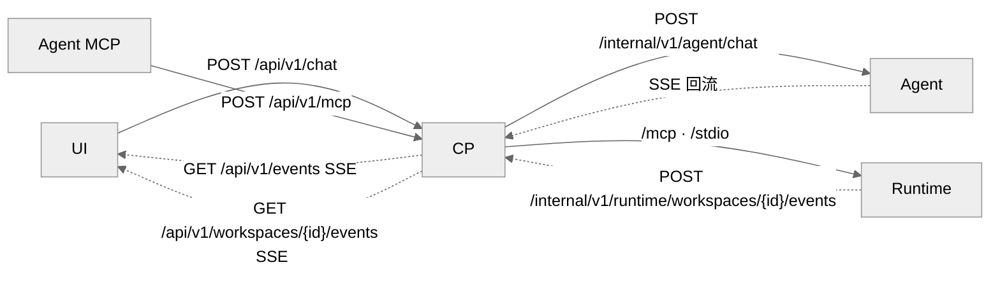

# DEV-014: CP 架构

> Control Plane（Java 25 + Spring Boot 4）是系统心脏：路由 + 认证 + MCP 反向代理 + 状态广播 + 会话管理 + 统一配置。约束：不做模块专属业务逻辑。与 DEV-016 以"CP 内部 vs 端到端工具路径"分界互引；端点以 `docs/api/openapi.yaml`/`docs/api/inventory.md` 为准，跨模块 ownership 和事件边界见根级 `spec/architecture/`、`spec/protocol/` 与 `spec/data/`；认证、授权、能力策略、审批和审计见根级 `spec/security/`（当前为 proposed）。

```mermaid
%%{init: {'theme': 'neutral'}}%%
flowchart LR
    UI["UI"] -->|"POST /api/v1/chat"| CP["CP"]
    CP -->|"POST /internal/v1/agent/chat"| AG["Agent"]
    AG -.->|"SSE 回流"| CP
    CP -.->|"GET /api/v1/events SSE"| UI
    CP -.->|"GET /api/v1/workspaces/{id}/events SSE"| UI
    AG2["Agent MCP"] -->|"POST /api/v1/mcp"| CP
    CP -->|"/mcp · /stdio"| RT["Runtime"]
    RT -.->|"POST /internal/v1/runtime/workspaces/{id}/events"| CP
```

## 1. 三通道

- **聊天通道**：`POST /api/v1/chat`（必填 `sessionId`/`branchId`/`content`，`202` + `runId`，指令发送）+ `GET /api/v1/events?sessionId=`（会话级持久 SSE，流接收）。CP 中转 UI↔Agent，流式分发到 UI。**注意**：CP 只转运聊天流量（租约/透传/审计），不组装 LLM 请求、不代理模型调用——模型调用由 Agent 直调 provider（见 DEV-013 §2.3）。
- **MCP 反向代理通道**（`POST /api/v1/mcp`，另有同前缀 GET/DELETE）：JSON-RPC 解析 → 工具名提取 → 权限检查 → 请求改写 → 三层路由转发（详见 DEV-016）。CP 为纯 HTTP 反代，不依赖 MCP SDK。
- **状态分发通道**：Runtime/Workspace storage watcher → CP Workspace event ingress → UI Workspace SSE；ChatRun 仍独立使用 Session SSE，不把无 Session 文件事件塞入 Chat。

## 2. 会话级持久 SSE（PLAN-230）

- `SseEmitterManager` 按 `{sessionId, generation, emitter}` 存储，单会话单活；新连接替换旧连接（`chat_sse_replaced`），旧 `onCompletion` 用 `removeIfCurrent` 身份比对保护（误删记 `stale_cleanup_ignored`）。
- `POST /api/v1/chat` 先校验 `hasEmitter`（缺失 → `409 SSE_SUBSCRIPTION_REQUIRED`），再原子获取 `activeRuns` 单并发租约（冲突 → `409 CHAT_IN_PROGRESS`）。
- `done` 仅结束当前 `runId`，不关闭会话 SSE；`heartbeat` 15s 保活不进业务气泡。
- `requestId`/`runId` 由 `RequestIdFilter` 生成，经 `X-Request-Id`/`X-Chat-Run-Id` 显式透传至异步 `execAsync` 与 Agent（禁跨线程 MDC 继承）；`RequestIdFilter` 同时写 MDC `requestId` 并回写响应头。
- CP→Agent 聊天：`POST /internal/v1/agent/chat`（`stream:true`，SSE 回流）。

## 2.1 Workspace 级事件 SSE（PLAN-0350 首批）

- `GET /api/v1/workspaces/{workspaceId}/events` 按 `TenantContext` + Workspace membership 鉴权，不要求 Session 存在；订阅数按 Workspace 有界。
- Runtime 通过 `POST /internal/v1/runtime/workspaces/{workspaceId}/events` 上报归一化的相对路径/变更提示，CP 分配 Workspace-local `sequence` 并直接 fan-out。
- v1 不持久化 replay log；`Last-Event-ID` 发生 gap 时发送 `snapshot_required`，UI 通过既有 Workspace HTTP/MCP API 重建文件树和打开文件状态。
- 事件只携带摘要，不携带文件正文、完整目录树或宿主绝对路径；Workspace 删除提交后 CP 关闭相关订阅。

## 3. MCP 反代与工具命名空间

- `McpProxyController`：验 session-id HMAC 签名 + 提取 ws_id；`tools/list` 合并系统工具 + 各 STDIO server 工具 + 各 remote server 工具并建 tool→server 映射（5min TTL 缓存）+ sticky 别名落盘；`tools/call` 按三路（系统/stdio/remote）查表路由；命名 sticky（冲突仅新者加前缀，永不晋升）。
- **MCP caller 授权**：CP 按验证后的 Authentication 分流：User Bearer 仅调用 workspace UI 文件工具面，并经 membership + User grant；Agent internal service Bearer 的 `tools/call` 必须关联真实 application Session，并走 Agent principal grant path。`mcp-init` 不是 Session；Run/Operation headers 不会把 User caller 转成 Agent。错误响应 requestId 沿用 RequestIdFilter，便于响应和审计关联；目标契约见 `spec/security/principal-workspace-scope.md`。
- **Agent durable caller gate（PLAN-0387 T3.2）**：在 grant、approval 与 Runtime dispatch 前，CP 核验 `sessionId/runId/toolCallId` 对应的 Session→ChatRun→`mcp_invocations(source=agent)`，匹配 owner、Workspace、Session、Run、Invocation 与 `toolName`，并要求 Run lease 与 invocation `active`。verdict 为空（无 invocation 行、Run 不存在）一律 fail-closed；UI-direct MCP 走独立路径。
- `ToolNameRewriter`（`read_file` ↔ `serverId__read_file`）：冲突时命名策略，已接线（PLAN-242 M2；全量前缀不取）。
- 服务间调用统一 `Authorization: Bearer`；自有 JSON 用 camelCase + RFC 9457 Problem Details（`code` + `requestId`）。

## 4. OAuth 与 token broker

- UI 发起 Authorization Code + PKCE；CP 保存加密 refresh token，按 user/workspace/server 发放短期 access token；负责 refresh/revoke。
- Runtime host-side connector 只收短期 access token（workspace sandbox 不承载远程 OAuth）。

## 5. 会话 / 附件 / 文件 / 遥测

- **会话**：服务端 Session/Message 为 canonical source；`GET /api/v1/sessions/{sessionId}/messages?branchId=` 要求显式选择路径，只返回该 path 可见的历史（含附件）。
- **派生会话协作（PLAN-0408）**：child ChatRun terminal 与 parent Inbox 由 CP 同事务提交；提交后 CP 向 parent Session SSE 发 best-effort `derived_state_changed` 四键 hint。恢复读只使用 `GET /api/v1/sessions/{sessionId}/derived-state`；SSE 不是数据源。parent 删除只清 Inbox，不级联 child Session/ChatRun。生命周期契约见 [`spec/session/derived-collaboration-inbox.md`](../../../spec/session/derived-collaboration-inbox.md)，wire 见 OpenAPI 与 route inventory。
- **附件**：`File` 实体（`sessionId` + `messageId`，`workspaceId` nullable），物理路径 `{attachments-base-path}/{sessionId}/{fileId}`；`POST /api/v1/sessions/{sessionId}/attachments` 批量上传（白名单校验、500MB 上限）；`GET /api/v1/files/{fileId}` 取流（注意 `ChatAttachmentController` 返回的元数据 URL 缺 `/api/v1` 前缀，代码不一致待修，UI 依赖带前缀形式）；orphan 附件 24h 定时清理。
- **Fork 附件复制（PLAN-0409）**：child bytes 使用新 Session namespace 和新 File row；fork copy 与 direct/Session-wide physical delete 共用 per-File 行锁，cleanup 必须严格验证 child namespace 已不存在。持久 request/recovery 见 V46 与根 fork/action SPEC。
- **文件**：`WorkspaceFileController` 转发 Runtime REST（含二进制上传）；`GET /api/v1/workspaces/{workspaceId}/environment` 为只读诊断视图。
- **遥测**：`TelemetryController` 收前端日志（`POST /api/v1/telemetry/logs` 需 JWT；`/anonymous` 限流），写 `telemetry.log`。
- **审计**：`AuditLogger` 记录 MCP 工具调用与策略决策，持久化到 `audit.log`（脱敏 encoder），内存保留最近 1000 条查询视图。

## 6. ChatRun 与错误终态（PLAN-247）

- 公开 `POST /api/v1/chat` 的 readiness gate、SSE subscription 和 single-flight 通过后，CP 才创建 `origin=user_submission` 的 `ChatRun` 与 user `Message`；gate 前失败不产生历史消息。`origin` 不接受请求方设置。
- **单根（PLAN-0464 T1.1）**：`ChatRun` 是 Chat 生命周期唯一根，提交响应使用 `runId`；admission 冲突由 `chat_runs` 唯一索引映射为 409。终态、取消、恢复统一走 `ChatRunTerminalService`（写 `chat_run_history` + waiting link 结算 + Inbox + `llm.usage` ContextEvent + 事务后 `closeRunScope`）。
- `ChatRun.origin ∈ {user_submission, spawn}`；公开提交固定为前者。CP 内部 spawn 入口只接受父 Agent `spawn_agent` tool_call 的 **durable `mcp_invocations` 行（PLAN-0464 T2.1）**，校验父 run/invocation 与 child Session provenance，并绕过浏览器 SSE gate；waiting link 记在 child `chat_runs` 行（`waiting_on_run_id`/`waiting_tool_call_id`，V50 无回填）。`ChatSubmissionService.createSpawn`（旧 OperationItem provenance 入口）无生产调用方。T1.4 已提供 CP persistence service contract。PLAN-0407 T2.10 将 `spawn_agent` 暴露为 CP-owned logical MCP tool；Agent 经 MCPProxy 现有 grant/approval gate，CP local dispatch 执行 child transaction 并在 commit 后 handoff worker。`POST /internal/v1/agents/spawn` 保留为 CP internal service surface，不由 Agent 调用。
- user submission 以 `(userId, sessionId, Idempotency-Key)` 唯一约束；spawn 另以 `(userId, idempotencyKey) WHERE origin='spawn'` 部分唯一索引防跨 child-session 并发重复。同事件同 request hash 返回既有 run，不同 hash 返回 `IDEMPOTENCY_KEY_CONFLICT`。
- Agent provider failure 进入 `failed`/`partial`，流断开或缺少终态进入 `ambiguous`；`ambiguous` 不自动 retry，人工确认后使用新的幂等键。
- `/api/v1/exec` 已删除，所有聊天 caller 统一迁移至 `/api/v1/chat`。
- **健康**：`/actuator/health`；方法级 `@PreAuthorize`（禁类级，避免与 `/health` 冲突）。

## 6a. 用量与成本契约（PLAN-0343）

- **唯一计算点**：`ChatController.persistUsageExtension`（run 终态，usage 事件到达即映射）——`mapUsageCost` 查 ConfigService **`pricing` 域**（instance-only，per-MTok：`models.<provider/model>.{inputPerMTok,outputPerMTok,currency}`）→ 注入 `cost/costCurrency/costSource/costNote` 后**同源**落三处：llm_usage extension（schemaVersion 仍 1）、context event `llm.usage`、UI SSE `usage` 事件（每 run 一次、done 前）。
- **unmapped**（无 pricing 条目或 source=fallback）→ `cost=null` + log warn `usage_cost_unmapped`（含 runId+model），禁 0；存量无 `model` 行原样保留、聚合计 partial。
- **内部聚合**：`cp/usage/UsageAggregator.aggregate(sessionId)` 只读（测试与 0355 消费）；**无公开 `/usage` 端点**（刻意，Q1-A）。
- **UI 一行**：ChatView（`/chat` 路由）与 WorkspaceView（工具会话）header 渲染 `in/out tokens · cost 或 未映射 · source 徽章`；不持久化，历史回查走 ledger。

## 6b. 上下文管道与溢出重跑（PLAN-0341）- **CTX-1**：`ChatController.safeErrorCode` 含 `CONTEXT_OVERFLOW`；`execAsync` 在终态之前「至多一次」——`tryOverflowRecovery` → `ContextService.compactForOverflow`（`trigger=overflow`，冷却门清零）→ `preflightRetryAfterOverflow(configuredMax)` → 同 `runId` 重派（`X-Overflow-Retry`）；首次溢出不转发终态；二次超窗显式文案。
- **CTX-2**：摘要分节 carry-forward + 缩减校验（失败降级截断）+ `context.compaction_circuit`（residual > `recoveryBand×soft` 开闸；恢复=较 open 时 residual 增长）；熔断只停自动压缩。
- **读模型应用**：`applyCompaction` 只写 SUM（`system_messages`/`summary_hash`）；`context.prune` 按 content hash 替换为 placeholder；PLAN-0381 M3：keep-recent 窗口 fuse（窗口首条不得为 tool 消息，声明与结果同进同出），同 call id 重投在 projection first-wins 幂等（`duplicate_declaration_ignored`/`duplicate_result_ignored` 日志）。
- **公开 API**：`POST /api/v1/sessions/{id}/compact` 必须提交所选 `branchId`（`upToSequence` 可选）；成功追加无 ChatRun correlation 的 `compaction.manual_applied`，活跃 run 返回 `409 BRANCH_LOCK`；OpenAPI 已登记。
- **U3/U4 SSE**：`context_overflow_retry`、`context_compaction_circuit`。

## 6c. source/env 状态与刷新（PLAN-0382，2026-10-01 冻结）

- **三态读取**：`RuntimeContextSourceClient.readAgents` 返回 `SourceRead(CONTENT|ABSENT|ERROR)`——`200 {found:false}`（PLAN-0427）= `ABSENT`；错误按 wire 表分流：传输/5xx → `unavailable`、4xx/畸形 200 → `failed`。重试 **≤1 次、立即、仅传输失败与 5xx**（CP 包规则禁 `Thread.sleep`，无退避 sleep）。
- **五值 `l1_status`**：`ok|missing|unavailable|failed|unknown`。`context.source_changed` 的 `status` 扩展承载 `missing/unavailable`，payload 同带 `l1_status`；projection 优先读 `l1_status`，legacy 事件按 `created/updated→ok、failed→failed` 派生。clear 族（failed/missing/unavailable）**同时清空 epoch `sources`**（BL-48，禁无标记回退）。
- **Q2=A fail-closed**：`unavailable/failed` 本轮不注入旧 L1（Agent 侧门同判）；`missing` 合法空不报错；**L1 无 last-known-good**。`ChatController.refreshForRun` catch 补发 `unavailable`（B6，run 不中断但 L1 fail-closed）。
- **env 四值 `env_status`**：`ok|not_repository|unavailable|unknown`；Runtime 不可达保留 last-known-good 仅翻 `unavailable`；幂等双规则（六值集+状态相同不发事件，`observedAt` 不触发，状态翻转必发）；超时 connect 2s/read 10s、重试同上。legacy 无 `env_status` 键 → `unknown`（spec §5 执行表）。

## 7. 取消收敛与对账（PLAN-0317）

- **`POST /api/v1/chat/runs/{runId}/cancel` 由 CP 自主收敛**（不等 Agent 回音）：并行转发 Agent 与调用 Runtime 取消端点，终态只写入 `chat_runs`/`chat_run_history`，并在同一事务结算 Run waiting link、Inbox 与审批历史；取消不回写 MCP invocation 的执行事实。Run 下仍活跃的 invocation 按 MCP 执行域规则收口。
- **关联键（PLAN-0463 冻结契约）**：Agent callback `toolCallId` 经 EventStore、Agent SSE 与 `X-Tool-Call-Id` 贯通；非 UUID 值统一 `nameUUIDFromBytes` 派生。CP 出站另注入 `X-Mcp-Invocation-Id` 与可选 `X-Job-Id`。
- **执行域记账（PLAN-0463 T1.2）**：gate 在 grant 校验**之前**建 `mcp_invocations`（`source=agent`，幂等键 `(run_id, tool_call_id)`）；SSE relay 的 `agent_tool` attempt 与 MCP Proxy 的 `cp_forward` attempt 同步落 `mcp_attempts`，流转事件追加 `mcp_dispatch_history`；用户直连 mutation 建 `source=direct_user` invocation（**best-effort**：建行失败只记日志、不阻断执行）。Grant 工具上下文校验主路径 = `ChatRun lease + invocation active + scope`。Run 终态对账仍滞留 `active` 的 `source=agent` invocation（gate 建行、relay 丢失）。Session 硬删同事务删除其 MCP invocation 历史。
- **Runtime 不可达/未确认** → MCP dispatch attempt 落 `unknown` 并保留追偿：Runtime 复核结束后回调唯一端点 `POST /internal/v1/mcp/invocations/{invocationId}/late-termination`（append `mcp_dispatch_history`，`unknown → late_confirmed`）；不再有 item-keyed fallback，也不回改已终态。
- **恢复与对账**：启动恢复把崩溃遗留的 `cancelling` 收敛为 `cancelled`；`ChatRunReconciliationService` 周期（默认 5 分钟，宽限 10 分钟）收敛无 lease 且超宽限的非终态 run（`cancelling → cancelled`，其余 `ambiguous(CP_RECONCILED)`），并收口 ChatRun-owned waiting link、approval 与 active invocation；**本进程活跃 run 一律跳过**（防误伤）。
- **审批随 Run 终态收口**：`ChatRunTerminalService` 在同一终态事务中过期仍为 `pending`/`dispatch_unknown` 的 `approval_requests` 并追加 `approval_history(expired)`；`dispatching` 决策不被并发取消强行改写。UI Stop 在 CP cancel 返回后刷新权威 ChatRun 状态，避免已取消 run 的待审批重开条残留。
- MCP invocation history 是 append-only；Workspace Job history 只随领域状态前进写入，禁止对 Ledger 表引入新读写路径。

## 8. 当前事实：PLAN-0328 审批与 workspace checkpoint 切片

- **审批策略**：策略面 = tool face 分类 + `approval-policy`（`mode` 与 `askActionClasses[]` 要问清单）+ grant reuse，与既有 UI 人工审批并行；ask 触发 = actionClass 在册：在册 + `mode=manual` → 弹审批，在册 + `mode=auto` → 放行并记 `allowed_by`，不在册 → 授权过后直过；缺配置回退代码默认清单，显式空数组 = 什么都不问（PLAN-0407 T2.8，见 §8e）。post-gate 的 run-scoped ASK 以 HTTP `409` 携带 JSON-RPC `error.code=-32003`、`error.message=APPROVAL_REQUIRED` 和 `error.data`（含 `approvalRequestId` 等安全字段）。无 run context 仍使用 legacy Problem Details 409。`/api/v1/policy/rules` CRUD 与规则裁决已退役（PLAN-0407 T2.8）；permission-rules UI 页退役随 PLAN-0374 T3.4 交付。
- **审批来源（PLAN-0371）**：`approval_requests.origin`（V25）区分 `cp_gate`（CP 门禁触发）与 `agent_relay`（模型经 `request_approval` 提问）；live/replay envelope 与 UI 审批卡片来源徽章已暴露该只读字段，legacy 行（V25 前）返回 null 且 UI 不渲染。
- **Checkpoint 切片记录（workspace 切片模型，PLAN-0338/0339）**：Runtime 负责影子 Git；CP 将 `run_checkpoints` 重建为 workspace slice rows（0339 V27，旧行物理清空、不做格式迁移）。每行含 `id`、`sliceRef`、`capturedAt`、`sourceRunId`、`sourceSessionId`、`predecessorRef`、`changedFiles`、`changedCount`、`opaqueNestedRepos`、`state`、`unrollableReason` 与 `revert` bookkeeping。`changedFiles` 是相邻链尾切片差异；前驱缺失时为空，不伪造全量清单；`state` 为 `captured | abnormal-captured | degraded | expired`，已回收行不进入公共列表。
- **Workspace checkpoint API**：成员经 `requireAccessibleWorkspace` 使用 `GET /api/v1/workspaces/{workspaceId}/checkpoints`、按 `sliceRef` 的 preview/revert/blob，以及需要 `{acknowledge:true}` 的 cleanup；保留 git-status、retention、GC。Runtime 内部由 CP 调用 `/checkpoints/capture`、`/gc`、`/cleanup`、`/revert/preview`、`/revert`、`/blob?sliceRef=&path=`、`/git-status`。完整请求/响应字段以 [OpenAPI](../../api/openapi.yaml) 和 [API inventory](../../api/inventory.md) 为准。
- **回滚账本**：UI 触发的 `revert_checkpoint` 记录为 `kind=checkpoint`、`source=ui`；`revert` 记录 `state/at/counts/ref/attemptCount`，摘要只含计数、逐路径结果与安全原因，不含原始参数或文件内容。
- **规范入口**：完整策略与 checkpoint 设计、测试和剩余证据见 [PLAN-0328 evidence](../../../../plans/archive/20260918/PLAN-0328-XH-change-safety-net/evidence/m3-revert-and-ui-2026-09-16.md)。本文只保留当前边界，不复制设计。

## 8a. Workspace Job 能力透出（PLAN-0396）

- `GET /api/v1/workspaces/{id}/environment` 新增 `jobCapability`：CP 每次组装 environment 时调用 Runtime `jobs/capabilities`，把 0390 形能力（`canStart/canCancel/canStreamOutput/canIsolateFilesystem/available/unavailableReason`）白名单透传并附 `checkedAt`。
- 三态口径：200 直传；501 → `available=false` + `CONTAINER_JOBS_SERVED_BY_DOCKER`；不可达/超时 → `available=false` + `RUNTIME_UNREACHABLE`。**能力探测失败只降级本块**，不阻断 environment 其余字段。
- CP 不维护「哪些执行模式有启动器」的常量表：能力事实源唯一是 Runtime（避免第二份语义）。
- UI 依 `canStart && available` 决定入口可用性，`canIsolateFilesystem=false`（unrestricted host）必须在提示中显式标注无隔离；能力缺省时显示「能力未知」并禁用。

## 8b. Workspace 创建、目录选择与执行模式（PLAN-0379/0384）

- **创建**：`POST /api/v1/workspaces` 接受 `storageMode`（`managed_import`/`direct_attach`）、`executionMode`、`hostPath`（仅 direct-attach）与 `Idempotency-Key`。v1 矩阵由既有契约固定：`managed_import` 仅 `docker`（Docker 线暂缓，仅文件导入可用）；`direct_attach` 仅 `windows-mxc`/`windows-host` 且必带 `hostPath`；`profile`/`image` 仅 docker。direct-attach 在落库前先经 Runtime probe，probe 失败不落库。
- **创建前能力预检**：`POST /api/v1/workspaces/capabilities/preflight`（USER/ADMIN）入参 `{storageMode: direct_attach, hostPath, executionMode}`，经 CP 复用 Runtime `capabilities/direct-attach/probe` 返回 `BackendCapabilitySnapshot` + `checkedAt`。Runtime 可达时 `available:false`（含 `reason`，如 `MXC_EXECUTABLE_MISSING`）仍是 200；Runtime 不可达/非法响应 → `502 RUNTIME_UNAVAILABLE`。CP 不缓存、不硬编码后端可用性。
- **能力 reason 保真**：`environment.capability` 与预检都保留 Runtime 返回的具体 `reason`（不再折叠为 `DIRECT_ATTACH_UNAVAILABLE`），UI 据此显示不可用原因。
- **模式切换**：`PATCH /api/v1/workspaces/{workspaceId}/execution-mode` 仅 Workspace owner/platform admin；运行中 Job → `409 WORKSPACE_BUSY`（不自动重放）；切换前重新 probe，成功后旧 execution binding 由 Runtime 终止（PLAN-0379 T3.5）。
- **目录选择**：UI 复用 `GET /api/v1/workspaces/import-sources?path=`（Runtime-visible source browser），浏览器不伪造宿主绝对路径；UI 不新增相对/绝对路径限制，路径合法性由 Runtime 校验。

## 8c. Agent principal / Workspace Agent API（PLAN-0374）

- `POST /api/v1/agent-principals`（human `CREATE_ACCOUNT`，body `{name, templateId?}`）只建 principal+snapshot、不建 binding；`GET/PUT/DELETE /api/v1/workspaces/{workspaceId}/agents[/{principalId}]`：读=Workspace member，写=独立 `MANAGE_WORKSPACE_AGENTS`，PUT 仅改本 Workspace cap 且不超操作者/principal grants。创建/绑定/改 cap/解绑分别写 `agent_principal_created`、`workspace_agent_bound`/`workspace_agent_cap_updated`/`workspace_agent_unbound` audit。
- `POST /internal/v1/agents/spawn` 仅 service Bearer，body 严格 `{parentRunId, toolCallId}`；仅 CP internal service surface，主体/Workspace/chain 全部由 durable 数据派生（400/401/403/404/409）。Agent 生产 caller 通过 CP logical MCP tool `spawn_agent`，不直调该 route。`POST /api/v1/sessions` 要求显式 `agentPrincipalId`；principal-null 空 Session 首绑走 Chat admission CAS（403/409），无 lazy-create。
- 三个授权 action（`CREATE_ACCOUNT`/`CREATE_TEMPLATE`/`MANAGE_WORKSPACE_AGENTS`）默认 deny、彼此独立；wire 字段与错误码以 `docs/api/openapi.yaml`/`inventory.md` 为准，契约见 [`spec/agent/principal-workspace-binding.md`](../../../spec/agent/principal-workspace-binding.md)。

## 8d. Branch-aware 上下文（PLAN-0410 / V43）

- **schema**：V43 `session_branches`（每 Session 恰一 root，partial unique；anchor composite FK 限定同 Session/同 parent branch）；`messages`/`chat_runs`/`context_projections` 增 `branch_id NOT NULL`、`context_events` 增 `branch_id NULL`；读模型唯一键改为 `(session_id, projection_type, branch_id)`。字段与索引以 `spec/field-matrix.md` 为准。
- **读路径**：`GET /internal/v1/context/{id}/snapshot` 增 `?branchId`/`?runId`——并存必须一致（409 `BRANCH_RUN_MISMATCH`）、未知/外 Session 404、**缺省两者 = legacy root snapshot**（fail-closed 只针对给了解析不了的选择器）。可见集 = Session/global（两槽 NULL）∪ 每层祖先段 `sequence ≤ child.fork_point_sequence` ∪ 当前 branch。
- **写路径**：`events`/`events/batch` 接收 `correlation_id`，CP 校验同 Session 可解析 ChatRun 后派生 `branch_id`（解析失败零 Event row）；请求体出现 `branch_id` → 400 `INVALID_REQUEST`；`compact` body 可带 `branchId`。correlation 与显式 branch 冲突 → 409。
- **服务**：`BranchPathService`（`resolveAnchor`/`resolvePath`/`resolveVisibility`/`deriveBranchForRun`，全部 fail-closed，不静默回退 root）；`ContextService.resolveScopeBranch` 是 compaction/usage/circuit/snapshot 的单一 scope 解析点，兄弟分支互不污染。
- **Fork seed（PLAN-0410 T3.6）**：`ContextService.buildForkSeed` 同时按 source branch visibility 与 terminal anchor cursor 生成 normalized `messages` + 可选 SUM；PLAN-0381 M3：seed 消息整对象拷贝，携带 `tool_calls/tool_call_id/tool_name/status/truncated/artifact_ref/…` 配对字段（role/content 校验保持 fail-closed，child 投影配对不丢）；`latestCompaction` 服从同一 upper bound。Child `session.forked` 是 Session/global root event，CP 读模型应用 seed 且 compaction cursor 使用 child event sequence；parent L1 不复制，由 child pre-run refresh 重建。
- **并发**：`context_events.sequence` 由 Session 行锁串行（PLAN-0346）；first-root 绑定与读模型三键 upsert 同样串行于 Session 行（PLAN-0410 T3.1），判据 `BranchConcurrencyIntegrationTest`；错误面矩阵见 `BranchFailClosedMatrixIntegrationTest`。
- **公开面归属**：`POST /api/v1/chat` 必须显式携带 `branchId`（并纳入 request hash、固化到 ChatRun/user Message）；`POST /api/v1/sessions/{id}/compact` 必须显式携带 `branchId` 并追加无 ChatRun correlation 的 manual compaction；`GET/POST /api/v1/sessions/{id}/branches` 提供服务端 branch list/create；同会话消息读取用 `GET /messages?branchId=`。创建分支时 `sourceBranchId` 选择 anchor 可见路径，V43 的 `parentBranchId` 指向 anchor Message/Run 所属 branch。上述公开面与 `409 BRANCH_LOCK` 由 **PLAN-0409** 实现，本节只定义内部 data plane 与 fail-closed 语义。

## 8e. 授权查表与分级查询（PLAN-0407）

- **授权 = grant lookup**：`GrantAuthorizationService` 按 gate order **HardGuard L0 → grant 查表 → approval** 评估；单主体权限集 = 该主体 `default|spawn|direct|template` grant 的 union，操作授权 = 驱动链上每个主体 permission set 的 intersection（atom `{actionClass, resource?}`，`resource` 缺省 `*`，无 `effect`、未列出即 deny；仅工具调用边界重算）。**grant deny 不进入 approval、不创建 pending approval**；词表外 actionClass、空集合与评估异常 fail-closed 拒绝。原「无规则默认 ASK」翻转为无权限集命中即拒不弹。
- **HardGuard L0 保留**：代码内置（路径逃逸 / 关键路径删除 / 凭据嗅探），任何 mode/规则不可覆盖，不在退役范围内。
- **policy rules 裁决退役（PLAN-0407 T2.8，design #18/#19/#21）**：规则求值产 allow/ask/deny 的授权裁决路径与 `/api/v1/policy/rules`（list/create/conflicts/delete）已移除；`/api/v1/policy/domains` 词表与 ToolFace 分类保留；`policy_rules` 表与 `PolicyRuleService` 仅保留审批复用存储 + `policy_revision` 失效源（迁名后置）；permission-rules UI 页退役由 PLAN-0374 T3.4 承接。rules 中的 ask 语义迁入 `approval-policy.askActionClasses[]`（§8、DEV-003）。`LayeredPolicyResolver` 仅保留 shape-aware resource matcher 与 `manual/auto` 模式常量（审批存储侧 `ApprovalGrantWriter.RulePlan` 不在退役范围内）。
- **注册默认最小集**：新注册 USER 的 `source=default` 权限集 = `read/write/delete/exec/network` 五类（`credential` 不在 USER 默认集），仅本人资源由 subject 隔离 + workspace 成员隔离 + HardGuard L0 路径校验收口；断言 `GrantDefaultBootstrapIntegrationTest#registeredUserDefaultGrantIsMinimalAndEvaluatorScopesItToOwnWorkspaceOnly`。
- **内部分级查询**：`GET /internal/v1/queries/tier1/status`（沿 provenance 单向向下 + 同 workspace 免 grant 的状态元数据 `{sessionId, runId, state, at}`，无内容字段）与 `GET /internal/v1/queries/tier2/access`（同链规则 + `GrantAuthorizationService.allows` 单一内核的内容访问判定）；均 service Bearer，反向/链外/跨 workspace 403。契约见 `spec/security/principal-workspace-scope.md` §4 与 PLAN-0407 spec §5；OpenAPI/inventory 为准。

## 8f. 上下文模板与 Session 绑定（PLAN-0414）

- **配置域 `context-templates`**：仿 `agent-templates` 走显式分层读写（`ConfigService` 三层白名单注册、merged `effective()` 拒绝、非 ADMIN 读 instance 层 403、写入经 `ContextTemplateService` 追加式校验）；schema = `config-schemas/context-templates.json`，导入样例见 `config.import.example.jsonc` 注释块。与 `agent-templates`（Agent 角色卡）是不同概念，路由/键名区分。
- **版本不可变**：模板 `id+version` 修订追加式（修改/删除/跳号 → `409 CONTEXT_TEMPLATE_REVISION_IMMUTABLE` 或 400）；组件标记 `{{component:<instanceId>}}` 必须引用同模板实例，未知引用 400；workspace/user/instance 层的默认键范围按层校验（v1 workspace 不设默认、instance 仅 `defaultTemplate`）。
- **Session 钉住**：`sessions.context_template_layer/id/version`（V48，创建时按显式选择或解析 `provider/model 默认 → 用户默认 → instance 默认 → 内置模板` 落定；模型/Agent 侧字段变更不改绑定）；`PATCH /api/v1/sessions/{sessionId}/context-template` 显式换绑（未知修订 404 `CONTEXT_TEMPLATE_NOT_FOUND`），Session/list/detail 视图回读三字段。
- **Run 原子快照**：admission（`ChatSubmissionService.create`）从 Session 钉住修订复制 `chat_runs.context_template_snapshot` JSONB（V48）；在途 Run 与模板后续修订互不影响；运行期消费（CP 下发装配）归 PLAN-0415。
- **Agent build wire（PLAN-0415）**：复用 `/internal/v1/agent/chat`，additive 发送 ChatRun 模板快照、safe instructions 文本与 per-run `componentSources`；tree source 通过 `ContextTemplateSourceService` 调现有 Runtime `/files/list`，每次先经 CP `PolicyEngine` grant/verdict，限当前 Session Workspace、bounded depth/entries、no symlink/no traversal、只发送相对路径，不新 route/EventStore。AgentPrincipal ID/permission snapshot 不出 CP。
- **根级 AGENTS.md 刷新范围（PLAN-0415，用户 2026-10-04 裁定）**：active 值为 `per_chat_run`（每个 ChatRun 前刷新）/`per_session`（首次成功读取或明确 found:false 后，在该 Session 的 ContextEvent projection 固定正文/状态）；`unavailable/failed/unknown` 不算成功，后续 Run 重试；env facts 仍每 Run 刷新。旧值仅留归档 0414 历史，未上线不保留 wire 兼容。
- **根级 AGENTS.md 刷新范围（PLAN-0415，用户 2026-10-04 裁定）**：active 值为 `per_chat_run`（每个 Run 前刷新）/`per_session`（首次成功读取或明确 found:false 后，在该 Session 的 ContextEvent projection 固定）；`unavailable/failed/unknown` 不算成功，后续 Run 重试；env facts 仍每 Run 刷新。旧值仅留归档 0414 历史，未上线不保留 wire 兼容。
- **存量处置（用户 2026-10-03 裁定）**：**先清库、迁移纯 schema**——未上线开发库在升级前执行既有 `mise run dev:reset`（V14 dev-state 可弃先例）；V48 只 `ADD COLUMN ... DEFAULT/CHECK`，不携带 DELETE/数据拦截（升级路径测试的历史回填语义必须在完整链上可验证）；漏清库时旧行经 DEFAULT 自动钉内置默认模板，零回填代码。

## 9. Durable job 档案与续看（PLAN-0344）

- **档案（PLAN-0465 T1.2 迁 `workspace_jobs`）**：Job 状态是可变事实——`workspace_jobs` 行（`state` JSONB 保留 Job payload，`status`/`scope` 为同步查询列）按状态机前进 upsert（行锁串行化 + 唯一索引竞争重试一次；running → 终态一次性、终态不可回退/异终态覆盖丢弃）。canonical identity 是 domain `jobId`（=`workspace_jobs.id`）；`runtimeJobId` 为 Runtime backend handle。V55 已删除 `operation_item_id` anchor，pre-0465 `job_state` extension 不回填。每次状态前进同步 `workspace_job_history`（事件 `start/running/settle/cancel/orphaned/interrupted`）。字段与状态机冻结口径见 [PLAN-0344 job-freeze](../../../../plans/archive/20260918/PLAN-0344-XH-durable-job-continuation/evidence/job-freeze.md)。`scope` 取 `run/session/workspace`（缺省 `session`），是 Job 存活边界。
- **Start 与幂等（PLAN-0390 M2 / PLAN-0465 T1.2）**：`POST /api/v1/workspaces/{workspaceId}/jobs`（header `Idempotency-Key` 必填）在同一 REQUIRES_NEW 事务内创建 `workspace_jobs` 行与 start history，随后派发执行；幂等只由 domain 唯一索引负责（session 绑定 `(user_id, session_id, idempotency_key)`，session-less `(user_id, workspace_id, idempotency_key) WHERE session_id IS NULL`）；不再双写 legacy Ledger。Runtime start request 用 `jobId` 传域 ID；response 回显 `jobId` 并以 `runtimeJobId` 返回 backend handle。同 key 重放返回既有 Job（`200`，不产生第二个进程），同 key 但 input 不同 → `409 JOB_IDEMPOTENCY_CONFLICT`；缺 header → `400 IDEMPOTENCY_KEY_REQUIRED`；无 launcher → `501 JOB_BACKEND_LAUNCH_PENDING`；派发未确认 → `502 RUNTIME_UNAVAILABLE` 且档案落 `interrupted`。
- **Scope 收口**：run 进入终态收口该 `runId` 下 `scope=run` 的 active Job（`cancelReason=scope_run_end`）；session 硬删收口 `scope=session`（`scope_session_stop`）；Workspace 逻辑删除收口该 Workspace 全部 active Job（销毁路径落 `destroy_orphan`）。收口一律 best-effort 调 Runtime cancel，未确认时保留显式未确认态，不静默成功、不跨 scope 越界。
- **恢复**：`JobReconciliationService` 对账时若 Runtime `bootId`（`GET /internal/v1/runtime/diagnostics` 暴露）与档案 `runtimeBootId` 不一致，则该 Job 落 `interrupted`（`cancelReason=runtime_restart`）且**不自动重放**；SSE/HTTP 断线不改变 Job 状态。
- **三源回填**：① `McpProxyController` 在 start/get/cancel 工具成功后同步（best-effort，失败不影响派发）；② `JobReconciliationService` 周期（默认 5 分钟）只查档案内 running 的 jobId 走 Runtime `get_background_process`（不扫全容器），job 消失且非不可达 → `orphaned`；③ destroy 窗口内 Runtime `delete_workspace_handler` 在 destroying 标记后、容器 stop 前枚举存活 job 并随删除响应返回 `jobIds`，CP `markOrphanedForWorkspace` 落 orphaned（枚举失败 = fail-closed 全量落 orphaned）。
- **续看（PLAN-0465 T2.1）**：`GET /api/v1/workspaces/{workspaceId}/jobs/{jobId}/output`（Workspace access + `(jobId, workspaceId)` 双键归属；`jobId`=domain 身份）经 Runtime 内部路由读容器文件，并同时返回 `runtimeJobId`。分页按字节 `offset`（缺省 64KiB / 上限 1MiB），`nextOffset` 由 Runtime `utf8_safe_chunk` 保证恒为 UTF-8 rune 边界（CP 不做二次裁剪）；容器销毁 → 409 `JOB_OUTPUT_LOST`，终态但文件被 TTL 清理 → 409 `JOB_OUTPUT_EXPIRED`，Runtime 不可达 → 502。
- **计时**：运行时限按累计运行时间——空闲回收暂停前 `mark_jobs_paused` 打点、unpause 激活后折算 `paused_total_secs`，enforce 判定扣除暂停时长（消除「解冻即 timeout」误杀）。
- **唯一写者**：`workspace_jobs`（含 `state` 与 transition history）只由 CP 写；Runtime start request 接收域 `jobId` 并回显，后端 handle 独立返回为 `runtimeJobId`；status/output/cancel 使用 Runtime handle；Runtime 不写 CP 数据库。
- **单 Job 取消（PLAN-0366 / PLAN-0465 T2.1）**：canonical `POST /api/v1/workspaces/{workspaceId}/jobs/{jobId}/cancel`（Workspace access + `(jobId, workspaceId)` 双键）→ Runtime 内部路由 `jobs/cancel`（复用四阶段终止；`failed`=终止未确认）。已终态幂等 200 + 原状态 + `changed:false`；未确认 → 502 `JOB_CANCEL_UNCONFIRMED` 且档案不变；Runtime 404 → 档案落 `orphaned`（`cancelReason=job_missing`，与销毁/对账的 `destroy_orphan` 语义区分）；Runtime 不可达 → 502。取消 Job ≠ 取消 Run/对话终态；有效状态变化只写 `workspace_job_history`。

> **PLAN-0390 进度（2026-09-21）**：已落地 scope 字段（最终 schema version 1）、Workspace Job start（`Idempotency-Key` + V36 session-less 幂等）与 list 响应、Workspace access output/cancel、`interrupted` 对账。backend-neutral JobHandle/adapter、output cursor 完善、release/resume 和完整 scope termination 仍由 PLAN-0390 后续、0392–0395、0391 承接（接口冻结见 workspace 根 `plans/PLAN-0390-XH-execution-job-backends/spec/job-handle-contract.md`）。

## 10. 摘要 provider seam 与 LLM 回退（PLAN-0354）

- **接缝**：`ContextService.compact/compactForOverflow` 只依赖 `SummaryProvider` 接口；`RuleBasedSummaryProvider`（0341 基线，逐字不变）与 `LlmSummaryProvider`（`@Primary` 默认）两实现。契约源为 workspace 根 `one/plans/archive/20260919/PLAN-0354-XH-summary-provider-fallback/spec/summary-provider.md`（与本文冲突时以 spec + design 决策表为准）。
- **默认与回退（0355 裁定后）**：`context-policy.summaryProvider` 默认 `rule`（2026-09-19 质量门 reject → Q6-A 翻关分支生效，见 PLAN-0355 `evidence/gate-decision.md`；原默认 `llm`）；显式 `llm` 仍可开启。`rule` 为直属规则式（`provider=rule`、无 `fallbackReason`），不是回退。LLM 失败在 `LlmSummaryProvider` 内全捕获降级并填 `fallbackReason`（唯一枚举：`no_credential` / `lease_failed` / `timeout` / `agent_error` / `invalid_output` / `shrink_failed`），不抛出、不阻塞 run（I1）；`shrink_failed` 为产出未通过缩减校验后的实际应用降级（LLM usage 成本仍计）。
- **复测先决（F1）**：重开/重估 LLM 摘要前必须先修复 `shrink_failed` 降级截断摘要丢 `[Constraints]` 的缺陷（0355 实测 1/54 触发即丢 2 条约束；规则式路径同形态但样本未触发），并与「p95 ≤10s 且无 >15s 长尾」的 provider/model 按冻结判据复跑（PLAN-0355 `gate-decision.md` §4–§5）。
- **配置键**（`context-policy`；schema 与 `config.import.example.jsonc` 同步，UI 该域为 `defaults`/`models` JSON 透传表单、无需 UI 代码改动）：`summaryProvider`（`llm|rule`，默认 `rule`——0355 裁定后；显式 `llm` 仍合法）、`summaryModel`（可选 bare model 覆盖，provider 仍取 canonical pair）、`summaryTimeoutMs`（1000–60000，默认 15000；越界钳制到边界并 warn）。解析优先级 `models.<modelKey>` → `defaults` → 代码默认，`modelKey` = 解析后 `provider/model`。
- **模型/provider 解析（canonical pair，Q1-A）**：`provider` = `session.modelProvider` → `llm-provider.defaultProvider`；`model` = `summaryModel` → `session.modelName` → `llm-provider.defaultModel` → `<provider>Model`；任一缺失或 provider=`mock` → 不发起 LLM（`no_credential`）。
- **凭据与租约**：连接 = `session.providerConnectionId`（无 → `no_credential`）；CP 用新重载 `ProviderCredentialLeaseService.issue(..., expectedRevision, 2min)` 签发短租约（既有调用方保持 5 分钟默认）；兑换仍走 Agent→CP `/internal/v1/provider-leases/redeem` 既有通道，不新增凭据通道；pre-run/overflow 传 `runId`，手动压缩 `runId=null`（redeem 侧仅在 `lease.runId` 非空时校验）；租约 token/apiKey 不入日志。
- **事件字段（`compaction.applied` / 手动触发的 `compaction.manual_applied`，前向兼容追加；两类 payload 相同，见 PLAN-0410 field-matrix §4）**：`provider`（`rule|llm`，shrink 降级后为 rule）、`model`（llm 时 `provider/model`，rule 时 `""`）、`durationMs`、`beforeTokens`/`afterTokens`（chars/4 估算）、`source`（`real|estimated|fallback`）；`fallbackReason` 仅回退时存在；`usage` 仅 LLM 调用完成时存在（0343 同名，写入事件前经 `UsageCostMapper` 完成 pricing 映射；`unmapped` → `cost=null` + `costSource=unmapped` + warn，不按 0；`source=fallback` 不计价）。旧字段全部保留；事件不含摘要正文之外的任何正文。
- **输入有界与 SC 隔离（I2/I3）**：组装输入仅 `role: content`；单条上限 4000 chars（截断后缀 marker）；总预算复用 `pruneWindowChars`（默认 80000，区间 [2000, 2000000]，不新增预算键）；从最新向旧累计，放不下的旧消息跳过并在首行标 `[... N earlier messages omitted for summarization ...]`；`previousSummary` 先丢弃 `[Constraints]` 段，LLM 输出若自带 `[Constraints]` 一律丢弃，再由 `ConstraintExtractor` 逐字抽取并拼接（规则式保持 0341 段落位置，LLM 追加在末尾）。
- **事务边界（M0 新增）**：`compact()` / `compactForOverflow()` 不再标注 `@Transactional`——外部 HTTP 最长 60s 不得持有 DB 事务/连接（`cp.lock-timeout-ms` 默认 5s）；读模型读（`projectUpTo`）与事件写（`EventStoreService.append`）各自短事务，`ProviderCredentialLeaseService.issue` 自带事务；追加顺序、事件序列号与恢复带逻辑保持不变（`ContextServiceTest` 回归）。
- **传输层失败分类**：`AgentSummarizeClient` 使用 `HttpClient` 请求级 timeout `summaryTimeoutMs`（connect 2s）；超时（`HttpTimeoutException`）→ `timeout`，非 2xx / 连接失败 / 响应不可解析 → `agent_error`，均不重试；CP 对 Agent 任何非 2xx 一律记 `agent_error`（不区分细分码）。手动验证与失败对照见 spec §12。

## 11. Audit 只读视图与查询面（PLAN-0466）

- **读投影，不是账本**：`V54` 建 `v_audit_entries` 只读 VIEW —— 四域 UNION ALL + type tag（`chat_run` = `chat_runs` / `workspace_job` = `workspace_jobs` / `mcp_invocation` = `mcp_invocations` / `approval` = `approval_requests`），列集两档冻结：user 列集（type/entry_id/session/workspace/run/status/summary/source/error/时间/terminal_outcome/scope/cancel_reason/tool_call_id/approval_request_id）+ internal 扩展列（user_id/idempotency_key/request_id/runtime_job_id）；prompt、凭据、`arguments_preview`、`policy_summary` 原文与 history `payload` 列**不进 VIEW**。分页索引随迁移补齐（各表 `(user_id, created_at DESC)` + 缺的 `(workspace_id, created_at DESC)`），无表改写、无回填。
- **两条读路由**：`GET /api/v1/audit/entries?sessionId&workspaceId&type&status&page&size`（单条 SQL 分页，`created_at DESC, entry_id DESC`，owner 来自 TenantContext，`workspaceId` 须可访问否则 404 `WORKSPACE_NOT_FOUND`）；`GET /api/v1/audit/entries/{type}/{id}`（VIEW 行 + 该域 history 时间线，`mcp_invocation` 另带 attempts）。归属不符与不存在同为 404 `AUDIT_ENTRY_NOT_FOUND`；未知 `type`/非 UUID → 400 `INVALID_REQUEST`；未知 `status` → 空集。
- **字段边界**：user 视图无 `userId`/`idempotencyKey`/`requestId`/`runtimeJobId`、无 attempt `httpStatus`/`resultRef`；internal 视图（`GET /internal/v1/audit/entries/{type}/{id}`，service Bearer）只加引用不加数据，仍无 prompt/凭据/原始 arguments。`policy` 只给解析后的安全摘要（`SafePolicySummary.parse` / `ApprovalPolicySummary.parse`，approval 补 `allowedBy=null`/`reused=null` 以对齐 wire 契约）；读不出即省略，不猜值。
- **已退役读面**：V55 删除 public/internal operations list/trace 与 legacy item Job routes；UI 与服务消费者分别使用 Audit、Workspace Job、ChatRun 和 MCP invocation owner API。OpenAPI 与 [`inventory.md`](../../api/inventory.md) 不再列出 operations routes 或 Operation schemas。
- **UI**：AuditView 经 `api.listAuditEntries`/`getAuditEntry` 改读新路由；列表/筛选（type + status 动态选项）/详情/时间线/分页/错误态行为等价，policy verdict 块与 PLAN-0328 T1.15 测试标记保留。
