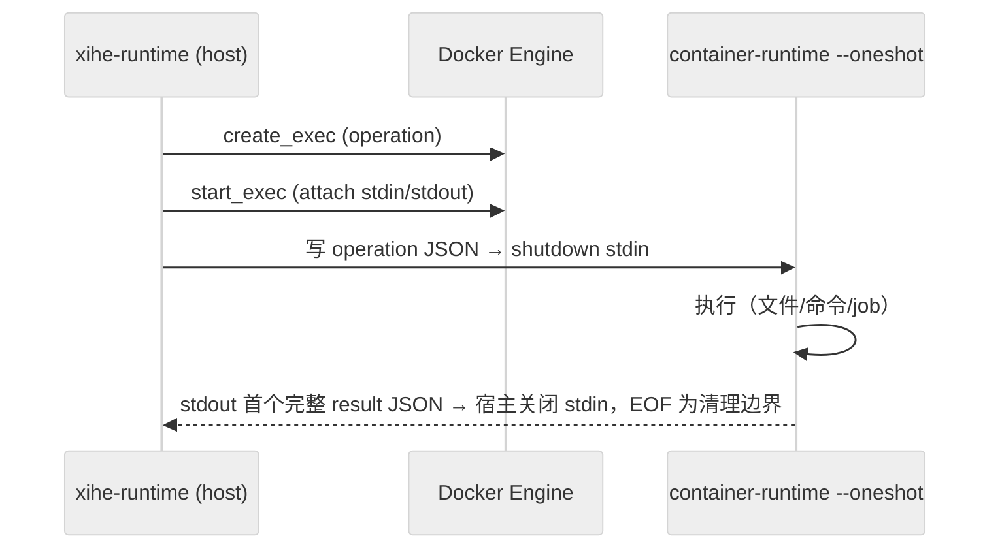

# DEV-015: Runtime 架构

> Rust 1.97.1（edition 2024）+ rmcp 3.1.4 + Axum + Tokio + bollard。Runtime 负责实际文件、命令、容器和 stdio MCP 会话执行；CP 负责元数据、授权与健康。端口：宿主 12633（Docker 内 8001）；`/health` = liveness，`/ready` = readiness（不等全部 Sandbox 物化）。

## 1. 两 binary

| Binary | 位置 | 职责 |
|--------|------|------|
| `xihe-runtime` | host Gateway 主进程 | 注册 `/workspace/{ws_id}/mcp` 等路由；Workspace 操作经 `WorkspaceExecutionRouter` 转 per-request Docker exec；stdio MCP 会话经 `mcp_session.rs`（exec attach 直连，PLAN-0347） |
| `xihe-container-runtime` | 容器内（镜像预装） | `--oneshot` 模式：stdin 单 operation JSON → stdout 单 result JSON；宿主读取首个完整 result JSON 后关闭 stdin，EOF 是清理边界；处理文件/命令工具与 `/tmp/xihe-jobs` 后台任务（HTTP daemon 已退役） |

> `xihe-mcp-bridge` 已随 PLAN-0347 退役（容器内 HTTP 服务 + 发布端口/容器 IP 全部删除）：stdio MCP 改为宿主 `exec attach` 长驻会话直连（状态机/预算/按 id 配对/kill 回收见 `mcp_session.rs` 与 `spec/session-lifecycle.md`）。remote MCP 不进容器，走 host 出网（身份校验，不建容器）。

## 2. 执行边界（PLAN-235）

- Strict / Coding / Isolated 三 profile 的 Workspace 文件、命令、PDF、后台操作**全部在 Sandbox 内执行**，Runtime host 进程不直接读写 WorkspaceStorage，无 container failure → host fallback。
- 传输模型：统一 per-request Docker exec；**无** HTTP container-runtime 通道、instance token、长驻 worker、NDJSON 多路复用（exec 本身即认证边界：只有 Runtime 能调 Docker Engine API）。



锚点：`executor.rs: create_exec→start_exec` + `container_runtime.rs: --oneshot`。
- 三 profile 隔离矩阵：

| | Strict | Coding | Isolated |
|---|---|---|---|
| network | `none` | bridge | bridge |
| 端口发布 | 无 | 无 | 无 |
| 执行面 | per-request exec | per-request exec | per-request exec |
| host 回退 | 无 | 无 | 无 |

镜像预置 `xihe-executor` / `xihe-job` 独立容器用户（切换与凭据隔离语义待实现确认，见 DEV-018）
- `execute_command` 为显式 Shell 语义：`args` 作 positional parameters 传入（禁拼接）；timeout/cancel 终止并等待 child/process group；stdout/stderr 与 retained artifact 有界，超限只留 bounded preview。
- MCP 工具集（rmcp `#[tool]`，`main.rs` 共 23 个）：read_file/read_file_range（二进制安全，base64+is_binary，16MiB 预览上限）/write_file/list_directory/glob/grep/execute_command/read_command_output/get_file_info/watch_directory/edit_file/delete_file/delete_directory/move_file/copy_file/mkdir/extract_pdf_text/web_fetch/start_background_process/list_background_processes/get_background_process/cancel_background_process/apply_patch（多文件原子 patch，需审批）。公开集由 `GatewayToolRegistryContractTest` 冻结（PLAN-290 M0.2 / PLAN-292 M2 / PLAN-0328 T3.2；PLAN-0357 退役 legacy snapshot 工具）。

## 3. 后台 Job 与 FS 安全

- `start_background_process` 返回 opaque `jobId`；状态存于容器 `/tmp/xihe-jobs/<jobId>/`（detached exec wrapper 写入），支持 status/list/get/cancel + TTL 清理；容器重建后旧 jobId 查无属设计行为（自然孤儿化）。
- FS 写路径经 rustix openat2 helper（create/open/rename/copy 四类），no-follow + revalidation + 原子写入，防 symlink/TOCTOU。
- 执行事件走结构化日志（`info` 级，全经 `RedactingWriter` 脱敏）；`command`/`args`/`stdout` 与 job 输出内容永不进明文日志（由 `scan-log-secrets` 门禁覆盖）。

## 4. Lazy 物化与生命周期（PLAN-222）

- Runtime 启动只完成自身 liveness/readiness；经受保护的 targeted ExecutionSpec API 按 `workspaceId` 懒加载 Workspace，首次文件/命令/MCP 操作时才物化目标 Sandbox。
- WorkspaceStorage（host 持久化）与 Sandbox（容器执行面）分离；unknown workspace fail-closed；Docker 不可用与执行超时显式失败。
- MCP 2026-07-28 无会话协议（SEP-2567）：Runtime 侧全程 stateless；CP 转发 `tools/list`/`tools/call` 必须带 `Mcp-Method` + `Mcp-Name` 头。
- 生命周期（PLAN-0345）：六态权威状态机（`creating/ready/paused/stopped/failed/destroying`）经 `lifecycle.rs` `Lifecycle` 单一写路径（lease 绑 in-flight 操作，无心跳/无持久化）；Registry=可重建缓存（`rebuild` 从 Docker 推导）。paused 走 unpause 激活（禁 force recreate，失败 fail-closed）；destroying 窗口内迟到 materialize → 409 `WORKSPACE_DESTROYING`（CP 原样透传，不 collapse 502）；destroy 完成即注销（无常驻 `destroyed` 态）。idle reaper 三档（15m pause / 2h stop / 24h 注销，原 7d `Released` 档删除）。REST read/list/stat 收口 executor router（binary write 仍 host 例外=债）。warm pool/microVM/多设备接管仍属后续。

## 5. 执行终止语义（PLAN-0317）

- **oneshot 中止协议**：宿主写入指令帧后**保持 stdin 打开**；超时/取消时写独立中止帧 `{"abort":true}`（EOF 兜底）。容器侧并发监听 stdin，命中后对执行进程组两阶段终止（SIGTERM → 1s → SIGKILL），并回 `CANCELLED`（超时同路径 `TIMEOUT`）帧；宿主有界等待（5s + EOF 兜底 2s）判定"确认终止"，未确认以 `RuntimeError::Cancelled{confirmed=false}` 上报。
- **进程组规则（实测要点，缺一即静默失效）**：容器内所有 `kill` 必须用 `/bin/kill`（dash 内建不支持 `--`，`kill -TERM -- -PGID` 会报 `Illegal number`）；前台命令用 `process_group(0)` 显式建组（pid 即 PGID）；后台作业必须 `setsid` 会话隔离（仅建组会随 docker exec 会话被清理）。
- **内部取消端点**：`POST /internal/v1/runtime/workspaces/{wsId}/executions/{itemId}/cancel`（key = `operationItemId`，Bearer + workspace 边界）；注册表 `InFlightExecutions` 记录在途执行与 exec 句柄，返回 `cancelled` / `unconfirmed` / `already_finished`，未命中 404。
- **未确认追偿**：取消未确认的条目保留在注册表，空闲回收循环用 `inspect_exec` 复核；确认结束则回调 CP 的 late-termination 端点（5 次重试后放弃告警）。
- **Job 运行时限**：`start_background_process` 的 `timeout`（payload `timeoutSecs`）默认 60 分钟、显式 0 不限；到点由宿主清理通道（`cleanup_jobs` op）终止进程组并落 `timeout` 终态。job 参数/描述统一 `jobId`，清理先判活（`/bin/kill -0`）、以**文件** mtime 判过期（禁用目录 mtime，防误清运行中 job）。
- 容器侧改动必须先 `mise run image:workspace:build` 才生效（否则测到的是旧二进制）。

## 6. workspace checkpoint 切片与回滚（PLAN-0338/0339/0358）

### 6.1 心智模型与边界

- Checkpoint 是**系统侧 Git 快照**，不是用户仓库的历史分支：**不是** Git 官方「shadow repo」功能；影子库与用户 `.git` **平行**，互不读写 refs/index/branch。
- 用户可感动作：**capture（存）→ preview（看）→ restore（回滚）→ cleanup（清）**。
- Runtime 在 `<hostRoot>/.xihe-shadow/<workspaceId>.git` 维护影子库；位于 workspace 外、不 bind 进 Sandbox。`hostRoot` 下做路径校验；未知 workspace、Git 不可用或版本不足 → 显式 `CHECKPOINT_UNAVAILABLE`，不回退到宿主任意目录。
- 嵌套仓库按不透明 gitlink（`opaqueNestedRepos[]`）；可选 `XIHE_CHECKPOINT_REJECT_NESTED_REPOS`（默认关，开启则 `NESTED_REPO_LIMIT` 降级）。**子仓内部文件不进入切片**（不可恢复嵌套内容）；可恢复方案见 backlog **BL-15**。
- `apply_patch` 为 Gateway-public 工具之一，走正常审批；捕获只在 Run 终止 / 异常补拍 / C0，不由派发前置触发；UI 回滚只经 CP public workspace route。

### 6.2 对象模型（Git 本体）

```text
refs/xihe/slices/<epochMs>-<commitHash>   ← 自定义 ref（非 refs/heads 分支）
  → root commit（无 parent）              ← 快照信封（时间/作者/message）
      → tree（完整相对目录树）
          → 子 tree + blob（文件内容，内容寻址、可压缩去重）
```

| 对象 | 存什么 | 不存什么 |
|---|---|---|
| commit | tree 哈希、时间、作者、message | 工作区绝对路径、文件 mtime |
| tree | mode + **basename** + 子对象哈希 | 完整绝对路径（沿层级拼出） |
| blob | 文件内容（压缩后） | 文件名、目录、mtime |
| index（`last-index`） | 路径、mode、blob id、stat/untracked 缓存 | 非还原权威，仅加速（PLAN-0358） |

路径：tree 按相对目录嵌套；`src/a.rs` = root → `src` → `a.rs`。绝对路径仅在恢复写盘时由 `core.worktree` 决定。

### 6.3 切片为何是独立 root commit

| parent 链（普通分支） | 切片模型 |
|---|---|
| 相对父提交的演进 | 某一时刻完整状态 |
| merge / rebase / blame | **不做归因** |
| 删中间点纠缠对象图 | 按 ref 删，GC 简单 |

- **链尾** = ref 名排序最新切片（**不是** Git parent）；**链尾树** = 该 commit 的 tree。
- capture：`write-tree` 得 `T`；`T == 链尾树` → `noChange` 不写 ref；否则 `commit-tree`（无 `-p`）+ `update-ref`。
- ref 机制是 Git 规范，命名空间 `xihe/slices` 由产品定义；`git branch` 不会列出这些 ref。

### 6.4 捕获（capture）

```text
短锁 → git 探测/init → 链尾 → stage_index
  （优先 copy last-index；否则 read-tree 链尾树
   → 动态超限扫描 → excludesFile → add -A）
→ write-tree → 保存 last-index
→ 与链尾树比较 → 无变化则 noChange；否则 commit-tree + update-ref
→ changed_files = diff(链尾树, T) → best-effort retention GC
```

- **树哈希每次完整计算**；**内容 hash 热路径可复用**（`last-index` stat），冷首片可能全量（性能见 DEV-015 与 PLAN-0358）。

### 6.5 恢复（preview / execute）

**Preview（只读）**：目标 commit → tree `T`；当前工作区同规则 stage → `C`；`diff T C`：

| status | 计划 |
|---|---|
| A（当前有、T 无） | Delete |
| M/D | Restore（自 T 的 blob 写回） |
| 类型冲突 | type_conflict（须显式 ack） |

**Execute**：短 restore 锁（不冻结旁路写）→ **先全部 Delete**（fs 删除+剪空目录）→ **再批量 Restore**（`git checkout <commit> -- paths`，0358 按批合并，失败回退单路径）→ **suspects 复核**（防并发写抢赢）。

**为何 `checkout -- path` 而非 `reset`/`rebase`**：按路径写回、不动 HEAD；切片无当前分支、无 parent 链，reset/rebase 语义错误。

### 6.6 排除边界（三层）

`add -A` 在 worktree 上叠加：

1. **工作区 `.gitignore`**（固定文件名；改名则 Git 默认不再扫描）；
2. **影子 `core.excludesFile`**：Xihe 静态表（凭据、`node_modules/`、`.xihe-*` 等）+ 每次动态超限；
3. **不读**用户全局 git 配置、用户仓库 `.git/info/exclude`。

动态规则：**新的未跟踪且超 10MiB** 不进变更集；**已索引**路径变大不受该上限（`checkpoint_budget_test` 冻结）。

- 进不了当前树 `C` 的路径 → diff 不出现 → **还原零触碰**；capture 与 restore **共用**该语义。
- 未跟踪：排除集内不碰；集内且 T 无 → 删；T 有 → 写回。
- 与用户 ignore 分离的产品方案见 backlog（BL-14），不在本节展开。
- **当前实现调用形态**：stage 决策与机制均在 **系统 `git` 子进程**（porcelain `add -A` + plumbing）；**无** libgit2/`git2`/gitoxide 等进程内库，**不 fork Git**。嵌套默认 opaque；文件级可恢复与 ignore 分离的未来方案（收回 stage 决策层、机制仍 CLI/可选库）见 workspace backlog **BL-14/BL-15** 及内部方案备忘，不在本节展开。

### 6.7 性能（PLAN-0358）

| 项 | 要点 |
|---|---|
| 冷首片 | 大仓需全量 hash → 对照带可 supersede（见 0358 决策） |
| 热路径 | `last-index` + `untrackedCache` 避免全量重哈希 |
| restore | 批量 checkout（原每文件一 git 进程） |
| 门禁基线 | 可复跑 harness：`packages/runtime/tests/checkpoint_perf_m0_test.rs` |

### 6.8 契约与证据

- Runtime internal：`POST /internal/v1/runtime/workspaces/{id}/checkpoints/capture|gc|cleanup|revert/preview|revert`、`GET .../blob`、`GET .../git-status`。CP 为调用方；public API 仅 workspace 级切片列表、按 `sliceRef` 恢复/读文件/清理。
- 端点字段：[OpenAPI](../../api/openapi.yaml) / [API inventory](../../api/inventory.md)。
- 实现与验证：`packages/runtime/src/checkpoint*.rs`；证据 `plans/PLAN-0338-XH-checkpoint-core-closure/evidence/`、`plans/PLAN-0358-XH-checkpoint-performance/evidence/`。
