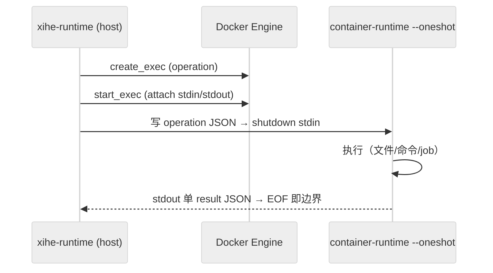

# DEV-015: Runtime 架构

> Rust 1.88（edition 2024）+ rmcp 3.1.4 + Axum + Tokio + bollard。Runtime 负责实际文件、命令、容器和 MCP bridge 执行；CP 负责元数据、授权与健康。端口：宿主 12633（Docker 内 8001）；`/health` = liveness，`/ready` = readiness（不等全部 Sandbox 物化）。

## 1. 三 binary

| Binary | 位置 | 职责 |
|--------|------|------|
| `xihe-runtime` | host Gateway 主进程 | 注册 `/workspace/{ws_id}/mcp` 等路由；Workspace 操作经 `WorkspaceExecutionRouter` 转 per-request Docker exec |
| `xihe-container-runtime` | 容器内（镜像预装） | `--oneshot` 模式：stdin 单 operation JSON → stdout 单 result JSON，EOF 即边界；处理文件/命令工具与 `/tmp/xihe-jobs` 后台任务 |
| `xihe-mcp-bridge` | 容器内（镜像预装） | STDIO bridge：用户 STDIO MCP server ↔ HTTP（`POST /{server_id}`，30s 超时 / 1MB 缓冲；`/_spawn`、`/_kill/{id}`、`/_health` 管理端点） |

> 两者平行无调用：bridge 不调 container-runtime，container-runtime 无 HTTP server，唯一交集是同住一个容器（端到端工具路径见 DEV-016）。remote MCP 不进容器，走 host 出网（身份校验，不建容器）。

## 2. 执行边界（PLAN-235）

- Strict / Coding / Isolated 三 profile 的 Workspace 文件、命令、PDF、后台操作**全部在 Sandbox 内执行**，Runtime host 进程不直接读写 WorkspaceStorage，无 container failure → host fallback。
- 传输模型：统一 per-request Docker exec；**无** HTTP container-runtime 通道、instance token、长驻 worker、NDJSON 多路复用（exec 本身即认证边界：只有 Runtime 能调 Docker Engine API）。

锚点：`executor.rs: create_exec→start_exec` + `container_runtime.rs: --oneshot`。
- 三 profile 隔离矩阵：

| | Strict | Coding | Isolated |
|---|---|---|---|
| network | `none` | bridge | bridge |
| 端口发布 | 无 | 无 | 无 |
| 执行面 | per-request exec | per-request exec | per-request exec |
| host 回退 | 无 | 无 | 无 |

镜像预置 `xihe-executor` / `xihe-job` 独立容器用户（切换与凭据隔离语义待实现确认，见 DEV-018）
- `execute_command` 为显式 Shell 语义：`args` 作 positional parameters 传入（禁拼接）；timeout/cancel 终止并等待 child/process group；stdout/stderr 与 retained artifact 有界，超限只留 bounded preview。
- MCP 工具集（rmcp `#[tool]`，`main.rs` 共 22 个）：read_file/read_file_range（二进制安全，base64+is_binary，16MiB 预览上限）/write_file/list_directory/glob/grep/execute_command/read_command_output/get_file_info/watch_directory/edit_file/delete_file/delete_directory/move_file/copy_file/mkdir/extract_pdf_text/web_fetch/start_background_process/list_background_processes/get_background_process/cancel_background_process。公开集由 `GatewayToolRegistryContractTest` 冻结（PLAN-290 M0.2 / PLAN-292 M2）；`apply_patch/create_snapshot/revert_snapshot` 为 internal-only 不在此列。

## 3. 后台 Job 与 FS 安全

- `start_background_process` 返回 opaque `jobId`；状态存于容器 `/tmp/xihe-jobs/<jobId>/`（detached exec wrapper 写入），支持 status/list/get/cancel + TTL 清理；容器重建后旧 jobId 查无属设计行为（自然孤儿化）。
- FS 写路径经 rustix openat2 helper（create/open/rename/copy 四类），no-follow + revalidation + 原子写入，防 symlink/TOCTOU。
- 执行事件走结构化日志（`info` 级，全经 `RedactingWriter` 脱敏）；`command`/`args`/`stdout` 与 job 输出内容永不进明文日志（由 `scan-log-secrets` 门禁覆盖）。

## 4. Lazy 物化与生命周期（PLAN-222）

- Runtime 启动只完成自身 liveness/readiness；经受保护的 targeted ExecutionSpec API 按 `workspaceId` 懒加载 Workspace，首次文件/命令/MCP 操作时才物化目标 Sandbox。
- WorkspaceStorage（host 持久化）与 Sandbox（容器执行面）分离；unknown workspace fail-closed；Docker 不可用与执行超时显式失败。
- MCP 2026-07-28 无会话协议（SEP-2567）：Runtime 侧全程 stateless；CP 转发 `tools/list`/`tools/call` 必须带 `Mcp-Method` + `Mcp-Name` 头。
- 技术债：`WorkspaceRegistry` 与 `WorkspaceManager` 双路径收敛进行中（handler 已收敛为单一状态持有，注释为准）；warm pool/microVM/多设备接管仍属后续。
