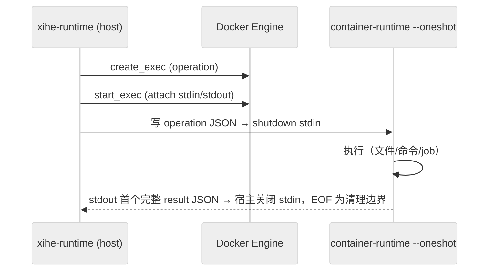

# DEV-015: Runtime 架构

> Rust 1.97.1（edition 2024）+ rmcp 3.1.4 + Axum + Tokio + bollard。Runtime 负责实际文件、命令、容器和 MCP bridge 执行；CP 负责元数据、授权与健康。端口：宿主 12633（Docker 内 8001）；`/health` = liveness，`/ready` = readiness（不等全部 Sandbox 物化）。

## 1. 三 binary

| Binary | 位置 | 职责 |
|--------|------|------|
| `xihe-runtime` | host Gateway 主进程 | 注册 `/workspace/{ws_id}/mcp` 等路由；Workspace 操作经 `WorkspaceExecutionRouter` 转 per-request Docker exec |
| `xihe-container-runtime` | 容器内（镜像预装） | `--oneshot` 模式：stdin 单 operation JSON → stdout 单 result JSON；宿主读取首个完整 result JSON 后关闭 stdin，EOF 是清理边界；处理文件/命令工具与 `/tmp/xihe-jobs` 后台任务 |
| `xihe-mcp-bridge` | 容器内（镜像预装） | STDIO bridge：用户 STDIO MCP server ↔ HTTP（`POST /{server_id}`，30s 超时 / 1MB 缓冲；`/_spawn`、`/_kill/{id}`、`/_health` 管理端点） |

> 两者平行无调用：bridge 不调 container-runtime，container-runtime 无 HTTP server，唯一交集是同住一个容器（端到端工具路径见 DEV-016）。remote MCP 不进容器，走 host 出网（身份校验，不建容器）。

## 2. 执行边界（PLAN-235）

- Strict / Coding / Isolated 三 profile 的 Workspace 文件、命令、PDF、后台操作**全部在 Sandbox 内执行**，Runtime host 进程不直接读写 WorkspaceStorage，无 container failure → host fallback。
- 传输模型：统一 per-request Docker exec；**无** HTTP container-runtime 通道、instance token、长驻 worker、NDJSON 多路复用（exec 本身即认证边界：只有 Runtime 能调 Docker Engine API）。

锚点：`executor.rs: create_exec→start_exec` + `container_runtime.rs: --oneshot`。
- 三 profile 隔离矩阵：

| | Strict | Coding | Isolated |
|---|---|---|---|
| network | `none` | bridge | bridge |
| 端口发布 | 无 | 无 | 无 |
| 执行面 | per-request exec | per-request exec | per-request exec |
| host 回退 | 无 | 无 | 无 |

镜像预置 `xihe-executor` / `xihe-job` 独立容器用户（切换与凭据隔离语义待实现确认，见 DEV-018）
- `execute_command` 为显式 Shell 语义：`args` 作 positional parameters 传入（禁拼接）；timeout/cancel 终止并等待 child/process group；stdout/stderr 与 retained artifact 有界，超限只留 bounded preview。
- MCP 工具集（rmcp `#[tool]`，`main.rs` 共 23 个）：read_file/read_file_range（二进制安全，base64+is_binary，16MiB 预览上限）/write_file/list_directory/glob/grep/execute_command/read_command_output/get_file_info/watch_directory/edit_file/delete_file/delete_directory/move_file/copy_file/mkdir/extract_pdf_text/web_fetch/start_background_process/list_background_processes/get_background_process/cancel_background_process/apply_patch（多文件原子 patch，需审批）。公开集由 `GatewayToolRegistryContractTest` 冻结（PLAN-290 M0.2 / PLAN-292 M2 / PLAN-0328 T3.2）；`create_snapshot/revert_snapshot` 仍为 internal-only，不在此列。

## 3. 后台 Job 与 FS 安全

- `start_background_process` 返回 opaque `jobId`；状态存于容器 `/tmp/xihe-jobs/<jobId>/`（detached exec wrapper 写入），支持 status/list/get/cancel + TTL 清理；容器重建后旧 jobId 查无属设计行为（自然孤儿化）。
- FS 写路径经 rustix openat2 helper（create/open/rename/copy 四类），no-follow + revalidation + 原子写入，防 symlink/TOCTOU。
- 执行事件走结构化日志（`info` 级，全经 `RedactingWriter` 脱敏）；`command`/`args`/`stdout` 与 job 输出内容永不进明文日志（由 `scan-log-secrets` 门禁覆盖）。

## 4. Lazy 物化与生命周期（PLAN-222）

- Runtime 启动只完成自身 liveness/readiness；经受保护的 targeted ExecutionSpec API 按 `workspaceId` 懒加载 Workspace，首次文件/命令/MCP 操作时才物化目标 Sandbox。
- WorkspaceStorage（host 持久化）与 Sandbox（容器执行面）分离；unknown workspace fail-closed；Docker 不可用与执行超时显式失败。
- MCP 2026-07-28 无会话协议（SEP-2567）：Runtime 侧全程 stateless；CP 转发 `tools/list`/`tools/call` 必须带 `Mcp-Method` + `Mcp-Name` 头。
- 技术债：`WorkspaceRegistry` 与 `WorkspaceManager` 双路径收敛进行中（handler 已收敛为单一状态持有，注释为准）；warm pool/microVM/多设备接管仍属后续。

## 5. 执行终止语义（PLAN-0317）

- **oneshot 中止协议**：宿主写入指令帧后**保持 stdin 打开**；超时/取消时写独立中止帧 `{"abort":true}`（EOF 兜底）。容器侧并发监听 stdin，命中后对执行进程组两阶段终止（SIGTERM → 1s → SIGKILL），并回 `CANCELLED`（超时同路径 `TIMEOUT`）帧；宿主有界等待（5s + EOF 兜底 2s）判定"确认终止"，未确认以 `RuntimeError::Cancelled{confirmed=false}` 上报。
- **进程组规则（实测要点，缺一即静默失效）**：容器内所有 `kill` 必须用 `/bin/kill`（dash 内建不支持 `--`，`kill -TERM -- -PGID` 会报 `Illegal number`）；前台命令用 `process_group(0)` 显式建组（pid 即 PGID）；后台作业必须 `setsid` 会话隔离（仅建组会随 docker exec 会话被清理）。
- **内部取消端点**：`POST /internal/v1/runtime/workspaces/{wsId}/executions/{itemId}/cancel`（key = `operationItemId`，Bearer + workspace 边界）；注册表 `InFlightExecutions` 记录在途执行与 exec 句柄，返回 `cancelled` / `unconfirmed` / `already_finished`，未命中 404。
- **未确认追偿**：取消未确认的条目保留在注册表，空闲回收循环用 `inspect_exec` 复核；确认结束则回调 CP 的 late-termination 端点（5 次重试后放弃告警）。
- **Job 运行时限**：`start_background_process` 的 `timeout`（payload `timeoutSecs`）默认 60 分钟、显式 0 不限；到点由宿主清理通道（`cleanup_jobs` op）终止进程组并落 `timeout` 终态。job 参数/描述统一 `jobId`，清理先判活（`/bin/kill -0`）、以**文件** mtime 判过期（禁用目录 mtime，防误清运行中 job）。
- 容器侧改动必须先 `mise run image:workspace:build` 才生效（否则测到的是旧二进制）。

## 6. 当前事实：Run checkpoint 与回滚（切片模型，PLAN-0338）

- Runtime 在 `<hostRoot>/.xihe-shadow/<workspaceId>.git` 维护独立影子 Git；它位于 workspace 外、不 bind 进 Sandbox，不写用户 `.git`、index、branch。每个 Run 的写入经**单次捕获**成为切片（`refs/xihe/slices/<capturedAt>-<commitHash>`，一个切片一 ref，无序号），只记录工作区变更集。
- `hostRoot` 是 workspace 物理根；Runtime 先按 workspace 派生目录并执行路径/归属校验，影子库与工作区均限于该根下，未知 workspace、Git 不可用或版本不足均显式返回不可回滚，不回退到宿主任意目录。
- Runtime 内部契约为 `POST .../checkpoints/capture`、`POST .../checkpoints/gc`、`POST .../checkpoints/cleanup`、revert preview/execute（入参=切片 ref）、blob、`GET .../git-status`；CP 是调用方，公共 `/api/v1/chat/runs/{runId}/checkpoint...` 与 workspace 路由由 CP 投影/代理。
- 捕获锁与恢复锁为短锁（fail-fast，不排队），**无 run 长租约**；恢复期间**不锁写**，与目标切片不符的路径在结果中标注 `suspects`。保留策略按**切片数**（最新 50 个切片 + TTL 30 天）；清理为方案 B（删除整个影子库，幂等，忙时 409 `CHECKPOINT_BUSY`）。
- `apply_patch` 是 Gateway-public 的 23 工具之一，走正常 Agent/CP 审批；捕获不再由派发触发，只发生在 Run 终止（无变化不落片）。`create_snapshot`、`revert_snapshot` 是 Runtime/container internal-only，不进入 `tools/list`，Agent 不可发现或调用。UI 回滚只走 CP public revert 路由。
- 嵌套仓库按不透明 gitlink 声明（`opaqueNestedRepos[]`）；可选硬限制开关 `XIHE_CHECKPOINT_REJECT_NESTED_REPOS`（默认关闭，开启时捕获以 `NESTED_REPO_LIMIT` 显式降级）。
- 端点和字段以 [OpenAPI](../../api/openapi.yaml) / [API inventory](../../api/inventory.md) 为准；实现与真实验证证据见 `plans/PLAN-0338-XH-checkpoint-core-closure/evidence/`（`t1.0-*`、`t1.2-*`、`host-matrix/`）。
