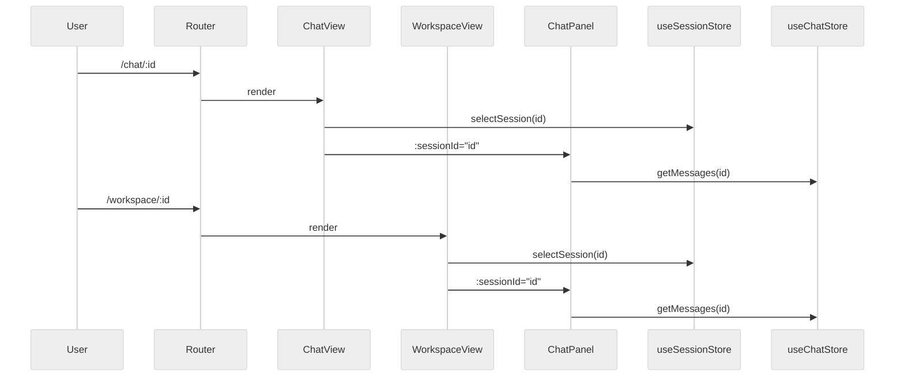

# DEV-015: Session 视图层设计

> 本文档描述 PLAN-029-XH-unified-session-architecture 的视图层实现：路由、`ChatPanel` 嵌入、chat ↔ workspace 切换。它面向前端开发者，假设读者已阅读 RFC-001 与 ADR-001。
>
> **PLAN-222 v1 修正（2026-09-02）**：Chat 使用 `sessionId`，Workspace 使用 `workspaceId`；Session/Message 以服务端 API 为 canonical source，旧 localStorage Session/Message 设计不再适用。

## 1. 路由设计

### 1.1. 路由表

```typescript
// packages/ui/src/router/index.ts
{
  path: '/chat',
  component: AppLayout,
  children: [
    { path: '', redirect: '/chat/default' },
    { path: 'new', redirect: '/chat/default' },
    { path: ':sessionId', name: 'chat', component: ChatView },
  ],
},
{
  path: '/workspace/:workspaceId?',
  name: 'workspace',
  component: AppLayout,
  children: [
    { path: '', name: 'workspace-session', component: WorkspaceView },
  ],
},
```

### 1.2. 设计决策

- 保持 `/chat/:sessionId` 与 `/workspace/:workspaceId` 并存，不统一为 `/session/:id`。
- `/workspace/:workspaceId?` 使用可选参数，兼容旧入口 `/workspace`。
- 两个路由共用 `AppLayout`，侧边栏与全局状态保持一致。

### 1.3. 默认首页

`/` 仍然重定向到 `/chat`，chat 仍是用户最常入口。workspace 适合从 chat 切换进入。

## 2. 组件分层

### 2.1. ChatPanel.vue（可嵌入的对话面板）

`packages/ui/src/components/chat/ChatPanel.vue`

- 职责：提供消息列表 + 输入框 + SSE 流式消息。
- 接收 `sessionId` prop，内部读取 `useChatStore` / `useAgentStore` / `useSessionStore`。
- 不包含全屏布局头、不包含导航按钮。
- 上传附件时同时调用 `sessionStore.addAttachment(...)`，把附件提升到 Session 层。

### 2.2. ChatView.vue（全屏对话视图）

`packages/ui/src/components/chat/ChatView.vue`

- 职责：全屏 chat 页面。
- 包含顶部标题栏（Session 标题、Agent 状态）。
- 内部嵌入 `ChatPanel :session-id="currentSessionId"`。
- 负责从路由参数或 `currentSessionId` 解析当前 Session，无 Session 时自动创建。

### 2.3. WorkspaceView.vue（文件编辑 + 内嵌对话）

`packages/ui/src/components/workspace/WorkspaceView.vue`

- 职责：workspace 主页面。
- 左侧：文件树；中间：代码编辑器；右侧：嵌入 `ChatPanel`。
- 从 Workspace route 的 `workspaceId` 读取当前 Workspace；Session 由服务端 Session API 创建/选择，不把 Session ID 当作 Workspace ID。
- 当 `activeFilePath` 变化时，调用 `workspaceStore.syncActiveFileToSession()` 把文件上下文回写 Session 层。

### 2.4. WorkspaceToolbar.vue（workspace 工具栏）

`packages/ui/src/components/workspace/WorkspaceToolbar.vue`

- 新增 Session 下拉选择器：切换当前 Session 并保留当前 Workspace route `/workspace/:workspaceId`。
- 新增「切换回 chat」按钮：跳转到 `/chat/:currentSessionId`。
- 保留刷新、上传按钮。

### 2.5. Sidebar.vue（侧边栏）

`packages/ui/src/components/sidebar/Sidebar.vue`

- 「New Chat」按钮：创建新 Session 并跳转 `/chat/:sessionId`。
- Session 列表：点击后跳转 `/chat/:sessionId`。
- 「Workspace」按钮：跳转 `/workspace/:currentWorkspaceId`；Workspace 缺失时保持 fail-closed。

## 3. Chat SSE 生命周期（PLAN-230）

会话级持久 SSE 取代了此前的每轮一次性连接，关键规则：

- **连接归属**：`GET /api/v1/events?sessionId=` 为单会话单活连接（CP `SseEmitterManager` 以 `{sessionId, generation, emitter}` 存储、`compareAndRemove` 保护；新连接替换旧连接时 log `chat_sse_replaced`，旧 `onCompletion` 被忽略时 log `chat_sse_stale_cleanup_ignored`）。
- **复用语义**：`done` 仅结束当前 `runId`，会话 SSE 保持打开；下一条 `POST /api/v1/chat` 复用同一连接，无需刷新。`heartbeat` 15s 保活，仅作传输层事件，不进入 `MessagePart`、不重置 run 计数、不参与持久化。
- **准入与并发**：`POST /api/v1/chat` 在持久化前先 `hasEmitter`（缺失 → `409 SSE_SUBSCRIPTION_REQUIRED`），并以 `activeRuns.putIfAbsent` 获取单并发租约（冲突 → `409 CHAT_IN_PROGRESS`）；成功后生成 `runId`，经 `X-Request-Id`/`X-Chat-Run-Id` 显式透传至 Agent，异步线程不依赖 `MDC` 继承。
- **UI 传输层**：`chatTransport` 按 `sessionId` 单飞（`connectionGeneration` + `intentionalStops`），`fetch-event-source` 重试归一（`onerror` 返回显式退避 250ms→5s，`onclose` 最多一次重连），`useSSE.ensureConnected()` 在 `SSE_SUBSCRIPTION_REQUIRED` 时最多一次受控恢复；`SSEStream` 每 `token` 调用 `replaceStreamingParts` 整量替换当前流式 parts，修复旧 `lastSentCount` 仅在 `parts.length` 增长时追加导致的长文本卡首字符。
- **流式与去重**：Agent `XiheLiteLLM._astream()` 显式 `streaming=True` 使 `astream_events` 产生 `on_chat_model_stream`；`LangGraphEventAdapter` 按 `run_id` 记录 `streamed` 状态，`on_chat_model_end` 仅在无 stream chunk 时 fallback 单 `token`，避免真实流式后重复追加。
- **生命周期边界**：组件挂载 / `sessionId` 切换 → 至多一个 `connect` attempt；卸载 / 切换 / session 删除 → `abort` 并仅清理对应 emitter；`401` → 清登录态跳转；网络抖动 → 退避重连（上限 5s，成功后归零）。本阶段不实现 `Last-Event-ID` 全量回放，断线中 run 完成后需重新加载 canonical `/messages`。

## 4. ChatPanel 嵌入细节

### 4.1. 为什么抽取 ChatPanel

- `ChatView.vue` 包含全屏标题栏和布局逻辑，不适合直接嵌入 workspace。
- `ChatPanel.vue` 只保留消息列表、输入框、SSEStream，占用空间小，可嵌入右侧面板。
- 避免代码重复：ChatView 和 WorkspaceView 共用同一套消息流逻辑。

### 3.2. 嵌入布局

```vue
<!-- WorkspaceView.vue -->
<div class="flex h-full">
  <div class="w-60 shrink-0 border-r"><FileTreePanel /></div>
  <div class="flex-1 flex flex-col"><WorkspaceToolbar /><FileEditor /></div>
  <div class="w-96 border-l flex flex-col shrink-0">
    <ChatPanel :session-id="sessionId" />
  </div>
</div>
```

当前右侧面板宽度固定为 `w-96`（384px）。后续可扩展为可拖拽调整宽度。

## 5. Chat ↔ Workspace 切换

### 5.1. 同一 Session 切换

所有切换入口都基于 `sessionStore.currentSessionId`：

- 从 chat 切换到 workspace：点击 Sidebar 的 Workspace 按钮或 WorkspaceToolbar 的返回按钮。
- 从 workspace 切换回 chat：点击 WorkspaceToolbar 的「当前 Session 标题」按钮。

### 5.2. 状态同步保证

- Session 元数据：`currentSessionId`、`title`、`context` 由 `useSessionStore` 统一维护。
- 消息历史：`ChatPanel` 始终通过 `chatStore.getMessages(sessionId)` 读取，跨视图一致。
- 附件：`sessionStore.currentSessionAttachments` 在两个视图中共享。
- 文件上下文：`workspaceStore.syncActiveFileToSession()` 把 workspace 状态写回 Session 层，chat 中可读取。

## 6. 视图层数据流



## 7. 开发约定

- 新增视图组件时，优先从 `useSessionStore` 读取 Session 元数据，不要直接操作 `useChatStore` 的 Session 相关状态。
- `ChatPanel` 是唯一的内嵌对话组件，不要直接在其他地方嵌入 `ChatView`。
- 附件写入入口统一在 `ChatPanel.handleSend`；workspace 对附件只读。
- 文件上下文写入入口统一在 `useWorkspaceStore.syncActiveFileToSession`。

## 8. 后续可扩展点

| 扩展 | 说明 | 承接 |
|------|------|------|
| 右侧面板可拖拽宽度 | 提升 workspace 布局灵活性 | 后续 UI 改进 |
| 统一路由 `/session/:id` | 长期评估，当前保持双路由 | 未来 PLAN |
| workspace 文件拖拽到 chat | 需要附件后端支持 | PLAN-031 |
| 多 Session 并列 | 同时打开多个 workspace/chat | 未来设计 |

## 9. 参考

- RFC-001-session-domain-model.md
- ADR-001-session-store-boundary.md
- PLAN-029-XH-unified-session-architecture
