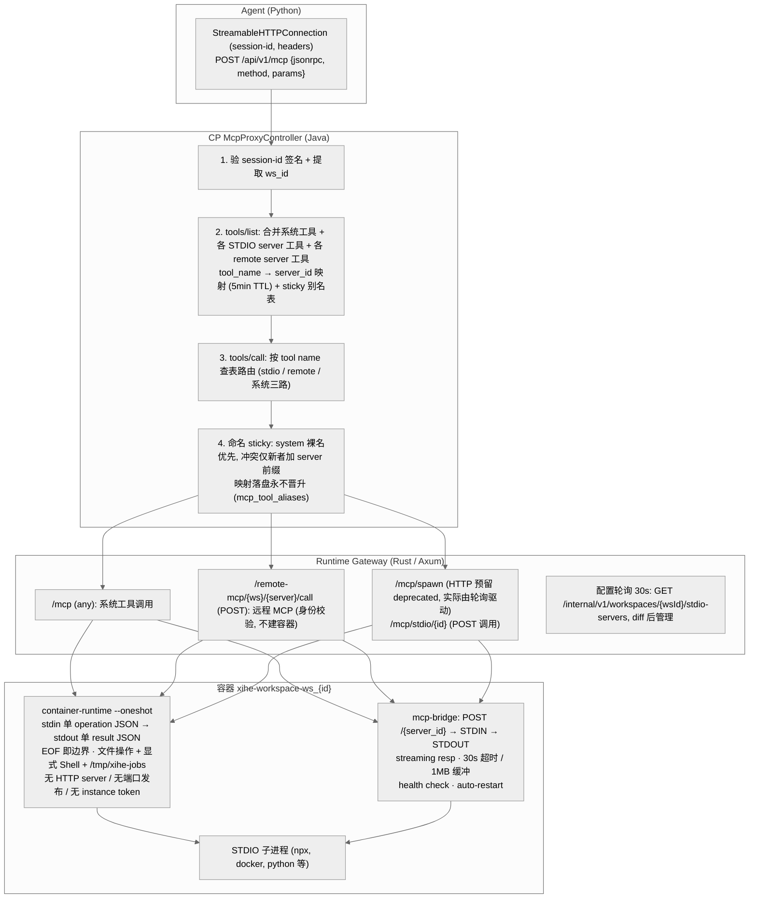
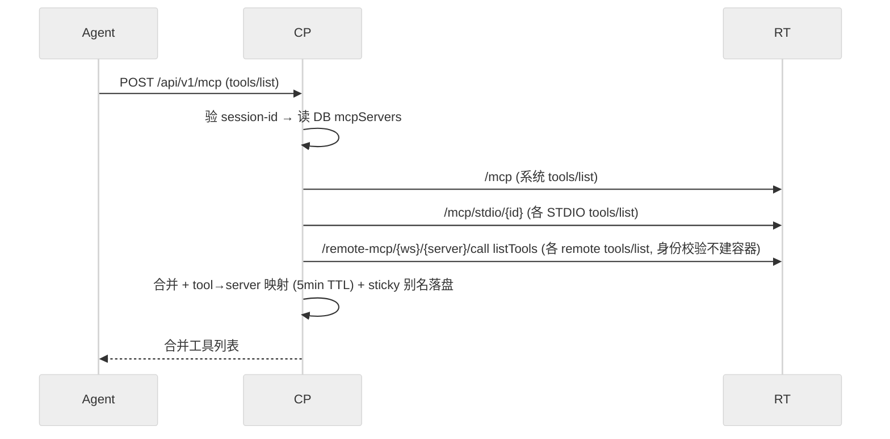
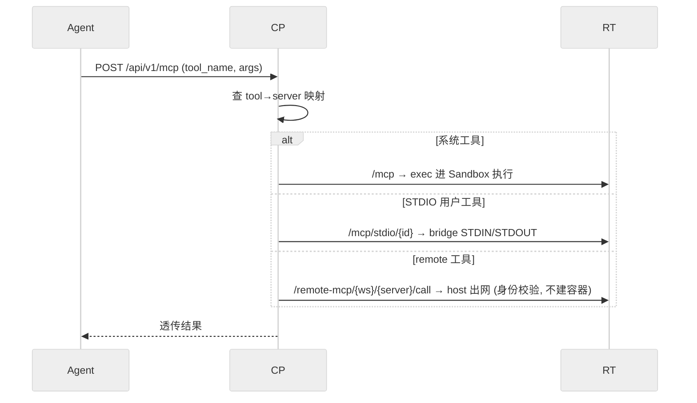

# DEV-016: MCP 三层路由架构

## 1. 概述

MCP（Model Context Protocol）请求从 Agent 发出的到工具执行的完整路径经过三层路由：

1. **CP McpProxyController** — 认证 + tool-name-based 路由
2. **Runtime Gateway** — per-workspace 分发
3. **容器内 bridge** — STDIO 子进程管理

> **协议版本说明**：当前采用 MCP `Protocol-Version: 2026-07-28`（rmcp 3.1.4，SEP-2567），Runtime 侧按该协议全程**无会话（stateless）**。因此 CP 转发 `tools/list` / `tools/call` 到 Runtime 时必须携带 `Mcp-Method` 与 `Mcp-Name` HTTP 头（见提交 `a9923e3`）；缺失会导致系统工具列表为空、`UNKNOWN_TOOL`。会话态仍存在的是 CP↔Agent 之间的 `mcp-session-id` HMAC 签名（见 §2 与根 `AGENTS.md` Known Issues），二者不冲突。

## 2. 架构图



锚点：`McpProxyController.java`、`main.rs: 路由注册`、`mcp_bridge.rs`、`mcp_process.rs: CONFIG_POLL_INTERVAL`。无 HTTP container-runtime 通道、无 instance token（exec 本身即认证边界，PLAN-235）。

## 3. 数据传输流

### 3.1. 工具发现（tools/list）



### 3.2. 工具调用（tools/call）



## 4. 关键技术决策

| 决策 | 选择 | 理由 |
|------|------|------|
| MCP transport | Streamable HTTP | MCP 社区已废弃 SSE |
| STDIO 桥接方式 | Rust bridge binary | shell 无法处理 JSON-RPC streaming |
| Bridge 部署 | 多阶段构建进 workspace 镜像（builder 编译双 binary + COPY） | 无 bind mount |
| 路由策略 | tool-name based（三路：系统 / stdio / remote，`McpServer` 表命中即 remote） | Agent 无需感知 server_id |
| 工具冲突 | sticky：system 裸名优先，冲突仅新者加 `serverId__` 前缀，映射落盘永不晋升 | 无冲突零改名；历史按 `(serverId, backendName, generation)` 回放 |
| serverId 来源 | 双源：STDIO 为用户配置键透传，remote 为 `mcp_remote_servers` 表行 | 无 id 生成器；表命中优先于 JSON key |
| remote 执行 | 身份校验（Spec 存在性 + 授权），不建容器；unknown 显式失败 | 防越权/计费逃逸；SSRF 靠 allowlist + DNS |
| remote 认证 | `authMode: oauth/no-auth`；no-auth 跳过 broker（多余 Bearer 经实测被忽略） | 公开 server 免 OAuth |
| spawn 状态 | HTTP 三端点 deprecated 预留，实际由 30s 轮询自同步驱动 | 删逻辑前需确认 admin/排障依赖 |
| 配置格式 | Claude Desktop JSON textarea（混合入口 `mcp-config` 按字段拆分：stdio / remote） | 业界标准，用户直接复制粘贴 |
| 配置存储 | `mcp_stdio_servers`（workspace_id + name + config JSONB，决策 #27） | 类型校验 + 索引支持；与 config 三层解耦 |
| workspace 隔离 | task-local（非 env var） | 支持多 workspace 单进程 |
| 向后兼容 | 无 | 所有组件同步升级 |
| LLM 可见性 | workspace_id 透明 | 基础设施关注点不泄漏到 LLM 层 |

## 5. bridge binary 设计要点

`xihe-mcp-bridge` 是容器内的轻量 HTTP 服务器，负责将 STDIO 子进程暴露为 HTTP 端点。

- 每个子进程由一个 `Mutex` 保护，串行化 STDIO 访问
- 响应为 streaming（`tokio::sync::mpsc` + `Body::from_stream`），逐行 flush
- 30s 读取超时（超时后丢弃 reader，pipe 关闭后子进程收到 SIGPIPE）
- 1MB 缓冲区上限
- 管理端点：`/_spawn`、`/_kill/{id}`、`/_health`
- 用户端点：`POST /{server_id}`

## 6. 配置同步

```
用户 → UI workspace 层 MCP 编辑器 → PUT /api/v1/workspaces/{wsId}/mcp-config（混合入口）
  → CP: 校验 JSON → 按字段拆分：stdio 写入 mcp_stdio_servers；remote 走 mcp_remote_servers
  → Runtime 每 30s: GET /internal/v1/workspaces/{wsId}/stdio-servers（generation/hash/servers，Bearer service token）
  → Runtime: diff 当前 bridge 列表 → spawn/stop
```

stdio 配置的公开/内部契约（`generation` 乐观锁 + `hash`）见 `docs/api/openapi.yaml` 与 `docs/api/inventory.md`；remote server 走 `mcp_remote_servers` 表（类名 `McpServer.java` 保留，决策 #38②）：`workspaceId/name/endpoint/authConfig/enabled/authMode`，CP 按表判定分流，Runtime 经 CP broker 取短期 token（no-auth 跳过）。混合入口读侧只回传非敏感字段（remote 仅 `url`/`type`，OAuth 元数据不回传）。

## 7. 测试策略

| 层级 | 内容 | 命令 |
|------|------|------|
| Unit | bridge spawn/conflict/kill | `cargo test --bin xihe-mcp-bridge` |
| Unit | Gateway 路由转发 | `cargo test --lib`（计数以实测为准） |
| Unit | CP McpProxyController | `mvn test -Dtest=McpProxyTest` |
| Unit | MCP 配置（ConfigSettings） | `pnpm vitest run` |
| Integration | 真实 bridge 进程 | `cargo test --test bridge_integration_test` |
| E2E | Settings 页截图 | `npx playwright test e2e/real/settings-visual.spec.ts` |

### 7.1. Agent 手动验证 runbook（PLAN-242 补充）

面向 Agent 操作者，验证 remote 工具端到端可达（以 no-auth 公开 server 为例）：

1. 注册：`mcp_remote_servers` 插一行（`workspaceId`、`name=deepwiki`、`endpoint=https://mcp.deepwiki.com/mcp`、`authMode=no-auth`、`enabled=true`）。
2. 发现：`POST /api/v1/mcp` 发 `tools/list`，确认返回含远端工具名（无冲突为裸名）。
3. 调用：`tools/call` 带上一步的工具名，确认结果透传。
4. 审计：查审计日志，`detail` 含 `serverId/deepwiki backendName/<原名> generation=<代数>` 四元组。
5. 无容器断言：`docker ps` 无新增 workspace 容器（remote 不建容器）。
6. 烟雾（非门禁）：直调 endpoint 发 `initialize`（有/无 Bearer 均应 200，见 M1.3）。

## 8. 相关文件

| 文件 | 说明 |
|------|------|
| `packages/agent/.../mcp_client.py` | Agent MCP client（StreamableHttpConnection） |
| `packages/runtime/src/mcp_bridge.rs` | 容器内 xihe-mcp-bridge binary |
| `packages/runtime/src/container_runtime.rs` | 容器内 xihe-container-runtime binary（文件操作 + 命令执行） |
| `docker/images/workspace/Dockerfile` | xihe/workspace 容器镜像多阶段构建 |
| `packages/runtime/src/mcp_process.rs` | Gateway 侧 STDIO 管理 |
| `packages/runtime/src/workspace.rs` | 容器 + bridge 生命周期 |
| `packages/runtime/src/main.rs` | 路由注册 + 配置轮询 |
| `packages/control-plane/.../McpProxyController.java` | CP 层路由代理（三路分流 + sticky 合并） |
| `packages/control-plane/.../entity/McpServer.java`（表 `mcp_remote_servers`，`authMode`） | remote server 行（含 no-auth 标记；类名保留，决策 #38②） |
| `packages/control-plane/.../entity/McpStdioServer.java`（表 `mcp_stdio_servers`） | stdio server 行（workspace 作用域，决策 #27） |
| `packages/control-plane/.../entity/McpToolAlias.java` | sticky 别名落盘（`workspace_id + issued_name` 主键） |
| `packages/control-plane/.../ConfigController.java` | MCP 配置 API（stdio-servers 公开/内部端点 + 混合 mcp-config 拆分） |
| `packages/ui/src/views/settings/ConfigSettings.vue`（workspace 层 MCP 编辑器 + saveMcpConfig） | MCP 配置 UI（PLAN-0307 T2.17 起归工作区设置条目） |

## 9. 附录：会话签名规则（旧签名规则短文全文并入，M2 正文化）

# MCP Session-id Signing Rule

## 问题

MCP 通信中 session-id 用于标识 workspace 身份。未签名的 session-id（如仅 Base64 编码的 `ws_id:user_id:timestamp`）可被中间人或恶意工具调用篡改，导致跨 workspace 数据泄露。

```java
// ❌ 禁止 — 仅 Base64 编码，无防篡改
String payload = wsId + ":" + rawSessionId + ":" + timestamp;
return Base64.getUrlEncoder().withoutPadding().encodeToString(payload.getBytes());

// ✅ 必须 — HMAC-SHA256 签名
String payload = wsId + ":" + rawSessionId + ":" + timestamp;
byte[] signature = mac.doFinal(payload.getBytes());
String sigB64 = Base64.getUrlEncoder().withoutPadding().encodeToString(signature);
String payloadB64 = Base64.getUrlEncoder().withoutPadding().encodeToString(payload.getBytes());
return payloadB64 + "." + sigB64;
```

## 硬约束

### R1: session-id 必须包含 HMAC 签名

```typescript
// ❌ 禁止
sessionId: base64(ws_id + ":" + user_id + ":" + timestamp)

// ✅ 必须
sessionId: base64(payload) + "." + base64(HMAC-SHA256(payload))
```

### R2: 服务端必须验签

每次收到 session-id 时验证：
1. 检查格式：`payload.signature` 两部分
2. 用相同密钥计算 `HMAC-SHA256(payload)` 并与 `signature` 对比
3. 只有匹配时才信任 session-id 中的 workspace 身份

### R3: 密钥安全

- HMAC 密钥不得硬编码在客户端代码中
- 生产环境密钥通过环境变量或密钥管理服务注入
- 开发/测试环境可使用固定占位密钥

> ⚠️ 已知违规（待修）：当前 `McpProxyController.HMAC_SECRET` 为硬编码 dev 默认值，无环境变量覆盖；R3 作为目标规则保留，实现合规前不得声称满足。

## 验证方法

```bash
# 扫描：检查是否有仅 Base64 编码的 session-id 实现
grep -rn "Base64.*encodeToString.*payload" packages/ --include="*.java" | grep -v "Mac\|hmac\|Hmac"
```

## 审计清单

```
□ 每个 MCP session-id 签发点使用 HMAC-SHA256 签名
□ 每个 session-id 验签点检查 HMAC 签名完整性
□ 无仅 Base64 编码的 session-id 构造逻辑
□ 签名密钥通过环境变量配置，非硬编码
□ 篡改 payload 的请求被拒绝（返回 null 或 403）
```
