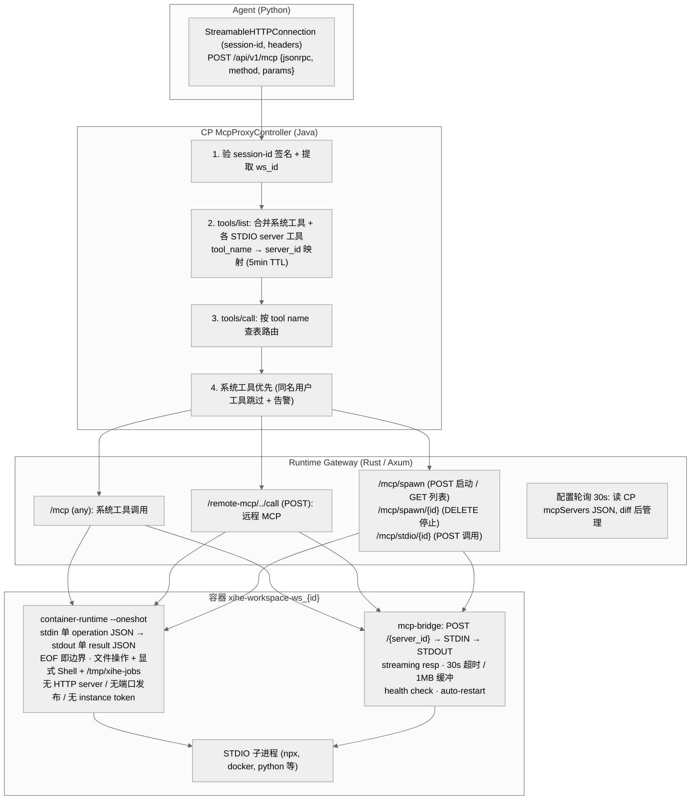
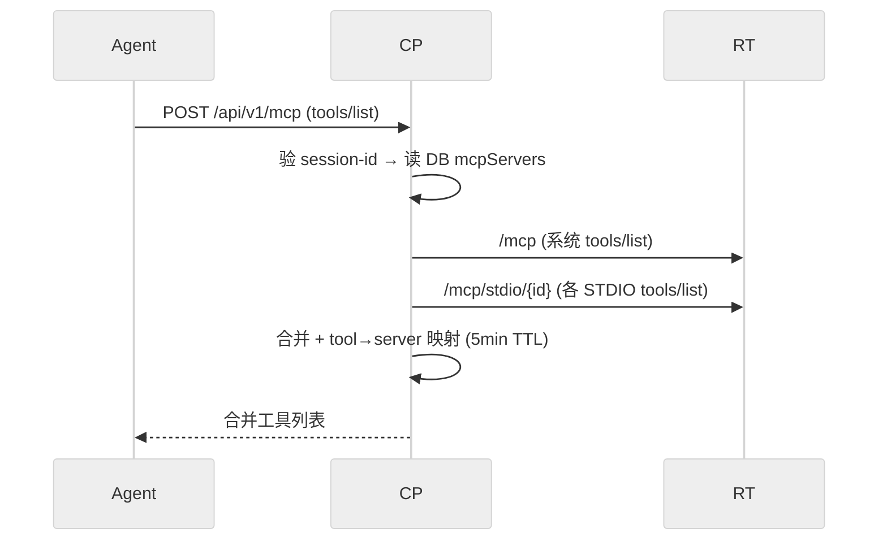
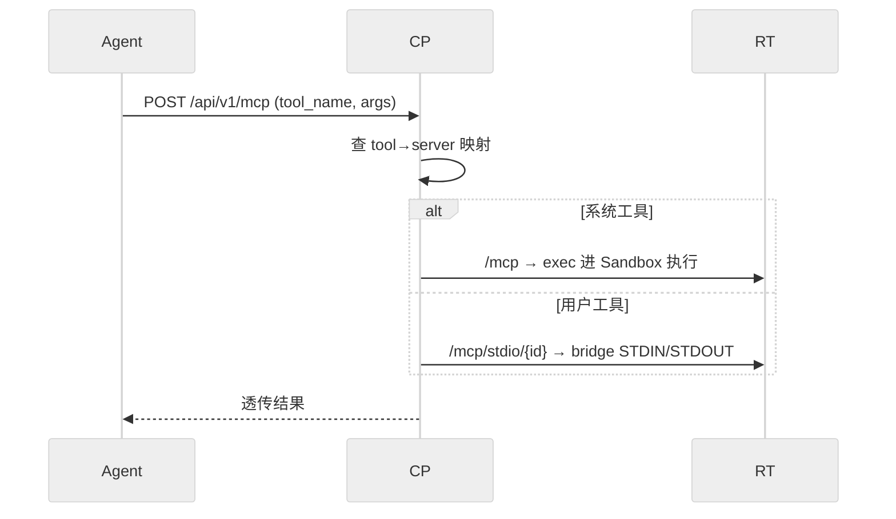

# DEV-016: MCP 三层路由架构

## 1. 概述

MCP（Model Context Protocol）请求从 Agent 发出的到工具执行的完整路径经过三层路由：

1. **CP McpProxyController** — 认证 + tool-name-based 路由
2. **Runtime Gateway** — per-workspace 分发
3. **容器内 bridge** — STDIO 子进程管理

> **协议版本说明**：当前采用 MCP `Protocol-Version: 2026-07-28`（rmcp 3.1.4，SEP-2567），Runtime 侧按该协议全程**无会话（stateless）**。因此 CP 转发 `tools/list` / `tools/call` 到 Runtime 时必须携带 `Mcp-Method` 与 `Mcp-Name` HTTP 头（见提交 `a9923e3`）；缺失会导致系统工具列表为空、`UNKNOWN_TOOL`。会话态仍存在的是 CP↔Agent 之间的 `mcp-session-id` HMAC 签名（见 §2 与根 `AGENTS.md` Known Issues），二者不冲突。

## 2. 架构图



锚点：`McpProxyController.java`、`main.rs: 路由注册`、`mcp_bridge.rs`、`mcp_process.rs: CONFIG_POLL_INTERVAL`。无 HTTP container-runtime 通道、无 instance token（exec 本身即认证边界，PLAN-235）。

## 3. 数据传输流

### 3.1. 工具发现（tools/list）



### 3.2. 工具调用（tools/call）



## 4. 关键技术决策

| 决策 | 选择 | 理由 |
|------|------|------|
| MCP transport | Streamable HTTP | MCP 社区已废弃 SSE |
| STDIO 桥接方式 | Rust bridge binary | shell 无法处理 JSON-RPC streaming |
| Bridge 部署 | 多阶段构建进 workspace 镜像（builder 编译双 binary + COPY） | 无 bind mount |
| 路由策略 | tool-name based | Agent 无需感知 server_id |
| 工具冲突 | 系统优先 + 告警 | 保证平台工具可用性 |
| 配置格式 | Claude Desktop JSON textarea | 业界标准，用户直接复制粘贴 |
| 配置存储 | PostgreSQL JSONB | 类型校验 + 索引支持 |
| workspace 隔离 | task-local（非 env var） | 支持多 workspace 单进程 |
| 向后兼容 | 无 | 所有组件同步升级 |
| LLM 可见性 | workspace_id 透明 | 基础设施关注点不泄漏到 LLM 层 |

## 5. bridge binary 设计要点

`xihe-mcp-bridge` 是容器内的轻量 HTTP 服务器，负责将 STDIO 子进程暴露为 HTTP 端点。

- 每个子进程由一个 `Mutex` 保护，串行化 STDIO 访问
- 响应为 streaming（`tokio::sync::mpsc` + `Body::from_stream`），逐行 flush
- 30s 读取超时（超时后丢弃 reader，pipe 关闭后子进程收到 SIGPIPE）
- 1MB 缓冲区上限
- 管理端点：`/_spawn`、`/_kill/{id}`、`/_health`
- 用户端点：`POST /{server_id}`

## 6. 配置同步

```
用户 → UI textarea → PUT /api/v1/workspaces/{wsId}/mcp-config
  → CP: 校验 JSON → 写入 config 表 (JSONB)
  → Runtime 每 30s: GET /internal/v1/config/workspaces/{workspaceId}/mcp-config（Bearer service token）
  → Runtime: diff 当前 bridge 列表 → spawn/stop
```

## 7. 测试策略

| 层级 | 内容 | 命令 |
|------|------|------|
| Unit | bridge spawn/conflict/kill | `cargo test --bin xihe-mcp-bridge` |
| Unit | Gateway 路由转发 | `cargo test --lib`（计数以实测为准） |
| Unit | CP McpProxyController | `mvn test -Dtest=McpProxyTest` |
| Unit | MCP 配置（ConfigSettings） | `pnpm vitest run` |
| Integration | 真实 bridge 进程 | `cargo test --test bridge_integration_test` |
| E2E | Settings 页截图 | `npx playwright test e2e/real/settings-visual.spec.ts` |

## 8. 相关文件

| 文件 | 说明 |
|------|------|
| `packages/agent/.../mcp_client.py` | Agent MCP client（StreamableHttpConnection） |
| `packages/runtime/src/mcp_bridge.rs` | 容器内 xihe-mcp-bridge binary |
| `packages/runtime/src/container_runtime.rs` | 容器内 xihe-container-runtime binary（文件操作 + 命令执行） |
| `docker/images/workspace/Dockerfile` | xihe/workspace 容器镜像多阶段构建 |
| `packages/runtime/src/mcp_process.rs` | Gateway 侧 STDIO 管理 |
| `packages/runtime/src/workspace.rs` | 容器 + bridge 生命周期 |
| `packages/runtime/src/main.rs` | 路由注册 + 配置轮询 |
| `packages/control-plane/.../McpProxyController.java` | CP 层路由代理 |
| `packages/control-plane/.../ConfigController.java` | MCP 配置 API |
| `packages/ui/src/views/settings/ConfigSettings.vue`（mcpJson textarea + saveMcpConfig，未设独立 MCP 设置页） | MCP 配置 UI |

## 9. 附录：会话签名规则（旧签名规则短文全文并入，M2 正文化）

# MCP Session-id Signing Rule

## 问题

MCP 通信中 session-id 用于标识 workspace 身份。未签名的 session-id（如仅 Base64 编码的 `ws_id:user_id:timestamp`）可被中间人或恶意工具调用篡改，导致跨 workspace 数据泄露。

```java
// ❌ 禁止 — 仅 Base64 编码，无防篡改
String payload = wsId + ":" + rawSessionId + ":" + timestamp;
return Base64.getUrlEncoder().withoutPadding().encodeToString(payload.getBytes());

// ✅ 必须 — HMAC-SHA256 签名
String payload = wsId + ":" + rawSessionId + ":" + timestamp;
byte[] signature = mac.doFinal(payload.getBytes());
String sigB64 = Base64.getUrlEncoder().withoutPadding().encodeToString(signature);
String payloadB64 = Base64.getUrlEncoder().withoutPadding().encodeToString(payload.getBytes());
return payloadB64 + "." + sigB64;
```

## 硬约束

### R1: session-id 必须包含 HMAC 签名

```typescript
// ❌ 禁止
sessionId: base64(ws_id + ":" + user_id + ":" + timestamp)

// ✅ 必须
sessionId: base64(payload) + "." + base64(HMAC-SHA256(payload))
```

### R2: 服务端必须验签

每次收到 session-id 时验证：
1. 检查格式：`payload.signature` 两部分
2. 用相同密钥计算 `HMAC-SHA256(payload)` 并与 `signature` 对比
3. 只有匹配时才信任 session-id 中的 workspace 身份

### R3: 密钥安全

- HMAC 密钥不得硬编码在客户端代码中
- 生产环境密钥通过环境变量或密钥管理服务注入
- 开发/测试环境可使用固定占位密钥

> ⚠️ 已知违规（待修）：当前 `McpProxyController.HMAC_SECRET` 为硬编码 dev 默认值，无环境变量覆盖；R3 作为目标规则保留，实现合规前不得声称满足。

## 验证方法

```bash
# 扫描：检查是否有仅 Base64 编码的 session-id 实现
grep -rn "Base64.*encodeToString.*payload" packages/ --include="*.java" | grep -v "Mac\|hmac\|Hmac"
```

## 审计清单

```
□ 每个 MCP session-id 签发点使用 HMAC-SHA256 签名
□ 每个 session-id 验签点检查 HMAC 签名完整性
□ 无仅 Base64 编码的 session-id 构造逻辑
□ 签名密钥通过环境变量配置，非硬编码
□ 篡改 payload 的请求被拒绝（返回 null 或 403）
```
