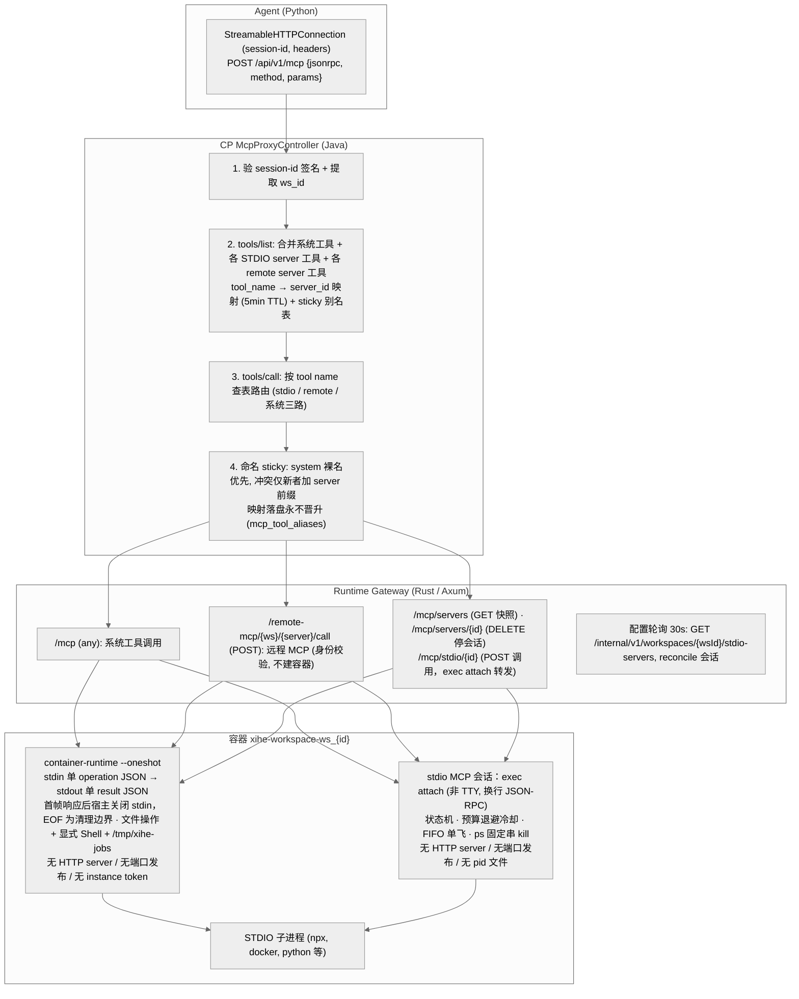
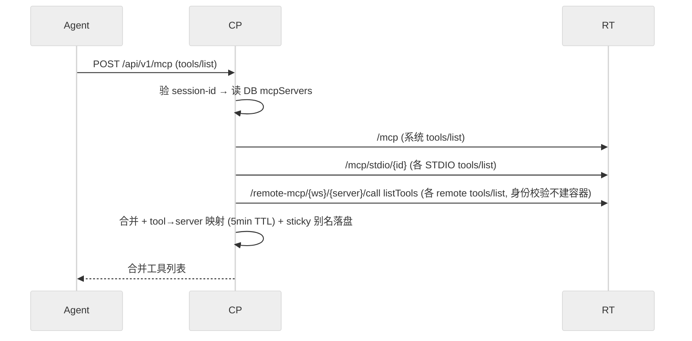
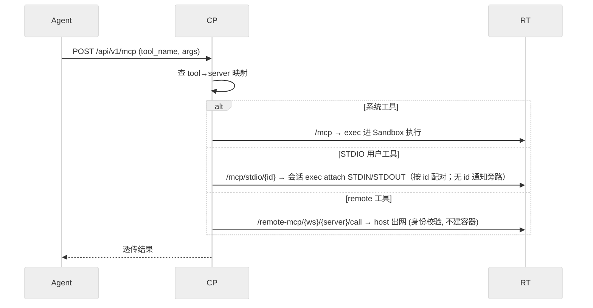

# DEV-016: MCP 三层路由架构

> 本文保留 MCP 实现说明；CP/Runtime/Agent 的冻结通信边界见根级 `spec/protocol/mcp.md`，wire 字段以 OpenAPI/inventory 和 MCP 实现为准。

## 1. 概述

MCP（Model Context Protocol）请求从 Agent 发出的到工具执行的完整路径经过路由：

1. **CP McpProxyController** — 认证 + tool-name-based 路由
2. **Runtime Gateway** — per-workspace 分发
3. **stdio 会话（PLAN-0347）** — 宿主 `exec attach` 直连容器内 MCP server 进程（无容器内 HTTP bridge；会话 = 状态机 + 预算 + FIFO 单飞）

> **协议版本说明**：当前采用 MCP `Protocol-Version: 2026-07-28`（rmcp 3.1.4，SEP-2567），Runtime 侧按该协议全程**无会话（stateless）**。因此 CP 转发 `tools/list` / `tools/call` 到 Runtime 时必须携带 `Mcp-Method` 与 `Mcp-Name` HTTP 头（见提交 `a9923e3`）；缺失会导致系统工具列表为空、`UNKNOWN_TOOL`。会话态仍存在的是 CP↔Agent 之间的 `mcp-session-id` HMAC 签名（见 §2 与根 `AGENTS.md` Known Issues），二者不冲突。

## 2. 架构图



锚点：`McpProxyController.java`、`main.rs: 路由注册`、`mcp_session.rs`（CONFIG_POLL_INTERVAL / 状态机）、`spec/session-lifecycle.md`。无 HTTP container-runtime 通道、无 instance token（exec 本身即认证边界，PLAN-235）；无容器内 bridge、无发布端口/容器 IP（PLAN-0347）。

## 3. 数据传输流

### 3.1. 工具发现（tools/list）



### 3.2. 工具调用（tools/call）



## 4. 关键技术决策

| 决策 | 选择 | 理由 |
|------|------|------|
| MCP transport | Streamable HTTP | MCP 社区已废弃 SSE |
| STDIO 承载方式 | 宿主 `exec attach` 长驻会话（PLAN-0347） | 桥 HTTP+端口是 Docker-only 泄漏且 native Windows 不可达；会话层对 MCP 协议透明 |
| STDIO 部署 | 无容器内组件（会话直连 MCP server 进程） | 少一个镜像内 binary 与一层跳转 |
| 路由策略 | tool-name based（三路：系统 / stdio / remote，`McpServer` 表命中即 remote） | Agent 无需感知 server_id |
| 工具冲突 | sticky：system 裸名优先，冲突仅新者加 `serverId__` 前缀，映射落盘永不晋升 | 无冲突零改名；历史按 `(serverId, backendName, generation)` 回放 |
| serverId 来源 | 双源：STDIO 为用户配置键透传，remote 为 `mcp_remote_servers` 表行 | 无 id 生成器；表命中优先于 JSON key |
| remote 执行 | 身份校验（Spec 存在性 + 授权），不建容器；unknown 显式失败 | 防越权/计费逃逸；SSRF 靠 allowlist + DNS |
| remote 认证 | `authMode: oauth/no-auth`；no-auth 跳过 broker（多余 Bearer 经实测被忽略） | 公开 server 免 OAuth |
| spawn 状态 | 已退役（410 `MCP_SESSION_ENDPOINT_RETIRED`）；会话由 30s 轮询 + 调用惰性管理 | PLAN-0347 决策 #12/#18；无已知调用方 |
| 配置格式 | Claude Desktop JSON textarea（混合入口 `mcp-config` 按字段拆分：stdio / remote） | 业界标准，用户直接复制粘贴 |
| 配置存储 | `mcp_stdio_servers`（workspace_id + name + config JSONB，决策 #27） | 类型校验 + 索引支持；与 config 三层解耦 |
| workspace 隔离 | task-local（非 env var） | 支持多 workspace 单进程 |
| 向后兼容 | 无 | 所有组件同步升级 |
| LLM 可见性 | workspace_id 透明 | 基础设施关注点不泄漏到 LLM 层 |

## 5. stdio 会话设计要点（PLAN-0347）

`mcp_session.rs` 为每个 `(workspace, serverId)` 维护一条长驻 `exec attach` 会话，直接运行 MCP server 进程。

- 状态机：`starting / ready / restarting(n) / failed / stopped`；迁移写结构化日志 `mcp_session_transition`
- 重试：同一故障周期预算 3 次、退避 1/5/15s；超限 `failed` + 冷却 5 分钟（半开）
- 并发：同 key FIFO 单飞；排队超上限 `MCP_SESSION_BUSY`；调用取消只作用于自身，不杀会话（决策 #20）
- 配对：响应按 JSON-RPC `id`；无 id 通知（如 `notifications/tools/list_changed`）旁路记录
- 终止：容器内 `ps` 固定串匹配 + `kill`（SIGTERM → SIGKILL）；`inspect_exec` pid 属宿主命名空间不可用于容器内 kill；EOF 不保证退出
- 回收：容器重建/evict/destroy → `cleanup_workspace`；Runtime 启动期 `cleanup_orphans` 兜底
- 边界：帧上限双向 1MiB；stderr 脱敏进日志；会话不跨 workspace 复用

## 6. 配置同步

```
用户 → UI workspace 层 MCP 编辑器 → PUT /api/v1/workspaces/{wsId}/mcp-config（混合入口）
  → CP: 校验 JSON → 按字段拆分：stdio 写入 mcp_stdio_servers；remote 走 mcp_remote_servers
  → Runtime 每 30s: GET /internal/v1/workspaces/{wsId}/stdio-servers（generation/hash/servers，Bearer service token）
  → Runtime: reconcile 会话（spec 变化/删除 → 停；首次调用惰性建会话）
```

stdio 配置的公开/内部契约（`generation` 乐观锁 + `hash`）见 `docs/api/openapi.yaml` 与 `docs/api/inventory.md`；remote server 走 `mcp_remote_servers` 表（类名 `McpServer.java` 保留，决策 #38②）：`workspaceId/name/endpoint/authConfig/enabled/authMode`，CP 按表判定分流，Runtime 经 CP broker 取短期 token（no-auth 跳过）。混合入口读侧只回传非敏感字段（remote 仅 `url`/`type`，OAuth 元数据不回传）。

### 6.1 OAuth token broker（PLAN-0349）

`POST /internal/v1/oauth/token` 由 CP `OAuthCredentialService` + `OAuthTokenBroker` 提供，Runtime 只消费短期 access token：

- **缓存与单飞**：按 `(userId, workspaceId, serverId)` 进程内缓存 access token，TTL = `clamp(expires_in − 60, 0, 300)` 秒（provider 缺 `expires_in` 用 300s 保守默认；`ttl = 0` 则返回但不缓存）；同键并发只触发一次 provider 刷新，等待方共享同一结果或同一失败。
- **轮换写回**：刷新在凭据行锁内执行（`SELECT ... FOR UPDATE` + PLAN-0346 `SET LOCAL lock_timeout`），并发刷新串行消费轮换链，不互相失效；锁等待超时 → 503 `OPERATION_LOCK_TIMEOUT`。
- **错误两档**：401 `OAUTH_REAUTH_REQUIRED`（缺凭据 / 状态非 AUTHORIZED / scope 不符 / provider 明确拒绝，如 4xx、`invalid_grant`）；503 `OAUTH_TOKEN_UNAVAILABLE`（provider 不可达 / 超时 / 5xx）。Runtime 按 HTTP 状态消费，不解析 problem code。
- **撤销**：本地置 `REVOKED` + 缓存立即失效，并在提交后 best-effort 通知 provider（RFC 7009；经 RFC 8414 / OpenID metadata 发现撤回端点，无端点或失败仅记日志）。
- **观测**：结构化事件 `oauth_token_hit` / `oauth_token_miss` / `oauth_token_refresh` / `oauth_token_merge` / `oauth_token_revoke` / `oauth_token_failure`（含 `requestId` 与三元组 id）；token 明文与 provider 响应体不落日志。

### 6.2 stdio 会话状态可见（PLAN-0366）

`GET /api/v1/workspaces/{workspaceId}/mcp/servers` 为 CP 薄代理（成员可见）：调用 Runtime `GET /internal/v1/runtime/workspaces/{ws_id}/mcp/servers`，在 CP 侧做**唯一一次显式键名映射**（`server_id/state/attempt/last_error/since_ms/epoch` → `serverId/state/attempt/lastError/sinceMs/epoch`；`state` 保持 Runtime 小写字面量），不重算状态语义、不反向改 Runtime（决策 #2/#13）。错误表：Runtime 404 `WORKSPACE_NOT_FOUND` / 409 `WORKSPACE_DESTROYING|WORKSPACE_BUSY` / 503 `WORKSPACE_MATERIALIZATION_FAILED` 白名单透传；不可达、超时、响应不可解析、未知码 → 502 `RUNTIME_UNAVAILABLE`。Runtime handler 先 `ensure_workspace`，首次查询可能触发物化（接受该副作用；后续为注册表纯读）。

UI 设置页 workspace 标签以 `stdio-servers`（配置 name）∪ 本端点（快照 `server_id`）合并出行集合：五态徽章（starting/ready/restarting/failed/stopped）+「无记录」行 + 失败原因；打开拉取 + 手动刷新 + 30s 轮询（页面不可见暂停；失败保留上次状态并标注「状态可能过期」，不自动重试风暴）。

同一波次修复 CP `toolServerCache` 失效处理：stdio `tools/list` 转发非 2xx 时移除该 serverId 的**全部旧映射**（warn 记录 wsId/serverId/status），部分失败不影响其他 server 的映射或工具合并——避免 `tools/call` 仍路由到不可用 server（调用侧宁可「未知工具」）。

## 7. 测试策略

| 层级 | 内容 | 命令 |
|------|------|------|
| Unit | 会话状态机/预算/配对/kill 命令 | `cargo test --lib -- mcp_session::` |
| Unit | Gateway 路由转发 | `cargo test --lib`（计数以实测为准） |
| Unit | CP McpProxyController | `mvn test -Dtest=McpProxyTest` |
| Unit | MCP 配置（ConfigSettings） | `pnpm vitest run` |
| Integration | 真容器会话（惰性建/自愈/清理） | `cargo test --test mcp_session_test` |
| E2E | Settings 页截图 | `npx playwright test e2e/real/settings-visual.spec.ts` |

### 7.1. Agent 手动验证 runbook（PLAN-242 补充）

面向 Agent 操作者，验证 remote 工具端到端可达（以 no-auth 公开 server 为例）：

1. 注册：`mcp_remote_servers` 插一行（`workspaceId`、`name=deepwiki`、`endpoint=https://mcp.deepwiki.com/mcp`、`authMode=no-auth`、`enabled=true`）。
2. 发现：`POST /api/v1/mcp` 发 `tools/list`，确认返回含远端工具名（无冲突为裸名）。
3. 调用：`tools/call` 带上一步的工具名，确认结果透传。
4. 审计：查审计日志，`detail` 含 `serverId/deepwiki backendName/<原名> generation=<代数>` 四元组。
5. 无容器断言：`docker ps` 无新增 workspace 容器（remote 不建容器）。
6. 烟雾（非门禁）：直调 endpoint 发 `initialize`（有/无 Bearer 均应 200，见 M1.3）。

## 8. 相关文件

| 文件 | 说明 |
|------|------|
| `packages/agent/.../mcp_client.py` | Agent MCP client（StreamableHttpConnection） |
| `packages/runtime/src/mcp_session.rs` | stdio MCP 会话（exec attach 直连；替代已退役的 bridge） |
| `packages/runtime/src/container_runtime.rs` | 容器内 xihe-container-runtime binary（文件操作 + 命令执行，oneshot） |
| `docker/images/workspace/Dockerfile` | xihe/workspace 容器镜像多阶段构建（PLAN-0347 起不再构建 bridge） |
| `packages/runtime/src/workspace.rs` | 容器生命周期（bridge 相关机制已删除） |
| `packages/runtime/src/main.rs` | 路由注册 + 配置轮询 |
| `packages/control-plane/.../McpProxyController.java` | CP 层路由代理（三路分流 + sticky 合并） |
| `packages/control-plane/.../entity/McpServer.java`（表 `mcp_remote_servers`，`authMode`） | remote server 行（含 no-auth 标记；类名保留，决策 #38②） |
| `packages/control-plane/.../entity/McpStdioServer.java`（表 `mcp_stdio_servers`） | stdio server 行（workspace 作用域，决策 #27） |
| `packages/control-plane/.../entity/McpToolAlias.java` | sticky 别名落盘（`workspace_id + issued_name` 主键） |
| `packages/control-plane/.../ConfigController.java` | MCP 配置 API（stdio-servers 公开/内部端点 + 混合 mcp-config 拆分） |
| `packages/ui/src/views/settings/ConfigSettings.vue`（workspace 层 MCP 编辑器 + saveMcpConfig） | MCP 配置 UI（PLAN-0307 T2.17 起归工作区设置条目） |

## 9. 附录：会话签名规则（旧签名规则短文全文并入，M2 正文化）

# MCP Session-id Signing Rule

## 问题

MCP 通信中 session-id 用于标识 workspace 身份。未签名的 session-id（如仅 Base64 编码的 `ws_id:user_id:timestamp`）可被中间人或恶意工具调用篡改，导致跨 workspace 数据泄露。

```java
// ❌ 禁止 — 仅 Base64 编码，无防篡改
String payload = wsId + ":" + rawSessionId + ":" + timestamp;
return Base64.getUrlEncoder().withoutPadding().encodeToString(payload.getBytes());

// ✅ 必须 — HMAC-SHA256 签名
String payload = wsId + ":" + rawSessionId + ":" + timestamp;
byte[] signature = mac.doFinal(payload.getBytes());
String sigB64 = Base64.getUrlEncoder().withoutPadding().encodeToString(signature);
String payloadB64 = Base64.getUrlEncoder().withoutPadding().encodeToString(payload.getBytes());
return payloadB64 + "." + sigB64;
```

## 硬约束

### R1: session-id 必须包含 HMAC 签名

```typescript
// ❌ 禁止
sessionId: base64(ws_id + ":" + user_id + ":" + timestamp)

// ✅ 必须
sessionId: base64(payload) + "." + base64(HMAC-SHA256(payload))
```

### R2: 服务端必须验签

每次收到 session-id 时验证：
1. 检查格式：`payload.signature` 两部分
2. 用相同密钥计算 `HMAC-SHA256(payload)` 并与 `signature` 对比
3. 只有匹配时才信任 session-id 中的 workspace 身份

### R3: 密钥安全

- HMAC 密钥不得硬编码在任何应用代码中
- CP 必须从 `XIHE_MCP_SESSION_ID_HMAC_SECRET` 读取非空密钥；生产由部署环境/密钥管理服务注入至少 32 个随机字节，各 CP 副本保持相同密钥
- 开发/测试环境可使用固定占位密钥

已完成：`McpProxyController` 不再含密钥常量；缺失/空值会在 CP 启动时 fail-fast。旧 HMAC key 已暴露在 Git 历史，部署者须在所有 CP 部署注入新随机值并重启；更换 key 会使现存签名 session-id 立即失效（其验签年龄窗口最多 24 小时），MCP 客户端需重新初始化。该轮只完成代码侧外置与步骤记录，未访问或修改任何宿主/部署 secret。

## 验证方法

```bash
# 扫描：检查是否有仅 Base64 编码的 session-id 实现
grep -rn "Base64.*encodeToString.*payload" packages/ --include="*.java" | grep -v "Mac\|hmac\|Hmac"
```

## 审计清单

```
□ 每个 MCP session-id 签发点使用 HMAC-SHA256 签名
□ 每个 session-id 验签点检查 HMAC 签名完整性
□ 无仅 Base64 编码的 session-id 构造逻辑
□ `XIHE_MCP_SESSION_ID_HMAC_SECRET` 通过环境变量配置，CP 无硬编码 fallback
□ 生产密钥已轮换、所有 CP 副本保持一致；轮换后客户端重新初始化
□ 篡改 payload 的请求被拒绝（返回 null 或 403）
```
