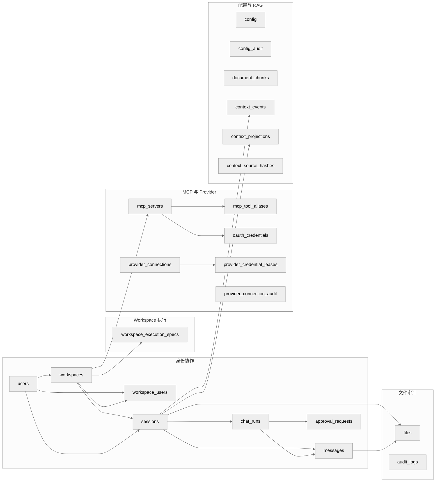

# DEV-019: 数据库设计

> 读者：新加入 XH 的后端 / 全栈开发者。内容：当前最终库表一览（结论先行），细节按域查表。Source of Truth 是 `packages/control-plane/src/main/resources/db/migration/V1~V22`，JPA Entity 只是镜像。前置阅读：[DEV-001](DEV-001-system-architecture.md)（四模块与 PG 定位）、[DEV-014](DEV-014-control-plane-architecture.md)（CP 通道）、[DEV-017](DEV-017-session-architecture.md)（会话语义）、[DEV-003](DEV-003-config-management.md)（Config 三层）。

## 1. 结论与使用规则

| 结论 | 内容 |
|------|------|
| 数据库 | PostgreSQL 17 + pgvector，Docker 镜像 `pgvector/pgvector:pg17`，dev 端口 `12634`，库名/用户名 `xihe` |
| 表数量 | 22 张业务表 + `flyway_schema_history`（Flyway 自维护，不在本文列字段） |
| 权威顺序 | Flyway SQL > JPA Entity > 本文档；`application.properties` 中 `ddl-auto=update` 仅为 dev 兜底，生产以 Flyway 为准 |
| 主键风格 | 多数 `VARCHAR(36)`（UUID 字符串）；`config/config_audit` 用 `BIGSERIAL`；`context_*`/`workspace_execution_specs` 用 `UUID DEFAULT gen_random_uuid()` |
| 时间风格 | `TIMESTAMP DEFAULT CURRENT_TIMESTAMP` 或 `TIMESTAMPTZ DEFAULT NOW()`，混用是历史遗留，新表用后者 |
| 删除语义 | `workspaces.deleted_at` 软删 + 部分唯一索引；`messages/context_*` 随 `sessions` 级联删；`files.message_id` 置空 |
| 扩展 | `postgres-init/01-enable-pgvector.sql` 只做 `CREATE EXTENSION IF NOT EXISTS vector`，`V3` 重申一次保证幂等 |

关键入口：

| 入口 | 路径 |
|------|------|
| Compose PG 定义 | `docker-compose.yml`（`postgres` 服务，`./postgres-init:/docker-entrypoint-initdb.d:ro`） |
| 扩展初始化 | `postgres-init/01-enable-pgvector.sql` |
| 连接配置 | `packages/control-plane/src/main/resources/application.properties:12-24`（`datasource.url`、`flyway.locations=classpath:db/migration`） |
| 全量迁移 | `packages/control-plane/src/main/resources/db/migration/V1__init_schema.sql` ~ `V22__chat_run_leases.sql` |
| Entity 镜像 | `packages/control-plane/src/main/java/com/cc01cc/p/xihe/cp/entity/`（22 个）+ `context/entity/`（3 个） |
| Seed | `packages/control-plane/src/main/java/com/cc01cc/p/xihe/cp/config/DataSeeder.java`（仅 seed `admin@xihe.local`，密码随机不落日志） |

## 2. ER 关系（域分组）

代码锚点：ER 节点名即表名，DDL 见 §4 迁移对照，Entity 见附录 A。

## 3. 按域表详情

### 3.1 身份（users）

**users**（`V1`，Entity `entity/User.java`）：唯一登录主体，`role` 仅 `USER/ADMIN`。

| 列 | 类型 | 约束/索引 | 说明 |
|----|------|-----------|------|
| id | VARCHAR(36) | PK | UUID 字符串 |
| email | VARCHAR(255) | UNIQUE + `idx_users_email` | 登录键，`DataSeeder` seed `admin@xihe.local` |
| password_hash | VARCHAR(255) | NOT NULL | BCrypt，不存明文 |
| role | VARCHAR(20) | NOT NULL DEFAULT 'USER' | `USER` / `ADMIN` |
| name / avatar | VARCHAR(100) / VARCHAR(512) | nullable | 展示用 |
| settings | TEXT | nullable | 遗留自由字段，用户偏好以 `config` 表为准 |
| created_at / updated_at | TIMESTAMP | DEFAULT CURRENT_TIMESTAMP | 无自动更新触发器，靠 JPA 维护 |

### 3.2 协作（workspaces / workspace_users / sessions / messages / chat_runs / approval_requests）

**workspaces**（`V1` + `V2/V11/V14`，Entity `entity/Workspace.java`）：`owner_id` 拥有者，`deleted_at` 软删后同 owner 可重建。

| 列 | 类型 | 约束/索引 | 说明 |
|----|------|-----------|------|
| id / name / description | VARCHAR(36) / VARCHAR(255) / TEXT | PK / NOT NULL | 基础 |
| owner_id | VARCHAR(36) | FK `users(id)` + `idx_workspaces_owner_id` | 拥有者 |
| settings | TEXT | nullable | 遗留，结构化配置走 `config` |
| storage_path | VARCHAR(512) | nullable（`V2`） | 遗留绝对路径，仅回填 `storage_ref` 用 |
| storage_backend | VARCHAR(32) | DEFAULT 'host_directory'（`V11`） | 当前 v1 仅 `host_directory` |
| storage_ref | VARCHAR(64) | nullable | `host_directory` 根下 `workspaceId` 派生，由 `storage_path` basename 回填 |
| generation | INT | DEFAULT 0 | 当前执行代数，与 `workspace_execution_specs.generation` 对齐 |
| sandbox_spec_hash / sandbox_spec | VARCHAR(64) / JSONB | nullable | 当前生效规格快照 |
| deleted_at | TIMESTAMPTZ | nullable（`V14`）+ 部分索引 `idx_workspaces_owner_active WHERE deleted_at IS NULL` + 部分唯一 `uq_workspaces_active_owner(owner_id) WHERE deleted_at IS NULL` | 软删，删后不阻塞同 owner 新建 |

**workspace_users**（`V1` + `V14` 加复合索引，Entity `entity/WorkspaceUser.java`）：多对多成员。

| 列 | 类型 | 约束/索引 | 说明 |
|----|------|-----------|------|
| workspace_id / user_id | VARCHAR(36) | 联合 PK + `idx_workspace_users_user_id` + `idx_workspace_users_user_workspace(user_id, workspace_id)` | 双向查 |
| role | VARCHAR(20) | DEFAULT 'MEMBER' | 成员角色 |
| created_at | TIMESTAMP | DEFAULT CURRENT_TIMESTAMP | 加入时间 |

**sessions**（`V1` + `V14/V19`，Entity `entity/Session.java`）：服务端 canonical 会话，详见 [DEV-017](DEV-017-session-architecture.md)。

| 列 | 类型 | 约束/索引 | 说明 |
|----|------|-----------|------|
| id | VARCHAR(36) | PK | 会话键，SSE `sessionId` 即此 |
| workspace_id / user_id | VARCHAR(36) | FK + `idx_sessions_workspace_id/user_id` + 复合 `idx_sessions_workspace_user_active(workspace_id, user_id, archived, created_at DESC)` | 归属 |
| title | VARCHAR(255) | nullable | 列表展示 |
| model_provider / model_name | VARCHAR(50) / VARCHAR(100) | nullable | canonical pair，普通 chat `toolMode=none` |
| provider_connection_id / connection_revision | VARCHAR(36) / BIGINT | nullable，无 FK（`V19`）+ `idx_sessions_provider_connection` | 逻辑绑定，不做外键避免跨域耦合 |
| archived | BOOLEAN | DEFAULT FALSE + `idx_sessions_archived` | 归档非删除 |

**messages**（`V1` + `V6/V14/V16`，Entity `entity/Message.java`）：`session_id` 级联删（`V14` 重建 FK 加 `ON DELETE CASCADE`）。

| 列 | 类型 | 约束/索引 | 说明 |
|----|------|-----------|------|
| id / session_id | VARCHAR(36) | PK / FK `sessions(id) ON DELETE CASCADE` + `idx_messages_session_id` | 删会话清消息 |
| role | VARCHAR(20) | NOT NULL | `user/assistant/system/tool` 等，见 `MessageRole` |
| content | TEXT | NOT NULL | 正文 |
| metadata | TEXT | nullable | 遗留自由字段 |
| attachments | JSONB | nullable（`V6`） | 内联附件摘要， canonical 附件在 `files` |
| run_id | VARCHAR(36) | FK `chat_runs(id)` nullable（`V16`）+ `idx_messages_run_id` | 归属轮次，见 §3.2 `chat_runs` |
| created_at | TIMESTAMP | DEFAULT CURRENT_TIMESTAMP | 排序键 |

**chat_runs**（`V16` + `V19/V22`，Entity `entity/ChatRun.java`）：一次 `POST /api/v1/chat` 的持久化轮次（PLAN-247），同幂等键不重复起 Agent。

| 列 | 类型 | 约束/索引 | 说明 |
|----|------|-----------|------|
| id / session_id / user_id / workspace_id | VARCHAR(36) | PK / FK | 四元归属 |
| idempotency_key / request_hash | VARCHAR(128) / VARCHAR(64) | NOT NULL + UNIQUE `(user_id, session_id, idempotency_key)` | 同 key 同 payload 返回既有 run，不同 payload 报冲突 |
| provider / model / tool_mode | VARCHAR(50/100/20) | `tool_mode` DEFAULT 'none' | 全链路透传，见 AGENTS.md Chat 架构 |
| user_message_id / assistant_message_id | VARCHAR(36) | nullable，无 FK | 逻辑关联，避免循环 FK |
| status / terminal_outcome | VARCHAR(24) | NOT NULL | `success/error/partial/ambiguous` 等终态 |
| error_code / error_detail | VARCHAR(64) / TEXT | nullable | `error_code` 给 UI 分支，`error_detail` 脱敏后写 |
| token_count / assistant_chars | INTEGER | DEFAULT 0 | 计量 |
| provider_connection_id / connection_revision | VARCHAR(36) / BIGINT | nullable（`V19`）+ `idx_chat_runs_provider_connection` | 本轮实际用的连接快照 |
| lease_owner / lease_expires_at | VARCHAR(80) / TIMESTAMPTZ | nullable（`V22`）+ `idx_chat_runs_active_lease(session_id, status, lease_expires_at)` | 单并发租约，防双发 |
| created_at / updated_at | TIMESTAMPTZ | DEFAULT NOW() | `idx_chat_runs_session_created(session_id, created_at)` |

**approval_requests**（`V21`，Entity `entity/ChatApproval.java` 对应 `approval_requests` 表）：工具高危操作人审。

| 列 | 类型 | 约束/索引 | 说明 |
|----|------|-----------|------|
| request_id | VARCHAR(36) | PK | 请求键 |
| run_id / session_id / user_id / workspace_id | VARCHAR(36) | FK NOT NULL | 四元归属，`run_id→chat_runs` |
| tool / action / details | VARCHAR(80) / VARCHAR(512) / TEXT | NOT NULL | 待审批动作 |
| state / approved | VARCHAR(24) / BOOLEAN nullable | NOT NULL | `pending/approved/rejected/expired` 等，`approved` 空表未决 |
| expires_at / decided_at | TIMESTAMPTZ | NOT NULL / nullable | 超时自动过期 |
| dispatch_error_code | VARCHAR(64) | nullable | 下发失败码 |
| created_at / updated_at | TIMESTAMPTZ | DEFAULT NOW() | 索引 `idx_approval_requests_session_state` + `idx_approval_requests_run_state` |

### 3.3 Workspace 执行（workspace_execution_specs）

**workspace_execution_specs**（`V11` 建 `workspace_assignments`，`V12` 加唯一，`V13` 重命名，Entity `entity/WorkspaceExecutionSpec.java`）：期望执行规格（非调度绑定，`V13` 注释原名误导已纠正）。

| 列 | 类型 | 约束/索引 | 说明 |
|----|------|-----------|------|
| id | UUID | PK DEFAULT `gen_random_uuid()` | 内部分配键 |
| workspace_id | VARCHAR(36) | FK `workspaces(id) ON DELETE CASCADE` | 删 workspace 清规格 |
| generation | INT | NOT NULL + 联合唯一 `uq_workspace_execution_specs_workspace_generation(workspace_id, generation)` + 普通 `idx_...` | 单调递增，Runtime 按 `workspaceId` 懒加载对应用代 |
| sandbox_spec_hash / sandbox_spec | VARCHAR(64) / JSONB NOT NULL | — | 规格内容与哈希，`workspaces` 镜像当前代 |
| storage_backend / storage_ref | VARCHAR(32/64) | NOT NULL | 与 `workspaces` 同义，历史行保留当时值 |
| actor / reason | VARCHAR(255/512) | nullable | 谁因何创建此代 |
| created_at | TIMESTAMPTZ | DEFAULT NOW() | 代创建时间即版本序 |

### 3.4 MCP 与 Provider（mcp_servers / mcp_tool_aliases / oauth_credentials / provider_connections / provider_credential_leases / provider_connection_audit）

**mcp_servers**（`V1` + `V15`，Entity `entity/McpServer.java`）：workspace 下 remote/stdio server 注册。

| 列 | 类型 | 约束/索引 | 说明 |
|----|------|-----------|------|
| id / workspace_id | VARCHAR(36) | PK / FK + `idx_mcp_servers_workspace_id` | 归属 |
| name / endpoint | VARCHAR(255/512) | NOT NULL | `serverId` 路由键见 DEV-030 附录 |
| auth_config | TEXT | nullable | 遗留，OAuth 密文已迁 `oauth_credentials` |
| auth_mode | VARCHAR(16) | DEFAULT 'oauth'（`V15`） | `oauth` / `no-auth`（公开免 broker） |
| enabled | BOOLEAN | DEFAULT TRUE | 禁用即摘流 |

**mcp_tool_aliases**（`V15`，Entity `entity/McpToolAlias.java`）：sticky 工具别名，冲突仅新者加前缀、永不晋升。

| 列 | 类型 | 约束/索引 | 说明 |
|----|------|-----------|------|
| workspace_id / issued_name | VARCHAR(36/255) | 联合 PK | 下发名全局键 |
| server_id / backend_name | VARCHAR(36/255) | NOT NULL + `idx_mcp_tool_aliases_server(workspace_id, server_id)` | 真实后端 |
| generation | BIGINT | DEFAULT 0 | 每次 `tools/list` 合并递增，审计回放用 |
| created_at / updated_at | TIMESTAMP | DEFAULT CURRENT_TIMESTAMP | — |

**oauth_credentials**（`V9`，Entity `entity/OAuthCredential.java`）：CP token broker 持久化的加密 refresh token。

| 列 | 类型 | 约束/索引 | 说明 |
|----|------|-----------|------|
| id | VARCHAR(36) | PK | — |
| user_id / workspace_id / server_id | VARCHAR(36) | FK `users/workspaces/mcp_servers` + UNIQUE `(user_id, workspace_id, server_id)` + 双索引 | 单用户单空间单服单凭证 |
| client_id / token_endpoint / redirect_uri / scope | VARCHAR(255/512/512/1024) | NOT NULL | OAuth 接线四件套 |
| refresh_token_ciphertext / encryption_key_version | TEXT / VARCHAR(32) | NOT NULL | 信封加密，版本用于轮转 |
| status | VARCHAR(32) | DEFAULT 'AUTHORIZED' | 授权态 |

**provider_connections**（`V18`，Entity `entity/ProviderConnection.java`）：LLM Provider 连接（PLAN-261），三级归属。

| 列 | 类型 | 约束/索引 | 说明 |
|----|------|-----------|------|
| id | VARCHAR(36) | PK | — |
| owner_type / owner_id | VARCHAR(16/64) | CHECK `SYSTEM/WORKSPACE/USER` + UNIQUE `(owner_type, owner_id, provider_id)` + `idx_provider_connections_owner` | 作用域 |
| provider_id / label | VARCHAR(128) | NOT NULL | 如 `openai/deepseek` + 展示名 |
| base_url | VARCHAR(2048) | nullable | 自建网关覆盖 |
| credential_ciphertext / encryption_key_version | TEXT / VARCHAR(32) | — | 与 OAuth 同模式，独立 key |
| enabled / status | BOOLEAN / VARCHAR(32) | CHECK `UNVERIFIED/VERIFYING/READY/INVALID_CREDENTIALS/UNREACHABLE/DISABLED` + `idx_provider_connections_provider_status` | 可用态 |
| model_discovery / manual_models | VARCHAR(32) / JSONB | CHECK `remote-models/litellm-catalog/curated/manual` | 模型来源 |
| revision | BIGINT | DEFAULT 1 | 每次改连接 +1，`sessions/chat_runs` 存快照比对 |
| last_verified_at / last_error_code | TIMESTAMPTZ / VARCHAR(64) | nullable | 连通性 |

**provider_credential_leases**（`V18`，Entity `entity/ProviderCredentialLease.java`）：发给 Agent 的一次性短期凭证租约。

| 列 | 类型 | 约束/索引 | 说明 |
|----|------|-----------|------|
| id / lease_hash | VARCHAR(36/128) | PK / UNIQUE | `lease_hash` 给 Agent 兑换 |
| provider_connection_id | VARCHAR(36) | FK CASCADE | 删连接清租约 |
| user_id / workspace_id / session_id / run_id | VARCHAR(36) | nullable（除 user 外）+ `idx_..._binding(connection, user, run)` | 最小闭环绑定 |
| provider_id / model | VARCHAR(128/255) | NOT NULL | 本次允许的模型 |
| expires_at / redeemed_at / revoked_at | TIMESTAMPTZ | `expires_at` NOT NULL + `idx_..._expiry` | 一次性，过期/兑换/吊销三态 |

**provider_connection_audit**（`V20`，Entity `entity/ProviderConnectionAudit.java`）：只追加审计，`provider_connection_id` 可空（删连接后仍留痕）。

| 列 | 类型 | 约束/索引 | 说明 |
|----|------|-----------|------|
| id | VARCHAR(36) | PK | — |
| provider_connection_id | VARCHAR(36) | nullable，无 FK | 故意不级联 |
| owner_type / owner_id / provider_id | VARCHAR(16/64/128) | NOT NULL | 冗余当时归属 |
| action / changed_by | VARCHAR(32/64) | NOT NULL | 谁做了什么 |
| from_status / to_status | VARCHAR(32) | nullable | 状态变迁 |
| credential_present / credential_last4 | BOOLEAN / VARCHAR(4) | DEFAULT FALSE | 只存后四位，禁存明文 |
| connection_revision | BIGINT | NOT NULL | 当时 revision |
| created_at | TIMESTAMPTZ | DEFAULT CURRENT_TIMESTAMP + 双索引 `(connection, created_at)` / `(owner, created_at)` | 时间序 |

### 3.5 配置与 RAG（config / config_audit / document_chunks / context_events / context_projections / context_source_hashes）

**config / config_audit**（`V4` + `V5/V10/V17`，Entity `entity/ConfigEntity.java` / `ConfigAuditEntity.java`）：3-tier 配置 canonical 存储，语义见 [DEV-003](DEV-003-config-management.md)。

| 表 | 关键列 | 约束/索引 | 说明 |
|----|--------|-----------|------|
| config | `environment VARCHAR(64)`（`V10` 由 32 拓宽）、`layer VARCHAR(16)`、`domain VARCHAR(32)`、`config_key VARCHAR(64)`、`config_value TEXT`、`is_set BOOLEAN DEFAULT TRUE`、`mcp_config JSONB`（`V5`）、`updated_by/at` | UNIQUE `(environment, layer, domain, config_key)` + `idx_config_lookup(environment, layer, domain)` | `layer` 为 `SYSTEM/ADMIN/USER`，`domain` 8 枚举见 AGENTS.md |
| config_audit | `config_id BIGINT FK config(id)`、`old_value/new_value TEXT`、`changed_by/at` | `idx_config_audit_config_id` | `V17` 把 `llm-provider` 域含 `apikey/secret/password/token` 的历史值改写为 `missing` 或 `present:legacy:<md5>`，禁明文留痕 |

**document_chunks**（`V3`）：RAG 向量表，无 FK，独立生命周期。

| 列 | 类型 | 约束/索引 | 说明 |
|----|------|-----------|------|
| id | VARCHAR(36) | PK | chunk 键 |
| page_content | TEXT | NOT NULL | 切片正文 |
| embedding | `vector(1536)` | NOT NULL + `ivfflat (embedding vector_cosine_ops) WITH (lists=100)` | `text-embedding-3-small` 维度，余弦检索 |
| cmetadata / document_id / chunk_index | JSONB / VARCHAR(36) / INT | `idx_chunks_document_id` | 来源与序号 |
| created_at | TIMESTAMP | DEFAULT CURRENT_TIMESTAMP | — |

**context_events / context_projections / context_source_hashes**（`V7/V8` + `V14` 级联，Entity `context/entity/` 下三件套）：Agent Event Sourcing，见 [DEV-013](DEV-013-agent-architecture.md) 与 [DEV-017](DEV-017-session-architecture.md)。

| 表 | 关键列 | 约束/索引 | 说明 |
|----|--------|-----------|------|
| context_events | `session_id FK CASCADE`、`workspace_id/user_id`、`event_type VARCHAR(50)`、`sequence BIGINT`、`payload JSONB`、`correlation_id/causation_id` | UNIQUE `(session_id, sequence)` + 索引 `(session)` / `(session, sequence)` / `(workspace)` / `(event_type)` | 只追加，`sequence` 单会话单调 |
| context_projections | `session_id UNIQUE FK CASCADE`、`projection_type DEFAULT 'agent_context'`、`latest_sequence`、`payload JSONB` | UNIQUE `(session_id)` + 索引 `(session)` / `(workspace)` | 物化视图，重放 `events` 可重建 |
| context_source_hashes | `workspace_id`、`source_key VARCHAR(255)`、`hash VARCHAR(64)` | UNIQUE `(workspace_id, source_key)` + 双索引 | 增量源去重 |

### 3.6 文件审计（files / audit_logs）

**files**（`V1` + `V6`，Entity `entity/File.java`）：附件 canonical，物理路径 `{attachments-base-path}/{sessionId}/{fileId}`，见 [DEV-014 §5](DEV-014-control-plane-architecture.md)。

| 列 | 类型 | 约束/索引 | 说明 |
|----|------|-----------|------|
| id | VARCHAR(36) | PK | `fileId` 即文件名键 |
| user_id / workspace_id | VARCHAR(36) | `user_id` FK NOT NULL + `workspace_id` FK nullable + 双索引 | `workspaceId` 空表会话级附件 |
| session_id / message_id | VARCHAR(36) | FK nullable（`V6`）+ 双索引，`session_id ON DELETE CASCADE`、`message_id ON DELETE SET NULL` | 删会话清附件，删消息保留文件行 |
| filename / mime_type / size_bytes / storage_path | VARCHAR(255/127) / BIGINT / VARCHAR(512) | NOT NULL（除 mime 外） | 白名单校验 + 500MB 上限在 Controller 层 |
| created_at | TIMESTAMP | DEFAULT CURRENT_TIMESTAMP | orphan 清理 24h 窗口基准 |

**audit_logs**（`V1`）：业务审计（MCP 工具调用另写 `audit.log` 文件，见 DEV-014 §5，两者互补）。

| 列 | 类型 | 约束/索引 | 说明 |
|----|------|-----------|------|
| id | VARCHAR(36) | PK | — |
| user_id / workspace_id | VARCHAR(36) | FK nullable + 双索引 | 系统动作可空 |
| action / resource_type / resource_id | VARCHAR(100/50/36) | `action` NOT NULL + `idx_audit_logs_action` | 动作三元组 |
| details | TEXT | nullable | 脱敏后 JSON |
| created_at | TIMESTAMP | DEFAULT CURRENT_TIMESTAMP | — |

## 4. 迁移对照（V1~V22）

| 版本 | 文件 | 变更 | 影响表 |
|------|------|------|--------|
| V1 | `V1__init_schema.sql` | 8 基表 + 13 索引 | `users/workspaces/workspace_users/sessions/messages/files/mcp_servers/audit_logs` |
| V2 | `V2__add_workspace_storage_path.sql` | `workspaces` 加列 | `workspaces.storage_path` |
| V3 | `V3__add_document_chunks.sql` | vector 扩展 + RAG 表 + ivfflat 索引 | `document_chunks` |
| V4 | `V4__config_table.sql` | 配置 + 审计 | `config/config_audit` |
| V5 | `V5__add_mcp_config.sql` | `config` 加列 | `config.mcp_config` |
| V6 | `V6__add_session_attachments.sql` | 会话附件 | `files.session_id/message_id`、`messages.attachments`（`U6__undo_session_attachments.sql` 为回滚对子，勿直接执行） |
| V7 | `V7__context_event_store.sql` | Event Sourcing 双表 | `context_events/context_projections` |
| V8 | `V8__context_source_hashes.sql` | 增量哈希 | `context_source_hashes` |
| V9 | `V9__oauth_credentials.sql` | OAuth 凭证 | `oauth_credentials` |
| V10 | `V10__expand_config_environment.sql` | `environment` 32→64 | `config.environment` |
| V11 | `V11__add_assignment_and_storage_ref.sql` | 存储五列 + 分配表 + 回填 | `workspaces.storage_backend/ref/generation/sandbox_spec*`、`workspace_assignments` |
| V12 | `V12__unique_assignment_generation.sql` | 联合唯一 | `workspace_assignments(workspace_id, generation)` |
| V13 | `V13__rename_workspace_assignments_to_execution_specs.sql` | 重命名 + 幂等建表 | `workspace_execution_specs`（旧名退役） |
| V14 | `V14__workspace_lifecycle_constraints.sql` | 软删 + 级联重建 + 复合索引 | `workspaces.deleted_at`、`messages/context_*` FK CASCADE、`sessions/workspace_users` 复合索引 |
| V15 | `V15__mcp_remote_wiring.sql` | remote 接线 | `mcp_servers.auth_mode`、`mcp_tool_aliases` |
| V16 | `V16__chat_runs.sql` | 轮次持久化 | `chat_runs`、`messages.run_id` |
| V17 | `V17__redact_config_audit_secrets.sql` | 历史脱敏（数据修复，非结构） | `config_audit.old/new_value` |
| V18 | `V18__provider_connections.sql` | Provider 连接 + 租约 | `provider_connections/provider_credential_leases` |
| V19 | `V19__session_provider_connection_binding.sql` | 逻辑绑定（无 FK） | `sessions/chat_runs.provider_connection_id+connection_revision` |
| V20 | `V20__provider_connection_audit.sql` | 连接审计 | `provider_connection_audit` |
| V21 | `V21__chat_approval_requests.sql` | 人审 | `approval_requests` |
| V22 | `V22__chat_run_leases.sql` | 租约列 | `chat_runs.lease_owner/lease_expires_at` |

## 5. 本地查看与运维

| 场景 | 命令 / 位置 |
|------|-------------|
| 起 PG | `mise run dev:host`（先等 `pg_isready -U xihe -d xihe` healthy 再起 CP，见 `docker-compose.yml`） |
| 直连 | `psql postgresql://xihe@localhost:12634/xihe`（密码走 `.env.dev`，默认 trust） |
| 看迁移水位 | `SELECT version, script, success FROM flyway_schema_history ORDER BY installed_rank;` |
| 看向量扩展 | `SELECT * FROM pg_extension WHERE extname='vector';` |
| 看 RAG 维度 | `SELECT atttypmod FROM pg_attribute WHERE attrelid='document_chunks'::regclass AND attname='embedding';`（预期 1536） |
| 看当前代 | `SELECT id, generation, storage_ref, sandbox_spec_hash FROM workspaces;` + `SELECT workspace_id, generation, actor, reason FROM workspace_execution_specs ORDER BY generation DESC LIMIT 20;` |
| 看轮次 | `SELECT id, session_id, status, terminal_outcome, error_code FROM chat_runs ORDER BY created_at DESC LIMIT 20;` |
| 重置 admin | `mise run reset-admin`（`scripts/reset-admin.ps1 -Password <pw>`，免重启，不删数据） |
| 重建 dev 库 | `mise run dev:reset`（默认 dry-run，显式 `-Reset` 才执行，先备份） |

## 附录 A：表—Entity—迁移三向对照

| 表 | Entity | 首次迁移 |
|----|--------|----------|
| users | `entity/User.java` + `UserRole.java` | V1 |
| workspaces | `entity/Workspace.java` | V1 |
| workspace_users | `entity/WorkspaceUser.java` + `WorkspaceUserId.java` | V1 |
| sessions | `entity/Session.java` | V1 |
| messages | `entity/Message.java` + `MessageRole.java` | V1 |
| files | `entity/File.java` | V1 |
| mcp_servers | `entity/McpServer.java` | V1 |
| audit_logs | `entity/AuditLog.java` | V1 |
| document_chunks | 无独立 Entity（Agent RAG 直读） | V3 |
| config | `entity/ConfigEntity.java` | V4 |
| config_audit | `entity/ConfigAuditEntity.java` | V4 |
| context_events | `context/entity/ContextEvent.java` | V7 |
| context_projections | `context/entity/ContextProjection.java` | V7 |
| context_source_hashes | `context/entity/ContextSourceHash.java` | V8 |
| oauth_credentials | `entity/OAuthCredential.java` | V9 |
| workspace_execution_specs | `entity/WorkspaceExecutionSpec.java` | V11（V13 更名） |
| mcp_tool_aliases | `entity/McpToolAlias.java` | V15 |
| chat_runs | `entity/ChatRun.java` | V16 |
| provider_connections | `entity/ProviderConnection.java` | V18 |
| provider_credential_leases | `entity/ProviderCredentialLease.java` | V18 |
| provider_connection_audit | `entity/ProviderConnectionAudit.java` | V20 |
| approval_requests | `entity/ChatApproval.java` | V21 |

## 附录 B：删除与脱敏约定

| 约定 | 内容 |
|------|------|
| 级联删 | `sessions` → `messages/context_events/context_projections/files(session)`；`workspaces` → `workspace_execution_specs`；`provider_connections` → `provider_credential_leases` |
| 置空 | `messages` 删后 `files.message_id` 置空，文件行保留待 orphan 清理 |
| 软删 | 仅 `workspaces.deleted_at`，查询须带 `WHERE deleted_at IS NULL`，唯一约束用部分索引实现 |
| 只追加 | `context_events/provider_connection_audit` 禁 UPDATE/DELETE，`context_projections` 是唯一可重建的物化 |
| 脱敏 | `oauth_credentials.refresh_token_ciphertext` / `provider_connections.credential_ciphertext` 信封加密；`config_audit` 历史密钥已改写；`audit_logs.details` / `chat_runs.error_detail` 写前脱敏 |
