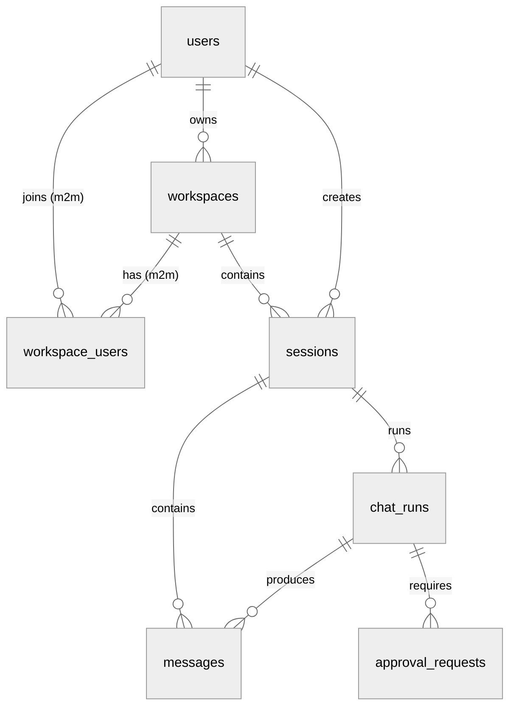
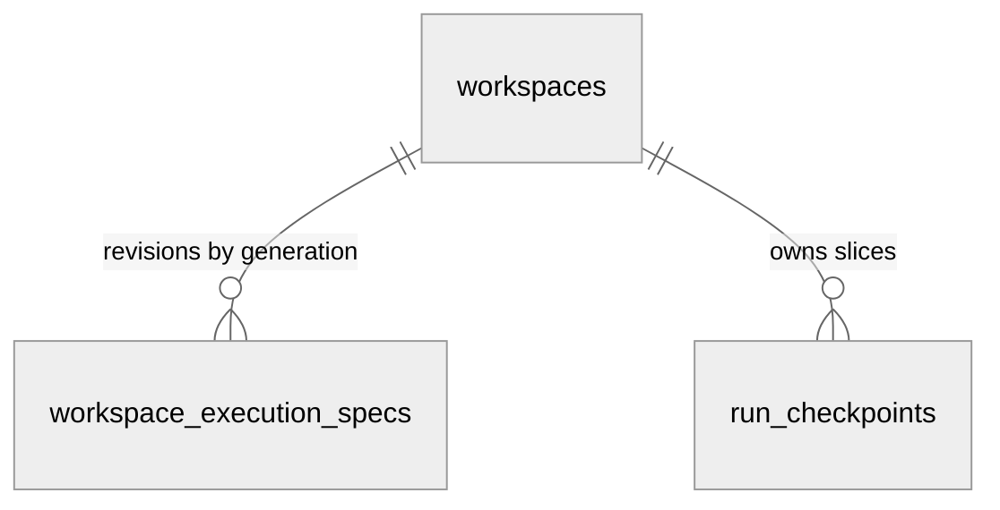
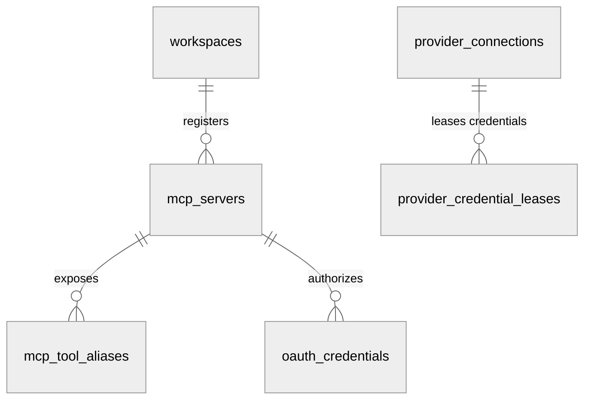
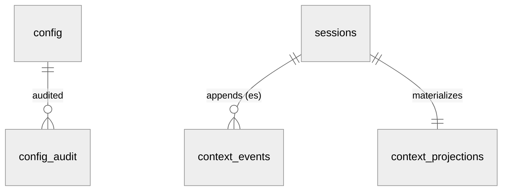
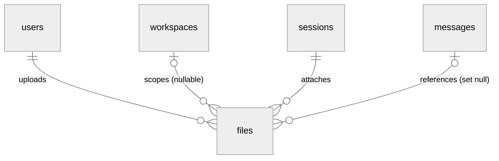
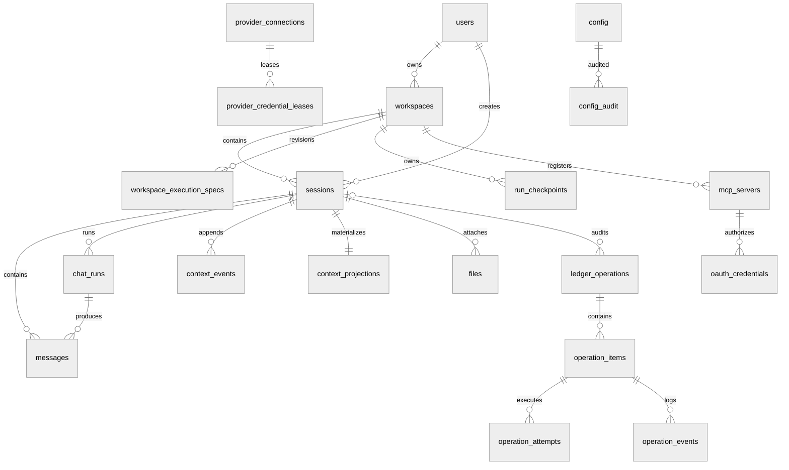
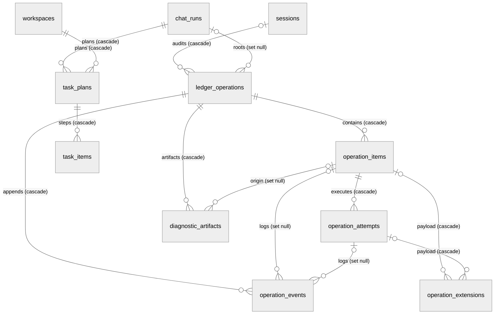

# DEV-019: 数据库设计

> 读者：新加入 XH 的后端 / 全栈开发者。内容：当前最终库表一览（结论先行），细节按域查表。Source of Truth 是 `packages/control-plane/src/main/resources/db/migration/V1~V39`，JPA Entity 只是镜像。前置阅读：[DEV-001](DEV-001-system-architecture.md)（四模块与 PG 定位）、[DEV-014](DEV-014-control-plane-architecture.md)（CP 通道）、[DEV-017](DEV-017-session-architecture.md)（会话语义）、[DEV-003](DEV-003-config-management.md)（Config 三层）。

## 1. 结论与使用规则

| 结论 | 内容 |
|------|------|
| 数据库 | PostgreSQL 17 + pgvector，Docker 镜像 `pgvector/pgvector:pg17`，dev 端口 `12634`，库名/用户名 `xihe` |
| 表数量 | 35 张业务表 + `flyway_schema_history`（Flyway 自维护，不在本文列字段） |
| 权威顺序 | Flyway SQL > JPA Entity > 本文档；`ddl-auto=validate`（PLAN-280），Flyway 是唯一 schema manager |
| 主键风格 | 全部 PostgreSQL 原生 `UUID`（PLAN-280）；Java 侧 @Id 为 `UUID` 类型，FK 列为 `String` + `UuidStringConverter` |
| 时间风格 | 当前 Flyway 链的时间列均为带时区类型：`TIMESTAMPTZ`（V21/V23 以等价的 `TIMESTAMP WITH TIME ZONE` 书写），默认值按各迁移定义；不存在裸 `TIMESTAMP` |
| 删除语义 | `workspaces.deleted_at` 软删 + 部分唯一索引；`messages/context_*` 随 `sessions` 级联删；`files.message_id` 置空 |
| 扩展 | `V1` 内 `CREATE EXTENSION IF NOT EXISTS vector`（幂等）；`document_chunks` 由 Agent 侧 langchain_postgres 自建自管，不在 Flyway 链内 |
| 表格式约定 | 每张表：字段表（一行一字段，`约束` 列只放单列约束）+ 表下索引注释（`CREATE INDEX` 与跨列唯一约束） |

关键入口：

| 入口 | 路径 |
|------|------|
| Compose PG 定义 | `docker-compose.yml`（`postgres` 服务，`./postgres-init:/docker-entrypoint-initdb.d:ro`） |
| 扩展初始化 | `postgres-init/01-enable-pgvector.sql` |
| 连接配置 | `packages/control-plane/src/main/resources/application.properties:12-24`（`datasource.url`、`flyway.locations=classpath:db/migration`） |
| 迁移链 | `packages/control-plane/src/main/resources/db/migration/V1__init_schema.sql` 至 `V39__chat_run_origin.sql`（当前 active chain；V1 基线，V2–V39 增量迁移） |
| Entity 镜像 | `packages/control-plane/src/main/java/com/cc01cc/p/xihe/cp/entity/`（32 个）+ `context/entity/`（3 个） |
| Seed | `packages/control-plane/src/main/java/com/cc01cc/p/xihe/cp/config/DataSeeder.java`（仅 seed `admin@xihe.local`，密码随机不落日志） |

> **PLAN-280 rebaseline（2026-09-07）**：`V1__init_schema.sql` 是当前链的 schema 基线；其后的 V2–V39 继续在 active classpath 中按顺序增量应用。统一原生 UUID、带时区时间类型、显式命名约束与 ON DELETE、`ddl-auto=validate`。更早的历史 V1~V22+U6 编号仍仅作 Git 历史溯源。`spring-boot-flyway` 模块缺失曾导致 Flyway 自动配置从未生效（schema 实际由 Hibernate 建），已在本轮修复。
>
> **版本标注约定**：§2/§3 各表括注与附录 A「旧链首次迁移」列的 `V<n>` 一律是 **rebaseline 前的旧链编号**（迁移溯源用），与 §4 的 active 链（V1~V39）**编号不通用**——例如「旧链 V11」指 `workspace_assignments` 建表，而 active `V11` 是 `mcp_server_tool_timeout`。逐表 active 变更见 §4。

## 2. ER 关系（分域 erDiagram）

> 按域拆成 6 张 `erDiagram`（单图塞全部表会挤成一团）。基数记法：`||--o{` 1 对 0..N，`||--|{` 1 对 1..N，`}o--||` N..0 对 1。无边实体（独立/弱关联表）单独标注。跨域关系在所属域内展示（如 `sessions → context_events` 属配置域视角）。

### 2.1 身份协作（主链）

- `users → workspaces`：`owner_id` FK + 部分唯一（活跃期每 owner 一个 workspace）
- `workspace_users`：联合 PK `(workspace_id, user_id)`，多对多关联表
- `chat_runs → messages`：经 `user_message_id`/`assistant_message_id` 逻辑关联（无 FK 约束）
- `chat_runs → approval_requests`：`run_id` FK

### 2.2 Workspace 执行

- `workspace_execution_specs.workspace_id` FK CASCADE；联合唯一 `(workspace_id, generation)`，每代一条规格快照

### 2.3 MCP 与 Provider

- `mcp_servers` 归属 `workspaces`（`workspace_id` FK，跨域引用身份协作域）
- `mcp_tool_aliases`：联合 PK `(workspace_id, issued_name)`；`server_id` 为逻辑外键（无 FK 约束）
- `oauth_credentials`：唯一 `(user_id, workspace_id, server_id)`，三向绑定
- `provider_credential_leases.provider_connection_id` FK CASCADE；租约发 Agent 一次性使用
- `provider_connection_audit`：无边实体，`provider_connection_id` 可空（删连接留痕），见 §3.4

### 2.4 配置与 RAG / 上下文

- `config_audit.config_id` FK config **ON DELETE SET NULL**（V12 起审计行不随配置删除丢失，决策 #30）；按 `(layer, domain, config_key [+ user_id/workspace_id])` 定位历史配置行（`environment` 为历史快照列）
- `context_events`：UNIQUE `(session_id, sequence)`，Event Sourcing 只追加
- `context_projections`：UNIQUE `session_id`，单会话单投影，可由事件重放重建
- `context_source_hashes` / `document_chunks`：无边实体（前者按 `(workspace_id, source_key)` 去重，后者无 FK 独立生命周期），见 §3.5

### 2.5 文件审计

- `files.user_id` FK NOT NULL；`workspace_id` FK 可空；`session_id` FK CASCADE；`message_id` FK SET NULL
- `audit_logs`：无边实体，`user_id`/`workspace_id` 均可空 FK，业务审计与 `audit.log` 文件互补，见 §3.6

### 2.6 全局视角（单图总览，弱化布局质量换全貌）

代码锚点：实体 = 表名；关系名 = 外键语义（括注为特殊语义：m2m 关联表、无 FK 约束的逻辑外键、nullable、ES 只追加）；无边实体清单见各域小节。字段/索引细节见 §3，DDL 见 §4 迁移对照，Entity 见附录 A。

### 2.7 操作账本与任务连续性

- `ledger_operations` 是审计根，`operation_items` 是通道事实总表，`operation_attempts/operation_events/operation_extensions/diagnostic_artifacts` 依次挂在 item/attempt 上（字段与约束见 §3.7）。
- `operation_extensions` 对 item/attempt 为 `ON DELETE CASCADE`（V34，PLAN-0367 DDL-13；此前 `SET NULL` 与 `ck_operation_extensions_target`（至少一目标非空）的组合使含 extension 行的会话硬删整事务回滚，见 §3.7 与 [DEV-018](DEV-018-known-issues.md)）。
- `task_plans`/`task_items` 为 run 任务连续性（`V6`，见 §3.8）；`task_plans.session_id` 无 FK，仅 run/workspace 建 FK。

## 3. 按域表详情

### 3.1 身份（users）

**users**（`V1`，Entity `entity/User.java`）：唯一登录主体，`role` 仅 `USER/ADMIN`。

| 字段 | 类型 | 约束 | 说明 |
|------|------|------|------|
| id | VARCHAR(36) | PK | UUID 字符串 |
| email | VARCHAR(255) | NOT NULL UNIQUE | 登录键，`DataSeeder` seed `admin@xihe.local` |
| password_hash | VARCHAR(255) | NOT NULL | BCrypt，不存明文 |
| role | VARCHAR(20) | NOT NULL DEFAULT 'USER' | `USER` / `ADMIN` |
| name | VARCHAR(100) | nullable | 展示用 |
| avatar | VARCHAR(512) | nullable | 展示用 |
| created_at | TIMESTAMPTZ | NOT NULL DEFAULT CURRENT_TIMESTAMP | 创建时间 |
| updated_at | TIMESTAMPTZ | NOT NULL DEFAULT CURRENT_TIMESTAMP | 无自动更新触发器，靠 JPA 维护 |

> 索引：`idx_users_email (email)`

### 3.2 协作（workspaces / workspace_users / sessions / messages / chat_runs / run_checkpoints / approval_requests）

**workspaces**（`V1` + `V2/V11/V14`，Entity `entity/Workspace.java`）：`owner_id` 拥有者，`deleted_at` 软删后同 owner 可重建。

| 字段 | 类型 | 约束 | 说明 |
|------|------|------|------|
| id | VARCHAR(36) | PK | — |
| name | VARCHAR(255) | NOT NULL | — |
| description | TEXT | nullable | — |
| owner_id | VARCHAR(36) | NOT NULL FK `users(id)` | 拥有者 |
| storage_backend | VARCHAR(32) | DEFAULT 'host_directory'（`V11`） | 当前 v1 仅 `host_directory` |
| storage_ref | VARCHAR(64) | nullable（`V11`） | `host_directory` 根下 `workspaceId` 派生（历史 `storage_path` 已随 `V32` 删除） |
| generation | INT | DEFAULT 0（`V11`） | 当前执行代数，与 `workspace_execution_specs.generation` 对齐 |
| sandbox_spec_hash | VARCHAR(64) | nullable（`V11`） | 当前生效规格哈希 |
| sandbox_spec | JSONB | nullable（`V11`） | 当前生效规格快照 |
| deleted_at | TIMESTAMPTZ | nullable（`V14`） | 软删标记，删后不阻塞同 owner 新建 |
| created_at | TIMESTAMPTZ | NOT NULL DEFAULT CURRENT_TIMESTAMP | — |
| updated_at | TIMESTAMPTZ | NOT NULL DEFAULT CURRENT_TIMESTAMP | — |

> 索引：
> - `idx_workspaces_owner_id (owner_id)`
> - `idx_workspaces_owner_active (owner_id, created_at) WHERE deleted_at IS NULL` — 部分索引，活跃 workspace 查询（`V14`）
> - 唯一约束 `uq_workspaces_active_owner (owner_id) WHERE deleted_at IS NULL` — 部分唯一，软删后同 owner 可重建（`V14`）

**workspace_users**（`V1` + `V14` 加复合索引，Entity `entity/WorkspaceUser.java`）：多对多成员。

| 字段 | 类型 | 约束 | 说明 |
|------|------|------|------|
| workspace_id | VARCHAR(36) | NOT NULL FK `workspaces(id)`，联合 PK | 归属 |
| user_id | VARCHAR(36) | NOT NULL FK `users(id)`，联合 PK | 成员 |
| role | VARCHAR(20) | NOT NULL DEFAULT 'MEMBER' | 成员角色 |
| created_at | TIMESTAMPTZ | NOT NULL DEFAULT CURRENT_TIMESTAMP | 加入时间 |

> 索引：
> - `idx_workspace_users_user_id (user_id)`
> - `idx_workspace_users_user_workspace (user_id, workspace_id)` — 双向查（`V14`）

**sessions**（`V1` + `V14/V19/V24/V37`，Entity `entity/Session.java`）：服务端 canonical 会话，含单父 Session/run provenance，详见 [DEV-017](DEV-017-session-architecture.md)。

| 字段 | 类型 | 约束 | 说明 |
|------|------|------|------|
| id | VARCHAR(36) | PK | 会话键，SSE `sessionId` 即此 |
| workspace_id | VARCHAR(36) | NOT NULL FK `workspaces(id)` | 归属 |
| user_id | VARCHAR(36) | NOT NULL FK `users(id)` | 归属 |
| title | VARCHAR(255) | nullable | 列表展示 |
| model_provider | VARCHAR(50) | nullable | canonical pair 前半 |
| model_name | VARCHAR(100) | nullable | canonical pair 后半，普通 chat `toolMode=none` |
| archived | BOOLEAN | NOT NULL DEFAULT FALSE | 归档非删除 |
| provider_connection_id | VARCHAR(36) | nullable，无 FK（`V19`） | 逻辑绑定，不做外键避免跨域耦合 |
| connection_revision | BIGINT | nullable（`V19`） | 绑定时的连接版本 |
| approval_mode | VARCHAR(16) | nullable，`ck_sessions_approval_mode`（`V24`） | 会话审批模式 `manual`/`auto`；NULL = 继承 workspace 的 `approval-policy.mode`（PLAN-0337） |
| spawned_from_session_id | UUID | nullable（`V37`） | 父 Session；spawn/fork 的单父来源，不做 FK 级联 |
| spawned_from_run_id | UUID | nullable（`V37`） | 父 ChatRun；停止传播与 lineage 查询来源 |
| spawned_at | TIMESTAMPTZ | nullable（`V37`） | 派生创建时间 |
| created_at | TIMESTAMPTZ | NOT NULL DEFAULT CURRENT_TIMESTAMP | — |
| updated_at | TIMESTAMPTZ | NOT NULL DEFAULT CURRENT_TIMESTAMP | — |

> 索引：
> - `idx_sessions_workspace_id (workspace_id)`
> - `idx_sessions_user_id (user_id)`
> - `idx_sessions_archived (archived)`
> - `idx_sessions_workspace_user_active (workspace_id, user_id, archived, created_at DESC)` — 会话列表复合索引（`V14`）
> - `idx_sessions_provider_connection (provider_connection_id)`（`V19`）
> - `idx_sessions_spawned_from_session (spawned_from_session_id) WHERE spawned_from_session_id IS NOT NULL`（`V37`）
> - `idx_sessions_spawned_from_run (spawned_from_run_id) WHERE spawned_from_run_id IS NOT NULL`（`V37`）

**messages**（`V1` + `V6/V14/V16`，Entity `entity/Message.java`）：`session_id` 级联删（`V14` 重建 FK 加 `ON DELETE CASCADE`）。

| 字段 | 类型 | 约束 | 说明 |
|------|------|------|------|
| id | VARCHAR(36) | PK | — |
| session_id | VARCHAR(36) | NOT NULL FK `sessions(id) ON DELETE CASCADE` | 删会话清消息 |
| role | VARCHAR(20) | NOT NULL | `user/assistant/system/tool` 等，见 `MessageRole` |
| content | TEXT | NOT NULL | 正文 |
| attachments | JSONB | nullable（`V6`） | 内联附件摘要，canonical 附件在 `files` |
| run_id | VARCHAR(36) | nullable FK `chat_runs(id)`（`V16`） | 归属轮次，见 §3.2 `chat_runs` |
| created_at | TIMESTAMPTZ | NOT NULL DEFAULT CURRENT_TIMESTAMP | 排序键 |

> 索引：
> - `idx_messages_session_id (session_id)`
> - `idx_messages_run_id (run_id)`（`V16`）

**chat_runs**（`V16` + `V19/V22/V39`，Entity `entity/ChatRun.java`）：一次用户提交或 CP 内部 spawn 派生执行（PLAN-247/0407），同幂等键不重复起 Agent。

| 字段 | 类型 | 约束 | 说明 |
|------|------|------|------|
| id | VARCHAR(36) | PK | — |
| session_id | VARCHAR(36) | NOT NULL FK `sessions(id)` | 归属 |
| user_id | VARCHAR(36) | NOT NULL FK `users(id)` | 归属 |
| workspace_id | VARCHAR(36) | NOT NULL FK `workspaces(id)` | 归属 |
| idempotency_key | VARCHAR(128) | NOT NULL | 幂等键，见下方唯一约束 |
| request_hash | VARCHAR(64) | NOT NULL | 请求 payload 哈希，同 key 比对 |
| origin | VARCHAR(24) | NOT NULL，`ck_chat_runs_origin`（`V39`） | `user_submission` / `spawn`；历史行回填为 user_submission；公开 POST 只允许前者 |
| provider | VARCHAR(50) | nullable | 全链路透传 |
| model | VARCHAR(100) | nullable | 全链路透传 |
| tool_mode | VARCHAR(20) | NOT NULL DEFAULT 'none' | 普通 chat `none`，workspace 操作 `workspace` |
| user_message_id | VARCHAR(36) | nullable，无 FK | 逻辑关联，避免循环 FK |
| assistant_message_id | VARCHAR(36) | nullable，无 FK | 逻辑关联，避免循环 FK |
| status | VARCHAR(24) | NOT NULL | 运行态 |
| terminal_outcome | VARCHAR(24) | nullable | `success/error/partial/ambiguous` 终态 |
| error_code | VARCHAR(64) | nullable | 给 UI 分支 |
| error_detail | TEXT | nullable | 脱敏后写 |
| token_count | INTEGER | NOT NULL DEFAULT 0 | 计量 |
| assistant_chars | INTEGER | NOT NULL DEFAULT 0 | 计量 |
| provider_connection_id | VARCHAR(36) | nullable，无 FK（`V19`） | 本轮实际用的连接 |
| connection_revision | BIGINT | nullable（`V19`） | 连接版本快照 |
| lease_owner | VARCHAR(80) | nullable（`V22`） | 单并发租约持有者，防双发 |
| lease_expires_at | TIMESTAMPTZ | nullable（`V22`） | 租约过期时间 |
| created_at | TIMESTAMPTZ | NOT NULL DEFAULT NOW() | — |
| updated_at | TIMESTAMPTZ | NOT NULL DEFAULT NOW() | — |

> 索引：
> - `idx_chat_runs_session_created (session_id, created_at)`
> - `idx_chat_runs_provider_connection (provider_connection_id, connection_revision)`（`V19`）
> - `idx_chat_runs_active_lease (session_id, status, lease_expires_at)` — 活跃租约判定（`V22`）
> - 唯一约束 `(user_id, session_id, idempotency_key)` — 同 key 不重复起 run，同 key 不同 payload 报冲突
> - 部分唯一 `uq_chat_runs_spawn_event_idempotency (user_id, idempotency_key) WHERE origin='spawn'`（`V39`）— 同父 durable event 即使重试使用不同 child Session 也只落一个 spawn ChatRun

**grants**（`V38`，Entity `entity/AuthorizationGrant.java`）：主体授权的可升级存储；多态 principal 引用不设跨域 FK。

| 字段 | 类型 | 约束 | 说明 |
|------|------|------|------|
| id | UUID | PK | — |
| granter_type / granter_id | VARCHAR(24) / UUID | nullable，成对检查 `ck_grants_granter_ref` | 授权来源 principal；系统 seed 可为空 |
| subject_type / subject_id | VARCHAR(24) / UUID | NOT NULL | 实际接收权限的 principal（user/agent） |
| permissions | JSONB | NOT NULL | 权限集合与 resource scope |
| source | VARCHAR(16) | NOT NULL，`ck_grants_source` | `default/spawn/direct/template` |
| role_name / template_name | TEXT | nullable | 来源名称快照 |
| created_at | TIMESTAMPTZ | NOT NULL DEFAULT NOW() | 创建时间 |
| read_state | VARCHAR(16) | NOT NULL DEFAULT `unread`，`ck_grants_read_state` | `unread/read` 收件状态 |

> 索引：`idx_grants_subject(subject_type, subject_id)`；`uq_grants_default_subject(subject_type, subject_id) WHERE source='default'` — 每主体一份默认权限集；spawn/direct/template 同主体允许多条。

**run_checkpoints**（PLAN-0339 T0.4 / V27 重建，workspace slice projection）：每行代表一个 workspace 时间线切片，不再代表某个 Run 的区间。0339 上线时先物理清空旧投影行，再按以下切片语义重建；不转换、不回填旧格式数据。

| 字段 | 类型 | 约束 | 说明 |
|------|------|------|------|
| id | UUID | PK | CP 投影行键 |
| workspace_id | VARCHAR(36) | NOT NULL FK `workspaces(id) ON DELETE CASCADE` | workspace 归属 |
| slice_ref | TEXT | nullable（有效切片唯一；降级捕获可为空） | Runtime 影子 Git `refs/xihe/slices/<capturedAt>-<hash>` |
| captured_at | TIMESTAMPTZ | nullable（降级捕获可为空） | 切片捕获时刻；按此排序 |
| source_run_id | VARCHAR(36) | nullable | 产生该切片的 Run；C0 可空 |
| source_session_id | VARCHAR(36) | nullable | 来源会话；C0/异常补拍可空 |
| predecessor_ref | TEXT | nullable | 捕获时链尾前驱，缺失时不回填全量差异 |
| changed_files | JSONB | NOT NULL DEFAULT '[]' | 相对前一切片的 `[{status, path}]`，不做来源归因 |
| changed_count | INTEGER | NOT NULL DEFAULT 0 | 完整变更数量，不受 UI 列表截断影响 |
| opaque_nested_repos | JSONB | NOT NULL DEFAULT '[]' | 不透明 gitlink 路径清单，内容不参与恢复 |
| state | VARCHAR(24) | NOT NULL CHECK `captured/abnormal-captured/degraded/expired` | 捕获状态；`degraded` 仅表示捕获失败 |
| unrollable_reason | VARCHAR(64) | nullable | 当前仅 `UNAVAILABLE` |
| revert_state | VARCHAR(16) | NOT NULL DEFAULT 'none' | `none/rolled_back/partial/failed` |
| revert_ref | TEXT | nullable | 本次恢复目标切片 ref |
| revert_summary | JSONB | nullable | 脱敏后的计数、逐路径结果、安全原因 |
| reverted_at | TIMESTAMPTZ | nullable | 最近一次接受的恢复时间 |
| revert_attempt_count | INTEGER | NOT NULL DEFAULT 0 | 恢复尝试次数 |
| created_at | TIMESTAMPTZ | NOT NULL DEFAULT NOW() | 投影创建时间 |
| updated_at | TIMESTAMPTZ | NOT NULL DEFAULT NOW() | 投影更新时间 |

> 索引与约束：`idx_run_checkpoints_workspace_captured (workspace_id, captured_at DESC)`；有效 `slice_ref` 在 workspace 内唯一。公共列表只返回非 `expired` 行；清理流程先成功删除 Runtime shadow Git，再删除该 workspace 的投影行。

**approval_requests**（基线 `V1` 内建，`V7` 加 `grant_consumed_at`，`V9` 加 `arguments_hash`，`V25` 加 `origin`；Entity `entity/ChatApproval.java`）：工具高危操作人审。

| 字段 | 类型 | 约束 | 说明 |
|------|------|------|------|
| request_id | VARCHAR(36) | PK | 请求键 |
| run_id | VARCHAR(36) | NOT NULL FK `chat_runs(id)` | 归属轮次 |
| session_id | VARCHAR(36) | NOT NULL FK `sessions(id)` | 归属 |
| user_id | VARCHAR(36) | NOT NULL FK `users(id)` | 归属 |
| workspace_id | VARCHAR(36) | NOT NULL FK `workspaces(id)` | 归属 |
| tool | VARCHAR(80) | NOT NULL | 待审批工具 |
| action | VARCHAR(512) | NOT NULL | 待审批动作 |
| details | TEXT | nullable | 动作详情 |
| state | VARCHAR(24) | NOT NULL | `pending/approved/rejected/expired` 等 |
| approved | BOOLEAN | nullable | 空表未决 |
| expires_at | TIMESTAMPTZ | NOT NULL | 超时自动过期 |
| decided_at | TIMESTAMPTZ | nullable | 决策时间 |
| dispatch_error_code | VARCHAR(64) | nullable | 下发失败码 |
| grant_consumed_at | TIMESTAMPTZ | nullable | grant 单次消费时间（`V7`） |
| arguments_hash | VARCHAR(96) | nullable | canonical arguments SHA-256（`V9`，PLAN-292 M1 grant 哈希匹配；存量行为 NULL 走 legacy 比对） |
| origin | VARCHAR(16) | nullable，`ck_approval_requests_origin`（`V25`） | 创建来源：`cp_gate`（CP 闸门判定后创建）/ `agent_relay`（Agent 中继的模型显式 `request_approval`）；NULL = 本列引入前的历史行。用于审计/统计区分两条创建路径（PLAN-0337） |
| created_at | TIMESTAMPTZ | NOT NULL DEFAULT NOW() | — |
| updated_at | TIMESTAMPTZ | NOT NULL DEFAULT NOW() | — |

> 索引：
> - `idx_approval_requests_session_state (session_id, user_id, workspace_id, state, created_at)`
> - `idx_approval_requests_run_state (run_id, state)`

### 3.3 Workspace 执行（workspace_execution_specs）

**workspace_execution_specs**（`V1` 内建；旧链溯源：旧 V11 建 `workspace_assignments`、旧 V12 加唯一、旧 V13 重命名；Entity `entity/WorkspaceExecutionSpec.java`）：期望执行规格（非调度绑定，旧 V13 注释原名误导已纠正）。

| 字段 | 类型 | 约束 | 说明 |
|------|------|------|------|
| id | UUID | PK DEFAULT `gen_random_uuid()` | 内部分配键 |
| workspace_id | VARCHAR(36) | NOT NULL FK `workspaces(id) ON DELETE CASCADE` | 删 workspace 清规格 |
| generation | INT | NOT NULL | 单调递增，Runtime 按 `workspaceId` 懒加载对应用代 |
| sandbox_spec_hash | VARCHAR(64) | NOT NULL | 规格哈希，`workspaces` 镜像当前代 |
| sandbox_spec | JSONB | NOT NULL | 规格内容，`workspaces` 镜像当前代 |
| storage_backend | VARCHAR(32) | NOT NULL DEFAULT 'host_directory' | 与 `workspaces` 同义，历史行保留当时值 |
| storage_ref | VARCHAR(64) | NOT NULL | 与 `workspaces` 同义，历史行保留当时值 |
| actor | VARCHAR(255) | nullable | 谁创建此代 |
| reason | VARCHAR(512) | nullable | 因何创建此代 |
| created_at | TIMESTAMPTZ | NOT NULL DEFAULT NOW() | 代创建时间即版本序 |

> 索引：
> - `idx_workspace_execution_specs_workspace_generation (workspace_id, generation)`
> - 唯一约束 `uq_workspace_execution_specs_workspace_generation (workspace_id, generation)` — 同代唯一

### 3.4 MCP 与 Provider（mcp_remote_servers / mcp_stdio_servers / mcp_tool_aliases / oauth_credentials / provider_connections / provider_credential_leases / provider_connection_audit）

**mcp_remote_servers**（`V1` 以 `mcp_servers` 建表，`V12` 改名并同步约束/索引名；Entity `entity/McpServer.java` 类名保留，决策 #38②）：workspace 下 **remote** server 注册（HTTP + OAuth/no-auth）。

| 字段 | 类型 | 约束 | 说明 |
|------|------|------|------|
| id | VARCHAR(36) | PK | — |
| workspace_id | VARCHAR(36) | NOT NULL FK `workspaces(id)` | 归属 |
| name | VARCHAR(255) | NOT NULL | `serverId` 路由键见 DEV-030 附录 |
| endpoint | VARCHAR(512) | NOT NULL | 服务端点 |
| enabled | BOOLEAN | NOT NULL DEFAULT TRUE | 禁用即摘流 |
| auth_mode | VARCHAR(16) | NOT NULL DEFAULT 'oauth'（旧链 V15） | `oauth` / `no-auth`（公开免 broker） |
| created_at | TIMESTAMPTZ | NOT NULL DEFAULT CURRENT_TIMESTAMP | — |
| updated_at | TIMESTAMPTZ | NOT NULL DEFAULT CURRENT_TIMESTAMP | — |

> 索引：`idx_mcp_remote_servers_workspace_id (workspace_id)`（V12 改名）

**mcp_stdio_servers**（`V12` 新建，Entity `entity/McpStdioServer.java`）：workspace 下 **stdio** server（Claude Desktop 形态配置），自 config 域 `mcp` 迁出（决策 #27）。

| 字段 | 类型 | 约束 | 说明 |
|------|------|------|------|
| id | UUID | PK DEFAULT `gen_random_uuid()` | — |
| workspace_id | UUID | NOT NULL FK `workspaces(id) ON DELETE CASCADE` | 归属 |
| name | VARCHAR(255) | NOT NULL，`uq_mcp_stdio_servers_workspace_name (workspace_id, name)` | 配置键/serverId |
| config | JSONB | NOT NULL，`ck_mcp_stdio_servers_config` 要求 object | 单 server 配置（command/args/env 等） |
| enabled | BOOLEAN | NOT NULL DEFAULT TRUE | 禁用即摘流 |
| created_at / updated_at | TIMESTAMPTZ | NOT NULL DEFAULT NOW() | — |

> 索引：`idx_mcp_stdio_servers_workspace (workspace_id)`；Runtime 经 `GET /internal/v1/workspaces/{wsId}/stdio-servers` 每 30s diff 同步

**mcp_tool_aliases**（`V1`；旧链 V15 溯源，Entity `entity/McpToolAlias.java`）：sticky 工具别名，冲突仅新者加前缀、永不晋升。

| 字段 | 类型 | 约束 | 说明 |
|------|------|------|------|
| workspace_id | VARCHAR(36) | NOT NULL FK `workspaces(id)`，联合 PK | 归属 |
| issued_name | VARCHAR(255) | NOT NULL，联合 PK | 下发名 |
| server_id | VARCHAR(36) | NOT NULL | 真实后端 server |
| backend_name | VARCHAR(255) | NOT NULL | 真实后端工具名 |
| generation | BIGINT | NOT NULL DEFAULT 0 | 每次 `tools/list` 合并递增，审计回放用 |
| created_at | TIMESTAMPTZ | NOT NULL DEFAULT CURRENT_TIMESTAMP | — |
| updated_at | TIMESTAMPTZ | NOT NULL DEFAULT CURRENT_TIMESTAMP | — |

> 索引：`idx_mcp_tool_aliases_server (workspace_id, server_id)`

**oauth_credentials**（`V9`，Entity `entity/OAuthCredential.java`）：CP token broker 持久化的加密 refresh token。

| 字段 | 类型 | 约束 | 说明 |
|------|------|------|------|
| id | VARCHAR(36) | PK | — |
| user_id | VARCHAR(36) | NOT NULL FK `users(id)` | 归属 |
| workspace_id | VARCHAR(36) | NOT NULL FK `workspaces(id)` | 归属 |
| server_id | VARCHAR(36) | NOT NULL FK `mcp_servers(id)` | 归属 |
| client_id | VARCHAR(255) | NOT NULL | OAuth client |
| token_endpoint | VARCHAR(512) | NOT NULL | token 端点 |
| redirect_uri | VARCHAR(512) | NOT NULL | 回跳地址 |
| scope | VARCHAR(1024) | NOT NULL | 授权范围 |
| refresh_token_ciphertext | TEXT | NOT NULL | 信封加密密文 |
| encryption_key_version | VARCHAR(32) | NOT NULL | 密钥版本，用于轮转 |
| status | VARCHAR(32) | NOT NULL DEFAULT 'AUTHORIZED' | 授权态 |
| created_at | TIMESTAMPTZ | NOT NULL DEFAULT CURRENT_TIMESTAMP | — |
| updated_at | TIMESTAMPTZ | NOT NULL DEFAULT CURRENT_TIMESTAMP | — |

> 索引：
> - `idx_oauth_credentials_workspace (workspace_id)`
> - `idx_oauth_credentials_server (server_id)`
> - 唯一约束 `(user_id, workspace_id, server_id)` — 单用户单空间单服单凭证

**provider_connections**（`V18`，Entity `entity/ProviderConnection.java`）：LLM Provider 连接（PLAN-261）。归属现为**两级** `USER / WORKSPACE`；`SYSTEM` 归属已退役（PLAN-0364 M2：不再创建/可见/可选），但 **CHECK 保留 `SYSTEM` 值不收紧**——为将来 `AGENT` 等主体类型留扩展位（BL-18，DEV-032 §1.1）。

| 字段 | 类型 | 约束 | 说明 |
|------|------|------|------|
| id | VARCHAR(36) | PK | — |
| owner_type | VARCHAR(16) | NOT NULL CHECK `SYSTEM/WORKSPACE/USER`（现用 `USER/WORKSPACE`；CHECK 不收紧以保留扩展位） | 作用域 |
| owner_id | VARCHAR(64) | NOT NULL | 作用域 ID |
| provider_id | VARCHAR(128) | NOT NULL | 如 `openai/deepseek` |
| label | VARCHAR(128) | NOT NULL | 展示名 |
| base_url | VARCHAR(2048) | nullable | 自建网关覆盖 |
| credential_ciphertext | TEXT | nullable | 信封加密，独立 key |
| encryption_key_version | VARCHAR(32) | NOT NULL | 密钥版本 |
| enabled | BOOLEAN | NOT NULL DEFAULT TRUE | 启用开关 |
| status | VARCHAR(32) | NOT NULL DEFAULT 'UNVERIFIED' CHECK `UNVERIFIED/VERIFYING/READY/INVALID_CREDENTIALS/UNREACHABLE/DISABLED` | 可用态 |
| model_discovery | VARCHAR(32) | NOT NULL DEFAULT 'remote-models' CHECK `remote-models/litellm-catalog/curated/manual` | 模型来源 |
| manual_models | JSONB | nullable | 手工模型清单 |
| revision | BIGINT | NOT NULL DEFAULT 1 | 每次改连接 +1，`sessions/chat_runs` 存快照比对 |
| last_verified_at | TIMESTAMPTZ | nullable | 连通性验证时间 |
| last_error_code | VARCHAR(64) | nullable | 最近错误码 |
| created_at | TIMESTAMPTZ | NOT NULL DEFAULT CURRENT_TIMESTAMP | — |
| updated_at | TIMESTAMPTZ | NOT NULL DEFAULT CURRENT_TIMESTAMP | — |

> 索引：
> - `idx_provider_connections_owner (owner_type, owner_id, enabled)`
> - `idx_provider_connections_provider_status (provider_id, status, enabled)`
> - 唯一约束 `(owner_type, owner_id, provider_id)` — 同 scope 同 provider 一条

**provider_credential_leases**（`V18`，Entity `entity/ProviderCredentialLease.java`）：发给 Agent 的一次性短期凭证租约。

| 字段 | 类型 | 约束 | 说明 |
|------|------|------|------|
| id | VARCHAR(36) | PK | — |
| lease_hash | VARCHAR(128) | NOT NULL UNIQUE | Agent 兑换键 |
| provider_connection_id | VARCHAR(36) | NOT NULL FK `provider_connections(id) ON DELETE CASCADE` | 删连接清租约 |
| user_id | VARCHAR(36) | NOT NULL | 发放对象 |
| workspace_id | VARCHAR(36) | nullable | 绑定空间 |
| session_id | VARCHAR(36) | nullable | 绑定会话 |
| run_id | VARCHAR(36) | nullable | 绑定轮次 |
| provider_id | VARCHAR(128) | NOT NULL | 本次允许的 provider |
| model | VARCHAR(255) | NOT NULL | 本次允许的模型 |
| expires_at | TIMESTAMPTZ | NOT NULL | 过期时间 |
| redeemed_at | TIMESTAMPTZ | nullable | 兑换时间 |
| revoked_at | TIMESTAMPTZ | nullable | 吊销时间 |
| created_at | TIMESTAMPTZ | NOT NULL DEFAULT CURRENT_TIMESTAMP | — |

> 索引：
> - `idx_provider_credential_leases_expiry (expires_at)` — 过期扫描
> - `idx_provider_credential_leases_binding (provider_connection_id, user_id, run_id)` — 绑定查询

**provider_connection_audit**（`V20`，Entity `entity/ProviderConnectionAudit.java`）：只追加审计，`provider_connection_id` 可空（删连接后仍留痕）。

| 字段 | 类型 | 约束 | 说明 |
|------|------|------|------|
| id | VARCHAR(36) | PK | — |
| provider_connection_id | VARCHAR(36) | nullable，无 FK | 故意不级联 |
| owner_type | VARCHAR(16) | NOT NULL | 冗余当时归属 |
| owner_id | VARCHAR(64) | NOT NULL | 冗余当时归属 |
| provider_id | VARCHAR(128) | NOT NULL | 冗余当时归属 |
| action | VARCHAR(32) | NOT NULL | 动作 |
| changed_by | VARCHAR(64) | NOT NULL | 操作人 |
| from_status | VARCHAR(32) | nullable | 状态变迁 |
| to_status | VARCHAR(32) | nullable | 状态变迁 |
| credential_present | BOOLEAN | NOT NULL DEFAULT FALSE | 是否含凭证 |
| credential_last4 | VARCHAR(4) | nullable | 只存后四位，禁存明文 |
| connection_revision | BIGINT | NOT NULL | 当时 revision |
| created_at | TIMESTAMPTZ | NOT NULL DEFAULT CURRENT_TIMESTAMP | 时间序 |

> 索引：
> - `idx_provider_connection_audit_connection (provider_connection_id, created_at)`
> - `idx_provider_connection_audit_owner (owner_type, owner_id, created_at)`

### 3.5 配置与 RAG（config / config_audit / document_chunks / context_events / context_projections / context_source_hashes）

**config**（`V1` 建表，`V12` 三层化 + 删列，`V13` 旧键清理；Entity `entity/ConfigEntity.java`）：三层配置 canonical 存储（`instance / workspace / user`，解析链 `workspace > user > instance > 代码默认`），语义与域集见 [DEV-003](DEV-003-config-management.md) §1。

| 字段 | 类型 | 约束 | 说明 |
|------|------|------|------|
| id | BIGSERIAL | PK | 自增主键 |
| layer | VARCHAR(16) | NOT NULL，`ck_config_layer` | `instance` / `workspace` / `user`（V12 前为 SYSTEM/ADMIN/USER，`admin` 已规范化为 `instance`） |
| user_id | UUID | nullable FK `users(id) ON DELETE CASCADE`，`ck_config_scope_binding` | `layer=user` 必填（V12 加） |
| workspace_id | UUID | nullable FK `workspaces(id) ON DELETE CASCADE`，`ck_config_scope_binding` | `layer=workspace` 必填（V12 加） |
| domain | VARCHAR(32) | NOT NULL | 九域：`llm-provider`/`context-policy`/`embedding`/`rag`/`agent-runtime`/`agent-profile`/`user-preference`/`logging`/`approval-policy`（后者 V24 起，仅 workspace 层，PLAN-0337） |
| config_key | VARCHAR(64) | NOT NULL | 配置键 |
| config_value | TEXT | nullable | 值（结构化值为 JSON 文本）；**一切凭证键禁写**——`rejectProviderSecrets` 对 `*ApiKey`/secret/password/token 返回 403，凭证只归 `provider_connections`/env 兜底（决策 #21/#37） |
| updated_by | VARCHAR(64) | nullable | 修改人 |
| created_at | TIMESTAMPTZ | NOT NULL DEFAULT NOW()（V8 补齐） | — |
| updated_at | TIMESTAMPTZ | DEFAULT NOW() | 修改时间 |

> 已删列（V12）：`environment`（层内去环境维）、`mcp_config`（迁 `mcp_stdio_servers`）、`is_set`；`idx_config_lookup` 已由 V8 删除。
>
> 索引与约束：
> - `uq_config_instance_scope (domain, config_key) WHERE layer = 'instance'` — 部分唯一
> - `uq_config_workspace_scope (workspace_id, domain, config_key) WHERE layer = 'workspace'` — 部分唯一
> - `uq_config_user_scope (user_id, domain, config_key) WHERE layer = 'user'` — 部分唯一
> - `ck_config_scope_binding`：instance 无标识列 / user 仅 user_id / workspace 仅 workspace_id
>
> V13 清理：非八域行（`infrastructure`/`workspace-config`/`mcp` 等）、各域已迁移/废弃键（全部 `*ApiKey`、`contextPolicy`、`user-preference.{defaultModel,maxTokens,temperature}`、logging 非五级键）直接删除，不做搬移（决策 #39）。

**config_audit**（`V1` 建表；密钥脱敏为旧链 V17 溯源；Entity `entity/ConfigAuditEntity.java`）：配置变更审计。

| 字段 | 类型 | 约束 | 说明 |
|------|------|------|------|
| id | BIGSERIAL | PK | — |
| config_id | BIGINT | nullable FK `config(id) ON DELETE SET NULL`（V12 起，审计不随配置删除丢失，决策 #30） | 关联配置行 |
| environment | VARCHAR(32) | nullable | 历史快照列（V12 后不再写入） |
| layer | VARCHAR(16) | nullable | 当时值 |
| domain | VARCHAR(32) | nullable | 当时值 |
| config_key | VARCHAR(64) | nullable | 当时值 |
| old_value | TEXT | nullable | 旧链 V17 起 `llm-provider` 域含 `apikey/secret/password/token` 的历史值改写为 `missing` 或 `present:legacy:<md5>` |
| new_value | TEXT | nullable | 同上，禁明文留痕 |
| changed_by | VARCHAR(64) | nullable | 修改人 |
| changed_at | TIMESTAMPTZ | DEFAULT NOW() | 修改时间 |

> 索引：`idx_config_audit_config_id (config_id)`

**document_chunks**（`V3`）：RAG 向量表，无 FK，独立生命周期。

| 字段 | 类型 | 约束 | 说明 |
|------|------|------|------|
| id | VARCHAR(36) | PK | chunk 键 |
| page_content | TEXT | NOT NULL | 切片正文 |
| embedding | vector(1536) | NOT NULL | `text-embedding-3-small` 维度 |
| cmetadata | JSONB | nullable | 来源元数据 |
| document_id | VARCHAR(36) | nullable | 来源文档 |
| chunk_index | INT | nullable | 切片序号 |
| created_at | TIMESTAMPTZ | DEFAULT CURRENT_TIMESTAMP | — |

> 索引：
> - `idx_chunks_embedding` — `ivfflat (embedding vector_cosine_ops) WITH (lists=100)`，余弦检索
> - `idx_chunks_document_id (document_id)`

**context_events**（`V7` + `V14` 级联，Entity `context/entity/ContextEvent.java`）：Agent Event Sourcing 事件表，只追加；见 [DEV-013](DEV-013-agent-architecture.md) 与 [DEV-017](DEV-017-session-architecture.md)。

| 字段 | 类型 | 约束 | 说明 |
|------|------|------|------|
| id | UUID | PK DEFAULT `gen_random_uuid()` | — |
| session_id | VARCHAR(36) | NOT NULL FK `sessions(id) ON DELETE CASCADE` | 归属会话 |
| workspace_id | VARCHAR(36) | NOT NULL | 冗余归属 |
| user_id | VARCHAR(36) | NOT NULL | 冗余归属 |
| event_type | VARCHAR(50) | NOT NULL | 事件类型 |
| sequence | BIGINT | NOT NULL | 单会话单调序号 |
| payload | JSONB | NOT NULL DEFAULT '{}' | 事件内容 |
| correlation_id | VARCHAR(36) | nullable | 关联链 |
| causation_id | VARCHAR(36) | nullable | 因果链 |
| created_at | TIMESTAMPTZ | NOT NULL DEFAULT CURRENT_TIMESTAMP | — |

> 索引：
> - `idx_context_events_session_id (session_id)`
> - `idx_context_events_session_sequence (session_id, sequence)`
> - `idx_context_events_workspace_id (workspace_id)`
> - `idx_context_events_event_type (event_type)`
> - 唯一约束 `(session_id, sequence)` — 单会话内序号唯一

**context_projections**（`V7` + `V14` 级联，Entity `context/entity/ContextProjection.java`）：事件物化视图，重放 `context_events` 可重建。

| 字段 | 类型 | 约束 | 说明 |
|------|------|------|------|
| id | UUID | PK DEFAULT `gen_random_uuid()` | — |
| session_id | VARCHAR(36) | NOT NULL UNIQUE FK `sessions(id) ON DELETE CASCADE` | 单会话单投影 |
| workspace_id | VARCHAR(36) | NOT NULL | 冗余归属 |
| user_id | VARCHAR(36) | NOT NULL | 冗余归属 |
| projection_type | VARCHAR(50) | NOT NULL DEFAULT 'agent_context' | 投影类型 |
| latest_sequence | BIGINT | NOT NULL DEFAULT 0 | 已物化到的事件序号 |
| payload | JSONB | NOT NULL DEFAULT '{}' | 投影内容 |
| created_at | TIMESTAMPTZ | NOT NULL DEFAULT CURRENT_TIMESTAMP | — |
| updated_at | TIMESTAMPTZ | NOT NULL DEFAULT CURRENT_TIMESTAMP | — |

> 索引：
> - `idx_context_projections_session_id (session_id)`
> - `idx_context_projections_workspace_id (workspace_id)`

**context_source_hashes**（`V8`，Entity `context/entity/ContextSourceHash.java`）：增量源哈希去重。

| 字段 | 类型 | 约束 | 说明 |
|------|------|------|------|
| id | UUID | PK DEFAULT `gen_random_uuid()` | — |
| workspace_id | VARCHAR(36) | NOT NULL | 归属 |
| source_key | VARCHAR(255) | NOT NULL | 源标识 |
| hash | VARCHAR(64) | NOT NULL | 内容哈希 |
| created_at | TIMESTAMPTZ | NOT NULL DEFAULT CURRENT_TIMESTAMP | — |
| updated_at | TIMESTAMPTZ | NOT NULL DEFAULT CURRENT_TIMESTAMP | — |

> 索引：
> - `idx_context_source_hashes_workspace_id (workspace_id)`
> - `idx_context_source_hashes_source_key (source_key)`
> - 唯一约束 `(workspace_id, source_key)` — 同源一行

### 3.6 文件审计（files / audit_logs）

**files**（`V1` + `V6`，Entity `entity/File.java`）：附件 canonical，物理路径 `{attachments-base-path}/{sessionId}/{fileId}`，见 [DEV-014 §5](DEV-014-control-plane-architecture.md)。

| 字段 | 类型 | 约束 | 说明 |
|------|------|------|------|
| id | VARCHAR(36) | PK | `fileId` 即文件名键 |
| user_id | VARCHAR(36) | NOT NULL FK `users(id)` | 上传者 |
| workspace_id | VARCHAR(36) | nullable FK `workspaces(id)` | 空 = 会话级附件 |
| filename | VARCHAR(255) | NOT NULL | 原始文件名 |
| mime_type | VARCHAR(127) | nullable | MIME 类型 |
| size_bytes | BIGINT | NOT NULL DEFAULT 0 | 白名单校验 + 500MB 上限在 Controller 层 |
| storage_path | VARCHAR(512) | NOT NULL | 物理路径 |
| session_id | VARCHAR(36) | nullable FK `sessions(id) ON DELETE CASCADE`（`V6`） | 删会话清附件 |
| message_id | VARCHAR(36) | nullable FK `messages(id) ON DELETE SET NULL`（`V6`） | 删消息保留文件行 |
| created_at | TIMESTAMPTZ | NOT NULL DEFAULT CURRENT_TIMESTAMP | orphan 清理 24h 窗口基准 |

> 索引：
> - `idx_files_user_id (user_id)`
> - `idx_files_workspace_id (workspace_id)`
> - `idx_files_session_id (session_id)`（`V6`）
> - `idx_files_message_id (message_id)`（`V6`）

**audit_logs**（`V1`）：业务审计（MCP 工具调用另写 `audit.log` 文件，见 DEV-014 §5，两者互补）。

| 字段 | 类型 | 约束 | 说明 |
|------|------|------|------|
| id | VARCHAR(36) | PK | — |
| user_id | VARCHAR(36) | nullable FK `users(id)` | 系统动作可空 |
| workspace_id | VARCHAR(36) | nullable FK `workspaces(id)` | 系统动作可空 |
| action | VARCHAR(100) | NOT NULL | 动作 |
| resource_type | VARCHAR(50) | nullable | 资源类型 |
| resource_id | VARCHAR(36) | nullable | 资源 ID |
| details | TEXT | nullable | 脱敏后 JSON |
| created_at | TIMESTAMPTZ | NOT NULL DEFAULT CURRENT_TIMESTAMP | — |

> 索引：
> - `idx_audit_logs_user_id (user_id)`
> - `idx_audit_logs_workspace_id (workspace_id)`
> - `idx_audit_logs_action (action)`

### 3.7 操作账本（ledger_operations / operation_items / operation_attempts / operation_events / operation_extensions / diagnostic_artifacts）

> PLAN-0326（v3 通道事实模型，2026-09-14）后的行身份与写者语义；PLAN-0351（V33，2026-09-19）把审计根表 `session_operations` 改名为 `ledger_operations`——旧名→新名 14 项映射登记在 `plans/archive/20260919/PLAN-0351-XH-schema-cleanup/spec/migration-contract.md` §5，`V2__session_operation_ledger.sql` 等历史迁移文件名保留旧名不改写。本节为项目侧速查。

**职责分层**：`ledger_operations` = 一次用户/系统动作的审计根（谁/何时/终态）；`operation_items` = 通道事实总表（**每通道事实一行**，`kind` 区分事实种类，`source` 是行身份位）；`operation_attempts` = 实际执行尝试（`agent_tool` 中继 / `cp_forward` 网关）；`operation_events` = append-only 状态流转流水；`operation_extensions` = 通道个性载荷（`mcp_call`/`llm_usage`/`job_state` 等）；`diagnostic_artifacts` = 诊断工件元数据（内容在受保护存储，仅存 hash/ref/acl）。

**ledger_operations**（`V2` 建 `session_operations`，`V33` 改名；`V30` 加 CHECK；Entity `entity/LedgerOperation.java`）：

| 字段 | 类型 | 约束 | 说明 |
|------|------|------|------|
| id | UUID | PK | — |
| session_id | UUID | nullable FK `sessions(id) ON DELETE CASCADE` | 会话归属；`kind='chat'` 时必填（`ck_ledger_operations_chat_session`，`V30`） |
| workspace_id | UUID | nullable FK `workspaces(id) ON DELETE CASCADE` | workspace 归属 |
| user_id | UUID | nullable FK `users(id) ON DELETE NO ACTION` | 发起人（系统动作可空） |
| run_id | UUID | nullable FK `chat_runs(id) ON DELETE SET NULL` | 归属轮次 |
| request_id | UUID | nullable，无 FK | 逻辑关联请求 |
| kind | VARCHAR(32) | NOT NULL，`ck_ledger_operations_kind` | `chat/tool_call/approval/job/workspace_lifecycle/system/other` |
| source | VARCHAR(24) | NOT NULL，`ck_ledger_operations_source` | `ui/agent/runtime/system/mcp` |
| actor_type | VARCHAR(24) | NOT NULL，`ck_ledger_operations_actor_type` | `user/agent/system/service` |
| actor_id | VARCHAR(128) | nullable | 主体标识 |
| status | VARCHAR(24) | NOT NULL，`ck_ledger_operations_status` | `accepted/running/waiting_for_approval/completed/failed/cancelled/interrupted/ambiguous` |
| idempotency_key | VARCHAR(128) | nullable | 幂等键 |
| input_hash | VARCHAR(64) | nullable | 入参哈希 |
| summary | TEXT | nullable | 摘要 |
| error_code | VARCHAR(64) | nullable | 错误码 |
| error_ref | TEXT | nullable | 错误引用 |
| started_at / finished_at | TIMESTAMPTZ | nullable | 起止时刻 |
| created_at / updated_at | TIMESTAMPTZ | NOT NULL DEFAULT `NOW()` | — |

> 索引：
> - `uq_ledger_operations_idempotency (user_id, session_id, idempotency_key) WHERE idempotency_key IS NOT NULL` — NULL-safe 幂等
> - `uq_ledger_operations_run (run_id) WHERE run_id IS NOT NULL` — v1 简化：每 run 至多一个根操作
> - `idx_ledger_operations_session_time (session_id, created_at)`
> - `idx_ledger_operations_workspace_time (workspace_id, created_at)`

**operation_items**（`V2` + `V10/V14/V19/V22`，Entity `entity/OperationItem.java`）：通道事实行；`fk_operation_items_operation` 指向改名后的 `ledger_operations`（子表侧 FK 名不随 V33 变）。

| 字段 | 类型 | 约束 | 说明 |
|------|------|------|------|
| id | UUID | PK | — |
| operation_id | UUID | NOT NULL FK `ledger_operations(id) ON DELETE CASCADE` | 审计根 |
| tool_call_id | UUID | nullable | 跨通道关联键；非工具行用自身 id |
| parent_item_id | UUID | nullable FK `operation_items(id) ON DELETE SET NULL` | 父行 |
| sequence | INTEGER | NOT NULL | operation 内时间线序号（行锁分配） |
| kind | VARCHAR(32) | NOT NULL，`ck_operation_items_kind`（`V22` 终版） | `chat/tool_call/approval/job/workspace_lifecycle/system/other/llm_usage/checkpoint` |
| tool_name | VARCHAR(128) | nullable | 工具名 |
| source | VARCHAR(24) | NOT NULL，`ck_operation_items_source` | `ui/agent/runtime/system/mcp`（V14 起为行身份位） |
| policy_decision | VARCHAR(24) | nullable | 策略判定（开放域） |
| approval_request_id | UUID | nullable FK `approval_requests(request_id) ON DELETE SET NULL` | 关联审批 |
| request_hash | VARCHAR(64) | nullable | 请求哈希 |
| arguments_preview | JSONB | nullable | 截断脱敏参数（见下） |
| normalized_argv | JSONB | nullable | 规范化参数 |
| cwd | VARCHAR(1024) | nullable | 工作目录 |
| env_policy_hash | VARCHAR(64) | nullable | 环境策略哈希 |
| expires_at | TIMESTAMPTZ | nullable | 过期 |
| status | VARCHAR(24) | NOT NULL，`ck_operation_items_status` | `pending/running/waiting_for_approval/resolving/completed/failed/aborted/cancelled/ambiguous` |
| result_ref | TEXT | nullable | 结果引用 |
| error_code | VARCHAR(64) | nullable | 错误码 |
| policy_summary | TEXT | nullable（`V19`） | 脱敏策略裁决摘要，不含原始参数 |
| started_at / finished_at | TIMESTAMPTZ | nullable | 起止时刻 |
| created_at / updated_at | TIMESTAMPTZ | NOT NULL DEFAULT `NOW()` | — |

> 索引：
> - `uq_operation_items_operation_source_tool_call (operation_id, source, tool_call_id) WHERE tool_call_id IS NOT NULL`（`V14`，行身份）
> - `uq_operation_items_operation_sequence (operation_id, sequence)`（时间线唯一）

**operation_attempts**（`V2`，Entity `entity/OperationAttempt.java`）：一次跨模块实际执行尝试。

| 字段 | 类型 | 约束 | 说明 |
|------|------|------|------|
| id | UUID | PK | — |
| item_id | UUID | NOT NULL FK `operation_items(id) ON DELETE CASCADE` | 归属事实行 |
| stage | VARCHAR(24) | NOT NULL | 阶段（开放域） |
| retry_no | INTEGER | NOT NULL DEFAULT 0 | 重试序号 |
| parent_attempt_id | UUID | nullable FK `operation_attempts(id) ON DELETE SET NULL` | 父尝试 |
| module | VARCHAR(24) | NOT NULL，`ck_operation_attempts_module` | `agent/cp/runtime/mcp` |
| request_id | UUID | nullable，无 FK | 逻辑关联请求 |
| status | VARCHAR(24) | NOT NULL，`ck_operation_attempts_status` | `started/succeeded/failed/timed_out/cancelled/unknown` |
| http_status | INTEGER | nullable | 出站 HTTP 状态 |
| error_code | VARCHAR(64) | nullable | 错误码 |
| result_ref | TEXT | nullable | 结果引用 |
| duration_ms | BIGINT | nullable | 耗时 |
| started_at | TIMESTAMPTZ | NOT NULL | 开始 |
| finished_at | TIMESTAMPTZ | nullable | 结束 |
| created_at / updated_at | TIMESTAMPTZ | NOT NULL DEFAULT `NOW()` | — |

> 索引：`uq_operation_attempts_item_stage_retry (item_id, stage, retry_no)`

**operation_events**（`V2` + `V31`，Entity `entity/OperationEvent.java`）：append-only 状态流转流水（只追加见附录 B）。

| 字段 | 类型 | 约束 | 说明 |
|------|------|------|------|
| id | UUID | PK | — |
| operation_id | UUID | NOT NULL FK `ledger_operations(id) ON DELETE CASCADE` | 审计根 |
| item_id | UUID | nullable FK `operation_items(id) ON DELETE SET NULL` | 关联事实行 |
| attempt_id | UUID | nullable FK `operation_attempts(id) ON DELETE SET NULL` | 关联尝试 |
| sequence | BIGINT | NOT NULL | operation 内事件序号 |
| event_type | VARCHAR(40) | NOT NULL | 事件类型（开放域） |
| state | VARCHAR(24) | NOT NULL | 状态（开放域） |
| actor | VARCHAR(24) | NOT NULL | 主体（开放域） |
| payload | JSONB | nullable | 事件载荷 |
| schema_version | INTEGER | NOT NULL DEFAULT 1 | 载荷版本 |
| created_at | TIMESTAMPTZ | NOT NULL DEFAULT `NOW()` | — |

> 索引与约束：
> - `uq_operation_events_operation_sequence (operation_id, sequence)`
> - `idx_operation_events_item_sequence (item_id, sequence)`（`V31`）
> - `idx_operation_events_attempt_sequence (attempt_id, sequence)`（`V31`）
> - append-only 由服务/仓储层测试钉住（无 DB 触发器，PLAN-0351 决策 #6）

**operation_extensions**（`V2`，Entity `entity/OperationExtension.java`）：通道个性载荷。

| 字段 | 类型 | 约束 | 说明 |
|------|------|------|------|
| id | UUID | PK | — |
| item_id | UUID | nullable FK `operation_items(id) ON DELETE CASCADE`（V34，PLAN-0367） | 目标事实行 |
| attempt_id | UUID | nullable FK `operation_attempts(id) ON DELETE CASCADE`（V34，PLAN-0367） | 目标尝试 |
| extension_kind | VARCHAR(40) | NOT NULL | 载荷种类（开放域） |
| schema_version | INTEGER | NOT NULL | 载荷版本 |
| payload | JSONB | NOT NULL | 载荷 |
| created_at | TIMESTAMPTZ | NOT NULL DEFAULT `NOW()` | — |

> 索引与约束：
> - `ck_operation_extensions_target`：`item_id IS NOT NULL OR attempt_id IS NOT NULL`
> - `uq_operation_extensions_item_kind_version (item_id, extension_kind, schema_version) WHERE item_id IS NOT NULL AND attempt_id IS NULL`
> - `uq_operation_extensions_attempt_kind_version (attempt_id, extension_kind, schema_version) WHERE attempt_id IS NOT NULL AND item_id IS NULL`
> - 删除语义：目标行删除时 `CASCADE`（V34，PLAN-0367 DDL-13；此前 `SET NULL` 与 CHECK 的组合使含 extension 行的会话硬删整事务回滚）。硬删随账本一并删除 `llm_usage`/`job_state`/`mcp_call` 档案（接受的取舍）

> **`job_state` extension（PLAN-0344/0390）**：`extension_kind='job_state'`、挂 Job item（`item_id`）、`schema_version=1`，由 CP 独占写入（Runtime 不写库）。payload 键恰为：`jobId, workspaceId, sessionId, runId, scope, status, startedAt, endedAt, exitCode, timeoutSecs, cancelReason, backendKind, executionMode, source, actorType, createdAt, cleanupStatus, errorCode, runtimeBootId`。`scope ∈ {run,session,workspace}`；`cancelReason ∈ {user_cancel,scope_run_end,scope_session_stop,workspace_destroy,runtime_restart,destroy_orphan,job_missing}`；`cleanupStatus ∈ {not_started,running,completed,failed}`。Docker backend 的 status 词表本批保持 `succeeded/timeout/orphaned`（归一化为 `completed/failed/timed_out` 后置到 adapter 批次），另有 `interrupted`（Runtime 重启或派发未确认，不重放）。无 Session 的 Job root 幂等由 V36 部分唯一索引 `uq_ledger_operations_workspace_job_idempotency` 保证。

**diagnostic_artifacts**（`V2`，Entity `entity/DiagnosticArtifact.java`）：诊断工件元数据（内容在受保护工件存储）。

| 字段 | 类型 | 约束 | 说明 |
|------|------|------|------|
| id | UUID | PK | — |
| operation_id | UUID | NOT NULL FK `ledger_operations(id) ON DELETE CASCADE` | 审计根 |
| item_id | UUID | nullable FK `operation_items(id) ON DELETE SET NULL` | 关联事实行 |
| attempt_id | UUID | nullable FK `operation_attempts(id) ON DELETE SET NULL` | 关联尝试 |
| kind | VARCHAR(40) | NOT NULL | 工件种类（开放域） |
| content_type | VARCHAR(128) | NOT NULL | MIME |
| storage_backend | VARCHAR(24) | NOT NULL | 存储后端（开放域） |
| storage_ref | TEXT | NOT NULL | 存储引用 |
| content_sha256 | VARCHAR(64) | NOT NULL | 内容哈希 |
| size_bytes | BIGINT | NOT NULL | 大小 |
| encryption_algorithm | VARCHAR(32) | NOT NULL | 加密算法 |
| encryption_key_version | VARCHAR(32) | NOT NULL | 密钥版本 |
| acl_scope | VARCHAR(24) | NOT NULL | 访问范围（开放域） |
| expires_at | TIMESTAMPTZ | nullable | 过期 |
| created_at | TIMESTAMPTZ | NOT NULL DEFAULT `NOW()` | — |
| deleted_at | TIMESTAMPTZ | nullable | 软删标记 |

> 索引：
> - `idx_diagnostic_artifacts_operation_time (operation_id, created_at)`
> - `idx_diagnostic_artifacts_live_expiry (expires_at) WHERE deleted_at IS NULL`

**行身份（v3，V14）**：`uq_operation_items_operation_source_tool_call (operation_id, source, tool_call_id) WHERE tool_call_id IS NOT NULL`——同一次工具调用在中继（agent）与网关（mcp）各有一行，`toolCallId` 为跨通道关联键（join 得完整故事）；是否实际派发以 `source=mcp` 行是否存在为准。无键行（`tool_call_id IS NULL`，如 `llm_usage`/`chat`）不参与该唯一键。时间线唯一：`(operation_id, sequence)`（行锁分配，0317 决策 #7②）。

**payload schema 注册表**（新 kind 前置条件：DEV-019 已登记字段清单，禁止未登记写入）：

| kind | 写者 | payload 字段（camelCase） |
|------|------|---------------------------|
| `mcp_call` | 网关 | `httpStatus` int、`durationMs` bigint、`resultHash` string?、`resultSize` int?、`errorCode` string? |
| `llm_usage` | 中继 | `inputTokens` int、`outputTokens` int、`totalTokens` int、`source` string（`real`/`estimated`） |

`arguments_preview`（operation_items JSONB）：截断脱敏后的参数 JSON，外层含 `truncated` bool 标记。

**V14/V30/V31/V33 变更**：V14 drop 空表 `runtime_jobs`（悬空 registry，PLAN-274 债务 #11）并把工具调用唯一键替换为上式（历史不迁移，开发态按 fresh baseline 清库）；V30 增 `ck_ledger_operations_chat_session`（`kind='chat' ⇒ session_id IS NOT NULL`；随 V33 改名）；V31 补 `operation_events` 两条 FK 子列索引；V33 表改名 + 14 项跟随改名（PK ×1、FK ×4、CHECK ×5、唯一索引 ×2、普通索引 ×2）。

### 3.8 任务连续性（task_plans / task_items）

**task_plans**（`V6`，Entity `entity/TaskPlan.java`）：一次 run 的目标导向计划（PLAN-276 M1）。

| 字段 | 类型 | 约束 | 说明 |
|------|------|------|------|
| id | UUID | PK DEFAULT `gen_random_uuid()` | — |
| run_id | UUID | NOT NULL FK `chat_runs(id) ON DELETE CASCADE` | 归属轮次 |
| session_id | UUID | NOT NULL，无 FK | 归属会话（逻辑关联） |
| workspace_id | UUID | NOT NULL FK `workspaces(id) ON DELETE CASCADE` | 归属 |
| goal | TEXT | nullable | 目标描述 |
| current_item_id | UUID | nullable，无 FK | 当前项指针 |
| state | VARCHAR(32) | NOT NULL DEFAULT 'active'，`ck_task_plans_state` | `active/completed/cancelled` |
| created_at / updated_at | TIMESTAMPTZ | NOT NULL DEFAULT `now()` | — |

> 索引：`idx_task_plans_run (run_id)`；`idx_task_plans_session (session_id)`

**task_items**（`V6`，Entity `entity/TaskItem.java`）：计划内步骤。

| 字段 | 类型 | 约束 | 说明 |
|------|------|------|------|
| id | UUID | PK DEFAULT `gen_random_uuid()` | — |
| task_plan_id | UUID | NOT NULL FK `task_plans(id) ON DELETE CASCADE` | 归属计划 |
| title | TEXT | NOT NULL | 步骤标题 |
| status | VARCHAR(32) | NOT NULL DEFAULT 'pending'，`ck_task_items_status` | `pending/in_progress/completed/blocked/cancelled` |
| depends_on | UUID | nullable，无 FK | 依赖步骤（逻辑关联） |
| evidence | TEXT | nullable | 完成证据 |
| position | INTEGER | NOT NULL DEFAULT 0 | 排序 |
| created_at / updated_at | TIMESTAMPTZ | NOT NULL DEFAULT `now()` | — |

> 索引：`idx_task_items_plan (task_plan_id)`；`idx_task_items_status (status)`

## 4. 迁移对照（当前 active 链 V1~V39）

> PLAN-280 destructive rebaseline 取代了当时的历史链（旧 V2~V22/U6 移出 active classpath，仅 Git 历史可追溯）；V15 起的 V15~V39 均为当前 active 链的 post-rebaseline migrations。本节保留历史编号解释，不把两套编号混用；表内 V2/V3/V4/V30 的旧名属于历史迁移文件名与原表名（V33 改名后保留）。

| 版本 | 文件 | 变更 | 影响表 |
|------|------|------|--------|
| V1 | `V1__init_schema.sql` | 全量基线：21 表（原生 UUID 主键、`TIMESTAMPTZ`、显式命名 FK/CHECK/UNIQUE/索引与 `ON DELETE`） | 全部表（含 `approval_requests/chat_runs/sessions/messages/files/mcp_servers/audit_logs` 等） |
| V2 | `V2__session_operation_ledger.sql` | Session Operation Ledger 6 表（审计根表名历史为 `session_operations`，V33 改名） | `ledger_operations/operation_items/operation_attempts/operation_events/operation_extensions/diagnostic_artifacts` |
| V3 | `V3__runtime_jobs.sql` | Runtime 后台任务 durable registry（**V14 退役删除**） | `runtime_jobs` |
| V4 | `V4__workspace_snapshots.sql` | Workspace snapshot 双表（**V28 退役删除**） | `workspace_snapshots/workspace_snapshot_files` |
| V5 | `V5__approval_snapshot_policy.sql` | 审批绑定 snapshot/policyClass（**V28 退役删除**） | `approval_requests.snapshot_id/policy_class` |
| V6 | `V6__task_continuity.sql` | 任务连续性 | `task_plans/task_items` |
| V7 | `V7__approval_grant_consumption.sql` | grant 单次消费 | `approval_requests.grant_consumed_at` |
| V8 | `V8__schema_gate_fixes.sql` | schema 门禁修正（FK `ON DELETE NO ACTION` 显式化、去冗余索引、`config.created_at`） | 多表 |
| V9 | `V9__approval_arguments_hash.sql` | grant 哈希匹配列（PLAN-292 M1） | `approval_requests.arguments_hash` |
| V10 | `V10__llm_usage_item_kind.sql` | LLM usage item kind | `operation_items.kind`/相关约束 |
| V11 | `V11__mcp_server_tool_timeout.sql` | remote MCP 工具超时列 | `mcp_servers.tool_timeout_seconds` |
| V12 | `V12__config_tiers_and_mcp_split.sql` | config 三层化（instance/workspace/user + scope 约束/部分唯一索引、删 `environment`/`mcp_config`/`is_set`）+ MCP 分载体（新建 `mcp_stdio_servers`、`mcp_servers` → `mcp_remote_servers`）+ `config_audit.config_id` SET NULL（PLAN-0307 决策 #27/#30/#37） | `config/config_audit/mcp_stdio_servers/mcp_remote_servers` |
| V13 | `V13__config_legacy_key_cleanup.sql` | 旧域键清理：裁撤域整体删除 + 各域废弃键删除（不搬移，决策 #39） | `config` |
| V14 | `V14__ledger_channel_identity.sql` | 通道事实行身份（唯一键含 `source`）+ drop 悬空 `runtime_jobs`（PLAN-0326 决策 #4/#9） | `operation_items`/`runtime_jobs` |
| V15 | `V15__policy_rules_and_tool_faces.sql` | 建立持久化策略规则与工具面分类表及约束 | `policy_rules/tool_faces` |
| V16 | `V16__approval_decision_kind_and_pending_index.sql` | 审批决定类型与 pending 查询索引 | `approval_requests` |
| V17 | `V17__approval_policy_snapshot.sql` | 审批策略快照字段 | `approval_requests` |
| V18 | `V18__approval_mode_at_grant.sql` | grant 决策时的 mode 快照 | `approval_requests` |
| V19 | `V19__operation_policy_summary.sql` | 操作账本安全策略摘要 | `operation_items` |
| V20 | `V20__approval_grant_reuse.sql` | grant reuse 绑定、范围与消费约束 | `approval_requests` |
| V21 | `V21__policy_revision_counter.sql` | 持久化单调策略 revision counter | `policy_revision` |
| V22 | `V22__run_checkpoints.sql` | Run checkpoint CP 投影、状态与账本 kind 约束扩展 | `run_checkpoints/operation_items` |
| V23 | `V23__run_checkpoint_revert.sql` | checkpoint revert 状态、引用、摘要与尝试计数 | `run_checkpoints` |
| V24 | `V24__session_approval_mode.sql` | 会话审批模式落库（`manual`/`auto`；NULL = 继承 workspace；PLAN-0337） | `sessions.approval_mode` |
| V25 | `V25__approval_request_origin.sql` | 审批 durable 来源标识（`cp_gate`/`agent_relay`；NULL = 历史行；PLAN-0337） | `approval_requests.origin` |
| V26 | `V26__run_checkpoint_slice_state_vocabulary.sql` | checkpoint 切片状态词表（`captured`/`abnormal-captured`）；切片表重建归 PLAN-0339 | `run_checkpoints` |
| V27 | `V27__run_checkpoints_workspace_slices.sql` | 物理清空旧投影并重建 workspace slice rows、来源/前驱/嵌套仓库与 revert bookkeeping | `run_checkpoints` |
| V28 | `V28__legacy_snapshot_retirement.sql` | Legacy snapshot 退役：删 `idx_approval_requests_snapshot`、`approval_requests.snapshot_id/policy_class`、`workspace_snapshot_files`、`workspace_snapshots`（PLAN-0357；实测空表，纯清理，不触碰切片表/shadow Git） | `approval_requests/workspace_snapshots/workspace_snapshot_files` |
| V29 | `V29__clear_context_source_hashes.sql` | 清空遗留单键源哈希（L1 状态改走事件投影；仅数据清空，无 schema 变更；PLAN-0340 决策 #10） | `context_source_hashes` |
| V30 | `V30__session_operation_chat_session_check.sql` | 直接 ADD CHECK（免存量）：`kind='chat' ⇒ session_id IS NOT NULL`（PLAN-0351 DDL-3；表名后随 V33 改名） | `ledger_operations`（`ck_ledger_operations_chat_session`） |
| V31 | `V31__ledger_fk_child_indexes.sql` | 补 FK 子列索引：`chat_runs.workspace_id`、`operation_events.item_id/attempt_id`（PLAN-0351 DDL-5） | `chat_runs/operation_events` |
| V32 | `V32__drop_dead_json_columns.sql` | 删死列：`workspaces.settings/storage_path`、`users.settings`、`messages.metadata`、`mcp_remote_servers.auth_config`（PLAN-0351 DDL-9/10；JSON 新列一律 JSONB） | `workspaces/users/messages/mcp_remote_servers` |
| V33 | `V33__rename_session_operations_to_ledger_operations.sql` | `session_operations` RENAME `ledger_operations` + 14 项跟随改名（PK ×1、FK ×4、CHECK ×5、唯一索引 ×2、普通索引 ×2；PLAN-0351 DDL-12） | `ledger_operations` 及其约束/索引 |
| V34 | `V34__operation_extensions_cascade.sql` | `operation_extensions` 两目标 FK `SET NULL` → `CASCADE`（CHECK 保留；PLAN-0367 DDL-13） | `operation_extensions` |
| V35 | `V35__workspace_imports.sql` | Workspace 导入 durable 记录表（状态 `queued/running/completed/cancelled/failed`、`(owner_id, idempotency_key)` 唯一、workspace+created 索引与 active 部分索引；PLAN-0376） | `workspace_imports` |
| V36 | `V36__workspace_job_idempotency.sql` | 新增部分唯一索引 `uq_ledger_operations_workspace_job_idempotency (user_id, workspace_id, kind, idempotency_key) WHERE idempotency_key IS NOT NULL AND session_id IS NULL`，为无 Session 的 Job root 提供幂等（Postgres 视 NULL 互异，此前无保护；PLAN-0390 M2 T2.2） | `ledger_operations` |
| V37 | `V37__session_provenance.sql` | `sessions` 增 nullable `spawned_from_session_id/spawned_from_run_id/spawned_at` 与两条非空部分查找索引（PLAN-0407 T1.1） | `sessions` |
| V38 | `V38__authorization_grants.sql` | 新增 grants 主体权限表、source/read_state CHECK、subject 查找索引与每主体一份 default grant 部分唯一索引（PLAN-0407 T1.2） | `grants` |
| V39 | `V39__chat_run_origin.sql` | `chat_runs.origin` 回填旧行为 `user_submission`，约束 `user_submission/spawn`；新增 spawn-only `(user_id,idempotency_key)` 部分唯一索引，保证父 durable event 全局幂等（PLAN-0407 T1.4） | `chat_runs` |

## 5. 本地查看与运维

| 场景 | 命令 / 位置 |
|------|-------------|
| 起 PG | `mise run dev:host`（先等 `pg_isready -U xihe -d xihe` healthy 再起 CP，见 `docker-compose.yml`） |
| 直连 | `psql postgresql://xihe@localhost:12634/xihe`（密码走 `.env.dev`，默认 trust） |
| 看迁移水位 | `SELECT version, script, success FROM flyway_schema_history ORDER BY installed_rank;` |
| 看向量扩展 | `SELECT * FROM pg_extension WHERE extname='vector';` |
| 看 RAG 维度 | `SELECT atttypmod FROM pg_attribute WHERE attrelid='document_chunks'::regclass AND attname='embedding';`（预期 1536） |
| 看当前代 | `SELECT id, generation, storage_ref, sandbox_spec_hash FROM workspaces;` + `SELECT workspace_id, generation, actor, reason FROM workspace_execution_specs ORDER BY generation DESC LIMIT 20;` |
| 看轮次 | `SELECT id, session_id, status, terminal_outcome, error_code FROM chat_runs ORDER BY created_at DESC LIMIT 20;` |
| 重置 admin | `mise run reset-admin`（`scripts/reset-admin.ps1 -Password <pw>`，免重启，不删数据） |
| 重建 dev 库 | `mise run dev:reset`（默认 dry-run，显式 `-Reset` 才执行，先备份） |

> **当前链备注**：V21 的 `policy_revision` 是审批 grant 失效判断的 durable counter；V22/V23/V26 是 checkpoint 切片语义落地前的历史增量；V27 按 PLAN-0339 物理清空旧 `run_checkpoints` 行并重建 workspace slice projection，不做旧格式数据迁移；V28 按 PLAN-0357 删除 V4/V5 legacy snapshot 对象（空表纯清理，V4/V5 原文保留为不可变历史）；V29 清空遗留单键源哈希（无 schema 变更）；V30–V33 为 PLAN-0351 的 schema 清理与 `ledger_operations` 改名（V33，见 §4）；V34 为 PLAN-0367 的 `operation_extensions` 目标 FK CASCADE 修复（读路径无改动）；V35 为 PLAN-0376 的 Workspace 导入 durable 记录表；V36 为 PLAN-0390 的 Workspace Job 幂等部分唯一索引（无 Session root，见 §3.7 `job_state`）；V37–V39 为 PLAN-0407 的会话 provenance、授权 grants 与 ChatRun origin/幂等约束。具体约束以对应 SQL 文件为准，禁止通过手工 DROP 表回滚 active 链。

## 附录 A：表—Entity—迁移三向对照

> 「active 首次迁移」指当前 V1~V39 链中的出处；rebaseline 前的旧链编号仅作溯源备注，编号与 active 链不通用（见 §1 版本标注约定）。

| 表 | Entity | active 首次迁移 |
|----|--------|-----------------|
| users | `entity/User.java` + `UserRole.java` | V1 |
| workspaces | `entity/Workspace.java` | V1 |
| workspace_users | `entity/WorkspaceUser.java` + `WorkspaceUserId.java` | V1 |
| sessions | `entity/Session.java` | V1 |
| messages | `entity/Message.java` + `MessageRole.java` | V1 |
| files | `entity/File.java` | V1 |
| chat_runs | `entity/ChatRun.java` | V1 |
| grants | `entity/AuthorizationGrant.java` | V38 |
| run_checkpoints | `entity/RunCheckpoint.java` | V27（V22/V23/V26 仅为历史增量） |
| approval_requests | `entity/ChatApproval.java` | V1 |
| provider_connections | `entity/ProviderConnection.java` | V1 |
| provider_credential_leases | `entity/ProviderCredentialLease.java` | V1 |
| provider_connection_audit | `entity/ProviderConnectionAudit.java` | V1 |
| mcp_remote_servers | `entity/McpServer.java`（类名保留，决策 #38②） | V1（V12 由 `mcp_servers` 改名） |
| mcp_tool_aliases | `entity/McpToolAlias.java` | V1 |
| oauth_credentials | `entity/OAuthCredential.java` | V1 |
| workspace_execution_specs | `entity/WorkspaceExecutionSpec.java` | V1（旧链 V11 建 / 旧 V13 更名） |
| context_events | `context/entity/ContextEvent.java` | V1 |
| context_projections | `context/entity/ContextProjection.java` | V1 |
| context_source_hashes | `context/entity/ContextSourceHash.java` | V1 |
| config | `entity/ConfigEntity.java` | V1（V12 三层化 / V13 键清理） |
| config_audit | `entity/ConfigAuditEntity.java` | V1（V12 审计解耦） |
| audit_logs | `entity/AuditLog.java` | V1 |
| policy_rules | `entity/PolicyRuleEntity.java` | V15 |
| tool_faces | `entity/ToolFaceEntity.java` | V15 |
| policy_revision | `entity/PolicyRevisionEntity.java` | V21 |
| ledger_operations | `entity/LedgerOperation.java` | V2（V33 由 `session_operations` 改名） |
| operation_items | `entity/OperationItem.java` | V2 |
| operation_attempts | `entity/OperationAttempt.java` | V2 |
| operation_events | `entity/OperationEvent.java` | V2 |
| operation_extensions | `entity/OperationExtension.java` | V2 |
| diagnostic_artifacts | `entity/DiagnosticArtifact.java` | V2 |
| task_plans | `entity/TaskPlan.java` | V6 |
| task_items | `entity/TaskItem.java` | V6 |
| mcp_stdio_servers | `entity/McpStdioServer.java` | V12（自 config 域 `mcp` 迁出） |
| document_chunks | 无独立 Entity（Agent RAG 直读） | 不在 Flyway 链（langchain 自建自管） |

## 附录 B：删除与脱敏约定

| 约定 | 内容 |
|------|------|
| 级联删 | `sessions` → `messages/context_events/context_projections/files(session)`；`workspaces` → `workspace_execution_specs/run_checkpoints`；`provider_connections` → `provider_credential_leases`；账本链：`ledger_operations` → `operation_items`（CASCADE）→ `operation_attempts/operation_events/diagnostic_artifacts`（CASCADE）；`operation_extensions` 对 item/attempt 为 `CASCADE`（V34，PLAN-0367；CHECK 保留，见 §3.7）；`task_plans` → `task_items`（CASCADE） |
| 置空 | `messages` 删后 `files.message_id` 置空，文件行保留待 orphan 清理 |
| 软删 | 仅 `workspaces.deleted_at`，查询须带 `WHERE deleted_at IS NULL`，唯一约束用部分索引实现 |
| 只追加 | `context_events/provider_connection_audit/operation_events` 禁 UPDATE/DELETE（服务/仓储层测试钉住，无 DB 触发器——PLAN-0351 决策 #6），`context_projections` 是唯一可重建的物化 |
| 脱敏 | `oauth_credentials.refresh_token_ciphertext` / `provider_connections.credential_ciphertext` 信封加密；`config_audit` 历史密钥已改写；`audit_logs.details` / `chat_runs.error_detail` 写前脱敏 |
