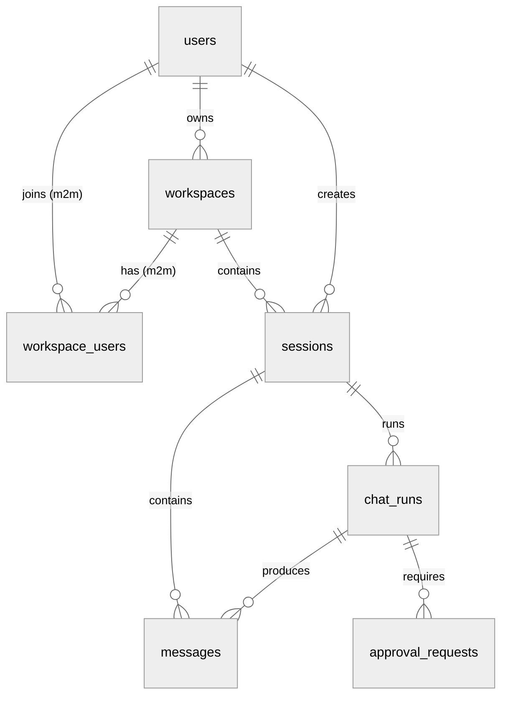
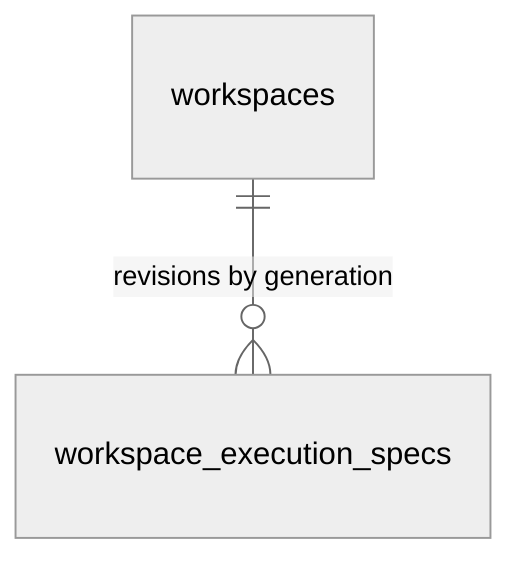
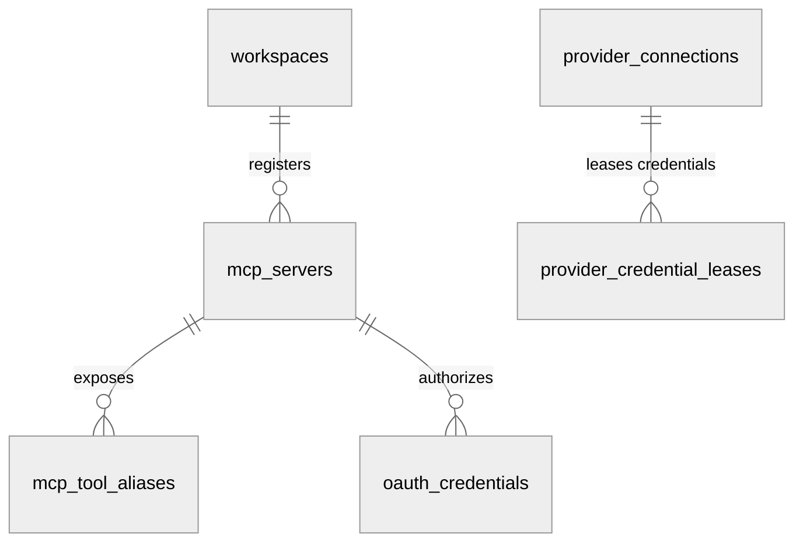
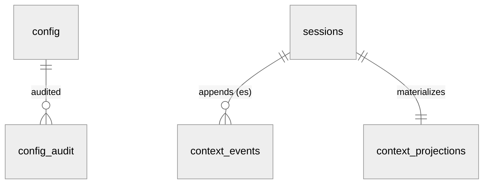
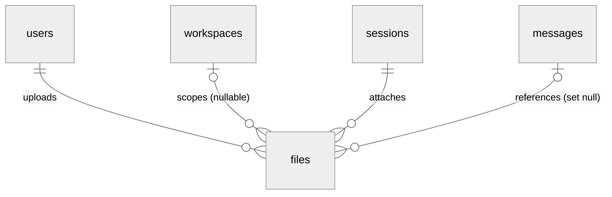
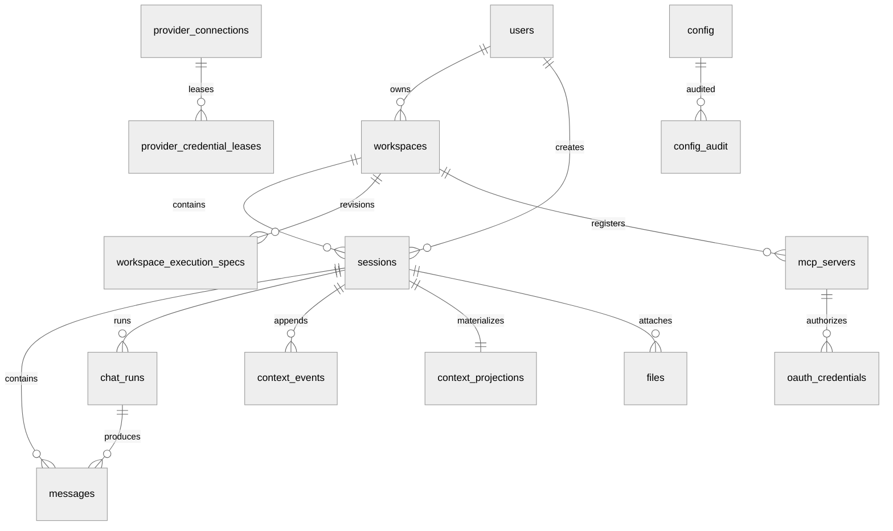

# DEV-019: 数据库设计

> 读者：新加入 XH 的后端 / 全栈开发者。内容：当前最终库表一览（结论先行），细节按域查表。Source of Truth 是 `packages/control-plane/src/main/resources/db/migration/V1~V9`，JPA Entity 只是镜像。前置阅读：[DEV-001](DEV-001-system-architecture.md)（四模块与 PG 定位）、[DEV-014](DEV-014-control-plane-architecture.md)（CP 通道）、[DEV-017](DEV-017-session-architecture.md)（会话语义）、[DEV-003](DEV-003-config-management.md)（Config 三层）。

## 1. 结论与使用规则

| 结论 | 内容 |
|------|------|
| 数据库 | PostgreSQL 17 + pgvector，Docker 镜像 `pgvector/pgvector:pg17`，dev 端口 `12634`，库名/用户名 `xihe` |
| 表数量 | 22 张业务表 + `flyway_schema_history`（Flyway 自维护，不在本文列字段） |
| 权威顺序 | Flyway SQL > JPA Entity > 本文档；`ddl-auto=validate`（PLAN-280），Flyway 是唯一 schema manager |
| 主键风格 | 全部 PostgreSQL 原生 `UUID`（PLAN-280）；Java 侧 @Id 为 `UUID` 类型，FK 列为 `String` + `UuidStringConverter` |
| 时间风格 | 全部 `TIMESTAMPTZ DEFAULT NOW()`（PLAN-280 消除裸 `TIMESTAMP`） |
| 删除语义 | `workspaces.deleted_at` 软删 + 部分唯一索引；`messages/context_*` 随 `sessions` 级联删；`files.message_id` 置空 |
| 扩展 | `V1` 内 `CREATE EXTENSION IF NOT EXISTS vector`（幂等）；`document_chunks` 由 Agent 侧 langchain_postgres 自建自管，不在 Flyway 链内 |
| 表格式约定 | 每张表：字段表（一行一字段，`约束` 列只放单列约束）+ 表下索引注释（`CREATE INDEX` 与跨列唯一约束） |

关键入口：

| 入口 | 路径 |
|------|------|
| Compose PG 定义 | `docker-compose.yml`（`postgres` 服务，`./postgres-init:/docker-entrypoint-initdb.d:ro`） |
| 扩展初始化 | `postgres-init/01-enable-pgvector.sql` |
| 连接配置 | `packages/control-plane/src/main/resources/application.properties:12-24`（`datasource.url`、`flyway.locations=classpath:db/migration`） |
| 全量迁移 | `packages/control-plane/src/main/resources/db/migration/V1__init_schema.sql`（PLAN-280 destructive rebaseline，旧 V2~V22/U6 已移出，仅 Git 历史可追溯） |
| Entity 镜像 | `packages/control-plane/src/main/java/com/cc01cc/p/xihe/cp/entity/`（22 个）+ `context/entity/`（3 个） |
| Seed | `packages/control-plane/src/main/java/com/cc01cc/p/xihe/cp/config/DataSeeder.java`（仅 seed `admin@xihe.local`，密码随机不落日志） |

> **PLAN-280 rebaseline（2026-09-07）**：本地数据库一次性重建为单一 `V1__init_schema.sql`（21 张表）。统一原生 UUID、TIMESTAMPTZ、显式命名约束与 ON DELETE、`ddl-auto=validate`。旧 V1~V22+U6 迁移链已从 active classpath 移出（仅 Git 历史可追溯）。`spring-boot-flyway` 模块缺失曾导致 Flyway 自动配置从未生效（schema 实际由 Hibernate 建），已在本轮修复——本文 §2 之后的逐表历史版本标注（`V14`/`V21` 等）仅作演进溯源，不再代表 active migration。

## 2. ER 关系（分域 erDiagram）

> 按域拆成 5 张 `erDiagram`（单图塞 22 表 19 条关系会挤成一团）。基数记法：`||--o{` 1 对 0..N，`||--|{` 1 对 1..N，`}o--||` N..0 对 1。无边实体（独立/弱关联表）单独标注。跨域关系在所属域内展示（如 `sessions → context_events` 属配置域视角）。

### 2.1 身份协作（主链）

- `users → workspaces`：`owner_id` FK + 部分唯一（活跃期每 owner 一个 workspace）
- `workspace_users`：联合 PK `(workspace_id, user_id)`，多对多关联表
- `chat_runs → messages`：经 `user_message_id`/`assistant_message_id` 逻辑关联（无 FK 约束）
- `chat_runs → approval_requests`：`run_id` FK

### 2.2 Workspace 执行

- `workspace_execution_specs.workspace_id` FK CASCADE；联合唯一 `(workspace_id, generation)`，每代一条规格快照

### 2.3 MCP 与 Provider

- `mcp_servers` 归属 `workspaces`（`workspace_id` FK，跨域引用身份协作域）
- `mcp_tool_aliases`：联合 PK `(workspace_id, issued_name)`；`server_id` 为逻辑外键（无 FK 约束）
- `oauth_credentials`：唯一 `(user_id, workspace_id, server_id)`，三向绑定
- `provider_credential_leases.provider_connection_id` FK CASCADE；租约发 Agent 一次性使用
- `provider_connection_audit`：无边实体，`provider_connection_id` 可空（删连接留痕），见 §3.4

### 2.4 配置与 RAG / 上下文

- `config_audit.config_id` FK config；四元唯一 `(environment, layer, domain, config_key)` 定位配置行
- `context_events`：UNIQUE `(session_id, sequence)`，Event Sourcing 只追加
- `context_projections`：UNIQUE `session_id`，单会话单投影，可由事件重放重建
- `context_source_hashes` / `document_chunks`：无边实体（前者按 `(workspace_id, source_key)` 去重，后者无 FK 独立生命周期），见 §3.5

### 2.5 文件审计

- `files.user_id` FK NOT NULL；`workspace_id` FK 可空；`session_id` FK CASCADE；`message_id` FK SET NULL
- `audit_logs`：无边实体，`user_id`/`workspace_id` 均可空 FK，业务审计与 `audit.log` 文件互补，见 §3.6

### 2.6 全局视角（单图总览，弱化布局质量换全貌）

代码锚点：实体 = 表名；关系名 = 外键语义（括注为特殊语义：m2m 关联表、无 FK 约束的逻辑外键、nullable、ES 只追加）；无边实体清单见各域小节。字段/索引细节见 §3，DDL 见 §4 迁移对照，Entity 见附录 A。

## 3. 按域表详情

### 3.1 身份（users）

**users**（`V1`，Entity `entity/User.java`）：唯一登录主体，`role` 仅 `USER/ADMIN`。

| 字段 | 类型 | 约束 | 说明 |
|------|------|------|------|
| id | VARCHAR(36) | PK | UUID 字符串 |
| email | VARCHAR(255) | NOT NULL UNIQUE | 登录键，`DataSeeder` seed `admin@xihe.local` |
| password_hash | VARCHAR(255) | NOT NULL | BCrypt，不存明文 |
| role | VARCHAR(20) | NOT NULL DEFAULT 'USER' | `USER` / `ADMIN` |
| name | VARCHAR(100) | nullable | 展示用 |
| avatar | VARCHAR(512) | nullable | 展示用 |
| settings | TEXT | nullable | 遗留自由字段，用户偏好以 `config` 表为准 |
| created_at | TIMESTAMP | NOT NULL DEFAULT CURRENT_TIMESTAMP | 创建时间 |
| updated_at | TIMESTAMP | NOT NULL DEFAULT CURRENT_TIMESTAMP | 无自动更新触发器，靠 JPA 维护 |

> 索引：`idx_users_email (email)`

### 3.2 协作（workspaces / workspace_users / sessions / messages / chat_runs / approval_requests）

**workspaces**（`V1` + `V2/V11/V14`，Entity `entity/Workspace.java`）：`owner_id` 拥有者，`deleted_at` 软删后同 owner 可重建。

| 字段 | 类型 | 约束 | 说明 |
|------|------|------|------|
| id | VARCHAR(36) | PK | — |
| name | VARCHAR(255) | NOT NULL | — |
| description | TEXT | nullable | — |
| owner_id | VARCHAR(36) | NOT NULL FK `users(id)` | 拥有者 |
| settings | TEXT | nullable | 遗留，结构化配置走 `config` |
| storage_path | VARCHAR(512) | nullable（`V2`） | 遗留绝对路径，仅回填 `storage_ref` 用 |
| storage_backend | VARCHAR(32) | DEFAULT 'host_directory'（`V11`） | 当前 v1 仅 `host_directory` |
| storage_ref | VARCHAR(64) | nullable（`V11`） | `host_directory` 根下 `workspaceId` 派生，由 `storage_path` basename 回填 |
| generation | INT | DEFAULT 0（`V11`） | 当前执行代数，与 `workspace_execution_specs.generation` 对齐 |
| sandbox_spec_hash | VARCHAR(64) | nullable（`V11`） | 当前生效规格哈希 |
| sandbox_spec | JSONB | nullable（`V11`） | 当前生效规格快照 |
| deleted_at | TIMESTAMPTZ | nullable（`V14`） | 软删标记，删后不阻塞同 owner 新建 |
| created_at | TIMESTAMP | NOT NULL DEFAULT CURRENT_TIMESTAMP | — |
| updated_at | TIMESTAMP | NOT NULL DEFAULT CURRENT_TIMESTAMP | — |

> 索引：
> - `idx_workspaces_owner_id (owner_id)`
> - `idx_workspaces_owner_active (owner_id, created_at) WHERE deleted_at IS NULL` — 部分索引，活跃 workspace 查询（`V14`）
> - 唯一约束 `uq_workspaces_active_owner (owner_id) WHERE deleted_at IS NULL` — 部分唯一，软删后同 owner 可重建（`V14`）

**workspace_users**（`V1` + `V14` 加复合索引，Entity `entity/WorkspaceUser.java`）：多对多成员。

| 字段 | 类型 | 约束 | 说明 |
|------|------|------|------|
| workspace_id | VARCHAR(36) | NOT NULL FK `workspaces(id)`，联合 PK | 归属 |
| user_id | VARCHAR(36) | NOT NULL FK `users(id)`，联合 PK | 成员 |
| role | VARCHAR(20) | NOT NULL DEFAULT 'MEMBER' | 成员角色 |
| created_at | TIMESTAMP | NOT NULL DEFAULT CURRENT_TIMESTAMP | 加入时间 |

> 索引：
> - `idx_workspace_users_user_id (user_id)`
> - `idx_workspace_users_user_workspace (user_id, workspace_id)` — 双向查（`V14`）

**sessions**（`V1` + `V14/V19`，Entity `entity/Session.java`）：服务端 canonical 会话，详见 [DEV-017](DEV-017-session-architecture.md)。

| 字段 | 类型 | 约束 | 说明 |
|------|------|------|------|
| id | VARCHAR(36) | PK | 会话键，SSE `sessionId` 即此 |
| workspace_id | VARCHAR(36) | NOT NULL FK `workspaces(id)` | 归属 |
| user_id | VARCHAR(36) | NOT NULL FK `users(id)` | 归属 |
| title | VARCHAR(255) | nullable | 列表展示 |
| model_provider | VARCHAR(50) | nullable | canonical pair 前半 |
| model_name | VARCHAR(100) | nullable | canonical pair 后半，普通 chat `toolMode=none` |
| archived | BOOLEAN | NOT NULL DEFAULT FALSE | 归档非删除 |
| provider_connection_id | VARCHAR(36) | nullable，无 FK（`V19`） | 逻辑绑定，不做外键避免跨域耦合 |
| connection_revision | BIGINT | nullable（`V19`） | 绑定时的连接版本 |
| created_at | TIMESTAMP | NOT NULL DEFAULT CURRENT_TIMESTAMP | — |
| updated_at | TIMESTAMP | NOT NULL DEFAULT CURRENT_TIMESTAMP | — |

> 索引：
> - `idx_sessions_workspace_id (workspace_id)`
> - `idx_sessions_user_id (user_id)`
> - `idx_sessions_archived (archived)`
> - `idx_sessions_workspace_user_active (workspace_id, user_id, archived, created_at DESC)` — 会话列表复合索引（`V14`）
> - `idx_sessions_provider_connection (provider_connection_id)`（`V19`）

**messages**（`V1` + `V6/V14/V16`，Entity `entity/Message.java`）：`session_id` 级联删（`V14` 重建 FK 加 `ON DELETE CASCADE`）。

| 字段 | 类型 | 约束 | 说明 |
|------|------|------|------|
| id | VARCHAR(36) | PK | — |
| session_id | VARCHAR(36) | NOT NULL FK `sessions(id) ON DELETE CASCADE` | 删会话清消息 |
| role | VARCHAR(20) | NOT NULL | `user/assistant/system/tool` 等，见 `MessageRole` |
| content | TEXT | NOT NULL | 正文 |
| metadata | TEXT | nullable | 遗留自由字段 |
| attachments | JSONB | nullable（`V6`） | 内联附件摘要，canonical 附件在 `files` |
| run_id | VARCHAR(36) | nullable FK `chat_runs(id)`（`V16`） | 归属轮次，见 §3.2 `chat_runs` |
| created_at | TIMESTAMP | NOT NULL DEFAULT CURRENT_TIMESTAMP | 排序键 |

> 索引：
> - `idx_messages_session_id (session_id)`
> - `idx_messages_run_id (run_id)`（`V16`）

**chat_runs**（`V16` + `V19/V22`，Entity `entity/ChatRun.java`）：一次 `POST /api/v1/chat` 的持久化轮次（PLAN-247），同幂等键不重复起 Agent。

| 字段 | 类型 | 约束 | 说明 |
|------|------|------|------|
| id | VARCHAR(36) | PK | — |
| session_id | VARCHAR(36) | NOT NULL FK `sessions(id)` | 归属 |
| user_id | VARCHAR(36) | NOT NULL FK `users(id)` | 归属 |
| workspace_id | VARCHAR(36) | NOT NULL FK `workspaces(id)` | 归属 |
| idempotency_key | VARCHAR(128) | NOT NULL | 幂等键，见下方唯一约束 |
| request_hash | VARCHAR(64) | NOT NULL | 请求 payload 哈希，同 key 比对 |
| provider | VARCHAR(50) | nullable | 全链路透传 |
| model | VARCHAR(100) | nullable | 全链路透传 |
| tool_mode | VARCHAR(20) | NOT NULL DEFAULT 'none' | 普通 chat `none`，workspace 操作 `workspace` |
| user_message_id | VARCHAR(36) | nullable，无 FK | 逻辑关联，避免循环 FK |
| assistant_message_id | VARCHAR(36) | nullable，无 FK | 逻辑关联，避免循环 FK |
| status | VARCHAR(24) | NOT NULL | 运行态 |
| terminal_outcome | VARCHAR(24) | nullable | `success/error/partial/ambiguous` 终态 |
| error_code | VARCHAR(64) | nullable | 给 UI 分支 |
| error_detail | TEXT | nullable | 脱敏后写 |
| token_count | INTEGER | NOT NULL DEFAULT 0 | 计量 |
| assistant_chars | INTEGER | NOT NULL DEFAULT 0 | 计量 |
| provider_connection_id | VARCHAR(36) | nullable，无 FK（`V19`） | 本轮实际用的连接 |
| connection_revision | BIGINT | nullable（`V19`） | 连接版本快照 |
| lease_owner | VARCHAR(80) | nullable（`V22`） | 单并发租约持有者，防双发 |
| lease_expires_at | TIMESTAMPTZ | nullable（`V22`） | 租约过期时间 |
| created_at | TIMESTAMPTZ | NOT NULL DEFAULT NOW() | — |
| updated_at | TIMESTAMPTZ | NOT NULL DEFAULT NOW() | — |

> 索引：
> - `idx_chat_runs_session_created (session_id, created_at)`
> - `idx_chat_runs_provider_connection (provider_connection_id, connection_revision)`（`V19`）
> - `idx_chat_runs_active_lease (session_id, status, lease_expires_at)` — 活跃租约判定（`V22`）
> - 唯一约束 `(user_id, session_id, idempotency_key)` — 同 key 不重复起 run，同 key 不同 payload 报冲突

**approval_requests**（基线 `V1` 内建，`V7` 加 `grant_consumed_at`，`V9` 加 `arguments_hash`；Entity `entity/ChatApproval.java`）：工具高危操作人审。

| 字段 | 类型 | 约束 | 说明 |
|------|------|------|------|
| request_id | VARCHAR(36) | PK | 请求键 |
| run_id | VARCHAR(36) | NOT NULL FK `chat_runs(id)` | 归属轮次 |
| session_id | VARCHAR(36) | NOT NULL FK `sessions(id)` | 归属 |
| user_id | VARCHAR(36) | NOT NULL FK `users(id)` | 归属 |
| workspace_id | VARCHAR(36) | NOT NULL FK `workspaces(id)` | 归属 |
| tool | VARCHAR(80) | NOT NULL | 待审批工具 |
| action | VARCHAR(512) | NOT NULL | 待审批动作 |
| details | TEXT | nullable | 动作详情 |
| state | VARCHAR(24) | NOT NULL | `pending/approved/rejected/expired` 等 |
| approved | BOOLEAN | nullable | 空表未决 |
| expires_at | TIMESTAMPTZ | NOT NULL | 超时自动过期 |
| decided_at | TIMESTAMPTZ | nullable | 决策时间 |
| dispatch_error_code | VARCHAR(64) | nullable | 下发失败码 |
| grant_consumed_at | TIMESTAMPTZ | nullable | grant 单次消费时间（`V7`） |
| arguments_hash | VARCHAR(96) | nullable | canonical arguments SHA-256（`V9`，PLAN-292 M1 grant 哈希匹配；存量行为 NULL 走 legacy 比对） |
| created_at | TIMESTAMPTZ | NOT NULL DEFAULT NOW() | — |
| updated_at | TIMESTAMPTZ | NOT NULL DEFAULT NOW() | — |

> 索引：
> - `idx_approval_requests_session_state (session_id, user_id, workspace_id, state, created_at)`
> - `idx_approval_requests_run_state (run_id, state)`

### 3.3 Workspace 执行（workspace_execution_specs）

**workspace_execution_specs**（`V11` 建 `workspace_assignments`，`V12` 加唯一，`V13` 重命名，Entity `entity/WorkspaceExecutionSpec.java`）：期望执行规格（非调度绑定，`V13` 注释原名误导已纠正）。

| 字段 | 类型 | 约束 | 说明 |
|------|------|------|------|
| id | UUID | PK DEFAULT `gen_random_uuid()` | 内部分配键 |
| workspace_id | VARCHAR(36) | NOT NULL FK `workspaces(id) ON DELETE CASCADE` | 删 workspace 清规格 |
| generation | INT | NOT NULL | 单调递增，Runtime 按 `workspaceId` 懒加载对应用代 |
| sandbox_spec_hash | VARCHAR(64) | NOT NULL | 规格哈希，`workspaces` 镜像当前代 |
| sandbox_spec | JSONB | NOT NULL | 规格内容，`workspaces` 镜像当前代 |
| storage_backend | VARCHAR(32) | NOT NULL DEFAULT 'host_directory' | 与 `workspaces` 同义，历史行保留当时值 |
| storage_ref | VARCHAR(64) | NOT NULL | 与 `workspaces` 同义，历史行保留当时值 |
| actor | VARCHAR(255) | nullable | 谁创建此代 |
| reason | VARCHAR(512) | nullable | 因何创建此代 |
| created_at | TIMESTAMPTZ | NOT NULL DEFAULT NOW() | 代创建时间即版本序 |

> 索引：
> - `idx_workspace_execution_specs_workspace_generation (workspace_id, generation)`
> - 唯一约束 `uq_workspace_execution_specs_workspace_generation (workspace_id, generation)` — 同代唯一

### 3.4 MCP 与 Provider（mcp_servers / mcp_tool_aliases / oauth_credentials / provider_connections / provider_credential_leases / provider_connection_audit）

**mcp_servers**（`V1` + `V15`，Entity `entity/McpServer.java`）：workspace 下 remote/stdio server 注册。

| 字段 | 类型 | 约束 | 说明 |
|------|------|------|------|
| id | VARCHAR(36) | PK | — |
| workspace_id | VARCHAR(36) | NOT NULL FK `workspaces(id)` | 归属 |
| name | VARCHAR(255) | NOT NULL | `serverId` 路由键见 DEV-030 附录 |
| endpoint | VARCHAR(512) | NOT NULL | 服务端点 |
| auth_config | TEXT | nullable | 遗留，OAuth 密文已迁 `oauth_credentials` |
| enabled | BOOLEAN | NOT NULL DEFAULT TRUE | 禁用即摘流 |
| auth_mode | VARCHAR(16) | NOT NULL DEFAULT 'oauth'（`V15`） | `oauth` / `no-auth`（公开免 broker） |
| created_at | TIMESTAMP | NOT NULL DEFAULT CURRENT_TIMESTAMP | — |
| updated_at | TIMESTAMP | NOT NULL DEFAULT CURRENT_TIMESTAMP | — |

> 索引：`idx_mcp_servers_workspace_id (workspace_id)`

**mcp_tool_aliases**（`V15`，Entity `entity/McpToolAlias.java`）：sticky 工具别名，冲突仅新者加前缀、永不晋升。

| 字段 | 类型 | 约束 | 说明 |
|------|------|------|------|
| workspace_id | VARCHAR(36) | NOT NULL FK `workspaces(id)`，联合 PK | 归属 |
| issued_name | VARCHAR(255) | NOT NULL，联合 PK | 下发名 |
| server_id | VARCHAR(36) | NOT NULL | 真实后端 server |
| backend_name | VARCHAR(255) | NOT NULL | 真实后端工具名 |
| generation | BIGINT | NOT NULL DEFAULT 0 | 每次 `tools/list` 合并递增，审计回放用 |
| created_at | TIMESTAMP | NOT NULL DEFAULT CURRENT_TIMESTAMP | — |
| updated_at | TIMESTAMP | NOT NULL DEFAULT CURRENT_TIMESTAMP | — |

> 索引：`idx_mcp_tool_aliases_server (workspace_id, server_id)`

**oauth_credentials**（`V9`，Entity `entity/OAuthCredential.java`）：CP token broker 持久化的加密 refresh token。

| 字段 | 类型 | 约束 | 说明 |
|------|------|------|------|
| id | VARCHAR(36) | PK | — |
| user_id | VARCHAR(36) | NOT NULL FK `users(id)` | 归属 |
| workspace_id | VARCHAR(36) | NOT NULL FK `workspaces(id)` | 归属 |
| server_id | VARCHAR(36) | NOT NULL FK `mcp_servers(id)` | 归属 |
| client_id | VARCHAR(255) | NOT NULL | OAuth client |
| token_endpoint | VARCHAR(512) | NOT NULL | token 端点 |
| redirect_uri | VARCHAR(512) | NOT NULL | 回跳地址 |
| scope | VARCHAR(1024) | NOT NULL | 授权范围 |
| refresh_token_ciphertext | TEXT | NOT NULL | 信封加密密文 |
| encryption_key_version | VARCHAR(32) | NOT NULL | 密钥版本，用于轮转 |
| status | VARCHAR(32) | NOT NULL DEFAULT 'AUTHORIZED' | 授权态 |
| created_at | TIMESTAMP | NOT NULL DEFAULT CURRENT_TIMESTAMP | — |
| updated_at | TIMESTAMP | NOT NULL DEFAULT CURRENT_TIMESTAMP | — |

> 索引：
> - `idx_oauth_credentials_workspace (workspace_id)`
> - `idx_oauth_credentials_server (server_id)`
> - 唯一约束 `(user_id, workspace_id, server_id)` — 单用户单空间单服单凭证

**provider_connections**（`V18`，Entity `entity/ProviderConnection.java`）：LLM Provider 连接（PLAN-261），三级归属。

| 字段 | 类型 | 约束 | 说明 |
|------|------|------|------|
| id | VARCHAR(36) | PK | — |
| owner_type | VARCHAR(16) | NOT NULL CHECK `SYSTEM/WORKSPACE/USER` | 作用域 |
| owner_id | VARCHAR(64) | NOT NULL | 作用域 ID |
| provider_id | VARCHAR(128) | NOT NULL | 如 `openai/deepseek` |
| label | VARCHAR(128) | NOT NULL | 展示名 |
| base_url | VARCHAR(2048) | nullable | 自建网关覆盖 |
| credential_ciphertext | TEXT | nullable | 信封加密，独立 key |
| encryption_key_version | VARCHAR(32) | NOT NULL | 密钥版本 |
| enabled | BOOLEAN | NOT NULL DEFAULT TRUE | 启用开关 |
| status | VARCHAR(32) | NOT NULL DEFAULT 'UNVERIFIED' CHECK `UNVERIFIED/VERIFYING/READY/INVALID_CREDENTIALS/UNREACHABLE/DISABLED` | 可用态 |
| model_discovery | VARCHAR(32) | NOT NULL DEFAULT 'remote-models' CHECK `remote-models/litellm-catalog/curated/manual` | 模型来源 |
| manual_models | JSONB | nullable | 手工模型清单 |
| revision | BIGINT | NOT NULL DEFAULT 1 | 每次改连接 +1，`sessions/chat_runs` 存快照比对 |
| last_verified_at | TIMESTAMPTZ | nullable | 连通性验证时间 |
| last_error_code | VARCHAR(64) | nullable | 最近错误码 |
| created_at | TIMESTAMPTZ | NOT NULL DEFAULT CURRENT_TIMESTAMP | — |
| updated_at | TIMESTAMPTZ | NOT NULL DEFAULT CURRENT_TIMESTAMP | — |

> 索引：
> - `idx_provider_connections_owner (owner_type, owner_id, enabled)`
> - `idx_provider_connections_provider_status (provider_id, status, enabled)`
> - 唯一约束 `(owner_type, owner_id, provider_id)` — 同 scope 同 provider 一条

**provider_credential_leases**（`V18`，Entity `entity/ProviderCredentialLease.java`）：发给 Agent 的一次性短期凭证租约。

| 字段 | 类型 | 约束 | 说明 |
|------|------|------|------|
| id | VARCHAR(36) | PK | — |
| lease_hash | VARCHAR(128) | NOT NULL UNIQUE | Agent 兑换键 |
| provider_connection_id | VARCHAR(36) | NOT NULL FK `provider_connections(id) ON DELETE CASCADE` | 删连接清租约 |
| user_id | VARCHAR(36) | NOT NULL | 发放对象 |
| workspace_id | VARCHAR(36) | nullable | 绑定空间 |
| session_id | VARCHAR(36) | nullable | 绑定会话 |
| run_id | VARCHAR(36) | nullable | 绑定轮次 |
| provider_id | VARCHAR(128) | NOT NULL | 本次允许的 provider |
| model | VARCHAR(255) | NOT NULL | 本次允许的模型 |
| expires_at | TIMESTAMPTZ | NOT NULL | 过期时间 |
| redeemed_at | TIMESTAMPTZ | nullable | 兑换时间 |
| revoked_at | TIMESTAMPTZ | nullable | 吊销时间 |
| created_at | TIMESTAMPTZ | NOT NULL DEFAULT CURRENT_TIMESTAMP | — |

> 索引：
> - `idx_provider_credential_leases_expiry (expires_at)` — 过期扫描
> - `idx_provider_credential_leases_binding (provider_connection_id, user_id, run_id)` — 绑定查询

**provider_connection_audit**（`V20`，Entity `entity/ProviderConnectionAudit.java`）：只追加审计，`provider_connection_id` 可空（删连接后仍留痕）。

| 字段 | 类型 | 约束 | 说明 |
|------|------|------|------|
| id | VARCHAR(36) | PK | — |
| provider_connection_id | VARCHAR(36) | nullable，无 FK | 故意不级联 |
| owner_type | VARCHAR(16) | NOT NULL | 冗余当时归属 |
| owner_id | VARCHAR(64) | NOT NULL | 冗余当时归属 |
| provider_id | VARCHAR(128) | NOT NULL | 冗余当时归属 |
| action | VARCHAR(32) | NOT NULL | 动作 |
| changed_by | VARCHAR(64) | NOT NULL | 操作人 |
| from_status | VARCHAR(32) | nullable | 状态变迁 |
| to_status | VARCHAR(32) | nullable | 状态变迁 |
| credential_present | BOOLEAN | NOT NULL DEFAULT FALSE | 是否含凭证 |
| credential_last4 | VARCHAR(4) | nullable | 只存后四位，禁存明文 |
| connection_revision | BIGINT | NOT NULL | 当时 revision |
| created_at | TIMESTAMPTZ | NOT NULL DEFAULT CURRENT_TIMESTAMP | 时间序 |

> 索引：
> - `idx_provider_connection_audit_connection (provider_connection_id, created_at)`
> - `idx_provider_connection_audit_owner (owner_type, owner_id, created_at)`

### 3.5 配置与 RAG（config / config_audit / document_chunks / context_events / context_projections / context_source_hashes）

**config**（`V4` + `V5/V10`，Entity `entity/ConfigEntity.java`）：3-tier 配置 canonical 存储，语义见 [DEV-003](DEV-003-config-management.md)。

| 字段 | 类型 | 约束 | 说明 |
|------|------|------|------|
| id | BIGSERIAL | PK | 自增主键 |
| environment | VARCHAR(64) | NOT NULL DEFAULT 'default' | `V10` 由 VARCHAR(32) 拓宽 |
| layer | VARCHAR(16) | NOT NULL | `SYSTEM/ADMIN/USER` |
| domain | VARCHAR(32) | NOT NULL | 8 枚举见 AGENTS.md |
| config_key | VARCHAR(64) | NOT NULL | 配置键 |
| config_value | TEXT | nullable | 值，敏感项脱敏 |
| is_set | BOOLEAN | NOT NULL DEFAULT TRUE | 是否已设置 |
| mcp_config | JSONB | nullable（`V5`） | 遗留 MCP 配置位 |
| updated_by | VARCHAR(64) | nullable | 修改人 |
| updated_at | TIMESTAMPTZ | DEFAULT NOW() | 修改时间 |

> 索引：
> - `idx_config_lookup (environment, layer, domain)`
> - 唯一约束 `(environment, layer, domain, config_key)` — 四元定位一行

**config_audit**（`V4` + `V17`，Entity `entity/ConfigAuditEntity.java`）：配置变更审计。

| 字段 | 类型 | 约束 | 说明 |
|------|------|------|------|
| id | BIGSERIAL | PK | — |
| config_id | BIGINT | NOT NULL FK `config(id)` | 关联配置行 |
| environment | VARCHAR(32) | nullable | 当时值 |
| layer | VARCHAR(16) | nullable | 当时值 |
| domain | VARCHAR(32) | nullable | 当时值 |
| config_key | VARCHAR(64) | nullable | 当时值 |
| old_value | TEXT | nullable | `V17` 把 `llm-provider` 域含 `apikey/secret/password/token` 的历史值改写为 `missing` 或 `present:legacy:<md5>` |
| new_value | TEXT | nullable | 同上，禁明文留痕 |
| changed_by | VARCHAR(64) | nullable | 修改人 |
| changed_at | TIMESTAMPTZ | DEFAULT NOW() | 修改时间 |

> 索引：`idx_config_audit_config_id (config_id)`

**document_chunks**（`V3`）：RAG 向量表，无 FK，独立生命周期。

| 字段 | 类型 | 约束 | 说明 |
|------|------|------|------|
| id | VARCHAR(36) | PK | chunk 键 |
| page_content | TEXT | NOT NULL | 切片正文 |
| embedding | vector(1536) | NOT NULL | `text-embedding-3-small` 维度 |
| cmetadata | JSONB | nullable | 来源元数据 |
| document_id | VARCHAR(36) | nullable | 来源文档 |
| chunk_index | INT | nullable | 切片序号 |
| created_at | TIMESTAMP | DEFAULT CURRENT_TIMESTAMP | — |

> 索引：
> - `idx_chunks_embedding` — `ivfflat (embedding vector_cosine_ops) WITH (lists=100)`，余弦检索
> - `idx_chunks_document_id (document_id)`

**context_events**（`V7` + `V14` 级联，Entity `context/entity/ContextEvent.java`）：Agent Event Sourcing 事件表，只追加；见 [DEV-013](DEV-013-agent-architecture.md) 与 [DEV-017](DEV-017-session-architecture.md)。

| 字段 | 类型 | 约束 | 说明 |
|------|------|------|------|
| id | UUID | PK DEFAULT `gen_random_uuid()` | — |
| session_id | VARCHAR(36) | NOT NULL FK `sessions(id) ON DELETE CASCADE` | 归属会话 |
| workspace_id | VARCHAR(36) | NOT NULL | 冗余归属 |
| user_id | VARCHAR(36) | NOT NULL | 冗余归属 |
| event_type | VARCHAR(50) | NOT NULL | 事件类型 |
| sequence | BIGINT | NOT NULL | 单会话单调序号 |
| payload | JSONB | NOT NULL DEFAULT '{}' | 事件内容 |
| correlation_id | VARCHAR(36) | nullable | 关联链 |
| causation_id | VARCHAR(36) | nullable | 因果链 |
| created_at | TIMESTAMP | NOT NULL DEFAULT CURRENT_TIMESTAMP | — |

> 索引：
> - `idx_context_events_session_id (session_id)`
> - `idx_context_events_session_sequence (session_id, sequence)`
> - `idx_context_events_workspace_id (workspace_id)`
> - `idx_context_events_event_type (event_type)`
> - 唯一约束 `(session_id, sequence)` — 单会话内序号唯一

**context_projections**（`V7` + `V14` 级联，Entity `context/entity/ContextProjection.java`）：事件物化视图，重放 `context_events` 可重建。

| 字段 | 类型 | 约束 | 说明 |
|------|------|------|------|
| id | UUID | PK DEFAULT `gen_random_uuid()` | — |
| session_id | VARCHAR(36) | NOT NULL UNIQUE FK `sessions(id) ON DELETE CASCADE` | 单会话单投影 |
| workspace_id | VARCHAR(36) | NOT NULL | 冗余归属 |
| user_id | VARCHAR(36) | NOT NULL | 冗余归属 |
| projection_type | VARCHAR(50) | NOT NULL DEFAULT 'agent_context' | 投影类型 |
| latest_sequence | BIGINT | NOT NULL DEFAULT 0 | 已物化到的事件序号 |
| payload | JSONB | NOT NULL DEFAULT '{}' | 投影内容 |
| created_at | TIMESTAMP | NOT NULL DEFAULT CURRENT_TIMESTAMP | — |
| updated_at | TIMESTAMP | NOT NULL DEFAULT CURRENT_TIMESTAMP | — |

> 索引：
> - `idx_context_projections_session_id (session_id)`
> - `idx_context_projections_workspace_id (workspace_id)`

**context_source_hashes**（`V8`，Entity `context/entity/ContextSourceHash.java`）：增量源哈希去重。

| 字段 | 类型 | 约束 | 说明 |
|------|------|------|------|
| id | UUID | PK DEFAULT `gen_random_uuid()` | — |
| workspace_id | VARCHAR(36) | NOT NULL | 归属 |
| source_key | VARCHAR(255) | NOT NULL | 源标识 |
| hash | VARCHAR(64) | NOT NULL | 内容哈希 |
| created_at | TIMESTAMP | NOT NULL DEFAULT CURRENT_TIMESTAMP | — |
| updated_at | TIMESTAMP | NOT NULL DEFAULT CURRENT_TIMESTAMP | — |

> 索引：
> - `idx_context_source_hashes_workspace_id (workspace_id)`
> - `idx_context_source_hashes_source_key (source_key)`
> - 唯一约束 `(workspace_id, source_key)` — 同源一行

### 3.6 文件审计（files / audit_logs）

**files**（`V1` + `V6`，Entity `entity/File.java`）：附件 canonical，物理路径 `{attachments-base-path}/{sessionId}/{fileId}`，见 [DEV-014 §5](DEV-014-control-plane-architecture.md)。

| 字段 | 类型 | 约束 | 说明 |
|------|------|------|------|
| id | VARCHAR(36) | PK | `fileId` 即文件名键 |
| user_id | VARCHAR(36) | NOT NULL FK `users(id)` | 上传者 |
| workspace_id | VARCHAR(36) | nullable FK `workspaces(id)` | 空 = 会话级附件 |
| filename | VARCHAR(255) | NOT NULL | 原始文件名 |
| mime_type | VARCHAR(127) | nullable | MIME 类型 |
| size_bytes | BIGINT | NOT NULL DEFAULT 0 | 白名单校验 + 500MB 上限在 Controller 层 |
| storage_path | VARCHAR(512) | NOT NULL | 物理路径 |
| session_id | VARCHAR(36) | nullable FK `sessions(id) ON DELETE CASCADE`（`V6`） | 删会话清附件 |
| message_id | VARCHAR(36) | nullable FK `messages(id) ON DELETE SET NULL`（`V6`） | 删消息保留文件行 |
| created_at | TIMESTAMP | NOT NULL DEFAULT CURRENT_TIMESTAMP | orphan 清理 24h 窗口基准 |

> 索引：
> - `idx_files_user_id (user_id)`
> - `idx_files_workspace_id (workspace_id)`
> - `idx_files_session_id (session_id)`（`V6`）
> - `idx_files_message_id (message_id)`（`V6`）

**audit_logs**（`V1`）：业务审计（MCP 工具调用另写 `audit.log` 文件，见 DEV-014 §5，两者互补）。

| 字段 | 类型 | 约束 | 说明 |
|------|------|------|------|
| id | VARCHAR(36) | PK | — |
| user_id | VARCHAR(36) | nullable FK `users(id)` | 系统动作可空 |
| workspace_id | VARCHAR(36) | nullable FK `workspaces(id)` | 系统动作可空 |
| action | VARCHAR(100) | NOT NULL | 动作 |
| resource_type | VARCHAR(50) | nullable | 资源类型 |
| resource_id | VARCHAR(36) | nullable | 资源 ID |
| details | TEXT | nullable | 脱敏后 JSON |
| created_at | TIMESTAMP | NOT NULL DEFAULT CURRENT_TIMESTAMP | — |

> 索引：
> - `idx_audit_logs_user_id (user_id)`
> - `idx_audit_logs_workspace_id (workspace_id)`
> - `idx_audit_logs_action (action)`

## 4. 迁移对照（当前链 V1~V9）

> 历史链 V1~V22 已被 PLAN-280 destructive rebaseline 取代（旧 V2~V22/U6 移出仓库，仅 Git 历史可追溯）；下表为当前 active 链。原文末尾的历史 V1~V22 对照表保留在 Git 历史中，本节按当前链重写。

| 版本 | 文件 | 变更 | 影响表 |
|------|------|------|--------|
| V1 | `V1__init_schema.sql` | 全量基线：21 表（原生 UUID 主键、`TIMESTAMPTZ`、显式命名 FK/CHECK/UNIQUE/索引与 `ON DELETE`） | 全部表（含 `approval_requests/chat_runs/sessions/messages/files/mcp_servers/audit_logs` 等） |
| V2 | `V2__session_operation_ledger.sql` | Session Operation Ledger 6 表 | `session_operations/operation_items/operation_attempts/operation_events/operation_extensions/operation_diagnostic_artifacts` |
| V3 | `V3__runtime_jobs.sql` | Runtime 后台任务 durable registry | `runtime_jobs` |
| V4 | `V4__workspace_snapshots.sql` | Workspace snapshot 双表 | `workspace_snapshots/workspace_snapshot_files` |
| V5 | `V5__approval_snapshot_policy.sql` | 审批绑定 snapshot/policyClass | `approval_requests.snapshot_id/policy_class` |
| V6 | `V6__task_continuity.sql` | 任务连续性 | `task_plans/task_items` |
| V7 | `V7__approval_grant_consumption.sql` | grant 单次消费 | `approval_requests.grant_consumed_at` |
| V8 | `V8__schema_gate_fixes.sql` | schema 门禁修正（FK `ON DELETE NO ACTION` 显式化、去冗余索引、`config.created_at`） | 多表 |
| V9 | `V9__approval_arguments_hash.sql` | grant 哈希匹配列（PLAN-292 M1） | `approval_requests.arguments_hash` |

## 5. 本地查看与运维

| 场景 | 命令 / 位置 |
|------|-------------|
| 起 PG | `mise run dev:host`（先等 `pg_isready -U xihe -d xihe` healthy 再起 CP，见 `docker-compose.yml`） |
| 直连 | `psql postgresql://xihe@localhost:12634/xihe`（密码走 `.env.dev`，默认 trust） |
| 看迁移水位 | `SELECT version, script, success FROM flyway_schema_history ORDER BY installed_rank;` |
| 看向量扩展 | `SELECT * FROM pg_extension WHERE extname='vector';` |
| 看 RAG 维度 | `SELECT atttypmod FROM pg_attribute WHERE attrelid='document_chunks'::regclass AND attname='embedding';`（预期 1536） |
| 看当前代 | `SELECT id, generation, storage_ref, sandbox_spec_hash FROM workspaces;` + `SELECT workspace_id, generation, actor, reason FROM workspace_execution_specs ORDER BY generation DESC LIMIT 20;` |
| 看轮次 | `SELECT id, session_id, status, terminal_outcome, error_code FROM chat_runs ORDER BY created_at DESC LIMIT 20;` |
| 重置 admin | `mise run reset-admin`（`scripts/reset-admin.ps1 -Password <pw>`，免重启，不删数据） |
| 重建 dev 库 | `mise run dev:reset`（默认 dry-run，显式 `-Reset` 才执行，先备份） |

## 附录 A：表—Entity—迁移三向对照

| 表 | Entity | 首次迁移 |
|----|--------|----------|
| users | `entity/User.java` + `UserRole.java` | V1 |
| workspaces | `entity/Workspace.java` | V1 |
| workspace_users | `entity/WorkspaceUser.java` + `WorkspaceUserId.java` | V1 |
| sessions | `entity/Session.java` | V1 |
| messages | `entity/Message.java` + `MessageRole.java` | V1 |
| files | `entity/File.java` | V1 |
| mcp_servers | `entity/McpServer.java` | V1 |
| audit_logs | `entity/AuditLog.java` | V1 |
| document_chunks | 无独立 Entity（Agent RAG 直读） | V3 |
| config | `entity/ConfigEntity.java` | V4 |
| config_audit | `entity/ConfigAuditEntity.java` | V4 |
| context_events | `context/entity/ContextEvent.java` | V7 |
| context_projections | `context/entity/ContextProjection.java` | V7 |
| context_source_hashes | `context/entity/ContextSourceHash.java` | V8 |
| oauth_credentials | `entity/OAuthCredential.java` | V9 |
| workspace_execution_specs | `entity/WorkspaceExecutionSpec.java` | V11（V13 更名） |
| mcp_tool_aliases | `entity/McpToolAlias.java` | V15 |
| chat_runs | `entity/ChatRun.java` | V16 |
| provider_connections | `entity/ProviderConnection.java` | V18 |
| provider_credential_leases | `entity/ProviderCredentialLease.java` | V18 |
| provider_connection_audit | `entity/ProviderConnectionAudit.java` | V20 |
| approval_requests | `entity/ChatApproval.java` | V21 |

## 附录 B：删除与脱敏约定

| 约定 | 内容 |
|------|------|
| 级联删 | `sessions` → `messages/context_events/context_projections/files(session)`；`workspaces` → `workspace_execution_specs`；`provider_connections` → `provider_credential_leases` |
| 置空 | `messages` 删后 `files.message_id` 置空，文件行保留待 orphan 清理 |
| 软删 | 仅 `workspaces.deleted_at`，查询须带 `WHERE deleted_at IS NULL`，唯一约束用部分索引实现 |
| 只追加 | `context_events/provider_connection_audit` 禁 UPDATE/DELETE，`context_projections` 是唯一可重建的物化 |
| 脱敏 | `oauth_credentials.refresh_token_ciphertext` / `provider_connections.credential_ciphertext` 信封加密；`config_audit` 历史密钥已改写；`audit_logs.details` / `chat_runs.error_detail` 写前脱敏 |
