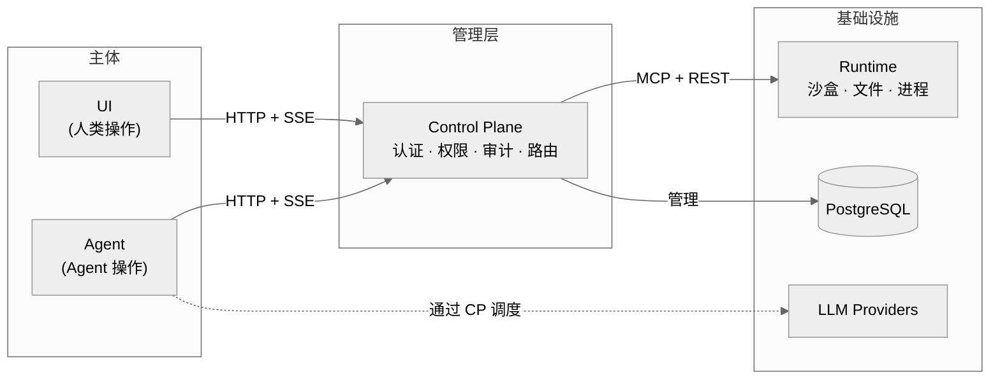

# xihe — 通用 Agent 运行时平台

> 给 Agent 以人的地位与约束。

> 多 Agent 编排 · 工具调用 · 沙盒执行 · 权限控制

> **⚠️ 开发状态**: 本项目处于活跃开发阶段，API 和数据结构可能变更，不建议用于生产环境。

## 理念

**Agent 不是工具，是团队中的新角色。**

一个 Agent 和一个新入职的员工有相似之处：它有自己的职责边界、需要访问资源的权限、会在不确定场景下犯错，也需要被信任、被监督、被复盘。xihe 的设计哲学正是建立在这个类比之上：

| 概念 | 人的管理 | xihe 对 Agent 的管理 |
|------|---------|---------------------|
| 入职 | 分配工位和账号 | 创建 workspace，分配 Runtime 实例 |
| 职责 | 岗位说明书 | Agent prompt + role 定义 |
| 权限 | RBAC 权限矩阵 | CP 权限控制 + MCP 工具级授权 |
| 工位 | 物理隔离的办公空间 | namespace/cgroup/seccomp 沙盒隔离 |
| 犯错 | 人会犯错，流程兜底 | Agent 不确定性由沙盒兜底，日志可审计 |
| 协作 | 人与人、人与团队的协同 | 多 Agent 编排 + 人机协同（人可审批、干预、接管 Agent 操作） |
| 成长 | 培训与经验积累 | RAG 知识库 + 上下文持续积累 |

这一理念直接决定了 xihe 的四模块架构：UI 和 Agent 是**平等的两个操作主体**，分别代表人和 Agent；CP 是**管理层**，对两边统一施加认证、权限和审计；Runtime 是**基础设施**，只通过 CP 暴露能力。员工不直接碰服务器，Agent 也不直接碰沙盒——一切通过管理层走。

## 架构



| 模块 | 角色 | 语言 | 框架 | 专篇 |
|------|------|------|------|------|
| **UI** | 人类操作入口 | TypeScript | Vue 3, Vite, Tailwind v4, reka-ui, Pinia | DEV-010 |
| **Agent** | Agent 操作入口 | Python 3.12+ | FastAPI, LangChain, LangGraph, litellm | DEV-013 |
| **Control Plane** | 管理层 | Java 25 | Spring Boot 4, Spring Security, Flyway | DEV-014 |
| **Runtime** | 基础设施 | Rust 1.88+ | rmcp, Tokio, Axum, bollard | DEV-015 |

通信：UI↔CP 聊天（`POST /api/v1/chat` + 持久 `GET /api/v1/events?sessionId=` SSE）；Agent 工具调用经 CP MCP 反向代理；文件操作走 REST。架构总览见 DEV-001，会话模型见 DEV-017。

## 功能特性

| 功能 | 状态 | 说明 |
|------|------|------|
| 多会话管理 | ✅ | 创建/切换/删除/重命名，时间分组，搜索 |
| 自研聊天组件 | ✅ | MessageScroller 五组件族，大消息量无卡顿 |
| Markdown 渲染 | ⚠️ 部分 | Shiki 高亮 + KaTeX 公式，Mermaid 未实现 |
| SSE 流式 | ✅ | 会话级持久连接，增量 MessagePart 渲染（PLAN-230） |
| MCP 反向代理 | ✅ | CP→Runtime 链路，工具名前缀 + 权限检查 |
| 多用户认证 | ✅ | JWT 登录/注册，BCrypt 加密 |
| PostgreSQL 持久化 | ✅ | Flyway 迁移，H2 本地开发 |
| 工作区隔离 | ✅ | 三 profile 全进 Sandbox，无 host 回退（PLAN-235） |
| 图片上传 | ⚠️ 部分 | 拖拽/选择 + Canvas 压缩 ≤1920px，粘贴未实现 |
| 语音 I/O | ✅ | 浏览器 Web Speech API STT/TTS |
| PDF 处理 | ⚠️ 部分 | pdfjs-dist 预览 + 文本提取，OCR 未实现 |
| 主题系统 | ✅ | dark/light/system |
| 国际化 | ⚠️ 部分 | zh-Hans + en 翻译完整，切换 UI 未实现 |
| 知识库 (RAG) | ✅ | 文档分块 + Embedding + pgvector 语义检索 |

## 快速启动

```bash
# 1. 安装工具链
mise install

# 2. 配置环境
cp .env.example .env.dev
# 编辑 .env.dev 设置 API key（如 XIHE_DEEPSEEK_API_KEY）

# 3. 安装各模块依赖
mise run setup

# 4. 日常开发启动（PostgreSQL 跑 Docker，其余原生）
mise run dev:host
```

浏览器打开 `http://localhost:12630`。`mise run dev:full` 仅用于一次性全容器基线场景。环境与运行模式详见 DEV-002，配置管理见 DEV-003。

> **开发环境凭据**：`DataSeeder` 不使用固定管理员密码（安全随机生成，不写日志）；本地开发请通过注册页创建测试用户，或用 `mise run reset-admin` 重置 dev 管理员密码。

## 测试

```bash
mise run validate        # lint + typecheck + build + test（Docker 自动管理）
mise run validate:full   # + 集成 + E2E（需 Docker）
mise run test:e2e:host   # host E2E（需先 dev:host，每轮隔离环境）
```

策略详见 DEV-020/021/022/023。

## 文档

完整索引见 [INDEX.md](INDEX.md)。分块编号：00x 基础 / 01x 模块 / 02x 测试 / 03x 规范（规则见 DEV-030）。

| 文档 | 说明 |
|------|------|
| `docs/i18n/zh-Hans/DEV-001-system-architecture.md` | 四模块架构、两流模型、协议定义 |
| `docs/i18n/zh-Hans/DEV-002-developer-guide.md` | 开发环境搭建、运行模式、调试 |
| `docs/i18n/zh-Hans/DEV-003-config-management.md` | ConfigService 三层 + 环境变量 + 导入 |
| `docs/i18n/zh-Hans/DEV-004-logging.md` | 日志系统：层次控制、脱敏、泄露扫描 |
| `docs/i18n/zh-Hans/USER-001-user-guide.md` | 用户指南 |
| `AGENTS.md` | 开发指南和约定 |

## License

Apache 2.0
