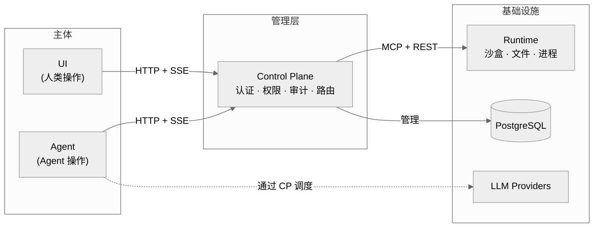
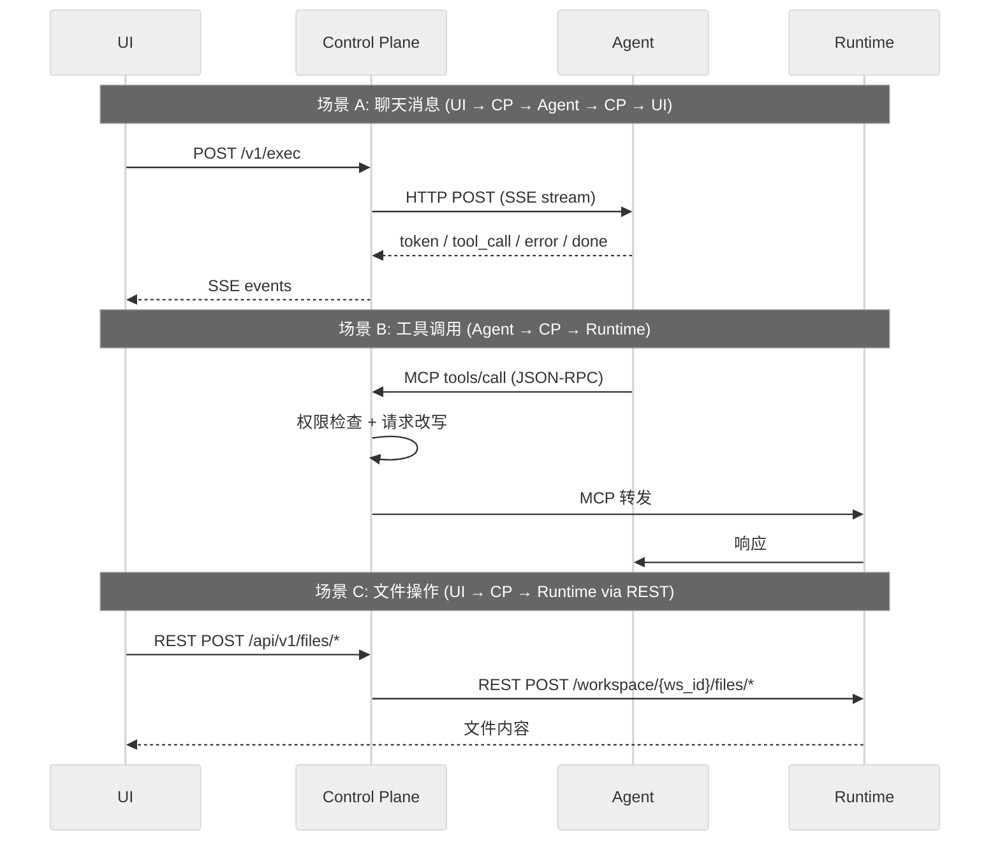

# xihe — 通用 Agent 运行时平台

> 给 Agent 以人的地位与约束。

> 多 Agent 编排 · 工具调用 · 沙盒执行 · 权限控制

> **⚠️ 开发状态**: 本项目处于活跃开发阶段，API 和数据结构可能变更，不建议用于生产环境。

## 理念

**Agent 不是工具，是团队中的新角色。**

一个 Agent 和一个新入职的员工有相似之处：它有自己的职责边界、需要访问资源的权限、会在不确定场景下犯错，也需要被信任、被监督、被复盘。xihe 的设计哲学正是建立在这个类比之上：

| 概念 | 人的管理 | xihe 对 Agent 的管理 |
|------|---------|---------------------|
| 入职 | 分配工位和账号 | 创建 workspace，分配 Runtime 实例 |
| 职责 | 岗位说明书 | Agent prompt + role 定义 |
| 权限 | RBAC 权限矩阵 | CP 权限控制 + MCP 工具级授权 |
| 工位 | 物理隔离的办公空间 | namespace/cgroup/seccomp 沙盒隔离 |
| 犯错 | 人会犯错，流程兜底 | Agent 不确定性由沙盒兜底，日志可审计 |
| 协作 | 人与人、人与团队的协同 | 多 Agent 编排 + 人机协同（人可审批、干预、接管 Agent 操作） |
| 成长 | 培训与经验积累 | RAG 知识库 + 上下文持续积累 |

这不是隐喻，而是产品架构的**第一性原理**：当 Agent 开始像人一样行动，它也需要像人一样被约束——不是限制它的能力，而是给它一个可信的边界，在边界内放手让它干。

这一理念直接决定了 xihe 的四模块架构：UI 和 Agent 是**平等的两个操作主体**，分别代表人和 Agent；CP 是**管理层**，对两边统一施加认证、权限和审计；Runtime 是**基础设施**，只通过 CP 暴露能力，不直接对 UI 或 Agent 开放。员工不直接碰服务器，Agent 也不直接碰沙盒——一切通过管理层走。

## 架构

基于上述理念，xihe 将"人"和"Agent"建模为两个**对等的操作主体**，各用一个独立模块表达，由中心管理层（CP）统一调度和约束：



| 模块 | 角色 | 语言 | 框架 | 职责 |
|------|------|------|------|------|
| **UI** | 人类操作入口 | TypeScript | Vue 3, Vite, Tailwind v4, reka-ui | 展示 + 输入采集，代表人类发起操作 |
| **Agent** | Agent 操作入口 | Python 3.12+ | FastAPI, LangChain, LangGraph, litellm | LLM 编排 + 工具选择，代表 Agent 发起操作 |
| **Control Plane** | 管理层 | Java 25 | Spring Boot 4, Spring Security, GraalVM | 认证 + 权限 + MCP 反向代理 + 审计，对 UI 和 Agent 施加统一约束 |
| **Runtime** | 基础设施 | Rust 1.88+ | rmcp, Tokio, Axum, bollard | 文件系统 + Shell 沙盒 + 进程管理，仅通过 CP 暴露能力 |

### 通信协议



## 功能特性

| 功能 | 状态 | 说明 |
|------|------|------|
| 多会话管理 | ✅ | 创建/切换/删除/重命名，时间分组，搜索 |
| 虚拟列表 | ✅ | @tanstack/vue-virtual，500+ 消息无卡顿 |
| Markdown 渲染 | ⚠️ 部分 | Shiki 高亮 + KaTeX 公式，Mermaid 未实现 |
| SSE 流式 | ✅ | 7 种事件：token/tool_call/tool_result/approval_request/status/error/done |
| MCP 反向代理 | ✅ | CP→Runtime 链路，工具名前缀 + 权限检查 |
| LangChain 集成 | ✅ | langchain-core + langchain-mcp-adapters + langgraph |
| 多用户认证 | ✅ | JWT 登录/注册，BCrypt 加密 |
| PostgreSQL 持久化 | ✅ | Flyway 迁移，H2 本地开发 |
| 工作区隔离 | ✅ | workspace_users 多对多，Runtime per-workspace 实例 |
| 图片上传 | ⚠️ 部分 | 拖拽/选择 + Canvas 压缩 ≤1920px，粘贴未实现 |
| 语音 I/O | ✅ | 浏览器 Web Speech API STT/TTS |
| PDF 处理 | ⚠️ 部分 | pdfjs-dist 预览 + 文本提取，OCR 未实现 |
| 主题系统 | ✅ | dark/light/system，FOUC-free |
| 响应式布局 | ⚠️ 部分 | 移动端 overlay 侧边栏，768px 断点检测未实现 |
| 国际化 | ⚠️ 部分 | zh-Hans + en 翻译完整，切换 UI 未实现 |
| PWA 支持 | ❌ | 依赖存在，vite-plugin-pwa 未配置 |
| Agent Marketplace | ❌ | 未实现（Worker Registry 为本地热加载） |
| 知识库 (RAG) | ✅ | 文档分块 + LiteLLM Embedding + pgvector 语义检索 |

## 技术栈

| 模块 | 语言 | 框架 | 测试 |
|------|------|------|------|
| **UI** | TypeScript | Vue 3, Vite 8, Tailwind v4, reka-ui, Pinia | Vitest (206+ tests) + Playwright |
| **CP** | Java 25 | Spring Boot 4, Spring Security, GraalVM, Flyway | JUnit 5 (152 tests) |
| **Agent** | Python 3.12+ | FastAPI, LangChain, LangGraph, litellm | pytest (150 tests) |
| **Runtime** | Rust 1.88+ | rmcp, Tokio, Axum, bollard | cargo test (176+ tests) |

## 项目结构

```
xihe-project/
├── packages/
│   ├── ui/                          # Vue 3 前端
│   │   ├── src/
│   │   │   ├── components/          # 共享组件 (MarkdownRenderer, ImageUpload, VoiceInput/Output, PdfViewer...)
│   │   │   ├── stores/              # Pinia stores (auth, agent, session, knowledge, theme, settings)
│   │   │   ├── views/               # Chat, Settings, Login/Register, KnowledgeBase
│   │   │   ├── composables/         # useSSE, useTheme, usePdfDocument
│   │   │   ├── i18n/                # zh-Hans + en
│   │   │   └── router/              # Vue Router + auth guard
│   │   ├── e2e/                     # Playwright E2E (mock + real)
│   │   └── vite.config.ts
│   ├── control-plane/               # Spring Boot 后端
│   │   ├── src/main/java/.../
│   │   │   ├── config/              # SecurityConfig, JwtTokenProvider
│   │   │   ├── auth/                # JWT 认证（登录/注册/刷新）
│   │   │   ├── chat/                # SSE 流式聊天
│   │   │   ├── mcp/                 # MCP 反向代理
│   │   │   ├── rag/                 # RAG 代理
│   │   │   ├── files/               # 文件操作
│   │   │   ├── config/              # SecurityConfig, JwtTokenProvider, TenantContext
│   │   │   ├── service/             # WorkspaceService, AuthService, PolicyEngine
│   │   │   ├── entity/              # User, Workspace, Session 等实体
│   │   │   └── audit/               # AuditLogger
│   │   └── src/main/resources/
│   │       └── db/migration/        # Flyway V1-V3
│   ├── agent/                       # Python Agent 服务
│   │   ├── src/xihe_agent/
│   │   │   ├── main.py              # FastAPI + SSE + RAG endpoints
│   │   │   ├── executor.py          # LangGraph React Agent
│   │   │   ├── supervisor.py        # Multi-agent supervisor
│   │   │   ├── sse_adapter.py       # LangChain → SSE 事件适配
│   │   │   ├── mcp_client.py        # MultiServerMCPClient
│   │   │   ├── adapters/            # SSE 适配 / 审批工具
│   │   │   ├── tools/               # 图像处理等工具
│   │   │   ├── llm/                 # ChatLiteLLM, LLMConfig
│   │   │   ├── rag/                 # chunking, embeddings, vector store
│   │   │   └── registry/            # Worker Registry (hot-reload)
│   │   └── tests/
│   │       ├── unit/                # 单元测试
│   │       └── integration/         # 集成测试（需 Docker）
│   └── runtime/                     # Rust 沙盒运行时
│       ├── src/
│       │   ├── main.rs              # Axum HTTP + MCP Server, gateway, idle reaper
│       │   ├── gateway.rs           # WorkspaceRegistry + 路由
│       │   ├── workspace.rs         # 容器/文件服务生命周期
│       │   ├── sandbox.rs           # Docker 沙盒 + 文件服务进程管理
│       │   ├── fs.rs                # 文件操作（ignore/walkdir/globset）
│       │   ├── mcp_bridge.rs        # STDIO MCP bridge
│       │   ├── mcp_process.rs       # Gateway 侧 STDIO 管理
│       │   ├── ws_file_handler.rs   # Workspace 文件操作处理
│       │   ├── container_runtime.rs # 容器内文件服务 binary
│       │   ├── config_client.rs     # CP ConfigService 客户端
│       │   ├── error.rs             # 错误类型
│       │   └── seccomp-profile.json # 130+ syscall 白名单
│       └── tests/
├── postgres-init/                   # Docker PostgreSQL 初始化
├── docker/                          # 容器镜像构建
│   └── images/workspace/            # xihe/workspace 容器镜像
├── scripts/                         # 开发辅助脚本
├── internal/                        # 内部文档 + Sprint 记录
├── docker-compose.yml               # 统一编排
├── mise.toml                        # mise 工具与任务配置
├── Taskfile.yml                     # 已弃用，仅保留 backwards compatibility
└── docs/i18n/
    └── zh-Hans/
        ├── DEV-001-system-architecture.md
        ├── DEV-002-developer-guide.md
        ├── DEV-003-logging.md
        ├── DEV-004-ui-checklist.md
        ├── DEV-005-mcp-architecture.md
        ├── DEV-010-documentation-layout-and-frontmatter.md
        └── USER-001-user-guide.md
```

## 快速启动

```bash
# 1. 安装工具链
mise install

# 2. 配置环境
cp .env.example .env.dev
# 编辑 .env.dev 设置 XIHE_DEEPSEEK_API_KEY

# 3. 安装各模块依赖
mise run setup

# 4. 一键启动全部（Docker Compose 后端 + 宿主机 UI）
mise run dev:full

# 5. 或分步启动
docker compose up -d --build
cd packages/ui && pnpm --ignore-workspace run dev
```

浏览器打开 `http://localhost:12630`。UI 端口由 `XIHE_UI_PORT` 控制，默认 `12630`。"

> **开发环境凭据**：
>
> `DataSeeder` 不再使用固定管理员密码。管理员密码由安全随机源生成且不写入日志；本地开发请通过注册页面创建测试用户，或在受控环境中显式配置并管理管理员凭据。

## 配置管理 (PLAN-042)

### 架构

CP ConfigService 是统一的配置管理入口，采用 3-tier 所有权模型：

| 层级 | 所有者 | 存储 | 生命周期 | 示例 |
|------|--------|------|---------|------|
| **system** | CP 管理员 | `config.import.*.jsonc` | 代码库管理，随部署 | `config.import.example.jsonc`、`config.import.prod.jsonc` |
| **admin** | 运维人员 | `config` 表 `owner=ADMIN` | CP API 运行时修改，持久化 | LLM API key 轮换、日志等级 |
| **user** | 终端用户 | `config` 表 `owner=USER` | UI 设置页修改，持久化 | LLM provider 选择、模型参数 |

**优先级**：`user > admin > system` — 高层级覆盖低层级同名 key。

### Phase 3: 无 env file 依赖

- `XIHE_LOAD_DOTENV=0` — 各模块不再从 `.env`/`.env.dev` 读取 `os.getenv` fallback
- 应用层配置（LLM provider、logging、embedding 等）通过 CP ConfigService 管理
- 仅保留 ~10 个**引导环境变量**用于基础设施启动（见下表）
- 开发环境通过 `config.import.local.jsonc` 文件导入 system 级配置，容器内由 CP 的 `ConfigStartupRunner` 自动导入

### 引导环境变量

仅以下变量仍通过 OS 环境变量传递（用于 Docker Compose 和模块启动）：

| 变量 | 默认值 | 说明 |
|------|--------|------|
| `XIHE_LOAD_DOTENV` | `0` | 关闭模块 dotenv fallback |
| `XIHE_CP_URL` | `http://localhost:12631` | CP 地址（宿主机访问） |
| `XIHE_CP_API_TOKEN` | — | CP API 认证 token |
| `XIHE_RUNTIME_HOST` | `0.0.0.0` | Runtime 监听地址 |
| `XIHE_RUNTIME_PORT` | `12633` | Runtime 端口（宿主机访问，Docker 内为 8001） |
| `XIHE_WORKSPACE` | `./workspace` | 工作区根目录 |
| `XIHE_DATASOURCE_URL` | `jdbc:postgresql://localhost:12634/xihe` | CP 数据库连接（宿主机映射，Docker 内为 5432） |
| `XIHE_DATASOURCE_USERNAME` | `xihe` | 数据库用户 |
| `XIHE_DATASOURCE_PASSWORD` | — | 数据库密码 |
| `XIHE_CP_JWT_SECRET` | — | JWT 签名密钥（仅供 CP 自身初始化） |

所有其他配置（LLM provider、API key、model、log level、embedding 等）通过 CP API 或 JSONC 导入管理。

### 配置方式对比

| 方式 | 适合场景 | 工具 |
|------|---------|------|
| **CP API** | 运行时修改、UI 设置页 | `PATCH /api/v1/config` (admin) / `PATCH /api/v1/config/user` (user) |
| **JSONC 导入** | 批量初始化、环境预设 | `POST /api/v1/config/import` — 上传 `config.import.*.jsonc` 文件 |
| **OS 环境变量** | 仅基础设施引导 | Docker Compose `environment:` 或模块启动包装脚本 |

## 测试

一键运行全部模块（无需 Docker）：
```bash
mise run validate
```
依次执行：UI 编译 + UI 单元测试 → Agent pytest → CP mvn → Runtime cargo

全量测试（需 Docker）：
```bash
mise run validate:full   # validate + Runtime full + integration + E2E
```

| 类型 | 数量 | 说明 |
|------|------|------|
| UI 单元 | 206+ | Store / Composable / Component / Provider 注册 / E2E |
| CP 单元 | 152 | Entity / JWT / TenantContext / Workspace / MCP Proxy |
| Agent 单元 | 150 | SSE / 审批 / Prompt / Executor / LLMConfig / RAG / Supervisor |
| Runtime | 176+ | 文件工具 / MCP / Docker 沙盒 / 逃逸防御 |
| E2E Mock | 40 | Chat / 登录 / 主题 / Session / Modal / Toast / a11y / i18n |
| E2E Real | 32 | Auth / Chat / PDF / 设置 / 跨模块 |

## 文档

| 文档 | 说明 |
|------|------|
| `docs/i18n/zh-Hans/DEV-001-system-architecture.md` | 四模块架构、两流模型、协议定义 |
| `docs/i18n/zh-Hans/DEV-002-developer-guide.md` | 开发环境搭建、运行模式 |
| `docs/i18n/zh-Hans/DEV-003-logging.md` | 日志系统：层次控制、UI→CP 转发 |
| `docs/i18n/zh-Hans/DEV-004-ui-checklist.md` | UI 视觉检查清单 |
| `docs/i18n/zh-Hans/DEV-005-mcp-architecture.md` | MCP 三层路由架构 |
| `docs/i18n/zh-Hans/DEV-010-documentation-layout-and-frontmatter.md` | 文档布局与 Frontmatter 规范 |
| `docs/i18n/zh-Hans/USER-001-user-guide.md` | 用户指南 |
| `AGENTS.md` | 开发指南和约定 |
| `internal/SPRINTS/` | Sprint 设计文档 |

## License

Apache 2.0
