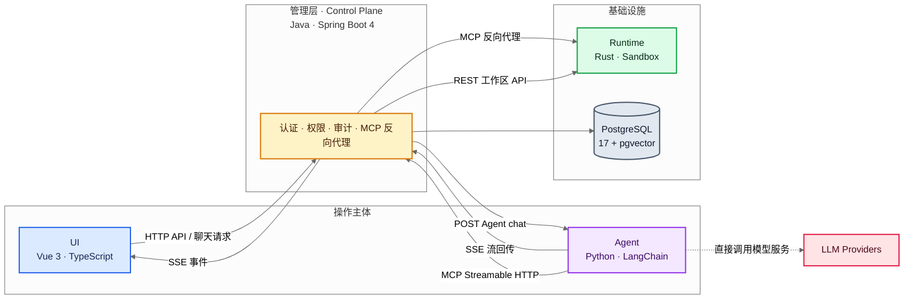

[English](https://github.com/cc01cc/xihe-project#readme)

<!-- 同步约定：架构图、Quick Start 命令、端口、技术栈摘要与根 README.md 同步；功能状态表仅由中文版维护。 -->

# xihe — 通用 Agent 运行时平台

**给 Agent 以人的地位与约束。** 多 Agent 编排、工具调用、沙盒执行与权限控制。

> **开发状态：** 项目仍在积极开发，API 和数据结构可能变化，不建议用于生产环境。

## 1. 快速启动

```bash
# 安装固定工具链
mise install

# .env.dev 已入库并含安全占位值；个人凭据仅写入 gitignored 的 .env.local

# 安装各模块依赖并启动日常 host 开发栈
mise run setup
mise run dev:host
# 查看开发/运维 CLI；配置导入与 Provider 初始化需显式执行
mise run xihe -- --help
```

`.env` 与 `.env.dev` 已作为安全基线入库，无需复制或覆盖；个人凭据写入 gitignored 的 `.env.local`，不得提交或写入日志。日常开发中 PostgreSQL 使用 Docker，其余服务由 mise 在宿主机启动。`dev:host` 不会导入配置或创建 Provider Connection；需要时运行 `mise run dev:host:import-config` 和 `mise run dev:host:provider-init`。UI 默认端口为 `12630`。`mise run dev:full` **已冻结禁用（2026-10-07：仅 PostgreSQL 保留容器，服务全 host；mise.toml 已注释）**，日常走 `dev:host`；环境说明见 [DEV-002](DEV-002-developer-guide.md)。

开发管理员密码通过 `mise run reset-admin` 临时重置；命令输出只用于本地登录，不要保存到脚本、源码或日志。

## 2. 架构

UI 与 Agent 是两个独立操作主体。Control Plane（CP）提供共享的路由、权限与审计；Runtime 提供受限的工作区执行能力。


```mermaid
%%{init: {'theme': 'neutral'}}%%
flowchart LR
    subgraph Actors["操作主体"]
        UI["UI<br/>Vue 3 · TypeScript"]
        AG["Agent<br/>Python · LangChain"]
    end
    subgraph Management["管理层 · Control Plane<br/>Java · Spring Boot 4"]
        CP["认证 · 权限 · 审计 · MCP 反向代理"]
    end
    subgraph Infra["基础设施"]
        RT["Runtime<br/>Rust · Sandbox"]
        PG[("PostgreSQL<br/>17 + pgvector")]
    end
    LLM["LLM Providers"]
    UI -->|"HTTP API / 聊天请求"| CP
    CP -->|"SSE 事件"| UI
    CP -->|"POST Agent chat"| AG
    AG -->|"SSE 流回传"| CP
    AG -->|"MCP Streamable HTTP"| CP
    CP -->|"MCP 反向代理"| RT
    CP -->|"REST 工作区 API"| RT
    CP --> PG
    AG -.->|"直接调用模型服务"| LLM
    classDef ui fill:#dbeafe,stroke:#2563eb,color:#172554,stroke-width:2px
    classDef agent fill:#f3e8ff,stroke:#9333ea,color:#3b0764,stroke-width:2px
    classDef control fill:#fef3c7,stroke:#d97706,color:#451a03,stroke-width:2px
    classDef runtime fill:#dcfce7,stroke:#16a34a,color:#052e16,stroke-width:2px
    classDef data fill:#e2e8f0,stroke:#475569,color:#0f172a,stroke-width:2px
    classDef external fill:#ffe4e6,stroke:#e11d48,color:#4c0519,stroke-width:2px
    class UI ui
    class AG agent
    class CP control
    class RT runtime
    class PG data
    class LLM external
```

聊天请求与 SSE 事件是两个方向的独立 HTTP 通道；Agent 直接调用模型服务，工具调用通过 CP 的 MCP 反向代理。协议与模块边界见 [DEV-001](DEV-001-system-architecture.md) 和 [DEV-014](DEV-014-control-plane-architecture.md)。

## 3. 模块与技术栈

| 模块 | 职责 | 主要技术 |
|---|---|---|
| UI | 人类交互入口 | Vue 3、TypeScript、Vite 8、Pinia、Tailwind CSS 4 |
| Agent | LLM 编排与工具选择 | Python 3.12、FastAPI、LangChain、LangGraph、litellm |
| Control Plane | 认证、路由、权限、审计 | Java 25、Spring Boot 4 |
| Runtime | 隔离工作区与进程执行 | Rust toolchain、rmcp 3、Axum 0.8 |
| 数据层 | 持久化与向量检索 | PostgreSQL 17、pgvector |
| 开发工具 | 构建与本地编排 | Node.js 24、pnpm 10、Maven 3.9、uv、Docker |

库依赖以各包 manifest 为准：`packages/ui/package.json`、`packages/agent/pyproject.toml`、`packages/control-plane/pom.xml`、`packages/runtime/Cargo.toml`。固定工具链见 `mise.toml` 和 `packages/runtime/rust-toolchain.toml`；Runtime 容器构建使用 `cargo build --locked`。

## 4. 功能状态

| 功能 | 状态 | 当前边界 |
|---|---|---|
| 多会话管理 | ✅ | 创建、切换、删除、重命名与搜索 |
| 聊天消息组件 | ✅ | MessageScroller 与消息列表、时间线组件分工 |
| Markdown 渲染 | ⚠️ 部分 | Shiki 高亮与 KaTeX 公式；当前未集成 Mermaid |
| SSE 流式 | ✅ | 会话级持久连接与增量 MessagePart 渲染（PLAN-230） |
| MCP 反向代理 | ✅ | CP 路由到 Runtime，并执行工具名与权限检查 |
| 多用户认证 | ✅ | JWT 注册/登录与 BCrypt 密码哈希 |
| PostgreSQL 持久化 | ✅ | Flyway 管理 schema；H2 仅用于模块测试 |
| 工作区执行 | ✅ | 后端与模式不同，安全边界见 DEV-031；host 模式不是进程沙盒 |
| 图片上传 | ⚠️ 部分 | 拖拽/选择，Canvas 压缩至 2048px；粘贴未实现 |
| 语音 I/O | ✅ | 浏览器支持 Web Speech API 时提供 STT/TTS |
| PDF 处理 | ⚠️ 部分 | pdfjs-dist 预览与文本提取；当前提取路径不含 OCR |
| 主题系统 | ✅ | dark、light、system |
| 国际化 | ⚠️ 部分 | locale 为 zh-CN / en-US；用户切换 UI 未实现 |
| 知识库（RAG） | ✅ | 文档分块、Embedding 与 pgvector；需配置 embedding provider/API key |

无 embedding 凭据时，聊天会跳过 RAG；ingest/search 会返回 503。详见 [DEV-018](DEV-018-known-issues.md)。

## 5. 测试

```bash
mise run validate        # lint + typecheck + build + test
mise run validate:full   # 增加集成与 E2E（需要 Docker）
mise run test:e2e:host   # Host E2E：先运行 dev:host，每轮使用隔离环境
```

测试策略见 DEV-020/021/022/023；环境清理与 host 运行要求见 [DEV-002](DEV-002-developer-guide.md)。

## 6. 文档

完整索引见 [INDEX.md](INDEX.md)。中文、英文文档各自维护编号与索引。

| 文档 | 内容 |
|---|---|
| [DEV-001](DEV-001-system-architecture.md) | 系统架构与通信协议 |
| [DEV-002](DEV-002-developer-guide.md) | 环境搭建、运行模式与调试 |
| [DEV-003](DEV-003-config-management.md) | ConfigService、环境变量与配置导入 |
| [DEV-004](DEV-004-logging.md) | 日志、脱敏与泄露扫描 |
| [USER-001](USER-001-user-guide.md) | 用户指南 |
| `AGENTS.md` | 开发指南与项目约定（仓库根目录） |

## 7. 理念

**Agent 不是工具，而是团队中的一个角色。** 人与 Agent 都有职责和权限边界；CP 负责统一策略与审计，Runtime 提供受限的执行空间。

## 8. License

Apache-2.0
