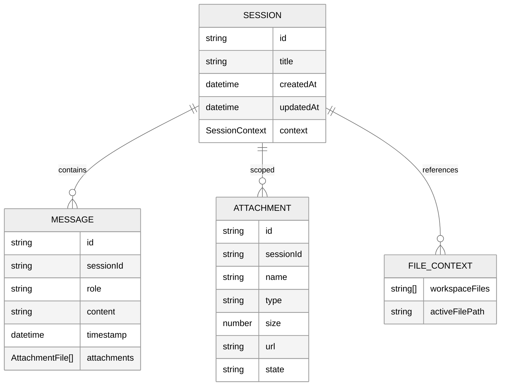
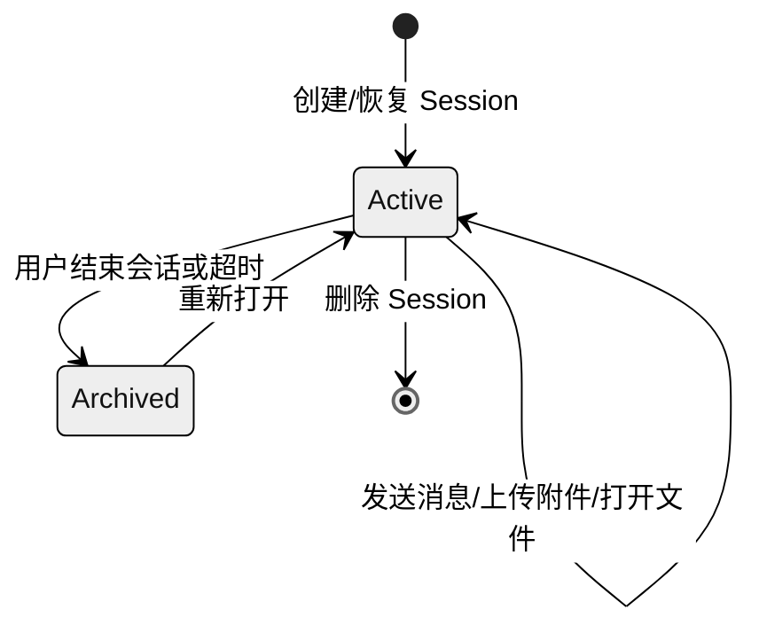

# RFC-001: Session 领域模型

> 本 RFC 定义 xihe UI 中统一 Session 的领域模型、状态图、生命周期及其与 Message、Attachment、File 的关系。它是 PLAN-029-XH-unified-session-architecture 的核心设计产出，为 PLAN-030（附件后端）和 PLAN-031（附件前端）提供边界约定。

## 1. 背景

在 PLAN-029 之前，xihe 的 chat 与 workspace 是两个独立入口：

- `/chat/:sessionId` 承载对话流，由 `useChatStore` 管理消息。
- `/workspace` 承载文件编辑器，由 `useWorkspaceStore` 管理文件树。

随着 Agent 编排、RAG、MCP、附件等概念同时进入两个视图，重复状态与上下文断裂问题变得不可接受。本 RFC 将 chat 与 workspace 统一为**同一 Session 的不同视图**。

## 2. 核心实体

### 2.1. Session

Session 是用户在 xihe 中的一次连贯工作上下文。它独立于具体视图，承载以下信息：

| 字段 | 类型 | 说明 |
|------|------|------|
| `id` | `string` | 唯一标识（UUID） |
| `title` | `string` | 可编辑的会话标题 |
| `createdAt` | `ISO 8601 string` | 创建时间 |
| `updatedAt` | `ISO 8601 string` | 最后更新时间 |
| `modelId` | `string?` | （已废弃）旧版模型绑定，迁移到 `configStore` |
| `context` | `SessionContext?` | 跨视图上下文（Agent、RAG、MCP、文件） |

### 2.2. SessionContext

```typescript
interface SessionContext {
  agents: string[]
  ragContext?: RAGContext
  mcpContext?: MCPContext
  fileContext?: FileContext
}
```

| 字段 | 类型 | 说明 |
|------|------|------|
| `agents` | `string[]` | 当前 Session 启用的 Agent 模块 ID 列表 |
| `ragContext` | `RAGContext?` | RAG 知识库与搜索开关 |
| `mcpContext` | `MCPContext?` | MCP server/tool 筛选上下文 |
| `fileContext` | `FileContext?` | workspace 文件上下文快照 |

### 2.3. RAGContext / MCPContext / FileContext

```typescript
interface RAGContext {
  knowledgeBaseIds?: string[]
  searchEnabled?: boolean
}

interface MCPContext {
  serverIds?: string[]
  toolFilter?: string[]
}

interface FileContext {
  workspaceFiles?: string[]
  activeFilePath?: string
}
```

`FileContext` 由 workspace 写入、chat/Agent 读取，用于在对话中引用当前打开的文件。

## 3. Session 与周边实体的关系



### 3.1. Session 与 Message

- 一个 Session 包含多条 Message。
- Message 的生命周期（创建、流式追加、完成）由 `useChatStore` 管理。
- Message 通过 `sessionId` 字段关联到 Session，但**不**反向存储在 Session 对象内部。

### 3.2. Session 与 Attachment

- 附件是 **Session-scoped**，而非 message-scoped 或 workspace-scoped。
- 在 chat 中上传的文件同时写入 `sessionStore.attachments` 与当前 Message。
- workspace 对 Session 附件为**只读访问**，用于把文件作为 Agent 上下文。
- PLAN-030 将实现后端 Session 专属空间；PLAN-029 仅定义前端访问边界。

### 3.3. Session 与 File

- workspace 中的文件系统由 Runtime 管理，Session 不拥有文件内容。
- Session 通过 `fileContext` 保存对当前打开文件的引用，使 chat/Agent 能够感知“用户正在看什么”。

## 4. 状态图



- **Active**：用户当前可交互的 Session；chat 与 workspace 视图均指向它。
- **Archived**：前端不再加载，但数据可能仍保存在后端/本地存储中。
- 删除是前端操作，从 `sessions` 列表移除；后端清理由 PLAN-030 决定。

## 5. 生命周期

1. **创建**：用户打开 Xihe 或点击「New Chat」时，`useSessionStore.createSession()` 创建 Session。
2. **选择**：侧边栏点击或路由切换时，`selectSession(id)` 激活 Session。
3. **在 chat 中对话**：`/chat/:sessionId` 下，消息追加到 `chatStore.messages[sessionId]`。
4. **切换到 workspace**：`/workspace/:sessionId` 共享同一 Session，内嵌 `ChatPanel` 继续显示历史消息。
5. **在 workspace 中操作文件**：`fileContext` 更新，Agent 可基于当前文件上下文回答。
6. **切换回 chat**：同一 Session 的消息与附件保持一致。
7. **结束**：用户删除 Session 或关闭应用；消息与附件本地状态释放。

## 6. 边界约定

| 范围 | 约定 |
|------|------|
| 消息归属 | Message 属于 Session，但由 `useChatStore` 按 `sessionId` 索引存储 |
| 附件归属 | Attachment 属于 Session，由 `useSessionStore.attachments` 管理 |
| 文件归属 | 物理文件由 Runtime 管理；Session 只保存引用 |
| Agent 上下文 | `SessionContext.agents` 决定当前 Session 可用 Agent |
| RAG/MCP 上下文 | 配置来自 `configStore`，运行时选择写入 `SessionContext` |

## 7. 向后兼容

- `Session` 类型新增 `context` 等可选字段，不破坏现有 `xihe-sessions` localStorage。
- 旧 Session 记录首次被访问时，`ensureSession()` 会自动补全 `context`。
- `modelId` 字段保留但已废弃，由 `configStore` 的 session-model 绑定接管。

## 8. 参考

- PLAN-029-XH-unified-session-architecture
- ADR-001-session-store-boundary.md
- DEV-015-session-views.md
