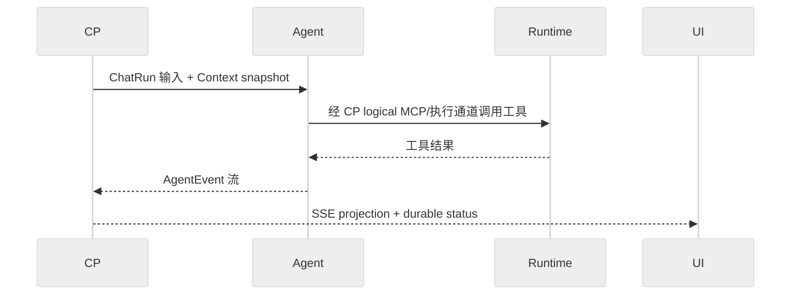

# Agent 执行模型

> 契约状态：`proposed`  
> 实现状态：`partial`  
> Profile：`architecture`  
> Owner：Agent owner  
> 消费者：CP、Runtime、UI、Security  
> 来源：PLAN-0387、DEV-013  
> 更新日期：2026-09-20

## 范围

本文定义 Agent Runner、工具适配、事件适配和一次 ChatRun 执行的边界。它描述 Agent 如何消费 CP 输入并产生可观察事件，不重新定义 Security authorization、CP durable record 或 Runtime 执行能力。

## 参与者与事实源

| 参与者 | 权威职责 |
|---|---|
| CP | 创建 ChatRun，计算可执行输入，拥有 ChatRun/Operation 终态 |
| Agent | 执行模型循环、工具调用和事件翻译；不得自行扩大授权 |
| Runtime | 承载文件、命令、进程和 MCP 执行 |
| UI | 消费 CP relay 的 SSE/HTTP projection，不把本地状态当作 durable authority |
| Security | 拥有通用 principal/role/scope/authorization 正文 |

`AgentRunner`、`RunnerConfig`、`AgentEvent` 和 `EventAdapter` 是 Agent 当前接口事实源；LangGraph 只允许位于接口实现之后。

## 规范条款

1. Agent MUST 只使用 CP 下发的 `sessionId`、`runId`、`workspaceId`、`operationId` 和 Context snapshot。
2. Agent MUST 通过 `AgentRunner.stream()` 产生统一事件；框架原始事件 MUST 经过 `EventAdapter` 翻译。
3. Agent MUST 将 `toolCallId` 同时用于对应的 tool call/result 事件；缺少稳定调用键时 MUST fail-closed 或沿用既有 adapter fallback，不得生成第二套跨层键。
4. Agent MUST 将取消、审批等待、provider failure 和 partial/ambiguous 结果交给 CP 的终态路径；Agent 本地 `done` 不得单独宣称 durable ChatRun 已完成。
5. `toolMode=none` MUST 不初始化 Workspace MCP；Workspace 工具模式 MUST 使用请求携带的 Workspace 绑定，禁止复用其他 Workspace 的已发现工具。

## 执行边界

图下注释：Agent 不绕过 CP 直接拥有通用授权；图中 Runtime 调用表示既有 CP/Agent logical boundary，不新增直连协议。

## 状态、失败与恢复

- Agent stream 可以出现 token、tool call/result、approval request、error 和 done；CP 负责将它们映射为 ChatRun/Operation 状态。
- 断线后，UI/CP 通过既有 run 查询和 SSE 恢复机制恢复可见状态；Agent 不自行重放已完成的 tool call。
- provider 不可达、工具超时、审批过期和取消必须保留稳定错误码/终态来源；错误 detail 不得包含 token 或原始 secret。

## 实现差距

- Agent `EventType` literal 与 `AgentContext.apply_event()` 对 `context.prune`、`context.env_updated` 的覆盖尚未完全一致。
- Agent payload 目前没有独立 Agent principal/schema；该 gap 由 PLAN-0374 与 Security 前置决策承接。

## 验证映射

- 当前事实：PLAN-0387 `evidence/current-state.md`。
- 事件与消费者：PLAN-0387 `evidence/consumer-matrix.md`。
- 真实状态机、断线恢复和跨模块运行态：PLAN-0387 T3/V7，尚未宣称完成。
