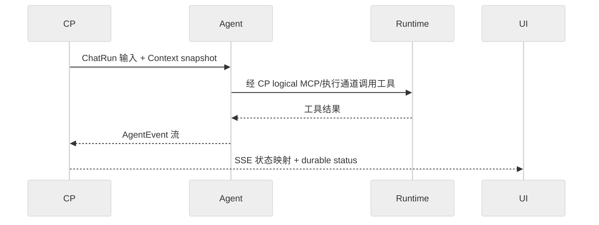

# Agent 执行模型

> 契约状态：`proposed`  
> 实现状态：`partial`  
> Profile：`architecture`  
> Owner：Agent owner  
> 消费者：CP、Runtime、UI、Security  
> 来源：PLAN-0387、DEV-013  
> 更新日期：2026-10-08

## 范围

本文定义 Agent Runner、工具适配、事件适配和一次 ChatRun 执行的边界。它描述 Agent 如何消费 CP 输入并产生可观察事件，不重新定义 Security authorization、CP durable record 或 Runtime 执行能力。

Agent Run 相关护栏（Context 预算、工具超时/输出、循环与无进展、取消/审批、接管、审计等）的跨域分类、owner 与实现状态导航见 [Agent Run 护栏总览](./run-guardrails.md)；该总览只链接本文与各 owner 规则，不复制或改变本文契约。

## 参与者与事实源

| 参与者 | 权威职责 |
|---|---|
| CP | 创建 ChatRun，计算可执行输入，拥有 ChatRun 终态与各域 durable records |
| Agent | 执行模型循环、工具调用和事件翻译；不得自行扩大授权 |
| Runtime | 承载文件、命令、进程和 MCP 执行 |
| UI | 消费 CP relay 的 SSE/HTTP 状态映射与响应，不把本地状态当作 durable authority |
| Security | 拥有通用 principal/role/scope/authorization 正文 |

`AgentRunner`、`RunnerConfig`、`AgentEvent` 和 `EventAdapter` 是 Agent 当前接口事实源；LangGraph 只允许位于接口实现之后。

## 规范条款

1. Agent MUST 只使用 CP 下发的 `sessionId`、`runId`、`workspaceId`、`toolCallId` 和 Context snapshot；MCP invocation/attempt 身份由 CP MCP execution domain 持有。
2. Agent MUST 通过 `AgentRunner.stream()` 产生统一事件；框架原始事件 MUST 经过 `EventAdapter` 翻译。
3. Agent MUST 将 `toolCallId` 同时用于对应的 tool call/result 事件；缺少稳定调用键时 MUST fail-closed 或沿用既有 adapter fallback，不得生成第二套跨层键。
4. Agent MUST 将取消、审批等待、provider failure 和 partial/ambiguous 结果交给 CP 的终态路径；Agent 本地 `done` 不得单独宣称 durable ChatRun 已完成。
5. `toolMode=none` MUST 不初始化 Workspace MCP；Workspace 工具模式 MUST 使用请求携带的 Workspace 绑定，禁止复用其他 Workspace 的已发现工具。

## MCP 关联键与迟到终止

1. Agent MUST 为同一次 MCP 工具调用在 `AgentEvent.tool_call` 与 `AgentEvent.tool_result` 使用相同的 `toolCallId`；不得按阶段重新派生另一关联键。
2. Agent→CP 请求 MUST 发送唯一关联头 `X-Tool-Call-Id`，值为事件 `toolCallId`；不得发送 Ledger operation/item headers。
3. Agent MUST NOT 创建或选择 `mcpInvocationId`。CP 在 MCP gate 创建并拥有 invocation；CP→Runtime 发送 `X-Mcp-Invocation-Id`。Runtime in-flight cancel key 仍使用 canonical `toolCallId`；Runtime late-termination 经 MCP invocation route 报告 `mcpInvocationId`，不保留 itemId fallback。
4. 每次调用最多一个 canonical `toolCallId` 与一个 CP-owned invocation；header 缺失、冲突或 scope 不匹配时由 CP fail-closed，Agent MUST 不绕过 CP 自行执行或补造身份。

验证映射：Agent `tests/unit/test_mcp_client.py`；CP `McpInvocationIntegrationTest` / `GrantPrincipalPathResolverTest`；Runtime `tool_timeout.rs` 与 late-termination integration tests；HTTP route 以 `docs/api/openapi.yaml` 和 `docs/api/inventory.md` 为准。PLAN-0464/0467 已移除 Ledger compatibility headers 与 itemId late route。

## 执行边界

```mermaid
%%{init: {'theme': 'neutral'}}%%
sequenceDiagram
    participant CP as CP
    participant Agent as Agent
    participant Runtime as Runtime
    participant UI as UI
    CP->>Agent: ChatRun 输入 + Context snapshot
    Agent->>Runtime: 经 CP logical MCP/执行通道调用工具
    Runtime-->>Agent: 工具结果
    Agent-->>CP: AgentEvent 流
    CP-->>UI: SSE 状态映射 + durable status
```

图下注释：Agent 不绕过 CP 直接拥有通用授权；图中 Runtime 调用表示既有 CP/Agent logical boundary，不新增直连协议。

## 状态、失败与恢复

- Agent stream 可以出现 token、tool call/result、approval request、error 和 done；CP 负责将它们映射为 ChatRun 状态与 owner-domain durable records。
- 断线后，UI/CP 通过既有 run 查询和 SSE 恢复机制恢复可见状态；Agent 不自行重放已完成的 tool call。
- provider 不可达、工具超时、审批过期和取消必须保留稳定错误码/终态来源；错误 detail 不得包含 token 或原始 secret。

## 实现差距

- Agent `EventType` literal 与 `AgentContext.apply_event()` 均覆盖 `context.prune`、`context.env_updated`；CP Event Store 自由字符串尚未形成跨层机器校验闭环。
- Agent payload 目前没有独立 Agent principal/schema；该 gap 由 PLAN-0374 与 Security 前置决策承接。
- MCP canonical `toolCallId`、CP-owned invocation 与 Runtime late-termination 关联由 PLAN-0463 落地；PLAN-0464/0467 已移除 Ledger headers、Job anchor alias 与旧 itemId late route。

## 验证映射

- 当前事实：PLAN-0387 `evidence/current-state.md`。
- 事件与消费者：PLAN-0387 `evidence/consumer-matrix.md`。
- 真实状态机、断线恢复和跨模块运行态：PLAN-0387 T3/V7，尚未宣称完成。
