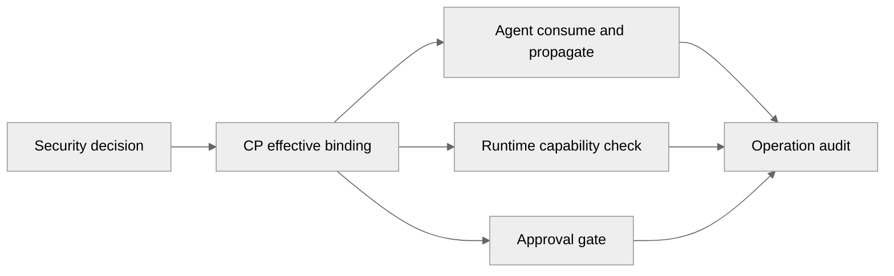

# Agent role/scope 绑定与传播

> 契约状态：`proposed`  
> 实现状态：`partial`  
> Profile：`security`  
> Owner：Security（通用授权）+ Agent（绑定传播）  
> 消费者：CP、Agent、Runtime、UI 审计  
> 来源：PLAN-0386、PLAN-0387、DEV-032  
> 更新日期：2026-09-20

## 范围与非目标

本文只定义 Agent 如何接收、传播和消费 Security 计算结果。principal、role、scope、resource、action、authorization decision 的 canonical 正文归 `spec/security/`；Agent 不复制这些模型。

独立 Agent principal、账户形态、成员表泛化、角色集合和凭据模型仍由 BL-18/BL-29 与 PLAN-0374 冻结；本文不能把当前 User-only 实现描述成已完成的 Agent principal。

## 目标输入

当 Security/CP 完成前置决策后，Agent 执行输入应包含可追溯的授权结果和执行包络：

| 输入 | 责任 | Agent 行为 |
|---|---|---|
| principal identity | Security/CP | 只读消费，不自行替换 |
| role/scope decision | Security/CP | 只读传播到工具/Runtime 请求 |
| capability envelope | Security/Runtime policy | 不得扩大；不满足即拒绝 |
| approval result | CP approval | 只作为本次操作 gate，不替代 authorization |
| Session/Run Workspace binding | CP Session/Run | 只使用一个 effective Workspace |

上表是目标态 proposed input，不等同于当前 HTTP/Agent payload 已有字段。

## 规范条款

1. Agent MUST NOT 因“代表 User”或“属于子代理”获得隐式授权。
2. Agent MUST NOT 从工具名、Workspace 路径或模型输出推导 role/scope。
3. Agent MUST 将 CP 计算的 Workspace binding、capability 和 approval context 原样带入需要它们的下游调用；不需要的调用不得复制敏感授权材料。
4. 一个 ChatRun MUST 只有一个 effective Workspace；跨 Workspace 使用必须创建独立 Session/Worker。
5. Security authorization、Runtime capability policy、operation approval 和 audit MUST 保持四个可区分的决策来源。
6. 授权撤销、scope 过期、capability 不支持或 approval 过期时，Agent MUST fail-closed，不得退回到 User-only 或默认 Workspace。

## 边界图

图下注释：Agent 是传播者和执行者，不是授权权威；Approval 通过不能跳过 Security 或 Runtime capability。

## 当前差距与承接

- 当前 Agent metadata 只有 request/run/session/workspace/operation 关联信息，没有独立 principal/role/scope schema。
- 当前 CP→Agent 仍使用 User JWT/服务认证和 Workspace/User 字段；不在本批新增兼容字段。
- principal/schema 与 Workspace binding 的代码迁移由 PLAN-0374 承接；本 SPEC 在相关决策冻结前保持 `proposed`。

## 验证映射

- 通用授权 owner：`spec/security/authorization.md`、`spec/security/principal-workspace-scope.md`。
- 当前差距：PLAN-0387 `evidence/context-boundary.md`、PLAN-0386 `evidence/consumer-validation.md`。
- Agent 不自行授权的真实验证：PLAN-0387 T3.2/V7，尚未完成。
