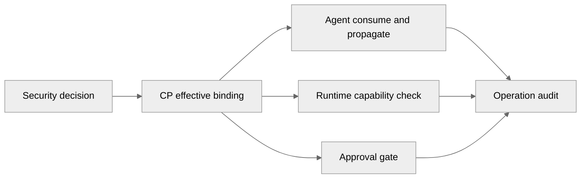

# Agent role/scope 绑定与传播

> 契约状态：`proposed`  
> 实现状态：`partial`  
> Profile：`security`  
> Owner：Security（通用授权）+ Agent（绑定传播）  
> 消费者：CP、Agent、Runtime、UI 审计  
> 来源：PLAN-0386、PLAN-0387、DEV-032  
> 更新日期：2026-09-27

## 范围与非目标

本文只定义 Agent 如何接收、传播和消费 Security 计算结果。principal、role、scope、resource、action、authorization decision 的 canonical 正文归 `spec/security/`；Agent 不复制这些模型。

独立 Agent principal、Workspace binding 与 grant 模型已由 PLAN-0374/0407 冻结并实施；账户/成员扩展与凭据模型按各自承接范围处理。本文不把 `Session.user_id` 当作 Agent principal，也不将 Agent-specific metadata 提升为授权来源。

## 目标输入

CP 是授权决定和 durable 身份的权威。Chat admission 时 CP 从请求绑定/校验 AgentPrincipal，并将其写入 Session 持久状态；ChatRun 通过 `sessionId` 关联该身份。CP→Agent payload 不复制 principal/role/scope/capability/approval 决定。Agent 使用 CP 下发的 `sessionId`、`runId`、`workspaceId` 等必要关联键和运行输入；Agent 调用 CP 工具时，CP 从 durable parent Run/ToolCall 重新解析授权，不信任 Agent 自报主体或 scope。

| 权威输入 | 权威来源与处置 |
|---|---|
| principal identity | CP 从 durable Session/Run 解析；不作为 Agent payload 的授权字段 |
| role/scope decision | Security/CP 计算并在 CP 授权边界执行；Agent 不计算、不改写 |
| capability envelope | CP/Runtime 在执行边界验证；Agent 不接收可扩大权限的决定副本 |
| approval result | CP approval gate 决定；Agent 只消费本次运行结果，不把 approval 当授权 |
| Session/Run Workspace binding | CP 从 durable Session/Run 校验；Agent 的 `workspaceId` 仅作运行上下文，不是授权证明 |

下表是职责映射，不是新增 wire schema，也不要求把授权材料放入 payload：

| 输入 | 责任 | Agent 行为 |
|---|---|---|
| durable principal reference + Session/Run keys | CP | 只保留关联键；不得提供另一授权权威 |
| effective run configuration | CP | 只消费授权后下发的配置值，不反推 role/scope |
| tool call identity | Agent/CP | 通过 `runId`/`toolCallId` 关联；CP 重新判权 |

此映射不是要求 CP→Agent 携带 principal/role/scope 等 authority-bearing 字段。公开 Chat `agentPrincipalId` 由 CP admission 校验并持久化；Agent 内部请求必须通过 Run/ToolCall 关联由 CP 反查身份。

## 规范条款

1. Agent MUST NOT 因“代表 User”或“属于子代理”获得隐式授权。
2. Agent MUST NOT 从工具名、Workspace 路径或模型输出推导 role/scope。
3. Agent MUST 保持 CP 下发的 Session/Run 关联键不变；工具调用由 CP 按 durable Run/ToolCall 重新解析 principal、Workspace 和 grant。Agent MUST NOT 把关联键改造成授权证明或向下游复制一份独立授权决定。
4. 一个 ChatRun MUST 只有一个 effective Workspace；跨 Workspace 使用必须创建独立 Session/Worker。
5. Security authorization、Runtime capability policy、operation approval 和 audit MUST 保持四个可区分的决策来源。
6. 授权撤销、scope 过期、capability 不支持或 approval 过期时，Agent MUST fail-closed，不得退回到 User-only 或默认 Workspace。

## 边界图

```mermaid
%%{init: {'theme': 'neutral'}}%%
flowchart LR
    S[Security decision] --> C[CP effective binding]
    C --> A[Agent consume and propagate]
    C --> R[Runtime capability check]
    C --> P[Approval gate]
    A --> O[Operation audit]
    R --> O
    P --> O
```

图下注释：Agent 是传播者和执行者，不是授权权威；Approval 通过不能跳过 Security 或 Runtime capability。

## 当前差距与承接

- 当前 Agent metadata 只有 request/run/session/workspace/operation 关联信息，没有独立 principal/role/scope schema；按 design #6 这是边界选择，不是待补字段的缺口。
- CP→Agent 使用 service Bearer 与必要关联键；`userId` 是 owner/visibility 上下文，不是 Agent 授权来源。principal 与 grants 保留在 CP durable state。
- 本 SPEC 仍为 proposed/partial；PLAN-0387 T3.2/V7 负责复核当前调用链、拒绝路径与失败恢复，不新增授权 payload schema。

## 验证映射

- 通用授权 owner：`spec/security/authorization.md`、`spec/security/principal-workspace-scope.md`。
- 当前差距：PLAN-0387 `evidence/context-boundary.md`、PLAN-0386 `evidence/consumer-validation.md`。
- Agent 不自行授权的真实验证：PLAN-0387 T3.2/V7，尚未完成。
