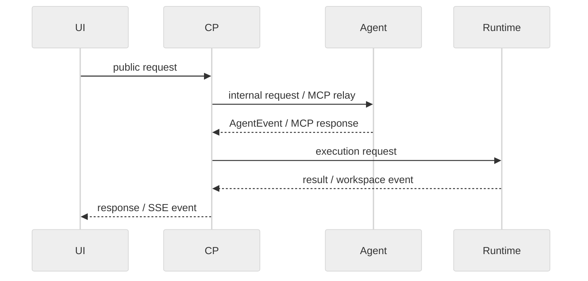

# XH 模块通信

> 契约状态：`proposed`；实现状态：`partial`；Profile：`protocol`；Owner：XH 跨边界 owner；来源：PLAN-0385；更新：2026-09-20。

## 1. 两类通信流

| 流 | 典型入口 | 事实源 | 主要规则 |
|---|---|---|---|
| 指令流 | REST、MCP、Runtime internal | OpenAPI/inventory/schema | request/response、错误、幂等、超时 |
| 状态流 | Chat SSE、Workspace SSE、Agent SSE relay | 事件实现与 durable record | 顺序、重连、重复、终态和恢复 |

## 2. 协议共性

- public route **MUST** 使用 `/api/v1`；service route **MUST** 使用 `/internal/v1`。
- service authentication **MUST** 使用 `Authorization: Bearer <token>`；不得引入自定义 token header。
- XH 自有 JSON **MUST** 使用 camelCase；MCP JSON-RPC 字段遵守 MCP 版本。
- HTTP 错误 **MUST** 使用 RFC 9457 Problem Details；`code` 和 `requestId` 是跨层定位键。
- 跨 operation hop 使用 `X-Operation-Id`、`X-Operation-Item-Id`、`X-Operation-Attempt-Id`；各层 **MUST** 复用上游 canonical key。
- OpenAPI、`inventory.md`、事件 schema 和代码类型是 wire source；本文只记录业务不变式和跨模块 ownership。

## 3. 超时、重试和幂等

| 边界 | 失败处理 |
|---|---|
| UI → CP | 显式 HTTP error；UI 按 endpoint 规则处理 401/409/5xx |
| CP → Agent | bounded timeout；Agent unavailable 进入显式 queue/circuit/error，不静默成功 |
| CP → Runtime | bounded connect/read timeout；unknown workspace、backend failure、timeout 显式失败 |
| 事件重连 | Chat 由 Session SSE 规则处理；Workspace gap 使用 `snapshot_required` + HTTP/MCP refresh |
| 重复请求 | durable idempotency key 或事件关联键；不得按展示文本匹配 |

具体 timeout 数值、错误 schema 和 route 参数以 OpenAPI/inventory/实现测试为准。

## 4. 证据与迁移

真实消费者验证至少覆盖 UI→CP、CP→Agent、CP→Runtime 和 Runtime→CP 事件 ingress。DEV/AGENTS 的稳定说明改为指针；旧 bridge、旧 route alias 和旧字段只保留历史 supersede 记录。
