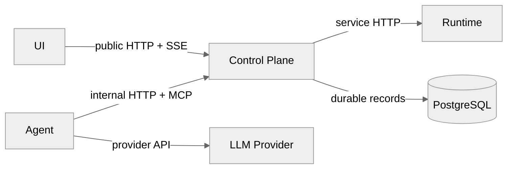

# XH 模块边界

> 契约状态：`proposed`；实现状态：`partial`；Profile：`architecture`；Owner：XH 跨边界 owner；来源：PLAN-0385；更新：2026-09-20。

## 1. 范围

本文冻结 UI、Control Plane（CP）、Agent、Runtime 四模块的职责边界和允许通信方向。HTTP 字段、SSE payload、MCP JSON-RPC 和数据库字段不在本文重复定义。

## 2. 静态边界

| 模块 | 拥有 | 可以调用 | 禁止拥有/调用 |
|---|---|---|---|
| UI | 用户动作、可见状态、浏览器连接 | CP public API/SSE | Agent、Runtime 直连；服务端权限裁决 |
| CP | 用户/Workspace/Session 元数据、授权、账本、SSE 中继 | Agent、Runtime、PostgreSQL | LLM 业务编排；把 Runtime transport 泄漏给 UI |
| Agent | LLM 编排、工具选择、AgentEvent、Context 组装 | CP logical MCP/Agent internal endpoints、LLM provider | 宿主文件、Shell、Runtime 直连、通用授权裁决 |
| Runtime | 文件、命令、进程、Sandbox、MCP session 执行 | CP internal endpoints、执行后端 | UI/Agent public API；自动 host fallback |

## 3. 硬约束

- UI **MUST** 只通过 CP 访问 Agent/Runtime 能力。
- Agent **MUST** 通过 CP logical MCP 入口访问工具，**MUST NOT** 直连 Runtime。
- Runtime **MUST** 把执行结果和 Workspace 事件回送 CP；不得向 UI 建立第二条业务通道。
- CP **MUST** 先持久化 durable 状态，再向 UI/Agent 广播需要恢复的事件。
- 领域 owner 不能因方便读取而跨过另一个模块的 canonical 边界。

## 4. 当前差距与来源

当前 DEV-001/014/015/016 仍包含部分历史 bridge/容器传输叙述。PLAN-0385 只把当前 backend-neutral 和 CP hub 边界写入根级 SPEC；旧叙述按来源矩阵由后续批次改为摘要、历史或 supersede。

验证入口：`docs/api/inventory.md`、OpenAPI、CP/Agent/Runtime integration tests、真实 UI E2E。
