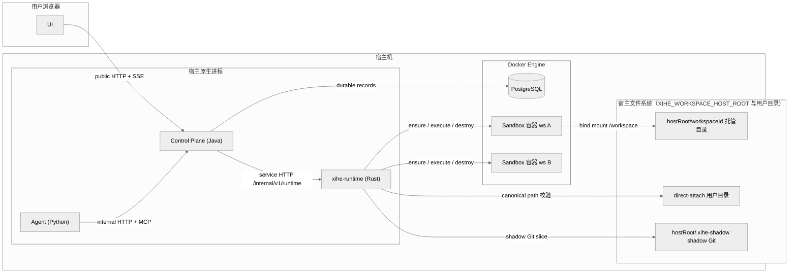
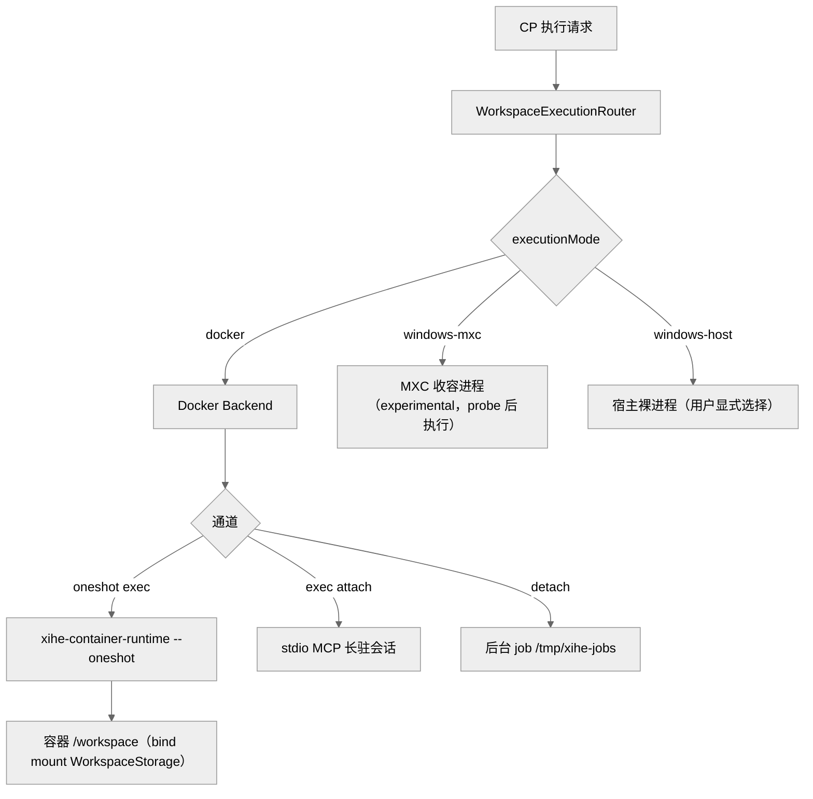

# XH Runtime 运行拓扑

> 契约状态：`proposed`；实现状态：`partial`（拓扑已落地；Windows backend 一次性执行 + Job 引擎已落地——PLAN-0379/0393/0394/0395/0397；release/resume 与 Docker Job adapter 未完成）；Profile：`architecture`；Owner：Runtime owner；消费者：CP Workspace/Job owner、Agent tool path、UI Workspace、Security capability owner、审查者；来源：PLAN-0389（用户指示补充）；更新：2026-09-21。

## 1. 范围

本文用示意图冻结 Runtime 在宿主机上的进程结构、执行面（Sandbox）与宿主机资源的归属关系，回答三个问题：

1. 哪些实体运行在宿主机，哪些运行在 Sandbox；
2. 哪些宿主机资源是持久资产（WorkspaceStorage、shadow Git、durable records），哪些是可丢弃执行实体（容器、exec、job 进程）；
3. 一次执行请求按 `executionMode` 如何落到 Docker、Windows MXC 或显式宿主执行。

字段、route、状态机与错误语义不在本文重复定义；分别以 OpenAPI/inventory、`spec/workspace/lifecycle.md`、`spec/workspace/sandbox-backend.md` 与 DEV-015/031 为准。

非目标：不重新定义生命周期状态转换表、capability schema 或 checkpoint slice 语义；不实现任何 backend。

## 2. 运行拓扑总览

读图结论与适用边界：

- 控制面（CP）与执行面（Runtime）均为宿主机原生进程，UI 只连 CP；PostgreSQL 经 Docker 运行且只由 CP 访问，Runtime 不触达数据库。
- 每个 Workspace 对应一个 Sandbox 执行实体（当前为 Docker 容器）；宿主 WorkspaceStorage 目录以 bind mount 进入容器 `/workspace`，容器内对 `/workspace` 的读写即宿主目录读写。
- shadow Git 与 WorkspaceStorage 同在宿主文件系统；checkpoint slice 由 Runtime host 侧引擎直接操作，不 bind 进 Sandbox。
- 本图以 `dev:host` 开发拓扑为基准；Compose 部署把 CP/Agent/Runtime 放入容器，但职责划分与通信方向不变。

## 3. 宿主机资源归属

| 资源 | 位置 | Owner | 生命周期 | 可丢弃性 |
|---|---|---|---|---|
| CP / Agent / Runtime 进程 | 宿主原生进程 | 各模块 owner | orchestrator 管理（mise watcher / Compose） | 可重启；状态在 DB 与文件 |
| PostgreSQL durable records | Docker（端口 12634） | CP | 持久（数据卷） | 容器可重建，数据保留 |
| WorkspaceStorage（managed） | `hostRoot/workspaceId` | CP binding + Runtime canonical path | 随 Workspace logical resource 存续 | 不可丢弃；执行实体销毁不删除 |
| WorkspaceStorage（direct-attach） | 用户显式授权目录 | 用户；Runtime 校验后使用 | 用户目录自身生命周期 | Runtime 不拥有，不负责其存亡 |
| shadow Git slice | `hostRoot/.xihe-shadow/workspaceId.git` | Runtime checkpoint | 随 Workspace；retention GC（数量 + TTL） | slice 可按 retention 清理；不承担唯一真源职责 |
| Sandbox 容器 | Docker Engine | Runtime lifecycle | 懒物化 → 六态 → 注销 | 可丢弃；可重建 |
| Job projection（durable） | CP PostgreSQL `operation_extensions(extension_kind='job_state')` | CP（唯一 durable writer） | 随账本；终态不可回退 | 不可丢弃；Job 事实源；Runtime 只返回执行事实 |
| Docker job 状态文件（backend 细节） | 容器内 `/tmp/xihe-jobs/jobId` | Runtime container runtime | 随容器存活 + TTL | 可丢弃；容器重建即孤儿化（显式行为）。**不是 Job 的唯一存放处**，只是 Docker backend 的本地状态，业务事实由上面的 Job projection 承载 |
| file watcher | Runtime host 进程内 | Runtime workspace_events | 随 Workspace materialize 建立 | 可丢弃；随 destroy/eviction 停止 |

不变式：

- 执行实体（容器、exec 会话、job 进程、watcher）**MUST** 可随时销毁重建；重建不得改变 Workspace 逻辑身份。
- WorkspaceStorage **MUST NOT** 因 ensure/destroy/pause/stop/evict 被删除或清空。
- Runtime **MUST** 对 direct-attach canonical path 做 allowlist、ownership、case-normalized prefix、symlink/junction/reparse 与 TOCTOU 校验；校验失败 fail-closed。
- 宿主绝对路径与 Docker transport 概念 **MUST NOT** 出现在 Runtime 之上的公共契约（CP/UI/Agent 可见层）。

## 4. Runtime 进程结构

单宿主进程 `xihe-runtime`（Gateway）；容器内另有镜像预装的 `xihe-container-runtime` oneshot CLI。

| 组件 | 代码锚点 | 职责 |
|---|---|---|
| Gateway HTTP（Axum） | `packages/runtime/src/main.rs` | `/health`（body 恒为字面量 `OK`，非 JSON）、`/ready`、`/internal/v1/runtime/*` 路由与 MCP endpoint；`GET /internal/v1/runtime/diagnostics` 暴露进程 `bootId`（每次 Runtime 启动重生成） |
| WorkspaceExecutionRouter | `executor.rs` | per-request 执行分发、backend-neutral Job start（`workspaces/{ws_id}/jobs/start`）、InFlight 注册、取消与 late-termination 回调 |
| Lifecycle | `lifecycle.rs` | 六态权威状态机单一写路径；Registry 为可重建缓存 |
| SandboxBackend seam | `backend.rs` | ensure/destroy/execute/capabilities；declared/probed/reason；冲突 fail-closed |
| stdio MCP session | `mcp_session.rs` | exec attach 长驻会话，按 `(workspace, serverId)` 共享 |
| Workspace storage | `storage.rs` | `hostRoot + storageRef` canonical 校验（escape/TOCTOU） |
| Checkpoint | `checkpoint.rs` | host-side shadow Git slice capture/revert/GC |
| Import | `import_job.rs` | source browser、managed copy、进度/取消/失败清理 |
| Workspace events | `workspace_events.rs` | 递归 watcher → CP event ingress（bounded queue） |
| 容器内执行器 | `xihe-container-runtime`（镜像内） | `--oneshot` stdin 单帧 op JSON → stdout 单帧 result JSON；管理 `/tmp/xihe-jobs` |

## 5. 执行通道与 Sandbox

读图结论与适用边界：

- `executionMode` 决定执行实体；通道决定一次操作如何进出执行实体。Docker backend 支持三条通道；`session` 在其他 backend 是可选能力，缺失时按 `UNSUPPORTED` 显式返回，不因 Docker 支持就声称所有 backend 支持长驻会话。
- MXC 与宿主执行均已支持一次性命令与后台 Job（Job Object 归属、kill-on-close、有界输出、取消确认，PLAN-0393/0397）；`windows-host` 直接在宿主产生裸进程，不经过任何收容。

执行通道语义：

| 通道 | 建立方式 | 生命周期 | 典型用途 |
|---|---|---|---|
| Job cleanup / capabilities | CP `.../jobs/cleanup`（`{jobId}` → outcome/reason/processes）、`.../jobs/capabilities`（0390 形能力，含 `unavailableReason`）；能力经 CP environment `jobCapability` 上行 UI | 非 Docker 模式由 `job_engine` 提供；Docker 模式 capabilities 显式 501 `JOB_BACKEND_LAUNCH_PENDING` |
| backend-neutral Job start | CP `POST /internal/v1/runtime/workspaces/{ws_id}/jobs/start` → 该 Workspace backend 的 launcher | 由 backend 决定（Docker 走下方 detach job）；无 launcher 显式 `501 JOB_BACKEND_LAUNCH_PENDING` | Workspace Job（scope `run/session/workspace`）；CP 是 durable 唯一写者，Runtime 只返回 `{jobId,status,operationItemId,bootId}` |
| per-request oneshot exec | create_exec → start_exec(attach) → 单帧 op JSON → 读首个完整 result JSON → EOF 清理 | 单次操作 | 文件/命令/PDF/审批后 apply_patch |
| exec attach 长驻会话 | exec attach（非 TTY，换行分隔 JSON-RPC） | `(workspace, serverId)` 会话，FIFO 单飞 | stdio MCP server |
| detach job（Docker backend 实现） | start_exec(detach) + `/tmp/xihe-jobs/jobId` 状态文件 | job 终态或 TTL 清理 | 后台进程 |

Sandbox 容器隔离基线（Docker backend 当前事实）：workspace 目录 bind mount `workspacePath:/workspace:rw`；Strict profile `network_mode=none`；无端口发布；`cap_drop=ALL` + `no-new-privileges`；Strict/Isolated readonly rootfs；资源默认 512MB / 2 CPU / 100 pids，经 `XIHE_SANDBOX_MEMORY_MB` / `XIHE_SANDBOX_CPUS` / `XIHE_SANDBOX_PIDS_LIMIT` 覆盖（env 为部署权威）。

## 6. 执行模式与宿主机资源映射

| `executionMode` | 执行实体 | 宿主机资源使用 | 状态 |
|---|---|---|---|
| `docker` | Linux 容器（Docker Engine） | WorkspaceStorage 以 bind mount 进入容器；容器 FS 临时 | 当前实现 |
| `windows-mxc` | MXC 收容进程（base container） | 允许目录内执行与文件访问，受 probe 能力约束 | experimental，须标注实验性 |
| `windows-host` | 宿主裸进程 | 完整宿主资源，无 Workspace 外写保护 | 用户显式选择；非 fallback |

条款：

- `windows-host/unrestricted` **MUST** 由用户显式选择，**MUST NOT** 由 Docker/MXC 失败自动触发；且必须有权限、确认、审计、超时与取消。
- `windows-mxc` **MUST** 对 policy 与 UI 消费者可见 experimental 状态；能力缺失显式 `UNSUPPORTED` 并给出 reason。
- 缺能力、探测失败、未知 Workspace **MUST** fail-closed；禁止静默 fallback 到其他 backend 或只读降级。

## 7. 当前实现差距

- 部分REST 文件操作仍直连 host filesystem（未统一走 executor router），已登记 Runtime 技术债（A03 AGENTS Known Issues）。
- CP `Workspace.hostPath` 原值持久化与「CP 保存逻辑 binding、Runtime 保存 canonical path」目标存在 drift（PLAN-0389 `evidence/current-state.md`）。
- `ensure/destroy` 接缝当前位于 WorkspaceManager/WorkspaceRegistry 双路径，收敛由后续生命周期专项承接（DEV-031 §1）。
- `windows-mxc` / `windows-host` backend 实现与真实运行证据已落地（PLAN-0379 一次性执行 + 0393 Job 引擎 + 0394/0395 adapter + 0397 one-shot 收敛；10 条 conformance 两适配器 10/10，浏览器证据见 0396）。

## 8. 验证映射

- 拓扑与通道事实：DEV-015、`packages/runtime/src/{main,executor,workspace,backend}.rs`。
- 资源归属与路径安全：`spec/workspace/lifecycle.md`、`spec/workspace/storage-checkpoint.md`、`storage.rs`、`checkpoint.rs`。
- 执行模式与 probe：`spec/workspace/sandbox-backend.md`、DEV-031、`process_guard.rs`。
- Job projection 与 start / `bootId` 对账：`spec/workspace/execution-job.md`、`packages/runtime/src/main.rs`（`jobs/start`、`diagnostics`）、`packages/control-plane/.../WorkspaceJobStartService.java`、DEV-014 §9。
- 六态生命周期：`spec/workspace/lifecycle.md`、`lifecycle.rs`、PLAN-0345。
- 真实 backend 证据（MXC/host）：PLAN-0379、PLAN-0389 T3.2/V7，尚未完成。
