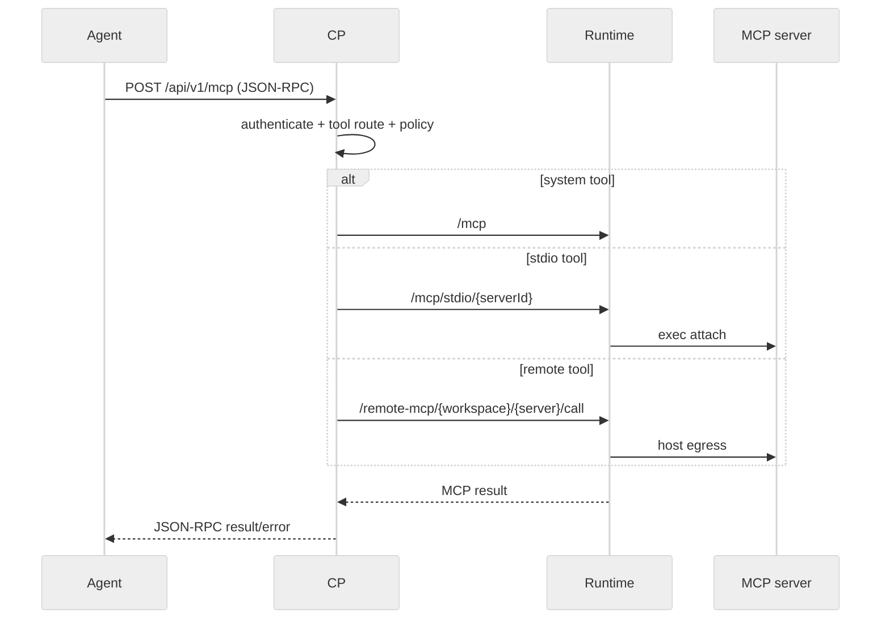

# XH MCP 通信边界

> 契约状态：`proposed`；实现状态：`partial`；Profile：`protocol`；Owner：CP/Runtime/MCP owner；来源：PLAN-0385；更新：2026-09-20。

## 1. 路由边界

- Agent **MUST** 只连接 CP logical MCP endpoint。
- CP **MUST** 负责认证、Workspace/session ownership、tool-name routing、policy gate 和 JSON-RPC relay。
- Runtime MCP v1 **MUST** 按当前 MCP protocol headers 保持 stateless；CP 转发所需 `Mcp-Method`/`Mcp-Name`。
- CP↔Agent 的 `mcp-session-id` HMAC 与 Runtime stateless transport 是两个不同边界，不得混为一个 session lifecycle。
- stdio 使用 Runtime host `exec attach` 会话；retired bridge、容器内 HTTP、容器端口和 Docker transport 不得进入 backend-neutral contract。
- remote MCP 由 Runtime host connector 出网；Workspace sandbox 不直接承担 OAuth 或 remote egress。

## 2. tools/list 与 tools/call

`tools/list` 的合并、tool→server 映射和 sticky alias 由 CP 拥有；`tools/call` 按 system/stdio/remote 三路路由。映射失效、server unavailable、unknown tool、MCP error 和 policy deny 必须显式返回，不得静默使用另一 Workspace 或默认 backend。

完整 JSON-RPC schema、协议版本和错误字段以 MCP wire implementation、OpenAPI/inventory 和 Runtime tests 为准。
