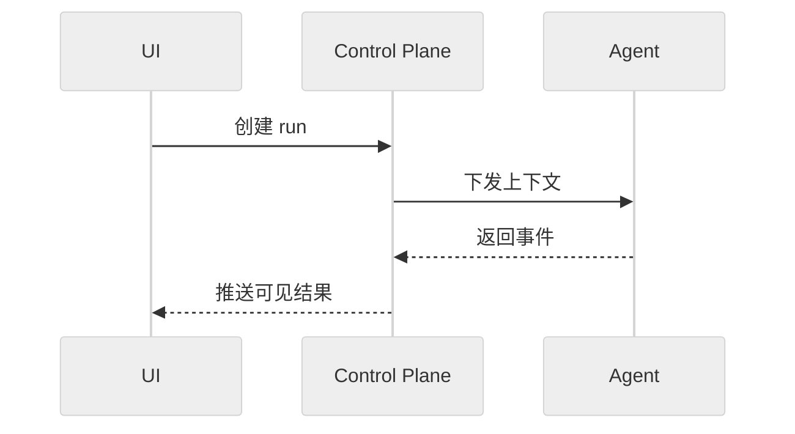

# XH SPEC 撰写指南

> 本文件是 A03 根级 SPEC 的唯一写作指南。根级 SPEC 使用中文为主，面向实现者、跨模块协作者、审查者和 Agent。
>
> 契约状态：`active`；实现状态：`implemented`；Profile：`governance`；Owner：XH 项目维护者；来源：PLAN-0383。

## 1. 语言与术语

正文使用中文。代码符号、API route、event、字段名、状态值和协议关键字保留英文，确保可以直接和代码、OpenAPI 或日志对照。

术语首次出现使用“中文（English）”，完整定义只保留一处。例如：接缝（seam）指可以替换实现而不改变调用方边界的接口。优先使用业界通行译名，不为同一概念创建多个别名。

## 2. 规范语气

规范条款使用 RFC 2119/8174 风格关键字：

| 关键字 | 中文含义 | 用途 |
|---|---|---|
| `MUST` | 必须 | 不满足即违反契约 |
| `SHOULD` | 应 | 默认要求，例外必须说明理由 |
| `MAY` | 可 | 允许但不强制 |

避免“尽量”“适当”“一般情况下”“建议最好”等不可验收的表达。每条规范只表达一个可检查的事实或约束。

文档内容分为四类：

1. **规范条款**：系统必须满足的行为和不变式。
2. **解释**：帮助理解条款，不增加新约束。
3. **示例**：明确标记为非规范性示例。
4. **验证映射**：指向测试、代码入口或 evidence，不复制原始输出。

## 3. 统一结构

每份 SPEC 按需要取用以下结构，不要求每个 profile 都填满所有章节：

```text
# 标题

契约状态 / 实现状态 / profile / owner / 消费者 / 来源 / 更新日期 / supersede

## 范围
## 非目标
## 术语与参与者
## 静态模型或资源关系
## 规范条款与不变式
## 状态、失败与恢复
## 代表性场景
## 跨模块数据流或协议
## 兼容与迁移
## 验证映射
## 来源与变更关系
```

`design.md` 负责背景、方案比较和决策理由；SPEC 只保留已接受的结论。当前实现与目标契约不一致时，必须明确写出实现差距，不得用 active 规范掩盖缺口。

## 4. Profile 选型

| Profile | 主要内容 | 常用图表 |
|---|---|---|
| `architecture` | 系统上下文、模块边界、依赖和部署 | C4、部署图、边界表 |
| `lifecycle` | 资源状态、转换、终态和恢复 | state diagram、转换表、场景 |
| `protocol` | route、event、消息、错误、顺序和幂等 | sequence、schema、数据流 |
| `security` | 主体、角色、scope、资源、动作和决策 | 授权矩阵、决策流、时序 |
| `ui` | 用户动作、UI 状态、可见结果和可访问性 | user journey、状态图、时序 |
| `resource` | desired/effective/observed、来源和条件 | 状态图、来源链、条件表 |

一个文档只选择一个主 profile。跨 profile 内容通过链接引用，避免复制同一状态或字段定义。

## 5. 图表规则

Mermaid 适用于流程、时序、状态和架构关系：

- `C4Context` / `C4Container`：系统和模块边界。
- `sequenceDiagram`：一次调用或事件传播的顺序。
- `stateDiagram-v2`：有限状态和允许转换。
- `flowchart`：决策和分支。
- `erDiagram`：稳定领域对象关系，不替代完整数据库 schema。

图表使用中文显示标签，节点 ID 使用 ASCII。默认使用中性主题，不以颜色作为唯一语义。每张图只回答一个问题，图下写读图结论和适用边界。写入前必须在浏览器中完成 parse/render 验证。



目录树、短边界清单和终端安全场景使用 ASCII：

```text
spec/
|-- architecture/
|-- agent/
`-- security/
```

复杂流程、时序和状态转换不使用手绘 ASCII 代替 Mermaid。不要同时维护两份表达相同语义的图。

## 6. 生命周期与状态

生命周期 SPEC 必须区分：

- 期望状态：调用方要求系统达到什么状态。
- 实际状态：系统当前观察到什么状态。
- 条件：为什么尚未 ready、为什么 degraded 或为什么失败。

状态转换表至少写明触发动作、前置条件、允许转换、持久化结果、失败结果和重试语义。状态图不能替代这些规则。

## 7. 安全与权限

安全 SPEC 至少分别描述：

- 身份认证：主体是谁。
- 授权：主体能否对资源执行动作；canonical 正文归 Security。
- Role/scope：角色和资源范围如何绑定；Agent 只描述自身绑定、传播和消费。
- 能力策略：执行环境开放哪些能力。
- 审批：本次具体操作是否还需额外放行。
- 审计：决策和执行结果如何留痕。

授权矩阵和审批流程不能合并成一个“权限表”。允许执行不等于本次操作已获批准；已批准也不能绕过授权或能力策略。

## 8. 变更与验证

规范发生语义变化时新增 supersede 关系，不静默重写历史含义。每个 XH PLAN 必须声明 Spec Impact，并在同一变更波次同步代码、根级 SPEC、DEV 摘要、OpenAPI/事件 schema 和测试。

Agent 可以生成候选文案、差异和同步建议，但根级 SPEC 的 active 内容必须经过 PLAN 决策和验证后写回。

根级 SPEC 不包含 token、Bearer、私钥、机器绝对路径、one 私有路径或仅本机存在的 evidence 引用。日志、完整 JSON、截图和探针输出进入 evidence，不进入规范正文。
